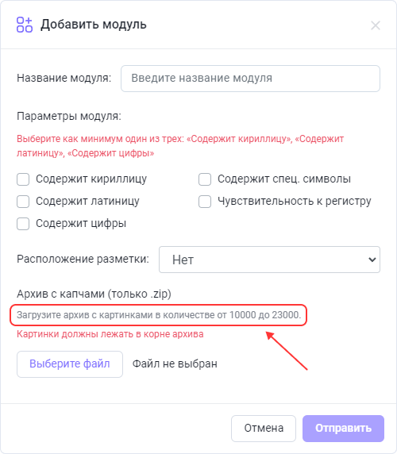
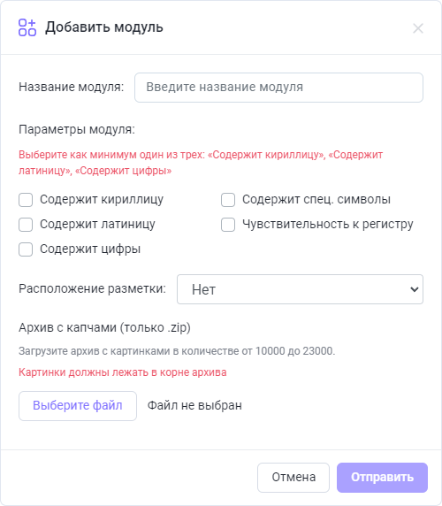
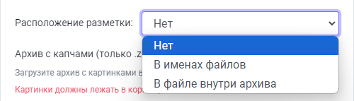
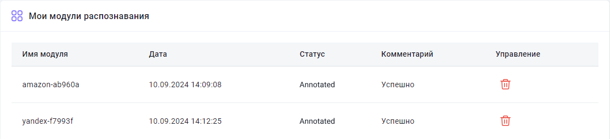

---
sidebar_position: 10
sidebar_label: Создание пользовательского модуля
title: "Создание пользовательского модуля для настройки распознавания капч"
description: "Создание пользовательского модуля позволяет создавать пользовательские модули, которые будут обучены под один конкретный вид капчи. Это позволит быстрее и эффективнее распознавать нестандартные капчи и снизит вероятность ошибок."
---

import { ArticleHead } from '../../src/theme/ArticleHead';

<ArticleHead slug="api/user-module" />

# Создание пользовательского модуля

## Описание

Функция создания пользовательского модуля позволяет обучить систему распознавать один конкретный вид капчи. Это повышает скорость и точность распознавания нестандартных капч и снижает вероятность ошибок. 

Чтобы перейти на [страницу обучения модуля](https://capmonster.cloud/UserModules), кликните по вашему email в верхней правой части сайта и выберите соответствующий пункт меню.


---

## Как это работает

Кратко процесс выглядит так:

1. Вы собираете капчи и упаковываете в архив.
2. Отправляете нам с указанием имени модуля.
3. Вносите депозит $10 на баланс (средства остаются на балансе и не списываются).
4. Мы создаём модуль.
5. Вы отправляете задачи на распознавание, указывая имя созданного модуля.

Ниже описан каждый шаг более подробно.

---

### 1. Сбор капчи

#### Сколько капч нужно?

На странице [Обучения модулей](https://capmonster.cloud/UserModules) отметьте типы символов, встречающихся в вашей капче. После этого появится подсказка, сколько капч необходимо собрать и загрузить:



#### Поддерживаемые форматы изображений

- jpg
- jpeg
- png

#### Как собирать капчи

Например, с помощью [ZennoPoster](https://zennolab.atlassian.net/wiki/spaces/RU/pages/509149204/ZennoPoster).

Предположим, вы регистрируете аккаунты на сайте, где используется капча, для которой вы хотите создать пользовательский модуль. Существует несколько способов собрать такие капчи:

- Возможно, у вас уже есть работающий проект для данного сайта, и вы уже решаете соответствующую капчу. В этом случае в экшене [Распознать капчу](https://zennolab.atlassian.net/wiki/spaces/RU/pages/534053026), на вкладке *Дополнительно* предусмотрена опция [Сохранение](https://zennolab.atlassian.net/wiki/spaces/RU/pages/534053026#%D0%A1%D0%BE%D1%85%D1%80%D0%B0%D0%BD%D0%B5%D0%BD%D0%B8%D0%B5), которая как раз и создана для таких случаев.
- Альтернативный способ: откройте страницу с капчей, у которой есть кнопка «Обновить картинку». Отправляйте капчу на распознавание через сервис или [распознавайте вручную](https://zennolab.atlassian.net/wiki/spaces/RU/pages/534053215) (перед этим настроив в экшене [Сохранение капч](https://zennolab.atlassian.net/wiki/spaces/RU/pages/534053026#%D0%A1%D0%BE%D1%85%D1%80%D0%B0%D0%BD%D0%B5%D0%BD%D0%B8%D0%B5)), затем обновляйте изображение и повторяйте процесс до достижения необходимого количества капч.

:::warning Внимание!
Не рекомендуется собирать капчи в десятки или сотни потоков одновременно, так как это может вызвать проблемы с работой сайта.
:::

---

### 2. Отправка архива капч



#### 2.1. Название

Сначала необходимо задать имя модуля. Оно должно содержать только латинские символы.


:::warning Внимание!
В названии модуля нельзя использовать слово **captcha**.
:::

#### 2.2. Типы символов

Отметьте типы символов, которые встречаются на вашей капче.
От выбранных пунктов зависит общее количество капч, необходимое для обучения модуля.

Можно отметить один или несколько вариантов из предложенного списка.


:::info
В этом списке обязательно должен быть отмечен один из пунктов (или несколько): "Cодержит кириллицу", "Содержит латиницу", "Содержит цифры"
:::

#### 2.3. Расположение разметки

Здесь необходимо выбрать способ хранения ответов на капчи.



Всё довольно просто:

- **Нет** - выбираете этот пункт, если у вас нет ответов на капчи (в этом случае обучение модуля может занять больше времени)
- **В именах файлов** - когда имя каждой картинки-капчи и есть ответ на неё (не всегда ответ на капчу можно сохранить в качестве имени файла: в операционных системах есть ограничение на используемые символы в названиях)
- **В файле внутри архива** - если ответы сохранены в отдельном файле, то это должен быть простой текстовый файл, с расширением .txt
  - Имя файла - answers.txt
  - Должен быть расположен внутри архива вместе с капчами
  - Формат - имяФайлаКапчи:ответНаКапчу, каждая капча с новой строки. Пример:

```
captcha1.png:d9li1

captcha2.png:2zhnw

captcha3.png:99loe
```

#### 2.4. Отправка архива

После того как вы указали имя модуля, выбрали типы символов и расположение ответов, осталось только загрузить zip-архив с капчами и отправить нам.


#### 2.5. Оплата

- Если всё было сделано правильно, то в таблице отобразится ваша заявка со статусом **Validated**.
- После этого необходимо внести депозит $10 на баланс в расчёте на 1 модуль.

:::note
Средства за обучение не списываются, они остаются на балансе. Вы можете их потратить на распознавание любых капч в любое время.
:::

- После успешного пополнения статус **первого** загруженного модуля изменится на **Paid**.

---

### 3. Статусы

#### Validated


Данный статус назначается после того, как вы отправите форму (если всё было сделано правильно).

:::note
Для модулей с этим статусом доступна возможность удаления - если вы загрузили неправильный архив или задали некорректное имя модуля, вы можете удалить модуль, внести необходимые исправления и отправить его повторно.
:::

#### Paid


Оплата за модуль принята.

#### ValidatedInDepth


Подготовительные работы.

#### Annotated



Разметка капч произведена. Идёт процесс обучения.

#### Trained


Модуль готов! Теперь на него можно отправлять капчи.

### 4. Отправка капч на конкретный модуль

Существует несколько способов указать модуль для распознавания:

- [Добавить аргумент CapMonsterModule с именем необходимого модуля при отправке запроса на /createTask](../captchas/image-to-text.mdx) (если вы взаимодействуете напрямую с нашим API)
- [Добавить имя модуля в поле ApiKey](module-name.mdx) (очень удобно при использовании чужих программ, когда нет возможности изменить отправляемые запросы)

---

## FAQ

<details>
    <summary>Как долго длится обучение модуля?</summary>

Обучение одного обычно происходит в течение суток.

**Обратите внимание:** обучение производится в рабочие дни с понедельника по пятницу. Если вы отправили заявку в пятницу, то он будет готов в начале следующей недели.

</details>

<details>
    <summary>Я хочу обучить сразу несколько модулей, как мне правильно это сделать?</summary>

Загрузите первый архив с капчами и оплатите его, затем повторите процесс для второго архива и так далее для всех модулей.

Ориентировочное время готовности одного модуля составляет примерно один рабочий день.

</details>

<details>
    <summary>Напротив моего модуля в колонке “Комментарий” появилась надпись “Ошибка” : Что мне делать?</summary>


Не паникуйте  Подождите немного.

Если спустя сутки ничего не изменилось, [напишите в поддержку](https://helpdesk.zennolab.com/ru) и мы вам обязательно поможем.

</details>

<details>
    <summary>Я загрузил не тот архив, могу ли я его переотправить?</summary>

Если вы ещё не оплатили модуль и у него статус **Validated**, то вы можете самостоятельно его удалить. Подробности можете найти в описании статуса **Validated**.

</details>

<details>
    <summary>Что за колонка “Управление” в таблице? У меня там ничего нет.</summary>

В этой колонке отображается кнопка «Удалить» только для модулей со статусом **Validated**.

Для модулей с другими статусами данная колонка остаётся пустой.

</details>

<details>
    <summary>Почему к имени моего модуля были добавлены какие-то символы?</summary>

Имя модуля автоматически дополнительно модифицируется для обеспечения уникальности. Так как несколько пользователей могут выбрать одинаковое название, система добавляет случайные символы, чтобы избежать путаницы. Это гарантирует, что каждая капча будет направлена именно на ваш модуль.

</details>

<details>
    <summary>Могу ли я получить обученный модуль для программы CapMonster2?</summary>

Нет. Обученный модуль доступен только в рамках сервиса CapMonster Cloud.

</details>

<details>
    <summary>Меня не устраивает качество обучения. Что делать?</summary>

Пожалуйста, [обратитесь в поддержку](https://helpdesk.zennolab.com/ru).

</details>

<details>
    <summary>У меня есть вопрос, который здесь не освещён. Куда мне обращаться?</summary>

Пожалуйста, [обратитесь в поддержку](https://helpdesk.zennolab.com/ru).

</details>
