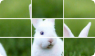
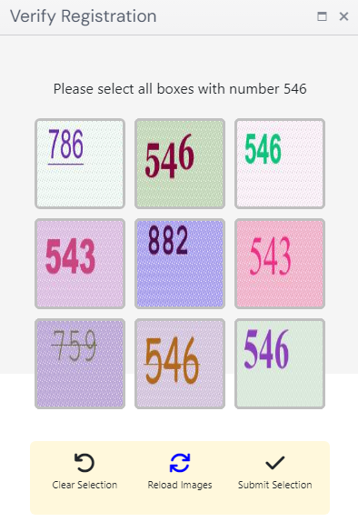

import Tabs from '@theme/Tabs';
import TabItem from '@theme/TabItem';
import ParamItem from '@theme/ParamItem';
import MethodItem from '@theme/MethodItem';
import MethodDescription from '@theme/MethodDescription'
import PriceBlock from '../../src/theme/PriceBlock';
import PriceBlockWrap from '@theme/PriceBlockWrap';
import TaskImageWrapper from '@theme/TaskImageWrapper';
import TaskImageBlock from '@theme/TaskImageBlock';
import TaskImage from '@theme/TaskImage';
import { TaskImageText } from '../../src/theme/TaskImageText';
import BlogLink from '@theme/BlogLink';

# ComplexImageTask Recognition

<TaskImageWrapper>
  <TaskImageBlock link="/ru/docs/captchas/ComplexImageTask-Recognition#oocl_rotate_new">
    <TaskImage>
      
    </TaskImage>
    <TaskImageText title="Oocl_rotate_new" name="complex-rec_oocl_rotate_new"  />
  </TaskImageBlock>
  <TaskImageBlock link="/ru/docs/captchas/ComplexImageTask-Recognition#oocl_rotate_double_new">
    <TaskImage>
      
    </TaskImage>
    <TaskImageText title="Oocl_rotate_double_new" name="complex-rec_oocl_rotate_double_new" />
  </TaskImageBlock>
  <TaskImageBlock link="/ru/docs/captchas/ComplexImageTask-Recognition#betpunch_3x3_rotate">
    <TaskImage>
      
    </TaskImage>
    <TaskImageText title="Betpunch_3x3_rotate request" name="complex-rec_betpunch_3x3_rotate request" />
  </TaskImageBlock>
  <TaskImageBlock link="/ru/docs/captchas/ComplexImageTask-Recognition#bls">
    <TaskImage>
      
    </TaskImage>
    <TaskImageText title="Bls" name="bls" />
  </TaskImageBlock>
</TaskImageWrapper>

## Параметры запроса
<TabItem value="proxyless" label="ComplexImageTask (без прокси)" default className="bordered-panel">
    <ParamItem title="type" required type="string" />
    **ComplexImageTask**

    ---

    <ParamItem title="class" required type="string" />
    **recognition**

    ---

    <ParamItem title="imagesBase64" required type="array" />
    Массив изображений в кодировке base64.
    Пример: [ “/9j/4AAQSkZJRgABAQEAAAAAAAD…”]

    ---

    <ParamItem title="metadata.Task" required type="string" />
    Возможные значения: `oocl_rotate_new` и другие <br />
    Название задания (<u>на английском</u>).
</TabItem>


## oocl_rotate_new

### Создание задачи `oocl_rotate_new`

<PriceBlockWrap>
  <PriceBlock title="ComplexImageTask" name="complex-rec_oocl_rotate_new"/>
</PriceBlockWrap>

В запросе передаем два изображения: фон и круг.

<TabItem value="proxyless" label="ComplexImageTask (без прокси)" default className="method-panel">
	<MethodItem>
		```http
		https://api.capmonster.cloud/createTask
		```
	</MethodItem>
	<MethodDescription>
		**Запрос**
		```json
		{
			"clientKey": "API_KEY",
			"task": {
				"type": "ComplexImageTask",
				"class": "recognition",
				"imagesBase64": [
					"{background_base64}",
					"{circle_base64}"
				],
				"metadata": {
					"Task": "oocl_rotate_new"
				}
			}
		}
		```

		Пример фона (*background_base64*):

		

		Пример круга (*circle_base64*):

		

		**Ответ**
		```json
		{
		  "errorId":0,
		  "taskId":407533072
		}
		```
	</MethodDescription>
</TabItem>

### Получение результата задачи `oocl_rotate_new`
<TabItem value="proxyless" label="ComplexImageTask (без прокси)" default className="method-panel-full">
	<MethodItem>
		```http
		https://api.capmonster.cloud/getTaskResult
		```
	</MethodItem>
	<MethodDescription>
		**Запрос**
		```json
		{
		  "clientKey":"API_KEY",
		  "taskId": 407533072
		}
		```
		**Ответ**
		Градусы, на которые необходимо повернуть круг по часовой стрелке.
		```json
		{
		  "errorId":0,
		  "status":"ready",
		  "errorCode":null,
		  "errorDescription":null,
		  "solution": 
		  {
			  "answer":[130.90909],
			  "metadata":{"AnswerType":"NumericArray"}
		  }		   
		}
		```
	</MethodDescription>
</TabItem>

## oocl_rotate_double_new
### Создание задачи `oocl_rotate_double_new`

<PriceBlockWrap>
  <PriceBlock title="ComplexImageTask" name="complex-rec_oocl_rotate_double_new"/>
</PriceBlockWrap>

В запросе передаем три изображения: фон, кольцо, круг.

<TabItem value="proxyless" label="ComplexImageTask (без прокси)" default className="method-panel">
	<MethodItem>
		```http
		https://api.capmonster.cloud/createTask
		```
	</MethodItem>
	<MethodDescription>
		**Запрос**
		```json
		{ 
			"clientKey": "API_KEY",
			"task": {
				"type": "ComplexImageTask",
				"class": "recognition",
				"imagesBase64": [
					"{background_base64}",
					"{ring_base64}",
					"{circle_base64}"
				],
				"metadata": {
					"Task": "oocl_rotate_double_new"
				}
			}
		}
		```

		Фон (*background_base64*):

		

		Кольцо (*ring_base64*):

		

		Круг (*circle_base64*):

		

		**Ответ**
		```json
		{
		  "errorId":0,
		  "taskId":407533072
		}
		```
	</MethodDescription>
</TabItem>

### Получение результата задачи `oocl_rotate_double_new`

<TabItem value="proxyless" label="ComplexImageTask (без прокси)" default className="method-panel-full">
	<MethodItem>
		```http
		https://api.capmonster.cloud/getTaskResult
		```
	</MethodItem>
	<MethodDescription>
		**Запрос**
		```json
		{
		  "clientKey":"API_KEY",
		  "taskId": 407533072
		}
		```
		**Ответ**
		Градусы, на которые необходимо повернуть кольцо против часовой и круг по часовой.
		```json
		{
		  "errorId":0,
		  "status":"ready",
		  "errorCode":null,
		  "errorDescription":null,
		  "solution": 
		  {
			  "answer":[130.90909],
			  "metadata":{"AnswerType":"NumericArray"}
		  }		   
		}
		```
	</MethodDescription>
</TabItem>

## betpunch_3x3_rotate
### Создание задачи `betpunch_3x3_rotate request`

<PriceBlockWrap>
  <PriceBlock title="ComplexImageTask" name="complex-rec_betpunch_3x3_rotate request"/>
</PriceBlockWrap>

В запросе передаем девять изображений. Передавать изображения нужно в следующем порядке:


<TabItem value="proxyless" label="ComplexImageTask (без прокси)" default className="method-panel">
	<MethodItem>
		```http
		https://api.capmonster.cloud/createTask
		```
	</MethodItem>
	<MethodDescription>
		**Запрос**
		```json
		{ 
			"clientKey": "API_KEY",
			"task": {
				"type": "ComplexImageTask",
				"class": "recognition",
				"imagesBase64": [
					"{image_1_Base64}",
					"{image_2_Base64}",
					"{image_3_Base64}",
					"{image_4_Base64}",
					"{image_5_Base64}",
					"{image_6_Base64}",
					"{image_7_Base64}",
					"{image_8_Base64}",
					"{image_9_Base64}",
				],
				"metadata": {
					"Task": "betpunch_3x3_rotate"
				}
			}
		}
		```

		**Ответ**
		```json
		{
		  "errorId":0,
		  "taskId":407533072
		}
		```
	</MethodDescription>
</TabItem>

### Получение результата задачи `betpunch_3x3_rotate request`

<TabItem value="proxyless" label="ComplexImageTask (без прокси)" default className="method-panel-full">
	<MethodItem>
		```http
		https://api.capmonster.cloud/getTaskResult
		```
	</MethodItem>
	<MethodDescription>
		**Запрос**
		```json
		{
		  "clientKey":"API_KEY",
		  "taskId": 407533072
		}
		```
		**Ответ**
		"answer":[X,X,X,X,X,X,X,X,X], где X - целочисленное значение от 1 до 4 для каждого изображения. 4 - означает, что картинку не нужно поворачивать; 1-3 - количество поворотов картинки против часовой стрелки.
		```json
		{
			"errorId":0,
			"status":"ready",
			"errorCode":null,
			"errorDescription":null,
			"solution":
			{
				"answer":[4,4,4,4,4,3,1,2,2],
				"metadata":{"AnswerType":"NumericArray"}
			}
		}
		```
	</MethodDescription>
</TabItem>

## bls
### Создание задачи `bls`

<PriceBlockWrap>
  <PriceBlock title="Bls" name="bls"/>
</PriceBlockWrap>

В запросе передаем 9 изображений в формате base64.
Также в metadata передаем искомое значение TaskArgument.

<BlogLink url="https://capmonster.cloud/ru/blog/news/bls-solve-extension"/>

<TabItem value="proxyless" label="ComplexImageTask (без прокси)" default className="method-panel">
	<MethodItem>
		```http
		https://api.capmonster.cloud/createTask
		```
	</MethodItem>
	<MethodDescription>
		**Запрос**
		```json
		{
			"clientKey":{{API_key}},
			"task": 
			{
				"type": "ComplexImageTask",
				"class": "recognition",
				"imagesBase64": [
					"image1_to_base64",
					"image2_to_base64",
					"image3_to_base64",
					"image4_to_base64",
					"image5_to_base64",
					"image6_to_base64",
					"image7_to_base64",
					"image8_to_base64",
					"image9_to_base64"
				],
				"metadata": {
					"Task": "bls_3x3",
					"TaskArgument": "123"
				}
			}
		}
		```

		Пример задания:

		

		Передавать сконвертированные в base64 картинки:
		
		
		
		
		
		
		
		
		
		
		
		Для данного примера: "TaskArgument": "546"

		**Ответ**
		```json
		{
		  "errorId":0,
		  "taskId":143998457
		}
		```
	</MethodDescription>
</TabItem>

### Получение результата задачи `bls`
<TabItem value="proxyless" label="ComplexImageTask (без прокси)" default className="method-panel-full">
	<MethodItem>
		```http
		https://api.capmonster.cloud/getTaskResult
		```
	</MethodItem>
	<MethodDescription>
		**Запрос**
		```json
		{
		  "clientKey":"API_KEY",
		  "taskId": 143998457
		}
		```
		**Ответ**
		Массив значений с элементами true или false, в зависимости от того является ли число на картинке искомым аргументом или нет.  
		```json
		{
		  "errorId":0,
		  "status":"ready",
		  "errorCode":null,
		  "errorDescription":null,
		  "solution": 
		  {
			"answer":[true,true,false,false,true,false,false,true,true],
			"metadata":{"AnswerType":"Grid"}
		  }
		}
		```
	</MethodDescription>
</TabItem>

## Shein
### Создание задачи `Shein`

<PriceBlockWrap>
  <PriceBlock title="shein" name="complex-rec_oocl_rotate_new"/>
</PriceBlockWrap>

В запросе передаем одно изображение в формате base64.

<TabItem value="proxyless" label="ComplexImageTask (без прокси)" default className="method-panel">
	<MethodItem>
		```http
		https://api.capmonster.cloud/createTask
		```
	</MethodItem>
	<MethodDescription>
		**Запрос**
		```json
{
    "clientKey": "API_KEY",
    "task": {
        "type": "ComplexImageTask",
        "class": "recognition",
        "imagesBase64": [
            "base64"
        ],
        "metadata": {
            "Task": "shein"
        }
    }
}
		```

		Примеры задания:

		
		

		**Ответ**
		```json
		{
		  "errorId":0,
		  "taskId":143998457
		}
		```
	</MethodDescription>
</TabItem>

### Получение результата задачи `shein`
<TabItem value="proxyless" label="ComplexImageTask (без прокси)" default className="method-panel-full">
	<MethodItem>
		```http
		https://api.capmonster.cloud/getTaskResult
		```
	</MethodItem>
	<MethodDescription>
		**Запрос**
		```json
		{
		  "clientKey":"API_KEY",
		  "taskId": 143998457
		}
		```
		**Ответ**
		Координаты на которые необходимо кликнуть в определенном порядке.
		```json
{
    "solution":
	{
	    "answer":[{"X":68.99999964,"Y":201.954889},{"X":127.99999783999999,"Y":281.54887104},{"X":181.00000776,"Y":49.894734680000006}],
		"metadata":{"AnswerType":"Coordinate"}
	},
		"cost":0.0003,
		"status":"ready",
		"errorId":0,
		"errorCode":null,
		"errorDescription":null
}
		```
	</MethodDescription>
</TabItem>

## Используйте библиотеку SDK
	<Tabs className="full-width-tabs filled-tabs request-tabs" groupId="captcha-type">
		<TabItem value="js" label="JavaScript" default className="method-panel">
			```js
			// https://github.com/ZennoLab/capmonstercloud-client-js

			import { CapMonsterCloudClientFactory, ClientOptions, ComplexImageTaskRecognitionRequest } from '@zennolab_com/capmonstercloud-client';

			document.addEventListener('DOMContentLoaded', async () => {
				const cmcClient = CapMonsterCloudClientFactory.Create(new ClientOptions({ clientKey: '<your capmonster.cloud API key>' }));
				console.log(await cmcClient.getBalance());
				
				const citRecognitionRequest = new ComplexImageTaskRecognitionRequest({
					imagesBase64: ['/9xwee/'],
					metaData: { Task: 'oocl_rotate' },
				});

				console.log(await cmcClient.Solve(citRecognitionRequest));
			});
			```
		</TabItem>
		
		<TabItem value="csharp" label="C#" className="method-panel">
			```csharp
			// https://github.com/ZennoLab/capmonstercloud-client-dotnet

			using Zennolab.CapMonsterCloud.Requests;
			using Zennolab.CapMonsterCloud;

			class Program
			{
				static async Task MainComplexImageTaskRecognition(string[] args)
				{
					var clientOptions = new ClientOptions
					{
						ClientKey = "your_api_key" // Replace with your CapMonster Cloud API key
					};

					var cmCloudClient = CapMonsterCloudClientFactory.Create(clientOptions);

					var recognitionCITRequest = new RecognitionComplexImageTaskRequest
					{
						ImagesBase64 = new List<string>
						{
							"/9j/4AAQSkZJRgABAQEAAAAAAAD…"
						},
						Metadata = new RecognitionComplexImageTaskRequest.RecognitionMetadata
						{
							Task = "oocl_rotate_new"
						}
					};

					var recognitionCITResult = await cmCloudClient.SolveAsync(recognitionCITRequest);

					if(recognitionCITResult.Solution.Answer.IsGrid)
						Console.WriteLine("Captcha Solution: " + recognitionCITResult.Solution.Answer.GridAnswer);
					else if (recognitionCITResult.Solution.Answer.IsNumeric)
						Console.WriteLine("Captcha Solution: " + recognitionCITResult.Solution.Answer.NumericAnswer);
				}
			}
			```
		</TabItem>
	</Tabs>