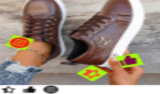

import Tabs from '@theme/Tabs';
import TabItem from '@theme/TabItem';
import ParamItem from '@theme/ParamItem';
import MethodItem from '@theme/MethodItem';
import MethodDescription from '@theme/MethodDescription';
import PriceBlock from '../../src/theme/PriceBlock';
import PriceBlockWrap from '@theme/PriceBlockWrap';
import TaskImageWrapper from '@theme/TaskImageWrapper';
import TaskImageBlock from '@theme/TaskImageBlock';
import TaskImage from '@theme/TaskImage';
import { TaskImageText } from '../../src/theme/TaskImageText';
import BlogLink from '@theme/BlogLink';

# ComplexImageTask Recognition

<TaskImageWrapper>
  <TaskImageBlock link="/ru/docs/captchas/ComplexImageTask-Recognition#oocl_rotate_new">
    <TaskImage></TaskImage>
    <TaskImageText title="Oocl_rotate_new" name="complex-rec_oocl_rotate_new" />
  </TaskImageBlock>
  <TaskImageBlock link="/ru/docs/captchas/ComplexImageTask-Recognition#oocl_rotate_double_new">
    <TaskImage></TaskImage>
    <TaskImageText title="Oocl_rotate_double_new" name="complex-rec_oocl_rotate_double_new" />
  </TaskImageBlock>
  <TaskImageBlock link="/ru/docs/captchas/ComplexImageTask-Recognition#betpunch_3x3_rotate">
    <TaskImage></TaskImage>
    <TaskImageText title="Betpunch_3x3_rotate request" name="complex-rec_betpunch_3x3_rotate request" />
  </TaskImageBlock>
  <TaskImageBlock link="/ru/docs/captchas/ComplexImageTask-Recognition#bls">
    <TaskImage></TaskImage>
    <TaskImageText title="Bls" name="bls" />
  </TaskImageBlock>
  <TaskImageBlock link="/docs/captchas/ComplexImageTask-Recognition#shein">
    <TaskImage></TaskImage>
    <TaskImageText title="shein" name="complex-rec_oocl_rotate_new" />
  </TaskImageBlock>
  <TaskImageBlock link="/docs/captchas/ComplexImageTask-Recognition#baidu">
    <TaskImage></TaskImage>
    <TaskImageText title="baidu" name="complex-rec_baidu" />
  </TaskImageBlock>
</TaskImageWrapper>

## Параметры запроса

<TabItem value="proxyless" label="ComplexImageTask (без прокси)" default className="bordered-panel">
    <ParamItem title="type" required type="string" />
    **ComplexImageTask**

    ---

    <ParamItem title="class" required type="string" />
    **recognition**

    ---

    <ParamItem title="imagesBase64" required type="array" />
    Массив изображений в кодировке base64.
    Пример: [ “/9j/4AAQSkZJRgABAQEAAAAAAAD…”]

    ---

    <ParamItem title="Task (внутри metadata)" required type="string" />
    Возможные значения: `oocl_rotate_new` и другие <br />
    Название задания (<u>на английском</u>).

</TabItem>

## oocl_rotate_new

### Создание задачи `oocl_rotate_new`

<PriceBlockWrap>
  <PriceBlock title="ComplexImageTask" name="complex-rec_oocl_rotate_new" />
</PriceBlockWrap>

В запросе передаем два изображения: фон и круг.

<TabItem value="proxyless" label="ComplexImageTask (без прокси)" default className="method-panel">
	<MethodItem>
		```http
		https://api.capmonster.cloud/createTask
		```
	</MethodItem>
	<MethodDescription>
		**Запрос**
		```json
		{
			"clientKey": "API_KEY",
			"task": {
				"type": "ComplexImageTask",
				"class": "recognition",
				"imagesBase64": [
					"{background_base64}",
					"{circle_base64}"
				],
				"metadata": {
					"Task": "oocl_rotate_new"
				}
			}
		}
		```

    	Пример фона (*background_base64*):

    	

    	Пример круга (*circle_base64*):

    	

    	**Ответ**
    	```json
    	{
    	  "errorId":0,
    	  "taskId":407533072
    	}
    	```
    </MethodDescription>

</TabItem>

### Получение результата задачи `oocl_rotate_new`

<TabItem value="proxyless" label="ComplexImageTask (без прокси)" default className="method-panel-full">
	<MethodItem>
		```http
		https://api.capmonster.cloud/getTaskResult
		```
	</MethodItem>
	<MethodDescription>
		**Запрос**
		```json
		{
		  "clientKey":"API_KEY",
		  "taskId": 407533072
		}
		```
		**Ответ**
		Градусы, на которые необходимо повернуть круг по часовой стрелке.
		```json
		{
		  "errorId":0,
		  "status":"ready",
		  "errorCode":null,
		  "errorDescription":null,
		  "solution": 
		  {
			  "answer":[130.90909],
			  "metadata":{"AnswerType":"NumericArray"}
		  }		   
		}
		```
	</MethodDescription>
</TabItem>

## oocl_rotate_double_new

### Создание задачи `oocl_rotate_double_new`

<PriceBlockWrap>
  <PriceBlock title="ComplexImageTask" name="complex-rec_oocl_rotate_double_new" />
</PriceBlockWrap>

В запросе передаем три изображения: фон, кольцо, круг.

<TabItem value="proxyless" label="ComplexImageTask (без прокси)" default className="method-panel">
	<MethodItem>
		```http
		https://api.capmonster.cloud/createTask
		```
	</MethodItem>
	<MethodDescription>
		**Запрос**
		```json
		{ 
			"clientKey": "API_KEY",
			"task": {
				"type": "ComplexImageTask",
				"class": "recognition",
				"imagesBase64": [
					"{background_base64}",
					"{ring_base64}",
					"{circle_base64}"
				],
				"metadata": {
					"Task": "oocl_rotate_double_new"
				}
			}
		}
		```

    	Фон (*background_base64*):

    	

    	Кольцо (*ring_base64*):

    	

    	Круг (*circle_base64*):

    	

    	**Ответ**
    	```json
    	{
    	  "errorId":0,
    	  "taskId":407533072
    	}
    	```
    </MethodDescription>

</TabItem>

### Получение результата задачи `oocl_rotate_double_new`

<TabItem value="proxyless" label="ComplexImageTask (без прокси)" default className="method-panel-full">
	<MethodItem>
		```http
		https://api.capmonster.cloud/getTaskResult
		```
	</MethodItem>
	<MethodDescription>
		**Запрос**
		```json
		{
		  "clientKey":"API_KEY",
		  "taskId": 407533072
		}
		```
		**Ответ**
		Градусы, на которые необходимо повернуть кольцо против часовой и круг по часовой.
		```json
		{
		  "errorId":0,
		  "status":"ready",
		  "errorCode":null,
		  "errorDescription":null,
		  "solution": 
		  {
			  "answer":[130.90909],
			  "metadata":{"AnswerType":"NumericArray"}
		  }		   
		}
		```
	</MethodDescription>
</TabItem>

## betpunch_3x3_rotate

### Создание задачи `betpunch_3x3_rotate request`

<PriceBlockWrap>
  <PriceBlock title="ComplexImageTask" name="complex-rec_betpunch_3x3_rotate request" />
</PriceBlockWrap>

В запросе передаем девять изображений. Передавать изображения нужно в следующем порядке:


<TabItem value="proxyless" label="ComplexImageTask (без прокси)" default className="method-panel">
	<MethodItem>
		```http
		https://api.capmonster.cloud/createTask
		```
	</MethodItem>
	<MethodDescription>
		**Запрос**
		```json
		{ 
			"clientKey": "API_KEY",
			"task": {
				"type": "ComplexImageTask",
				"class": "recognition",
				"imagesBase64": [
					"{image_1_Base64}",
					"{image_2_Base64}",
					"{image_3_Base64}",
					"{image_4_Base64}",
					"{image_5_Base64}",
					"{image_6_Base64}",
					"{image_7_Base64}",
					"{image_8_Base64}",
					"{image_9_Base64}",
				],
				"metadata": {
					"Task": "betpunch_3x3_rotate"
				}
			}
		}
		```

    	**Ответ**
    	```json
    	{
    	  "errorId":0,
    	  "taskId":407533072
    	}
    	```
    </MethodDescription>

</TabItem>

### Получение результата задачи `betpunch_3x3_rotate request`

<TabItem value="proxyless" label="ComplexImageTask (без прокси)" default className="method-panel-full">
	<MethodItem>
		```http
		https://api.capmonster.cloud/getTaskResult
		```
	</MethodItem>
	<MethodDescription>
		**Запрос**
		```json
		{
		  "clientKey":"API_KEY",
		  "taskId": 407533072
		}
		```
		**Ответ**
		"answer":[X,X,X,X,X,X,X,X,X], где X - целочисленное значение от 1 до 4 для каждого изображения. 4 - означает, что картинку не нужно поворачивать; 1-3 - количество поворотов картинки против часовой стрелки.
		```json
		{
			"errorId":0,
			"status":"ready",
			"errorCode":null,
			"errorDescription":null,
			"solution":
			{
				"answer":[4,4,4,4,4,3,1,2,2],
				"metadata":{"AnswerType":"NumericArray"}
			}
		}
		```
	</MethodDescription>
</TabItem>

## bls

### Создание задачи `bls`

<PriceBlockWrap>
  <PriceBlock title="Bls" name="bls" />
</PriceBlockWrap>

В запросе передаем 9 изображений в формате base64.
Также в metadata передаем искомое значение TaskArgument.

<BlogLink url="https://capmonster.cloud/ru/blog/news/bls-solve-extension" />

<TabItem value="proxyless" label="ComplexImageTask (без прокси)" default className="method-panel">
	<MethodItem>
		```http
		https://api.capmonster.cloud/createTask
		```
	</MethodItem>
	<MethodDescription>
		**Запрос**
		```json
		{
			"clientKey":{{API_key}},
			"task": 
			{
				"type": "ComplexImageTask",
				"class": "recognition",
				"imagesBase64": [
					"image1_to_base64",
					"image2_to_base64",
					"image3_to_base64",
					"image4_to_base64",
					"image5_to_base64",
					"image6_to_base64",
					"image7_to_base64",
					"image8_to_base64",
					"image9_to_base64"
				],
				"metadata": {
					"Task": "bls_3x3",
					"TaskArgument": "123"
				}
			}
		}
		```

    	Пример задания:

    	

    	Передавать сконвертированные в base64 картинки:

    	
    	
    	
    	
    	
    	
    	
    	
    	

    	Для данного примера: "TaskArgument": "546"

    	**Ответ**
    	```json
    	{
    	  "errorId":0,
    	  "taskId":143998457
    	}
    	```
    </MethodDescription>

</TabItem>

### Получение результата задачи `bls`

<TabItem value="proxyless" label="ComplexImageTask (без прокси)" default className="method-panel-full">
	<MethodItem>
		```http
		https://api.capmonster.cloud/getTaskResult
		```
	</MethodItem>
	<MethodDescription>
		**Запрос**
		```json
		{
		  "clientKey":"API_KEY",
		  "taskId": 143998457
		}
		```
		**Ответ**
		Массив значений с элементами true или false, в зависимости от того является ли число на картинке искомым аргументом или нет.  
		```json
		{
		  "errorId":0,
		  "status":"ready",
		  "errorCode":null,
		  "errorDescription":null,
		  "solution": 
		  {
			"answer":[true,true,false,false,true,false,false,true,true],
			"metadata":{"AnswerType":"Grid"}
		  }
		}
		```
	</MethodDescription>
</TabItem>

## shein

### Создание задачи `shein`

<PriceBlockWrap>
  <PriceBlock title="shein" name="complex-rec_oocl_rotate_new" />
</PriceBlockWrap>

В запросе передаем одно изображение в формате base64.

<TabItem value="proxyless" label="ComplexImageTask (без прокси)" default className="method-panel">
	<MethodItem>
		```http
		https://api.capmonster.cloud/createTask
		```
	</MethodItem>
	<MethodDescription>
		**Запрос**
		```json
{
		    "clientKey": "API_KEY",
		    "task": {
			"type": "ComplexImageTask",
			"class": "recognition",
			"imagesBase64": [
			   "base64"
			],
			"metadata": {
			    "Task": "shein"
		        }
	        }
}
		```

    	Примеры задания:

    	
    	

    	**Ответ**
    	```json
    	{
    	  "errorId":0,
    	  "taskId":143998457
    	}
    	```
    </MethodDescription>

</TabItem>

### Получение результата задачи `shein`

<TabItem value="proxyless" label="ComplexImageTask (без прокси)" default className="method-panel-full">
	<MethodItem>
		```http
		https://api.capmonster.cloud/getTaskResult
		```
	</MethodItem>
	<MethodDescription>
		**Запрос**
		```json
		{
		  "clientKey":"API_KEY",
		  "taskId": 143998457
		}
		```
		**Ответ**
		Координаты на которые необходимо кликнуть в определенном порядке.
		```json
{
    "solution":
	{
	    "answer":[{"X":68.99999964,"Y":201.954889},{"X":127.99999783999999,"Y":281.54887104},{"X":181.00000776,"Y":49.894734680000006}],
		"metadata":{"AnswerType":"Coordinate"}
	},
		"cost":0.0003,
		"status":"ready",
		"errorId":0,
		"errorCode":null,
		"errorDescription":null
}
		```
	</MethodDescription>
</TabItem>

## baidu

### Создание задачи `baidu`

<PriceBlockWrap>
  <PriceBlock title="baidu" name="complex-rec_baidu" />
</PriceBlockWrap>

:::warning **Внимание!**
В начале процесса решения возможны временные *unsolvable*-ответы. Это **не является ошибкой** - капча продолжит успешно решаться после инициализации.  
:::

В запросе передаем одно изображение в формате base64.

<TabItem value="proxyless" label="ComplexImageTask (без прокси)" default className="method-panel">
	<MethodItem>
		```http
		https://api.capmonster.cloud/createTask
		```
	</MethodItem>
	<MethodDescription>
		**Запрос**
		```json
		{
			"clientKey": "API_KEY",
			"task": 
			{
				"type": "ComplexImageTask",
				"class": "recognition",
				"imagesBase64": ["base64"],
				"metadata": {
					"Task": "baidu"
				}
			}
		}
		```

    	Примеры задания:

    	

    	**Ответ**
    	```json
    	{
    		"errorId":0,
    		"taskId":143998457
    	}
    	```
    </MethodDescription>

</TabItem>

### Получение результата задачи `baidu`

<TabItem value="proxyless" label="ComplexImageTask (без прокси)" default className="method-panel-full">
	<MethodItem>
		```http
		https://api.capmonster.cloud/getTaskResult
		```
	</MethodItem>
	<MethodDescription>
		**Запрос**
		```json
		{
			"clientKey":"API_KEY",
			"taskId": 143998457
		}
		```
		**Ответ**
		Градусы, на которые необходимо повернуть картинку по часовой стрелке.
		```json
		{
			"solution":
			{
				"answer":[297],
				"metadata":{"AnswerType":"NumericArray"}
			},
			"cost":0.0005,
			"status":"ready",
			"errorId":0,
			"errorCode":null,
			"errorDescription":null
		}
		```
	</MethodDescription>
</TabItem>

## Как найти все нужные параметры для создания задачи на решение

### Вручную

1. Откройте ваш сайт, где отображается капча, в браузере.
2. Правой кнопкой кликните по элементу капчи и выберите **Inspect**.

#### base64

Изображения на страницах могут быть представлены либо в виде ссылки (URL), либо сразу закодированы в формате Base64. Чтобы найти нужное значение, кликните правой кнопкой мыши по изображению, выберите **Просмотреть код** (**Inspect**) и внимательно изучите раздел **Элементы** или сетку сетевых запросов – там вы сможете обнаружить ссылку или закодированное содержимое.


### Автоматически

Удобный способ автоматизировать поиск всех необходимых параметров.
Некоторые параметры генерируются заново при каждой загрузке страницы, поэтому для их извлечения потребуется работать через браузер – обычный или в режиме headless (например, с помощью **Playwright**).
Так как значения динамических параметров хранятся недолго, капчу нужно решать сразу после их получения.

:::warning **Важно!**
Приведённые фрагменты кода являются базовыми примерами для ознакомления в извлечении необходимых параметров. Точная реализация будет зависеть от вашего сайта с капчей, его структуры и используемых HTML-элементов и селекторов.
:::

<Tabs className="full-width-tabs filled-tabs request-tabs">

  <TabItem value="js" label="JavaScript" default className="method-panel">
    <details>
      <summary>Показать код (Node.js)</summary>

      ```js
      import { chromium } from 'playwright';

      // Функция для извлечения base64 из src
      async function getBase64FromSrc(elementHandle) {
        const src = await elementHandle.getAttribute('src');
        if (src && src.startsWith('data:image')) {
          return src.split(',')[1];
        }
        return null;
      }

      // Функция для получения base64 с помощью скриншота (если нет src в виде base64)
      async function elementToBase64(elementHandle) {
        const base64 = await getBase64FromSrc(elementHandle);
        if (base64) {
          return base64; // Если изображение уже в base64, возвращаем его
        }
        const buffer = await elementHandle.screenshot();
        return buffer.toString('base64');
      }

      // Функция для конвертации массива элементов в массив base64 строк
      async function multipleElementsToBase64(elements) {
        const base64Array = [];
        for (const el of elements) {
          const base64 = await elementToBase64(el);
          base64Array.push(base64);
        }
        return base64Array;
      }

      // -------------------------------------------------------------
      // Подготовка base64 для разных типов капч
      // -------------------------------------------------------------

      // 1. oocl_rotate_new (background + circle)
      async function prepareOoclRotateNew(page) {
        const background = await page.$('img.background');
        const circle = await page.$('img.circle');

        const backgroundBase64 = await elementToBase64(background);
        const circleBase64 = await elementToBase64(circle);

        return { backgroundBase64, circleBase64 };
      }

      // 2. oocl_rotate_double_new (background + ring + circle)
      async function prepareOoclRotateDoubleNew(page) {
        const background = await page.$('img.background');
        const ring = await page.$('img.ring');
        const circle = await page.$('img.circle');

        const backgroundBase64 = await elementToBase64(background);
        const ringBase64 = await elementToBase64(ring);
        const circleBase64 = await elementToBase64(circle);

        return { backgroundBase64, ringBase64, circleBase64 };
      }

      // 3. betpunch_3x3_rotate (9 маленьких изображений)
      async function prepareBetpunch3x3(page) {
        const sectors = await page.$$('img.sector');

        const sectorsBase64 = await multipleElementsToBase64(sectors);

        return { sectorsBase64 };
      }

      // 4. bls (9 маленьких изображений для кликов)
      async function prepareBls(page) {
        const sectors = await page.$$('img.sector');

        const sectorsBase64 = await multipleElementsToBase64(sectors);

        return { sectorsBase64 };
      }

      // 5. shein (1 большое изображение)
      async function prepareShein(page) {
        const captchaImage = await page.$('img.captcha');

        const captchaBase64 = await elementToBase64(captchaImage);

        return { captchaBase64 };
      }

      // Пример работы Playwright
      async function run() {
        const browser = await chromium.launch();
        const page = await browser.newPage();
        await page.goto('https://example.com'); // Заменить на реальный URL

        // Пример получения base64 для oocl_rotate_new
        const { backgroundBase64, circleBase64 } = await prepareOoclRotateNew(page);
        console.log('Base64 background:', backgroundBase64);
        console.log('Base64 circle:', circleBase64);

        await browser.close();
      }

      run();
      ```
    </details>
  </TabItem>

  <TabItem value="python" label="Python" className="method-panel">
    <details>
      <summary>Показать код</summary>

      ```python
      import base64
      import asyncio
      from playwright.async_api import async_playwright

      # Функция для извлечения base64 из src
      async def get_base64_from_src(element_handle):
          src = await element_handle.get_attribute("src")
          if src and src.startswith("data:image"):
              return src.split(",")[1]
          return None

      # Функция для получения base64 с помощью скриншота (если нет src в виде base64)
      async def element_to_base64(element_handle):
          base64_str = await get_base64_from_src(element_handle)
          if base64_str:
              return base64_str  # Если изображение уже в base64, возвращаем его
          screenshot = await element_handle.screenshot()
          return base64.b64encode(screenshot).decode("utf-8")

      # Функция для конвертации массива элементов в массив base64 строк
      async def multiple_elements_to_base64(elements):
          base64_list = []
          for el in elements:
              base64_str = await element_to_base64(el)
              base64_list.append(base64_str)
          return base64_list

      # -------------------------------------------------------------
      # Подготовка base64 для разных типов капч
      # -------------------------------------------------------------

      # 1. oocl_rotate_new (background + circle)
      async def prepare_oocl_rotate_new(page):
          background = await page.query_selector("img.background")
          circle = await page.query_selector("img.circle")

          background_base64 = await element_to_base64(background)
          circle_base64 = await element_to_base64(circle)

          return {"backgroundBase64": background_base64, "circleBase64": circle_base64}

      # 2. oocl_rotate_double_new (background + ring + circle)
      async def prepare_oocl_rotate_double_new(page):
          background = await page.query_selector("img.background")
          ring = await page.query_selector("img.ring")
          circle = await page.query_selector("img.circle")

          background_base64 = await element_to_base64(background)
          ring_base64 = await element_to_base64(ring)
          circle_base64 = await element_to_base64(circle)

          return {"backgroundBase64": background_base64, "ringBase64": ring_base64, "circleBase64": circle_base64}

      # 3. betpunch_3x3_rotate (9 маленьких изображений)
      async def prepare_betpunch3x3(page):
          sectors = await page.query_selector_all("img.sector")
          sectors_base64 = await multiple_elements_to_base64(sectors)

          return {"sectorsBase64": sectors_base64}

      # 4. bls (9 маленьких изображений для кликов)
      async def prepare_bls(page):
          sectors = await page.query_selector_all("img.sector")
          sectors_base64 = await multiple_elements_to_base64(sectors)

          return {"sectorsBase64": sectors_base64}

      # 5. shein (1 большое изображение)
      async def prepare_shein(page):
          captcha_image = await page.query_selector("img.captcha")
          captcha_base64 = await element_to_base64(captcha_image)

          return {"captchaBase64": captcha_base64}

      # Пример работы Playwright
      async def run():
          async with async_playwright() as p:
              browser = await p.chromium.launch()
              page = await browser.new_page()
              await page.goto("https://example.com")

              # Пример получения base64 для oocl_rotate_new
              result = await prepare_oocl_rotate_new(page)
              print(result)

              await browser.close()

      if __name__ == "__main__":
          asyncio.run(run())
      ```
    </details>
  </TabItem>

  <TabItem value="csharp" label="C#" className="method-panel">
    <details>
      <summary>Показать код</summary>

      ```csharp
      using System;
      using System.Collections.Generic;
      using System.Threading.Tasks;
      using Microsoft.Playwright;

      class Program
      {
          // Функция для извлечения base64 из src
          private static async Task<string?> GetBase64FromSrcAsync(IElementHandle elementHandle)
          {
              var src = await elementHandle.GetAttributeAsync("src");
              if (!string.IsNullOrEmpty(src) && src.StartsWith("data:image"))
              {
                  return src.Split(',')[1];
              }
              return null;
          }

          // Функция для получения base64 с помощью скриншота (если нет src в виде base64)
          private static async Task<string> ElementToBase64Async(IElementHandle elementHandle)
          {
              var base64Str = await GetBase64FromSrcAsync(elementHandle);
              if (base64Str != null)
              {
                  return base64Str; // Если изображение уже в base64, возвращаем его
              }

              var screenshot = await elementHandle.ScreenshotAsync();
              return Convert.ToBase64String(screenshot);
          }

          // Функция для конвертации массива элементов в массив base64 строк
          private static async Task<List<string>> MultipleElementsToBase64Async(IEnumerable<IElementHandle> elements)
          {
              var base64List = new List<string>();
              foreach (var el in elements)
              {
                  var base64Str = await ElementToBase64Async(el);
                  base64List.Add(base64Str);
              }
              return base64List;
          }

          // -------------------------------------------------------------
          // Подготовка base64 для разных типов капч
          // -------------------------------------------------------------

          // 1. oocl_rotate_new (background + circle)
          private static async Task<Dictionary<string, string>> PrepareOoclRotateNewAsync(IPage page)
          {
              var background = await page.QuerySelectorAsync("img.background");
              var circle = await page.QuerySelectorAsync("img.circle");

              var backgroundBase64 = await ElementToBase64Async(background);
              var circleBase64 = await ElementToBase64Async(circle);

              return new Dictionary<string, string>
              {
                  ["backgroundBase64"] = backgroundBase64,
                  ["circleBase64"] = circleBase64
              };
          }

          // 2. oocl_rotate_double_new (background + ring + circle)
          private static async Task<Dictionary<string, string>> PrepareOoclRotateDoubleNewAsync(IPage page)
          {
              var background = await page.QuerySelectorAsync("img.background");
              var ring = await page.QuerySelectorAsync("img.ring");
              var circle = await page.QuerySelectorAsync("img.circle");

              var backgroundBase64 = await ElementToBase64Async(background);
              var ringBase64 = await ElementToBase64Async(ring);
              var circleBase64 = await ElementToBase64Async(circle);

              return new Dictionary<string, string>
              {
                  ["backgroundBase64"] = backgroundBase64,
                  ["ringBase64"] = ringBase64,
                  ["circleBase64"] = circleBase64
              };
          }

          // 3. betpunch_3x3_rotate (9 маленьких изображений)
          private static async Task<Dictionary<string, List<string>>> PrepareBetpunch3x3Async(IPage page)
          {
              var sectors = await page.QuerySelectorAllAsync("img.sector");
              var sectorsBase64 = await MultipleElementsToBase64Async(sectors);

              return new Dictionary<string, List<string>>
              {
                  ["sectorsBase64"] = sectorsBase64
              };
          }

          // 4. bls (9 маленьких изображений для кликов)
          private static async Task<Dictionary<string, List<string>>> PrepareBlsAsync(IPage page)
          {
              var sectors = await page.QuerySelectorAllAsync("img.sector");
              var sectorsBase64 = await MultipleElementsToBase64Async(sectors);

              return new Dictionary<string, List<string>>
              {
                  ["sectorsBase64"] = sectorsBase64
              };
          }

          // 5. shein (1 большое изображение)
          private static async Task<Dictionary<string, string>> PrepareSheinAsync(IPage page)
          {
              var captchaImage = await page.QuerySelectorAsync("img.captcha");
              var captchaBase64 = await ElementToBase64Async(captchaImage);

              return new Dictionary<string, string>
              {
                  ["captchaBase64"] = captchaBase64
              };
          }

          public static async Task Main()
          {
              using var playwright = await Playwright.CreateAsync();
              var browser = await playwright.Chromium.LaunchAsync();
              var page = await browser.NewPageAsync();
              await page.GotoAsync("https://example.com");

              var result = await PrepareOoclRotateNewAsync(page);
              Console.WriteLine($"Background base64 length: {result["backgroundBase64"].Length}");
              Console.WriteLine($"Circle base64 length: {result["circleBase64"].Length}");

              await browser.CloseAsync();
          }
      }
      ```
    </details>
  </TabItem>

</Tabs>

<details>
        <summary>Пример поиска параметров для oocl на Node.js</summary>

```js

import { chromium } from "playwright";

// Прокси (опционально)
// const proxyHost = "";
// const proxyUsername = "";
// const proxyPassword = "";

async function getBase64FromSrc(elementHandle) {
  const src = await elementHandle.getAttribute("src");
  if (src && src.startsWith("data:image")) {
    return src.split(",")[1];
  }
  return null;
}

async function elementToBase64(elementHandle) {
  const base64 = await getBase64FromSrc(elementHandle);
  if (base64) {
    return base64;
  }
  const buffer = await elementHandle.screenshot();
  return buffer.toString("base64");
}

async function extractVerifyImagesBase64(page) {
  const imgSelectors = [".verify-img-panel img", ".verify-sub-block img"];

  const imageHandles = (
    await Promise.all(imgSelectors.map((selector) => page.$$(selector)))
  ).flat();

  if (imageHandles.length === 0) {
    throw new Error(
      "Не найдено изображений в verify-img-panel или verify-sub-block."
    );
  }

  const imagesBase64 = [];
  for (const handle of imageHandles) {
    const base64 = await elementToBase64(handle);
    imagesBase64.push({
      src: await handle.getAttribute("src"),
      base64,
    });
  }

  return imagesBase64;
}

async function run() {
  const browser = await chromium.launch({
    headless: false,
    // proxy: {
    //   server: `http://${proxyHost}`,
    //   username: proxyUsername,
    //   password: proxyPassword,
    // },
  });

  const page = await browser.newPage();
  await page.goto(
    "https://example.com/registration/form?appurl=https://example.com"
  );

  try {
    const images = await extractVerifyImagesBase64(page);
    for (const { src, base64 } of images) {
      console.log("Источник:", src);
      console.log("Base64:", base64);
    }
  } catch (err) {
    console.error(err.message);
  }

  await browser.close();
}

run();
```
</details>

## Используйте библиотеку SDK

    <Tabs className="full-width-tabs filled-tabs request-tabs" groupId="captcha-type">
    	<TabItem value="js" label="JavaScript" default className="method-panel">
    		```js
    		// https://github.com/ZennoLab/capmonstercloud-client-js

    		import { CapMonsterCloudClientFactory, ClientOptions, ComplexImageTaskRecognitionRequest } from '@zennolab_com/capmonstercloud-client';

    		document.addEventListener('DOMContentLoaded', async () => {
    			const cmcClient = CapMonsterCloudClientFactory.Create(new ClientOptions({ clientKey: '<your capmonster.cloud API key>' }));
    			console.log(await cmcClient.getBalance());

    			const citRecognitionRequest = new ComplexImageTaskRecognitionRequest({
    				imagesBase64: ['/9xwee/'],
    				metaData: { Task: 'oocl_rotate' },
    			});

    			console.log(await cmcClient.Solve(citRecognitionRequest));
    		});
    		```
    	</TabItem>

    	<TabItem value="csharp" label="C#" className="method-panel">
    		```csharp
    		// https://github.com/ZennoLab/capmonstercloud-client-dotnet

    		using Zennolab.CapMonsterCloud.Requests;
    		using Zennolab.CapMonsterCloud;

    		class Program
    		{
    			static async Task MainComplexImageTaskRecognition(string[] args)
    			{
    				var clientOptions = new ClientOptions
    				{
    					ClientKey = "your_api_key" // Replace with your CapMonster Cloud API key
    				};

    				var cmCloudClient = CapMonsterCloudClientFactory.Create(clientOptions);

    				var recognitionCITRequest = new RecognitionComplexImageTaskRequest
    				{
    					ImagesBase64 = new List<string>
    					{
    						"/9j/4AAQSkZJRgABAQEAAAAAAAD…"
    					},
    					Metadata = new RecognitionComplexImageTaskRequest.RecognitionMetadata
    					{
    						Task = "oocl_rotate_new"
    					}
    				};

    				var recognitionCITResult = await cmCloudClient.SolveAsync(recognitionCITRequest);

    				if(recognitionCITResult.Solution.Answer.IsGrid)
    					Console.WriteLine("Captcha Solution: " + recognitionCITResult.Solution.Answer.GridAnswer);
    				else if (recognitionCITResult.Solution.Answer.IsNumeric)
    					Console.WriteLine("Captcha Solution: " + recognitionCITResult.Solution.Answer.NumericAnswer);
    			}
    		}
    		```
    	</TabItem>
    </Tabs>
