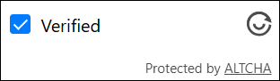

import Tabs from '@theme/Tabs';
import TabItem from '@theme/TabItem';
import ParamItem from '@theme/ParamItem';
import MethodItem from '@theme/MethodItem';
import MethodDescription from '@theme/MethodDescription'
import PriceBlock from '@theme/PriceBlock';
import PriceBlockWrap from '@theme/PriceBlockWrap';

# Altcha - Alternative CAPTCHA

<PriceBlockWrap>
  <PriceBlock title="altcha" captchaId="altcha"/>
</PriceBlockWrap>

## Примеры заданий

<Tabs className="full-width-tabs">
  <TabItem value="pow" label="PoW (Proof-of-Work)" default>
    
  </TabItem>
  <TabItem value="code" label="Code Captcha">
    
  </TabItem>
</Tabs>

*Также существует **невидимая капча** (**Invisible Captcha**), которая не имеет видимого интерфейса на странице и не требует каких-либо действий пользователя — проверка выполняется в фоновом режиме.*

:::warning **Внимание!**
CapMonster Cloud по умолчанию работает через встроенные прокси — они уже включены в стоимость. Указывать собственные прокси требуется только в тех случаях, когда сайт не принимает токен или доступ к встроенным сервисам ограничен. Вы можете обратиться в службу поддержки, чтобы уточнить детали и узнать, насколько корректно принимаются токены на конкретном сайте.

Если прокси с авторизацией по IP, то необходимо добавить адрес **65.21.190.34** в белый список.
:::

## Параметры запроса

<TabItem value="proxyless" label="CustomTask (без прокси)" default className="bordered-panel">
  
  <ParamItem title="type" required type="string" />
  **CustomTask**

  ---

  <ParamItem title="class" required type="string" />
  **altcha**

  ---

  <ParamItem title="websiteURL" required type="string" />
  Адрес основной страницы, на которой находится altcha.

  ---

  <ParamItem title="websiteKey" required type="string" />
  Для этой задачи допустимо отправлять пустую строку.

  ---

  <ParamItem title="challenge (внутри metadata)" required="required" type="string" />
  Уникальный идентификатор задачи, полученный с веб-страницы.

  ---

  <ParamItem title="iterations (внутри metadata)" required="required" type="string" />
  Количество итераций или максимальное число для вычислений.
> **Важно:** параметр `iterations` соответствует значению `maxnumber`!

  ---

  <ParamItem title="salt (внутри metadata)" required="required" type="string" />
  Полученный с сайта salt, используемый для генерации хэшей.

  ---

  <ParamItem title="signature (внутри metadata)" required="required" type="string" />
  Цифровая подпись запроса.

  ---

  <ParamItem title="userAgent" type="string" />
  User-Agent браузера. <br />
  **Передавайте только актуальный UA от ОС Windows. Сейчас таковым является**: `userAgentPlaceholder`

  ---

  <ParamItem title="proxyType" type="string" />
  **http** - обычный http/https прокси;<br />
  **https** - попробуйте эту опцию, только если "http" не работает (требуется для некоторых кастомных прокси);<br />
  **socks4** - socks4 прокси;<br />
  **socks5** - socks5 прокси.

  ---

  <ParamItem title="proxyAddress" type="string" />
  <p>
    IP адрес прокси IPv4/IPv6. Не допускается:
    - использование имен хостов;
    - использование прозрачных прокси (там где можно видеть IP клиента);
    - использование прокси на локальных машинах.
  </p>

  ---

  <ParamItem title="proxyPort" type="integer" />
  Порт прокси.

  ---

  <ParamItem title="proxyLogin" type="string" />
  Логин прокси-сервера.

  ---

  <ParamItem title="proxyPassword" type="string" />
  Пароль прокси-сервера.

  ---
</TabItem>

## Метод создания задачи
<Tabs className="full-width-tabs filled-tabs request-tabs" groupId="captcha-type">
  <TabItem value="proxyless" label="Altcha CustomTask (без прокси)" default className="method-panel">
    <MethodItem>
      ```http
      https://api.capmonster.cloud/createTask
      ```
    </MethodItem>
    <MethodDescription>
      **Запрос**
      ```json
      {
        "clientKey": "API_KEY",
        "task": {
          "type": "CustomTask",
          "class": "altcha",
          "websiteURL": "https://example.com",
          "websiteKey": "",
          "userAgent": "userAgentPlaceholder",
          "metadata": {
            "challenge": "3dd28253be6cc0c54d95f7f98c517e68744597cc6e66109619d1ac975c39181c",
            "iterations": "5000",
            "salt": "bf356449d56c719fd904c58f",
            "signature": "4b1cf0e0be0f4e5247e50b0f9a449830f1fbca44c32ff94bc080146815f31a18"
          }
        }
      }
      ```
      **Ответ**
      ```json
      {
        "errorId": 0,
        "taskId": 407533072
      }
      ```
    </MethodDescription>
  </TabItem>

  <TabItem value="proxy" label="Altcha CustomTask (с прокси)" className="method-panel">
    <MethodItem>
      ```http
      https://api.capmonster.cloud/createTask
      ```
    </MethodItem>
    <MethodDescription>
      **Запрос**
      ```json
      {
        "clientKey": "API_KEY",
        "task": {
          "type": "CustomTask",
          "class": "altcha",
          "websiteURL": "https://example.com",
          "websiteKey": "",
          "userAgent": "userAgentPlaceholder",
          "metadata": {
            "challenge": "3dd28253be6cc0c54d95f7f98c517e68744597cc6e66109619d1ac975c39181c",
            "iterations": "5000",
            "salt": "bf356449d56c719fd904c58f",
            "signature": "4b1cf0e0be0f4e5247e50b0f9a449830f1fbca44c32ff94bc080146815f31a18"
          },
          "proxyType":"http",
          "proxyAddress":"8.8.8.8",
          "proxyPort":8080,
          "proxyLogin":"proxyLoginHere",
          "proxyPassword":"proxyPasswordHere"
        }
      }
      ```
      **Ответ**
      ```json
      {
        "errorId": 0,
        "taskId": 407533072
      }
      ```
    </MethodDescription>
  </TabItem>
</Tabs>

## Метод получения результата задачи

Используйте метод [getTaskResult](../api/methods/get-task-result.md), чтобы получить решение Altcha.

<TabItem value="proxyless" label="Altcha CustomTask (без прокси)" default className="method-panel-full">
  <MethodItem>
    ```http
    https://api.capmonster.cloud/getTaskResult
    ```
  </MethodItem>
  <MethodDescription>
    **Запрос**
    ```json
    {
      "clientKey": "API_KEY",
      "taskId": 407533072
    }
    ```
    **Ответ**
    ```json
    {
      "errorId": 0,
      "status": "ready",
      "solution": {
        "number": 4883
      }
    }
    ```
	</MethodDescription>
</TabItem>

## Как найти все нужные параметры для создания задачи на решение

Ниже приведены примеры извлечения параметров Altcha, необходимых для отправки задачи на решение в CapMonster Cloud. Обратите внимание, что реализация капчи может отличаться на разных сайтах, поэтому способы получения параметров могут варьироваться.


1. В браузере откройте страницу с Altcha, запустите **DevTools** (**F12** или **Ctrl+Shift+I**), затем перейдите на вкладку **Network**.

2. Нажмите на чекбокс капчи и пройдите её вручную. В **поле поиска** в **Network** введите любое название параметра (например, *"algorithm"*).

3. Среди найденных элементов найдите запрос, в котором содержится JSON с параметрами. 

4. Кликните по запросу и при необходимости перейдите на вкладку **Response**, чтобы увидеть данные, возвращённые сервером.

5. Скопируйте параметры — эти значения нужно использовать для создания задачи в CapMonster Cloud.


> В целом, после активации капчи на странице нужно проанализировать сетевые запросы и выявить все взаимодействия, связанные с её работой. Эти действия необходимы для определения параметров и понимания процесса верификации. Например, на скриншоте ниже показан запрос с именем `altcha`, в котором содержатся все ключевые параметры:


После получения необходимых параметров их нужно передать в объект `metadata` при создании задачи в CapMonster Cloud. Пример структуры:

```javascript
metadata: {
  challenge: "<значение challenge>", 
  iterations: "<значение maxnumber>", // необходимо оформлять в кавычках, как и остальные параметры
  salt: "<значение salt>",             
  signature: "<значение signature>",  
}
  ```

Также для получения всех параметров можно воспользоваться приведёнными ниже примерами кода:

<details>
<summary>Пример GET-запроса</summary>

Делает HTTP GET-запрос к указанному URL и выводит полученный ответ в консоль.

```javascript
const url = 'https://example-portal.mysite.rs.gov.br/Altcha/Example'; // API-эндпоинт, откуда извлекаются параметры капчи

fetch(url, { method: 'GET' })
  .then(res => res.text())
  .then(data => console.log('Response:', data))
  .catch(err => console.error(err));
```

</details>

<details>
<summary>Перехват параметров</summary>

Скрипт для браузера, который переопределяет fetch и XMLHttpRequest, чтобы автоматически отслеживать сетевые запросы и извлекать ключевые параметры капчи Altcha. На странице с капчей вставьте данный скрипт в консоль браузера и активируйте капчу — необходимые параметры будут автоматически выведены в консоль.

```javascript
(function() {
  const keywords = ['algorithm','challenge','maxnumber','salt','signature'];
  const foundParams = {};

  const intercept = (url, body, text) => {
    keywords.forEach(key => {
      if ((url && url.includes(key)) || (body && body.includes(key)) || (text && text.includes(key))) {
        foundParams[key] = foundParams[key] || [];
        if (url?.includes(key)) foundParams[key].push(url);
        if (body?.includes(key)) foundParams[key].push(body);
        if (text?.includes(key)) foundParams[key].push(text);
      }
    });
    if (Object.keys(foundParams).length) console.log('Found parameters:', foundParams);
  };

  const originalFetch = window.fetch;
  window.fetch = async (...args) => {
    const [resource, config] = args;
    const url = typeof resource === 'string' ? resource : resource.url;
    const body = config?.body;
    const response = await originalFetch.apply(this, args);
    try {
      const text = await response.clone().text();
      intercept(url, body, text);
    } catch {}
    return response;
  };

  const originalOpen = XMLHttpRequest.prototype.open;
  const originalSend = XMLHttpRequest.prototype.send;

  XMLHttpRequest.prototype.open = function(method, url, ...rest) {
    this._url = url;
    return originalOpen.call(this, method, url, ...rest);
  };

  XMLHttpRequest.prototype.send = function(body) {
    this.addEventListener('load', () => intercept(this._url, body, this.responseText));
    return originalSend.call(this, body);
  };
})();
```

</details> 

## Пример автоматического решения Altcha на Node.js и Playwright

В некоторых случаях для подтверждения решения достаточно отправить только параметр `number`. Однако иногда сайт требует **все параметры**, зашифрованные в формате `base64`.

Например:


Если декодировать это значение, на выходе мы получим JSON-объект, содержащий данные, используемые для валидации капчи:

```JSON
{
  "algorithm": "SHA-256",
  "challenge": "86d178e154a5d04665710897b7bfc269d86407830d3a49dad3a3e027f6a824a6",
  "number": 92199,
  "salt": "f8ec36f9d615aa2c67c7ea29e?expires=1759147489",
  "signature": "29a57a68dd2b1de8cba74b104c38de8fc860f8dd5b5eacd04755dcff7eb7ee8f",
  "took": 1520
}
```

В ответе от CapMonster Cloud возвращаются отдельно `number` и полный набор параметров, уже закодированный в `base64` (включая `number`).

В приведённом примере подтверждение решения выполняется с помощью **токена**, содержащего полный набор параметров.
Если же вам требуется отправлять только `number`, необходимо изменить логику подтверждения решения соответствующим образом.

<details>
<summary>Показать пример кода</summary>

```javascript
const { chromium } = require("playwright");

// Замените значения на свои:
// - API_KEY → ваш ключ CapMonster Cloud
// - ALTCHA_PAGE → адрес страницы с Altcha
const API_KEY = "your_capmonster_cloud_api_key";
const ALTCHA_PAGE = "https://url_with_altcha";

(async () => {
  const browser = await chromium.launch({ headless: false, devtools: true });
  const context = await browser.newContext(); 
  const page = await context.newPage(); 

  await page.route("**/*", (route) => {
    const url = route.request().url();
    if (url.includes("api.capmonster.cloud")) return route.abort();
    return route.continue();
  });

  let challengeResp = null; // Переменная для хранения challenge Altcha
  page.on("response", async (response) => {
    try {
      if (response.url().includes("/Altcha/GerarDesafio")) {
        challengeResp = await response.json(); // Получаем JSON с параметрами challenge
        console.log("Captured /Altcha/GerarDesafio:", challengeResp);
      }
    } catch {}
  });

  await page.goto(ALTCHA_PAGE, { waitUntil: "networkidle" }); // Переход на страницу с Altcha

  try {
    await page.waitForSelector("altcha-widget input[type='checkbox']", { timeout: 10000 });
    await page.click("altcha-widget input[type='checkbox']");
  } catch {
    const widgetHandle = await page.$("altcha-widget");
    if (widgetHandle) await widgetHandle.click(); // Если стандартный селектор не найден
  }

  // Ожидание получения challenge
  const start = Date.now();
  while (!challengeResp && Date.now() - start < 30000) {
    await new Promise((r) => setTimeout(r, 300));
  }
  if (!challengeResp) {
    console.error("Failed to capture /Altcha/GerarDesafio.");
    await browser.close();
    return;
  }

  const { challenge, salt, signature, maxnumbers } = challengeResp;

  // Формирование тела запроса для создания задачи CapMonster Cloud
  const createTaskBody = {
    clientKey: API_KEY,
    task: {
      type: "CustomTask",
      class: "altcha",
      websiteURL: ALTCHA_PAGE,
      websiteKey: "",
      userAgent:
        "Mozilla/5.0 (Windows NT 10.0; Win64; x64) AppleWebKit/537.36 (KHTML, like Gecko) Chrome/140.0.0.0 Safari/537.36",
      metadata: {
        challenge,
        iterations: maxnumbers,
        salt,
        signature,
      },
    },
  };

  // Создание задачи на CapMonster Cloud
  const taskResp = await fetch("https://api.capmonster.cloud/createTask", {
    method: "POST",
    headers: { "Content-Type": "application/json" },
    body: JSON.stringify(createTaskBody),
  }).then((r) => r.json());

  console.log("CreateTask response:", taskResp);
  if (!taskResp || !taskResp.taskId) {
    console.error("CreateTask failed:", taskResp);
    await browser.close();
    return;
  }

  const taskId = taskResp.taskId;

  // Ожидание решения задачи
  let fullSolution = null;
  const maxPollMs = 120000;
  const pollStart = Date.now();
  while (Date.now() - pollStart < maxPollMs) {
    const res = await fetch("https://api.capmonster.cloud/getTaskResult", {
      method: "POST",
      headers: { "Content-Type": "application/json" },
      body: JSON.stringify({ clientKey: API_KEY, taskId }),
    }).then((r) => r.json());

    if (res.status === "ready") {
      fullSolution = res.solution;
      console.log("Full solution from CapMonster:", fullSolution);
      break;
    }
    await new Promise((r) => setTimeout(r, 3000));
  }

  if (!fullSolution) {
    console.error("Solution was not received within the allocated time.");
    await browser.close();
    return;
  }

  // Извлечение токена из решения
  const token =
    (fullSolution && fullSolution.data && fullSolution.data.token) ||
    fullSolution.token ||
    (fullSolution && fullSolution.data) ||
    null;

  if (!token) {
    console.error("Token not found in CapMonster response:", fullSolution);
    await browser.close();
    return;
  }

  // Внедрение токена на страницу
  await page.evaluate((tokenValue) => {
    const cpv = document.querySelector("#captchaParaValidar");
    if (cpv) {
      cpv.value = tokenValue;
    } else {
      const created = document.createElement("input");
      created.type = "hidden";
      created.id = "captchaParaValidar";
      created.name = "captchaParaValidar";
      created.value = tokenValue;
      (document.querySelector("form") || document.body).appendChild(created);
    }

    let alt = document.querySelector('input[name="altcha"]');
    if (alt) {
      alt.value = tokenValue;
    } else {
      const created2 = document.createElement("input");
      created2.type = "hidden";
      created2.name = "altcha";
      created2.value = tokenValue;
      (document.querySelector("form") || document.body).appendChild(created2);
    }

    const widget = document.querySelector("altcha-widget");
    if (widget) {
      widget.setAttribute("data-state", "verified");
      const checkbox = widget.querySelector("input[type='checkbox']");
      if (checkbox) {
        checkbox.checked = true;
        checkbox.dispatchEvent(new Event("change", { bubbles: true }));
      }
      const label = widget.querySelector(".altcha-label");
      if (label) label.textContent = "Verified";
    }
  }, token);

  console.log("Token injected:", token);
})();
```
</details>  
