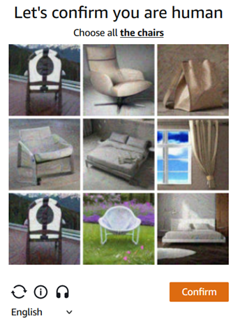
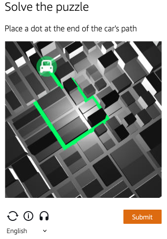

import Tabs from '@theme/Tabs';
import TabItem from '@theme/TabItem';
import ParamItem from '@theme/ParamItem';
import MethodItem from '@theme/MethodItem';
import MethodDescription from '@theme/MethodDescription'
import PriceBlock from '../../src/theme/PriceBlock';
import PriceBlockWrap from '@theme/PriceBlockWrap';
import BlogLink from '@theme/BlogLink';
import { ArticleHead } from '../../src/theme/ArticleHead';

<ArticleHead slug="captchas/amazon-task" />

# AmazonTask | AWS WAF Captcha and Challenge

<PriceBlockWrap>
  <PriceBlock title="AmazonTask" captchaId="amazonwaf"/>
</PriceBlockWrap>

### <span style={{fontSize: '1.5rem'}}>Примеры заданий</span>

<Tabs className="full-width-tabs">
  <TabItem value="waf1" label="Click" default>
    
  </TabItem>
  <TabItem value="waf2" label="Puzzle">
    
  </TabItem>
</Tabs>

Решение капчи и челленджа в AWS WAF

<BlogLink url="https://capmonster.cloud/ru/blog/scraping/amazon-captcha-web-scraping"/>

:::warning **Внимание!**
CapMonster Cloud по умолчанию работает через встроенные прокси — они уже включены в стоимость. Указывать собственные прокси требуется только в тех случаях, когда сайт не принимает токен или доступ к встроенным сервисам ограничен. 

Если прокси с авторизацией по IP, то необходимо добавить адрес **65.21.190.34** в белый список.
:::

## Параметры запроса
## Вариант 1
<TabItem value="proxyless" label="AmazonTask (без прокси)" default className="bordered-panel">
    <ParamItem title="type" required type="string" />
    **AmazonTask**

    --- 

    <ParamItem title="websiteURL" required type="string" />
    Адрес основной страницы, на которой решается капча.

    ---
	
	  <ParamItem title="websiteKey" required type="string" />
    Можно найти в поле `apiKey` при рендеринге капчи

    ---

    <ParamItem title="captchaScript" required type="string" />
    Ссылка на jsapi.js на html странице, имеет вид \<Integration URL\>/jsapi.js

    ---

    <ParamItem title="cookieSolution" type="boolean" />
    По умолчанию **false** — в ответ вы получите "captcha_voucher" и "existing_token". Если вам требуются куки "aws-waf-token", то укажите значение **true**.

    ---

    <ParamItem title="userAgent" type="string" />
    User-Agent браузера. <br />
  **Передавайте только актуальный UA от ОС Windows. Сейчас таковым является**: `userAgentPlaceholder`

    ---

  <ParamItem title="proxyType" type="string" />
  **http** - обычный http/https прокси;<br />
  **https** - попробуйте эту опцию только если "http" не работает (требуется для некоторых кастомных прокси);<br />
  **socks4** - socks4 прокси;<br />
  **socks5** - socks5 прокси.

  ---

  <ParamItem title="proxyAddress" type="string" />
  <p>
    IP адрес прокси IPv4/IPv6. Не допускается:
    - использование прозрачных прокси (там где можно видеть IP клиента);
    - использование прокси на локальных машинах.
  </p>

  ---

  <ParamItem title="proxyPort" type="integer" />
  Порт прокси.

  ---

  <ParamItem title="proxyLogin" type="string" />
  Логин прокси-сервера.

  ---

  <ParamItem title="proxyPassword" type="string" />
  Пароль прокси-сервера.

  ---

</TabItem>

## Вариант 2 
<TabItem value="proxyless" label="AmazonTaskProxyless (без прокси)" default className="bordered-panel">
    <ParamItem title="type" required type="string" />
    **AmazonTask**

    --- 

    <ParamItem title="websiteURL" required type="string" />
    Адрес основной страницы, на которой решается капча.

    ---

    <ParamItem title="challengeScript" required type="string" />
    Ссылка на challenge.js (см. описание ниже)

    ---

    <ParamItem title="websiteKey" required type="string" />
    Строка, которую можно получить из html страницы с капчей или с помощью javascript, выполнив `window.gokuProps.key`

    ---

    <ParamItem title="context" required type="string" />
    Строка, которую можно получить из html страницы с капчей или с помощью javascript, выполнив `window.gokuProps.context`

    ---

    <ParamItem title="iv" required type="string" />
    Строка, которую можно получить из html страницы с капчей или с помощью javascript, выполнив `window.gokuProps.iv`

    ---

    <ParamItem title="captchaScript" type="string" />
    Ссылка на captcha.js (может отсутствовать, если у вас просто челлендж)

    ---

    <ParamItem title="cookieSolution" type="boolean" />
    По умолчанию **false** — в ответ вы получите "captcha_voucher" и "existing_token". Если вам требуются куки "aws-waf-token", то укажите значение **true**.

    ---

  <ParamItem title="proxyType" type="string" />
  **http** - обычный http/https прокси;<br />
  **https** - попробуйте эту опцию только если "http" не работает (требуется для некоторых кастомных прокси);<br />
  **socks4** - socks4 прокси;<br />
  **socks5** - socks5 прокси.

  ---

  <ParamItem title="proxyAddress" type="string" />
  <p>
    IP адрес прокси IPv4/IPv6. Не допускается:
    - использование прозрачных прокси (там где можно видеть IP клиента);
    - использование прокси на локальных машинах.
  </p>

  ---

  <ParamItem title="proxyPort" type="integer" />
  Порт прокси.

  ---

  <ParamItem title="proxyLogin" type="string" />
  Логин прокси-сервера.

  ---

  <ParamItem title="proxyPassword" type="string" />
  Пароль прокси-сервера.

---

</TabItem>

  ## Вариант 3

Если на сайте используется невидимая капча и загружается только `challenge.js`, используйте этот вариант. В этом случае передавать все параметры, как в варианте 2, не требуется — значения можно оставить пустыми. Передавайте только значение `challenge.js`.

<TabItem value="proxyless" label="AmazonTaskProxyless (без прокси)" default className="bordered-panel">
    <ParamItem title="type" required type="string" />
    **AmazonTask**

    --- 

    <ParamItem title="websiteURL" required type="string" />
    Адрес основной страницы, на которой решается капча.

    ---

    <ParamItem title="challengeScript" required type="string" />
    Ссылка на challenge.js.

    ---

    <ParamItem title="captchaScript" required type="string" />
    Ссылка на captcha.js. В этом варианте указывайте любую строку.

    ---

    <ParamItem title="websiteKey" required type="string" />
    Указывайте любую строку.

    ---

    <ParamItem title="context" required type="string" />
    Указывайте любую строку.

    ---

    <ParamItem title="iv" required type="string" />
    Указывайте любую строку.

    ---

    <ParamItem title="cookieSolution" type="boolean" />
    Указывайте значение **true** для получения "aws-waf token". 

    ---

  <ParamItem title="proxyType" type="string" />
  **http** - обычный http/https прокси;<br />
  **https** - попробуйте эту опцию только если "http" не работает (требуется для некоторых кастомных прокси);<br />
  **socks4** - socks4 прокси;<br />
  **socks5** - socks5 прокси.

  ---

  <ParamItem title="proxyAddress" type="string" />
  <p>
    IP адрес прокси IPv4/IPv6. Не допускается:
    - использование прозрачных прокси (там где можно видеть IP клиента);
    - использование прокси на локальных машинах.
  </p>

  ---

  <ParamItem title="proxyPort" type="integer" />
  Порт прокси.

  ---

  <ParamItem title="proxyLogin" type="string" />
  Логин прокси-сервера.

  ---

  <ParamItem title="proxyPassword" type="string" />
  Пароль прокси-сервера.

---

</TabItem>


### Как получить параметры `websiteKey`, `context`, `iv` и `challengeScript`
При переходе на сайт вы получаете ответ **405** и html страницу с капчей. Именно из неё можно извлечь все параметры:
 
 


## Методы создания задачи
## Вариант 1
<Tabs className="full-width-tabs filled-tabs request-tabs" groupId="captcha-type">
  <TabItem value="proxyless" label="AmazonTask (без прокси)" default className="method-panel">
    <MethodItem>
      ```http
      https://api.capmonster.cloud/createTask
      ```
    </MethodItem>
    <MethodDescription>

    **Запрос**

    ```json
    {
      "clientKey": "API_KEY",
      "task": {
        "type": "AmazonTask",
        "websiteURL": "https://example.com/index.html",
        "websiteKey": "h15hX7brbaRTR...Za1_1",
        "userAgent": "userAgentPlaceholder",
        "captchaScript": "https://234324vgvc23.yejk.captcha-sdk.awswaf.com/234324vgvc23/jsapi.js",
        "cookieSolution": true
      }
    }
    ```

    **Ответ**

    ```json
    {
      "errorId": 0,
      "taskId": 407533072
    }
    ```

    </MethodDescription>
  </TabItem>

  <TabItem value="proxy" label="AmazonTask (с прокси)" className="method-panel">
    <MethodItem>
      ```http
      https://api.capmonster.cloud/createTask
      ```
    </MethodItem>
    <MethodDescription>

    **Запрос**

    ```json
    {
      "clientKey": "API_KEY",
      "task": {
        "type": "AmazonTask",
        "websiteURL": "https://example.com/index.html",
        "websiteKey": "h15hX7brbaRTR...Za1_1",
        "userAgent": "userAgentPlaceholder",
        "captchaScript": "https://234324vgvc23.yejk.captcha-sdk.awswaf.com/234324vgvc23/jsapi.js",
        "cookieSolution": true,
        "proxyType": "http",
        "proxyAddress": "8.8.8.8",
        "proxyPort": 8080,
        "proxyLogin": "proxyLoginHere",
        "proxyPassword": "proxyPasswordHere"
      }
    }
    ```

    **Ответ**

    ```json
    {
      "errorId": 0,
      "taskId": 407533072
    }
    ```

    </MethodDescription>
  </TabItem>
</Tabs>

## Вариант 2
<Tabs className="full-width-tabs filled-tabs request-tabs" groupId="captcha-type">
  <TabItem value="proxyless" label="AmazonTask (без прокси)" default className="method-panel">
    <MethodItem>
      ```http
      https://api.capmonster.cloud/createTask
      ```
    </MethodItem>
    <MethodDescription>

    **Запрос**

    ```json
    {
      "clientKey": "API_KEY",
      "task": {
        "type": "AmazonTask",
        "websiteURL": "https://example.com",
        "challengeScript": "https://41bcdd4fb3cb.610cd090.us-east-1.token.awswaf.com/41bcdd4fb3cb/0d21de737ccb/cd77baa6c832/challenge.js",
        "captchaScript": "https://41bcdd4fb3cb.610cd090.us-east-1.captcha.awswaf.com/41bcdd4fb3cb/0d21de737ccb/cd77baa6c832/captcha.js",
        "websiteKey": "AQIDA...wZwdADFLWk7XOA==",
        "context": "qoJYgnKsc...aormh/dYYK+Y=",
        "iv": "CgAAXFFFFSAAABVk",
        "cookieSolution": true
      }
    }
    ```

    **Ответ**

    ```json
    {
      "errorId": 0,
      "taskId": 407533072
    }
    ```

    </MethodDescription>
  </TabItem>

  <TabItem value="proxy" label="AmazonTask (с прокси)" className="method-panel">
    <MethodItem>
      ```http
      https://api.capmonster.cloud/createTask
      ```
    </MethodItem>
    <MethodDescription>

    **Запрос**

    ```json
    {
      "clientKey": "API_KEY",
      "task": {
        "type": "AmazonTask",
        "websiteURL": "https://example.com",
        "challengeScript": "https://41bcdd4fb3cb.610cd090.us-east-1.token.awswaf.com/41bcdd4fb3cb/0d21de737ccb/cd77baa6c832/challenge.js",
        "captchaScript": "https://41bcdd4fb3cb.610cd090.us-east-1.captcha.awswaf.com/41bcdd4fb3cb/0d21de737ccb/cd77baa6c832/captcha.js",
        "websiteKey": "AQIDA...wZwdADFLWk7XOA==",
        "context": "qoJYgnKsc...aormh/dYYK+Y=",
        "iv": "CgAAXFFFFSAAABVk",
        "cookieSolution": true,
        "proxyType": "http",
        "proxyAddress": "8.8.8.8",
        "proxyPort": 8080,
        "proxyLogin": "proxyLoginHere",
        "proxyPassword": "proxyPasswordHere"
      }
    }
    ```

    **Ответ**

    ```json
    {
      "errorId": 0,
      "taskId": 407533072
    }
    ```

    </MethodDescription>
  </TabItem>
</Tabs>

## Вариант 3
<Tabs className="full-width-tabs filled-tabs request-tabs" groupId="captcha-type">
  <TabItem value="proxyless" label="AmazonTask (без прокси)" default className="method-panel">
    <MethodItem>
      ```http
      https://api.capmonster.cloud/createTask
      ```
    </MethodItem>
    <MethodDescription>

    **Запрос**

    ```json
    {
      "clientKey": "API_KEY",
      "task": {
        "type": "AmazonTask",
        "websiteURL": "https://example.com",
        "challengeScript": "https://41bcdd4fb3cb.610cd090.us-east-1.token.awswaf.com/41bcdd4fb3cb/0d21de737ccb/cd77baa6c832/challenge.js",
        "captchaScript": "",
        "websiteKey": "",
        "context": "",
        "iv": "",
        "cookieSolution": true
      }
    }
    ```

    **Ответ**

    ```json
    {
      "errorId": 0,
      "taskId": 407533072
    }
    ```

    </MethodDescription>
  </TabItem>

  <TabItem value="proxy" label="AmazonTask (с прокси)" className="method-panel">
    <MethodItem>
      ```http
      https://api.capmonster.cloud/createTask
      ```
    </MethodItem>
    <MethodDescription>

    **Запрос**

    ```json
    {
      "clientKey": "API_KEY",
      "task": {
        "type": "AmazonTask",
        "websiteURL": "https://example.com",
        "challengeScript": "https://41bcdd4fb3cb.610cd090.us-east-1.token.awswaf.com/41bcdd4fb3cb/0d21de737ccb/cd77baa6c832/challenge.js",
        "captchaScript": "",
        "websiteKey": "",
        "context": "",
        "iv": "",
        "cookieSolution": true,
        "proxyType": "http",
        "proxyAddress": "8.8.8.8",
        "proxyPort": 8080,
        "proxyLogin": "proxyLoginHere",
        "proxyPassword": "proxyPasswordHere"
      }
    }
    ```

    **Ответ**

    ```json
    {
      "errorId": 0,
      "taskId": 407533072
    }
    ```

    </MethodDescription>
  </TabItem>
</Tabs>

## Метод получения результата задачи
Используйте метод [getTaskResult](../api/methods/get-task-result.md), чтобы получить решение AmazonTask.

<TabItem value="proxyless" label="AmazonTaskProxyless (без прокси)" default className="method-panel-full">
	<MethodItem>
		```http
		https://api.capmonster.cloud/getTaskResult
		```
	</MethodItem>
	<MethodDescription>
		**Запрос**
		```json
		{
		  "clientKey":"API_KEY",
		  "taskId": 407533072
		}
		```
		**Ответ**
		```json
		{
			"errorId":0,
			"status":"ready",
			"solution": {
				"cookies": {
					"aws-waf-token": "10115f5b-ebd8-45c7-851e-cfd4f6a82e3e:EAoAua1QezAhAAAA:dp7sp2rXIRcnJcmpWOC1vIu+yq/A3EbR6b6K7c67P49usNF1f1bt/Af5pNcZ7TKZlW+jIZ7QfNs8zjjqiu8C9XQq50Pmv2DxUlyFtfPZkGwk0d27Ocznk18/IOOa49Rydx+/XkGA7xoGLNaUelzNX34PlyXjoOtL0rzYBxMAQy0D1tn+Q5u97kJBjs5Mytqu9tXPIPCTSn4dfXv5llSkv9pxBEnnhwz6HEdmdJMdfur+YRW1MgCX7i3L2Y0/CNL8kd8CEhTMzwyoXekrzBM="
				},
				"userAgent": "userAgentPlaceholder"
			}
		}
		```
	</MethodDescription>
</TabItem>

## Как найти все нужные параметры для создания задачи на решение

### Автоматически

Удобный способ автоматизировать поиск всех необходимых параметров.
Некоторые параметры генерируются заново при каждой загрузке страницы, поэтому для их извлечения потребуется работать через браузер – обычный или в режиме headless (например, с помощью **Playwright**).
Так как значения динамических параметров хранятся недолго, капчу нужно решать сразу после их получения.

:::warning **Важно!**
Приведённые фрагменты кода являются базовыми примерами для ознакомления в извлечении необходимых параметров. Точная реализация будет зависеть от вашего сайта с капчей, его структуры и используемых HTML-элементов и селекторов.
:::

<Tabs className="full-width-tabs filled-tabs request-tabs">
  <TabItem value="js" label="JavaScript" default className="method-panel">
    <details>
      <summary>Показать код (Node.js)</summary>
      ```js
      import { chromium } from "playwright";

      const CAPTCHA_URL = "https://example.com";

      (async () => {
        const browser = await chromium.launch({ headless: false });
        const page = await browser.newPage();

        await page.goto(CAPTCHA_URL);

        const captchaParams = await page.evaluate(() => {
          const gokuProps = window.gokuProps || {};
          const scripts = Array.from(document.querySelectorAll("script"));

          return {
            websiteKey: gokuProps.key || "Not found",
            context: gokuProps.context || "Not found",
            iv: gokuProps.iv || "Not found",
            challengeScriptUrl:
              scripts.find((script) => script.src.includes("challenge.js"))?.src ||
              "Not found",
            captchaScriptUrl:
              scripts.find((script) => script.src.includes("captcha.js"))?.src ||
              "Not found",
          };
        });

        console.log("Captcha params:", captchaParams);

        await browser.close();
      })();
      ```
    </details>
  </TabItem>

  <TabItem value="python" label="Python" className="method-panel">
  <details>
    <summary>Показать код</summary>
    ```python
    import asyncio
    from playwright.async_api import async_playwright

    CAPTCHA_URL = "https://example.com"

    async def main():
        async with async_playwright() as p:
            browser = await p.chromium.launch(headless=False)
            page = await browser.new_page()

            await page.goto(CAPTCHA_URL)

            captcha_params = await page.evaluate("""
                () => {
                    const gokuProps = window.gokuProps || {};
                    const scripts = Array.from(document.querySelectorAll('script'));

                    return {
                        websiteKey: gokuProps.key || "Not found",
                        context: gokuProps.context || "Not found",
                        iv: gokuProps.iv || "Not found",
                        challengeScriptUrl: scripts.find(script => script.src.includes('challenge.js'))?.src || 
                            "Not found",
                        captchaScriptUrl: scripts.find(script => script.src.includes('captcha.js'))?.src || 
                            "Not found"
                    };
                }
            """)

            print("Captcha params:", captcha_params)

            await browser.close()

    asyncio.run(main())
    ```
  </details>
</TabItem>

  <TabItem value="csharp" label="C#" className="method-panel">
    <details>
      <summary>Показать код</summary>
      ```csharp
      using System;
      using System.Collections.Generic;
      using System.Threading.Tasks;
      using Microsoft.Playwright;

      class Program
      {
          public static async Task Main(string[] args)
          {
              const string CAPTCHA_URL = "https://example.com";

              using var playwright = await Playwright.CreateAsync();
              var browser = await playwright.Chromium.LaunchAsync(new BrowserTypeLaunchOptions
              {
                  Headless = false
              });

              var context = await browser.NewContextAsync();
              var page = await context.NewPageAsync();

              await page.GotoAsync(CAPTCHA_URL);

              var captchaParams = await page.EvaluateAsync<Dictionary<string, string>>(@"
                  (() => {
                      const gokuProps = window.gokuProps || {};
                      const scripts = Array.from(document.querySelectorAll('script'));
                      return {
                          websiteKey: gokuProps.key || 'Not found',
                          context: gokuProps.context || 'Not found',
                          iv: gokuProps.iv || 'Not found',
                          challengeScriptUrl: scripts.find(script => script.src.includes('challenge.js'))?.src || 
                          'Not found',
                          captchaScriptUrl: scripts.find(script => script.src.includes('captcha.js'))?.src || 
                          'Not found'
                      };
                  })()
              ");

              Console.WriteLine("Captcha params:");
              foreach (var param in captchaParams)
              {
                  Console.WriteLine($"{param.Key}: {param.Value}");
              }

              await browser.CloseAsync();
          }
      }
      ```
    </details>
  </TabItem>
</Tabs>

## Используйте библиотеку SDK

<Tabs className="full-width-tabs filled-tabs request-tabs" groupId="captcha-type">

  <TabItem value="js" label="JavaScript" default className="method-panel">

  ```js
  // https://github.com/ZennoLab/capmonstercloud-client-js

  import { CapMonsterCloudClientFactory, ClientOptions, AmazonRequest } from '@zennolab_com/capmonstercloud-client';

  document.addEventListener('DOMContentLoaded', async () => {
    const cmcClient = CapMonsterCloudClientFactory.Create(
      new ClientOptions({
        clientKey: '<your capmonster.cloud API key>',
      })
    );

    console.log(await cmcClient.getBalance());

    // Вариант 1. Без прокси
    const amazonRequest = new AmazonRequest({
      websiteURL: 'https://example.com', // URL страницы с капчей
      websiteKey: 'websiteKey',
      challengeScript: 'https://41bcdd4fb3cb.610cd090.us-east-1.token.awswaf.com/41bcdd4fb3cb/0d21de737ccb/cd77baa6c832/challenge.js',
      captchaScript: 'https://41bcdd4fb3cb.610cd090.us-east-1.captcha.awswaf.com/41bcdd4fb3cb/0d21de737ccb/cd77baa6c832/captcha.js',
      context: 'qoJYgnKsc...aormh/dYYK+Y=',
      iv: 'CgAAXFFFFSAAABVk',
    });

    /*
    // Вариант 2. С прокси
    const amazonRequest = new AmazonRequest({
      websiteURL: 'https://example.com',
      websiteKey: 'websiteKey', 
      challengeScript: 'https://41bcdd4fb3cb.610cd090.us-east-1.token.awswaf.com/41bcdd4fb3cb/0d21de737ccb/cd77baa6c832/challenge.js',
      captchaScript: 'https://41bcdd4fb3cb.610cd090.us-east-1.captcha.awswaf.com/41bcdd4fb3cb/0d21de737ccb/cd77baa6c832/captcha.js',
      context: 'qoJYgnKsc...aormh/dYYK+Y=',
      iv: 'CgAAXFFFFSAAABVk',
      proxyAddress: '8.8.8.8',
      proxyPort: 8080,
      proxyLogin: 'proxyLoginHere',
      proxyPassword: 'proxyPasswordHere',
    });
    */

    console.log(await cmcClient.Solve(amazonRequest));
  });
````

  </TabItem>

  <TabItem value="python" label="Python" className="method-panel">

```python
# https://github.com/ZennoLab/capmonstercloud-client-python

import asyncio
from capmonstercloudclient import CapMonsterClient, ClientOptions
from capmonstercloudclient.requests import AmazonWafRequest

# Укажите ваш API-ключ от CapMonster Cloud
client_options = ClientOptions(api_key="your_api_key")  # Ваш API-ключ CapMonster Cloud
cap_monster_client = CapMonsterClient(options=client_options)

# Вариант 1. Без прокси
amazon_waf_request = AmazonWafRequest(
    websiteUrl="https://example.com", # URL страницы с капчей
    challengeScript="https://example.com/path/to/challenge.js", # Замените на корректное значение  
    captchaScript="https://example.com/path/to/captcha.js",  
    websiteKey="your_website_key",                          
    context="your_context_value",                             
    iv="your_iv_value",                                       
    cookieSolution=False
)

# Вариант 2. С прокси
# Раскомментируйте блок ниже и укажите данные прокси

# amazon_waf_request = AmazonWafRequest(
#     websiteUrl="https://example.com",
#     challengeScript="https://example.com/path/to/challenge.js",
#     captchaScript="https://example.com/path/to/captcha.js",
#     websiteKey="your_website_key",
#     context="your_context_value",
#     iv="your_iv_value",
#     cookieSolution=False,
#     proxyType="http",
#     proxyAddress="127.0.0.1",  
#     proxyPort=8080,             
#     proxyLogin="username",      
#     proxyPassword="password"    
# )

async def solve_captcha():
    return await cap_monster_client.solve_captcha(amazon_waf_request)

response = asyncio.run(solve_captcha())
print(response)
```

  </TabItem>

  <TabItem value="csharp" label="C#" className="method-panel">

```csharp
// https://github.com/ZennoLab/capmonstercloud-client-dotnet

using System;
using System.Threading.Tasks;
using Zennolab.CapMonsterCloud;
using Zennolab.CapMonsterCloud.Requests;

class Program
{
    static async Task Main(string[] args)
    {
        // Ваш API-ключ от CapMonster Cloud
        var clientOptions = new ClientOptions
        {
            ClientKey = "your_api_key" // Ваш API-ключ CapMonster Cloud
        };

        var cmCloudClient = CapMonsterCloudClientFactory.Create(clientOptions);

        // Вариант 1: Без прокси
        var amazonWafRequest = new AmazonWafRequest
        {
            WebsiteUrl = "https://example.com",   // URL страницы с капчей
            ChallengeScript = "URL_of_challenge.js",   // Замените на корректное значение
            CaptchaScript = "URL_of_captcha.js",       
            WebsiteKey = "website_key",                  
            Context = "context_value",                   
            Iv = "iv_value",                            
            CookieSolution = false
        };

        // Вариант 2: С прокси
        // Раскомментируйте блок ниже и укажите данные прокси
        /*
        var amazonWafRequest = new AmazonWafRequest
        {
            WebsiteUrl = "https://example.com",
            ChallengeScript = "URL_of_challenge.js",
            CaptchaScript = "URL_of_captcha.js",
            WebsiteKey = "website_key",
            Context = "context_value",
            Iv = "iv_value",
            CookieSolution = false,

            Proxy = new ProxyContainer(
                "8.8.8.8",            
                8080,                 
                ProxyType.Http,       
                "proxyLoginHere",     
                "proxyPasswordHere"   
            )
        };
        */

        var solveResult = await cmCloudClient.SolveAsync(amazonWafRequest);

        Console.WriteLine("ExistingToken: " + solveResult.Solution.ExistingToken);
        Console.WriteLine("CaptchaVoucher: " + solveResult.Solution.CaptchaVoucher);
    }
}
```

  </TabItem>

</Tabs>
