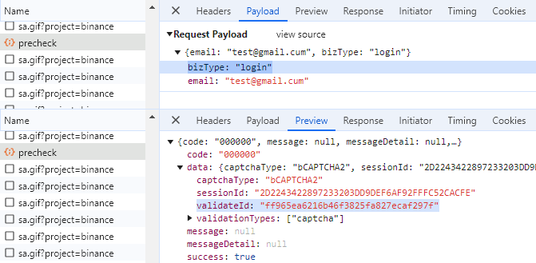

import Tabs from '@theme/Tabs';
import TabItem from '@theme/TabItem';
import ParamItem from '@theme/ParamItem';
import MethodItem from '@theme/MethodItem';
import MethodDescription from '@theme/MethodDescription'
import PriceBlock from '@theme/PriceBlock';
import PriceBlockWrap from '@theme/PriceBlockWrap';


# Binance - Binance captcha

<PriceBlockWrap>
  <PriceBlock title="Binance captcha" name="binanceToken"/>
</PriceBlockWrap>

:::warning **Внимание!**
* Данная задача будет выполняться с использованием наших прокси-серверов.
* Используйте только для входа в систему с помощью своей учетной записи.
:::

## Параметры запроса

<Tabs className="full-width-tabs filled-tabs" groupId="captcha-type">
  <TabItem value="proxyless" label="BinanceTaskProxyless (без прокси)" default className="bordered-panel">
  
    <ParamItem title="type" required type="string" />
    **BinanceTaskProxyless**

    ---

    <ParamItem title="websiteURL" required type="string" />
    Адрес основной страницы, на которой решается капча.

    ---

    <ParamItem title="websiteKey" required type="string" />
    Уникальный параметр для раздела вашего сайта. Значение параметра `bizId`, `bizType` или `bizCode`. Его можно взять из трафика (см. описание ниже).

    ---

    <ParamItem title="validateId" required type="string" />
    Динамический ключ. Значение параметра `validateId`, `securityId` или `securityCheckResponseValidateId`. Ег можно взять из трафика (см. описание ниже).

    ---

    <ParamItem title="userAgent" type="string" />
    User-Agent браузера. **Можно передать свой или указать последний UA от ОС Windows**: `userAgentPlaceholder`

  </TabItem>
  
  <TabItem value="proxy" label="BinanceTask (при использовании прокси)" className="bordered-panel">
    <ParamItem title="type" required type="string" />
    **BinanceTask**

    ---

    <ParamItem title="websiteURL" required type="string" />
    Адрес основной страницы, на которой решается капча.

    ---

    <ParamItem title="websiteKey" required type="string" />
    Уникальный параметр для раздела вашего сайта. Значение параметра `bizId`, `bizType` или `bizCode`. Его можно взять из трафика (см. описание ниже).

    ---

    <ParamItem title="validateId" required type="string" />
    Динамический ключ. Значение параметра `validateId`, `securityId` или `securityCheckResponseValidateId`. Ег можно взять из трафика (см. описание ниже).

    ---

    <ParamItem title="userAgent" type="string" />
    User-Agent браузера. **Можно передать свой или указать последний UA от ОС Windows**: `userAgentPlaceholder`
	
	 ---

    <ParamItem title="proxyType" required type="string" />
    **http** - обычный http/https прокси;<br />
	**https** - попробуйте эту опцию только если "http" не работает (требуется для некоторых кастомных прокси);<br />
	**socks4** - socks4 прокси;<br />
	**socks5** - socks5 прокси.

     ---

    <ParamItem title="proxyAddress" required type="string" />
    <p>
      IP адрес прокси IPv4/IPv6. Не допускается:
		- использование имен хостов;
		- использование прозрачных прокси (там где можно видеть IP клиента);
		- использование прокси на локальных машинах.
    </p>

     ---

    <ParamItem title="proxyPort" required type="integer" />
    Порт прокси.

     ---

    <ParamItem title="proxyLogin" type="string" />
    Логин прокси-сервера.

     ---

    <ParamItem title="proxyPassword" type="string" />
    Пароль прокси-сервера.

  </TabItem>
</Tabs>


### Как получить `websiteKey` и `validateId`
Включите инструменты разработчика, перейдите на вкладку Network, активируйте капчу и посмотрите запросы. В некоторых из них будет нужное вам значение параметров. 
Например, параметры:

bizCode: "CMC_register",
securityId: "09295759baca4d4fbeae80d9ffeaefd8"

 

или 

bizId: "CMC_register", 
securityCheckResponseValidateId: "09295759baca4d4fbeae80d9ffeaefd8"

 

или 

bizType: "login",
validateId: "ff965ea6216b46f3825fa827ecaf297f"

 

или

bizId: "login",
securityCheckResponseValidateId: "ff965ea6216b46f3825fa827ecaf297f"


Необходимые для решения капчи параметры можно получить, выполнив JavaScript: 
	```json
		let originalBCaptcha = window.BCaptcha;
		let BCaptchaData;
		Object.defineProperty(window, 'BCaptcha', {
			get: function() {
				return function(args) {
					const BCaptcha = new originalBCaptcha(args);
					let BCaptchaShow = BCaptcha.__proto__.show
					BCaptcha.__proto__.show = function(args) {
						BCaptchaData = args;
						return 1;
					};
					return BCaptcha;
				}
			}
		});
	```
Затем можно получить параметры, например так `BCaptchaData.securityCheckResponseValidateId`.


## Метод создания задачи
<Tabs className="full-width-tabs filled-tabs request-tabs" groupId="captcha-type">
  <TabItem value="proxyless" label="BinanceTaskProxyless (без прокси)" default className="method-panel">
	<MethodItem>
		```http
		https://api.capmonster.cloud/createTask
		```
	</MethodItem>
	<MethodDescription>
		**Запрос**
		```json
		{
			"clientKey": "API_KEY",
			"task": 
			{
				"type": "BinanceTaskProxyless",
				"websiteURL": "https://binance.com/login",
				"websiteKey": "login",
				"validateId": "cb0bfefa598b4c3887661fde54ecd57b",
				"userAgent": "userAgentPlaceholder"
			}
		}
		```
		**Ответ**
		```json
		{
			"errorId":0,
			"taskId":407533072
		}
		```
	</MethodDescription>
  </TabItem>
  
  <TabItem value="proxy" label="BinanceTask (при использовании прокси)" default className="method-panel">
	<MethodItem>
		```http
		https://api.capmonster.cloud/createTask
		```
	</MethodItem>
	<MethodDescription>
		**Запрос**
		```json
		{
			"clientKey": "API_KEY",
			"task": 
			{
				"type": "BinanceTask",
				"websiteURL": "https://binance.com/login",
				"websiteKey": "login",
				"validateId": "cb0bfefa598b4c3887661fde54ecd57b",
				"userAgent": "userAgentPlaceholder",
				"proxyType":"http",
				"proxyAddress":"8.8.8.8",
				"proxyPort":8080,
				"proxyLogin":"proxyLoginHere",
				"proxyPassword":"proxyPasswordHere"
			}
		}
		```
		**Ответ**
		```json
		{
			"errorId":0,
			"taskId":407533072
		}
		```
	</MethodDescription>
  </TabItem>
</Tabs>


## Метод получения результата задачи
Используйте метод [getTaskResult](../api/methods/get-task-result.md), чтобы получить решение Binance.

<TabItem value="proxyless" label="CustomTask (без прокси)" default className="method-panel-full">
	<MethodItem>
		```http
		https://api.capmonster.cloud/getTaskResult
		```
	</MethodItem>
	<MethodDescription>
		**Запрос**
		```json
		{
			"clientKey":"API_KEY",
			"taskId": 407533072
		}
		```
		**Ответ**
		```json
		{
			"errorId":0,
			"status":"ready",
			"solution": 
			{
				"token":"captcha#09ba4905a79f44f2a99e44f234439644-ioVA7neog7eRHCDAsC0MixpZvt5kc99maS943qIsquNP9D77",
				"userAgent":"userAgentPlaceholder"
			}
		}
		```
	</MethodDescription>
</TabItem>

## Используйте библиотеку SDK

	<Tabs className="full-width-tabs filled-tabs request-tabs" groupId="captcha-type">
		<TabItem value="js" label="JavaScript" default className="method-panel">
			```js
			// https://github.com/ZennoLab/capmonstercloud-client-js

			import { CapMonsterCloudClientFactory, ClientOptions, BinanceProxylessRequest /*BinanceRequest*/ } from '@zennolab_com/capmonstercloud-client';

			document.addEventListener('DOMContentLoaded', async () => {
				const cmcClient = CapMonsterCloudClientFactory.Create(new ClientOptions({ clientKey: '<your capmonster.cloud API key>' }));
				console.log(await cmcClient.getBalance());
				
				const binanceRequest = new BinanceProxylessRequest({
					websiteURL: 'https://example.com',
					websiteKey: 'websiteKey',
					validateId: 'validateId',
				});

				// const binanceRequest = new BinanceRequest({
				//  websiteURL: 'https://example.com',
				//	websiteKey: 'websiteKey',
				//	validateId: 'validateId',
				//	proxyType: 'http',
				//	proxyAddress: '8.8.8.8',
				//	proxyPort: 8080,
				//	proxyLogin: 'proxyLoginHere',
				//	proxyPassword: 'proxyPasswordHere',
				// });

				console.log(await cmcClient.Solve(binanceRequest));
			});
			```
		</TabItem>
		
		<TabItem value="csharp" label="C#" className="method-panel">
			```csharp
			// https://github.com/ZennoLab/capmonstercloud-client-dotnet

			// BinanceTaskRequest:

			using Zennolab.CapMonsterCloud.Requests;
			using Zennolab.CapMonsterCloud;

			class Program
			{
				static async Task Main(string[] args)
				{
					var clientOptions = new ClientOptions
					{
						ClientKey = "your_api_key" // Replace with your CapMonster Cloud API key
					};

					var cmCloudClient = CapMonsterCloudClientFactory.Create(clientOptions);

					var binanceRequest = new BinanceTaskRequest
					{
						WebsiteUrl = "https://example.com",
						WebsiteKey = "login",
						ValidateId = "cb0bfefa598b4c3887661fde54ecd57b",
						UserAgent = "userAgentPlaceholder" // Use the current userAgent
					};

					var binanceResult = await cmCloudClient.SolveAsync(binanceRequest);

					Console.WriteLine("Captcha Solution: " + binanceResult.Solution.Value);
				}
			}
			```
		</TabItem>
	</Tabs>