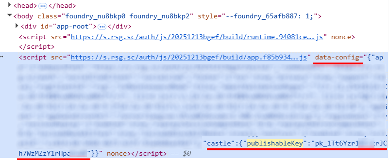

import Tabs from '@theme/Tabs';
import TabItem from '@theme/TabItem';
import ParamItem from '@theme/ParamItem';
import MethodItem from '@theme/MethodItem';
import MethodDescription from '@theme/MethodDescription'
import PriceBlock from '@theme/PriceBlock';
import PriceBlockWrap from '@theme/PriceBlockWrap';
import { ArticleHead } from '../../src/theme/ArticleHead';

<ArticleHead slug="captchas/castle-task" />

# Castle

<PriceBlockWrap>
  <PriceBlock title="Castle" captchaId="castle"/>
</PriceBlockWrap>


:::warning **Внимание!**
CapMonster Cloud по умолчанию работает через встроенные прокси — они уже включены в стоимость. Указывать собственные прокси требуется только в тех случаях, когда сайт не принимает токен или доступ к встроенным сервисам ограничен.

Если прокси с авторизацией по IP, то необходимо добавить адрес **65.21.190.34** в белый список.
:::

## Параметры запроса

<TabItem value="proxy" label="CastleTask" className="bordered-panel">
<ParamItem title="type" required type="string" />
**CustomTask**

---

<ParamItem title="class" required type="string" />
**Castle**

---

<ParamItem title="websiteURL" required type="string" />
Адрес страницы, на которой находится Castle.

---

<ParamItem title="websiteKey" required type="string" />
**Publishable Key**, идентификатор Castle. Находится на странице/в cкриптах сайта. 
Например: ```pk_1Tk5Yzr1WFzxrJCh7WzMZzY1rHpaOtdK```

---

<ParamItem title="wUrl (внутри metadata)" required type="string" />
Ссылка на `cw.js`, например: ```https://s.rsg.sc/auth/js/20251234bgef/build/cw.js```

---
<ParamItem title="swUrl (внутри metadata)" required type="string" />
Ссылка на `csw.js`, например: ```https://s.rsg.sc/auth/js/20251234bgef/build/cw.js```

---
<ParamItem title="count (внутри metadata)" type="intenger" />
Количество токенов - по умолчанию 1 (генерация от 1 до 49 токенов Castle, привязанных к одной и той же сессии браузера, то есть с одинаковым идентификатором `__cuid`.)
Если указать значение больше 49, будет возвращено максимальное допустимое количество токенов — 49, и стоимость будет рассчитана именно за это количество.

---

<ParamItem title="userAgent" type="string" />
User-Agent браузера. <br />
**Передавайте только актуальный UA от ОС Windows. Сейчас таковым является**: `userAgentPlaceholder`

---

<ParamItem title="proxyType" type="string" />
**http** - обычный http/https прокси;<br />
**https** - попробуйте эту опцию только если "http" не работает (требуется для некоторых кастомных прокси);<br />
**socks4** - socks4 прокси;<br />
**socks5** - socks5 прокси.

---

<ParamItem title="proxyAddress" type="string" />
<p>
    IP адрес прокси IPv4/IPv6. Не допускается:
    - использование прозрачных прокси (там где можно видеть IP клиента);
    - использование прокси на локальных машинах.
</p>

---

<ParamItem title="proxyPort" type="integer" />
Порт прокси.

---

<ParamItem title="proxyLogin" type="string" />
Логин прокси-сервера.

---

<ParamItem title="proxyPassword" type="string" />
Пароль прокси-сервера.

</TabItem>

## Метод создания задачи

<Tabs className="full-width-tabs filled-tabs request-tabs" groupId="captcha-type">

  <TabItem value="proxyless" label="CustomTask (без прокси)" default className="method-panel">
    <MethodItem>
      ```http
      https://api.capmonster.cloud/createTask
      ```
    </MethodItem>
    <MethodDescription>
      **Запрос**
      ```json
      {
		"type": "CustomTask",
		"Class": "Castle",
		"websiteURL": "https://www.example.com/",
		"websiteKey": "pk_1Tk5Yzr1WFzxrJCh7WzMZzY1rHpaOtdK",
		"userAgent": "userAgentPlaceholder",
		"metadata": {
			"wUrl": "https://s.rsg.sc/auth/js/20251234bgef/build/cw.js",
			"swUrl": "https://s.rsg.sc/auth/js/20251234bgef/build/csw.js",
			"count":1
		}
}
        ```
        **Ответ**
        ```json
        {
            "errorId": 0,
            "taskId": 123456789
        }
        ```
        </MethodDescription>
    </TabItem>

 <TabItem value="proxy" label="CustomTask (c прокси)" className="method-panel">
    <MethodItem>
      ```http
      https://api.capmonster.cloud/createTask
      ```
    </MethodItem>
    <MethodDescription>
      **Запрос**
      ```json
      {
		"type": "CustomTask",
		"Class": "Castle",
		"websiteURL": "https://www.example.com/",
		"websiteKey": "pk_1Tk5Yzr1WFzxrJCh7WzMZzY1rHpaOtdK",
		"userAgent": "userAgentPlaceholder",
		"metadata": {
			"wUrl": "https://s.rsg.sc/auth/js/20251234bgef/build/cw.js",
			"swUrl": "https://s.rsg.sc/auth/js/20251234bgef/build/csw.js",
			"count":1
		}
          "proxyType": "http",
          "proxyAddress": "8.8.8.8",
          "proxyPort": 8080,
          "proxyLogin": "proxyLoginHere",
          "proxyPassword": "proxyPasswordHere"
        }
      }
      ```

      **Ответ**
      ```json
      {
        "errorId": 0,
        "taskId": 407533072
      }
      ```
    </MethodDescription>
  </TabItem>

</Tabs>

## Метод получения результата задачи
Используйте метод [getTaskResult](../api/methods/get-task-result.mdx), чтобы получить решение TenDI.

<TabItem value="proxyless" label="CustomTask (без прокси)" default className="method-panel-full">
	<MethodItem>
		```http
		https://api.capmonster.cloud/getTaskResult
		```
	</MethodItem>
	<MethodDescription>
		**Запрос**
		```json
		{
		  "clientKey":"API_KEY",
		  "taskId": 407533072
		}
		```
		**Ответ**
		```json
     {
          "errorId":0,
          "status":"ready",
          "solution":  {
              "data":
          {
            "tokens":["Q05Ap...H7nYn", "cn9xW...aFl_4", ...]
          },
              "domains": {
                  "www.example.com": {
                      "cookies": {
                          "__cuid": "6883480a9ab7442d9f97da7307d6ea9c"
                      }
                  }
              }
          }
      }
		```
	</MethodDescription>
</TabItem>

## Как получить параметры Castle

### `pk (websiteKey)`

**Вариант 1:**

1. Откройте страницу с Castle, запустите **Инструменты разработчика**, перейдите на вкладку **Elements (Элементы)**.
2. Откройте поиск (Ctrl + F) и введите в строке ключевые слова **pk** или **PublishableKey**.
3. Найдите параметр `Publishable Key` среди элементов страницы или в подключённых скриптах.


**Вариант 2:**

Если сайт использует объект ```window._env```: 


Скопируйте значение `pk` или в консоли браузера введите команду: ```window._env.pk```


**Вариант 3:**

Если `pk` содержится в `data-config`:



Скопируйте значение `pk` или в консоли браузера используйте следующий код в консоли браузера:

```javascript
const script = document.querySelector('script[data-config]');
const config = JSON.parse(script.dataset.config);
config.castle.publishableKey;
```

---

### `cw.js` и `csw.js`

В **Инструментах разработчика** перейдите на вкладку **Network**, активируйте Castle и изучите сетевые запросы. Найдите запросы к файлам `cw.js` и `csw.js` и скопируйте их URL. 


