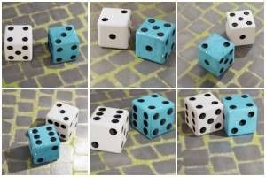
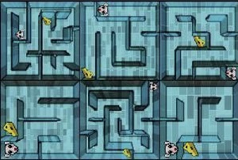
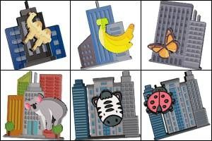
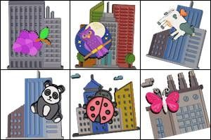
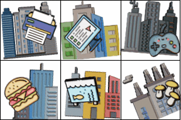
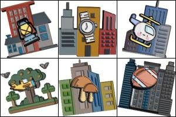
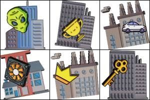
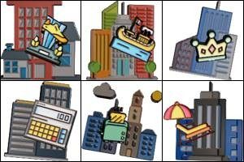
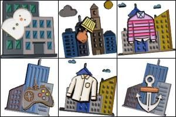
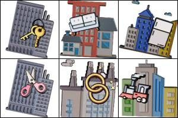

---
sidebar_position: 3
sidebar_label: FunCaptchaTask
---

# FunCaptchaTask : решение каптчи FunCaptcha
Этот тип задач решает FunCaptcha. Ваше приложение присылает адрес страницы, публичный ключ FunCaptcha и опционально прокси.

Результатом решения задачи является токен для сабмита формы.

:::warning **Внимание!**
Если прокси с авторизацией по IP, то необходимо обязательно добавить **116.203.55.208** в белый список.
:::

## **Структура объекта**

|**Параметр**|**Тип**|**Обязательный**|**Значение**|
| :- | :- | :- | :- |
|type|String|да|**FunCaptchaTaskProxyless** или **FunCaptchaTask (При использовании прокси)**|
|websiteURL|String|да|Адрес страницы на которой решается каптча|
|funcaptchaApiJSSubdomain|String|нет|Специальный сервисный URL, с которого должен загружаться JS виджет каптчи. Его можно найти в элементе с именем fc-token - значение после surl. Оно требуется, если используется домен отличный от client-api.arkoselabs.com|
|websitePublicKey|String|да|Ключ-идентификатор FunCaptcha на целевой странице. Его можно найти в блоке `<div id="funcaptcha" data-pkey="ВОТ\_ЗДЕСЬ"></div>` или в значении элементов с именем fc-token и verification-token, после параметра pk=|
|data|String|нет|Дополнительный параметр, который может требоваться для некоторых решений FunCaptcha.<br />Используйте это свойство для передачи параметра blob в виде массива, сведенного в строку. Пример:<br />*{"\blob\":\"HERE_COMES_THE_blob_VALUE\"}*|
|proxyType|String|да (При использовании **FunCaptchaTask**) |**http** - обычный http/https прокси<br/>**https** - попробуйте эту опцию только если "http" не работает (требуется для некоторых кастомных прокси)<br />**socks4** - socks4 прокси<br />**socks5** - socks5 прокси|
|proxyAddress|String|да (При использовании **FunCaptchaTask**)|<p>IP адрес прокси IPv4/IPv6. Не допускается:</p><p>- использование имен хостов</p><p>- использование прозрачных прокси (там где можно видеть IP клиента)</p><p>- использование прокси на локальных машинах</p>|
|proxyPort|Integer|да (При использовании **FunCaptchaTask**)|Порт прокси|
|proxyLogin|String|нет|Логин прокси-сервера|
|proxyPassword|String|нет|Пароль прокси-сервера|
|userAgent|String|да|User-Agent браузера, используемый в эмуляции. |
|cookies|String|нет|<p>Дополнительные cookies которые мы должны использовать во время взаимодействия с целевой страницей.</p><p>**Формат**: cookiename1=cookievalue1; cookiename2=cookievalue2</p>|

## **Пример запроса**

:::info Метод
<https://api.capmonster.cloud/createTask>
:::

### FunCaptchaTask (С использованием прокси)
```json
{
  "clientKey":"dce6bcbb1a728ea8d871de6d169a2057",
  "task": {
    "type":"FunCaptchaTask",
    "websiteURL":"http://mywebsite.com/",
    "funcaptchaApiJSSubdomain":"mywebsite-api.funcaptcha.com",
    "data": "{\"blob\":\"dyXvXANMbHj1iDyz.Qj97JtSqR2n%2BuoY1V%2FbdgbrG7p%2FmKiqdU9AwJ6MifEt0np4vfYn6TTJDJEfZDlcz9Q1XMn9przeOV%2FCr2%2FIpi%2FC1s%3D\"}",
    "websitePublicKey":"69A21A01-CC7B-B9C6-0F9A-E7FA06677FFC",
    "proxyType":"http",
    "proxyAddress":"8.8.8.8",
    "proxyPort":8080,
    "proxyLogin":"proxyLoginHere",
    "proxyPassword":"proxyPasswordHere",
    "userAgent":"Mozilla/5.0 (Windows NT 10.0; Win64; x64) AppleWebKit/537.36 (KHTML, like Gecko) Chrome/81.0.4044.132 Safari/537.36"
  }
}
```
### FunCaptchaTaskProxyless (Без использования прокси)
```json
{
  "clientKey":"dce6bcbb1a728ea8d871de6d169a2057",
  "task": {
    "type":"FunCaptchaTaskProxyless",
    "websiteURL":"http://mywebsite.com/",
    "funcaptchaApiJSSubdomain":"mywebsite-api.funcaptcha.com",
    "data": "{\"blob\":\"dyXvXANMbHj1iDyz.Qj97JtSqR2n%2BuoY1V%2FbdgbrG7p%2FmKiqdU9AwJ6MifEt0np4vfYn6TTJDJEfZDlcz9Q1XMn9przeOV%2FCr2%2FIpi%2FC1s%3D\"}",
    "websitePublicKey":"69A21A01-CC7B-B9C6-0F9A-E7FA06677FFC"
  }
}
```

**Пример ответа**

```json
{
  "errorId":0,
  "taskId":407533072

}
```

## **Получение результата**

:::info Метод
<https://api.capmonster.cloud/getTaskResult>
:::

Используйте метод [getTaskResult](https://capmonster.atlassian.net/wiki/spaces/APIS/pages/557078/getTaskResult) чтобы получить решение FunCaptcha. В зависимости от загрузки системы вы получите ответ через время в диапазоне от 10 с до 30 с.

|**Свойство**|**Тип**|**Описание**|
| :- | :- | :- |
|token|String|Токен FunCaptcha, который необходимо подставить в форму.|

**Пример:**
```json
{
  "errorId":0,
  "status":"ready",
  "solution": {
    "token":"36859d1086acb06e7.08293101|r=ap-southeast-1|metabgclr=%23ffffff|guitextcolor=%23555555|metaiconclr=%23cccccc|meta=3|pk=69A21A01-CC7B-B9C6-0F9A-E7FA06677FFC|injs=https://funcaptcha.com/fc/api/nojs/?pkey=69A21A01-CC7B-B9C6-0F9A-E7FA06677FFC|rid=11|cdn_url=https://cdn.funcaptcha.com/fc|surl=https://funcaptcha.com"
  }
}
```

## Поддерживаемые типы заданий

|**Тип**|**Описание**|
| :- | :- |
||Выберите изображение с соответствующим отражением|
||Выберите тень с другим силуэтом объекта|
||Выберите квадрат, на котором изображены два одинаковых объекта|
||Выберите пару кубиков с одинаковыми значками сверху|
||Выберите пару кубиков, сумма верхних сторон которых равна 4|
||Выберите пару кубиков, сумма верхних сторон которых равна 5|
||Выберите пару кубиков, сумма верхних сторон которых равна 6|
||Выберите пару кубиков, сумма верхних сторон которых равна 7|
||Выберите пару кубиков, сумма верхних сторон которых равна 8|
||Выберите пару кубиков, сумма верхних сторон которых равна 10|
||Выберите пару кубиков, сумма верхних сторон которых равна 14|
||Выберите изображение, где сумма дартс равна 8/10/12/14|
||Выберите изображение, на котором все животные идут по направлению стрелки|
||Выберите тень, соответствующую значкам в верхней части изображения|
||Выберите совпадающие карты|
||Выберите мышь, которая может добраться до всех кусочков сыра в лабиринте|
||Выберите животное с неправильной головой|
||Выберите пингвина|
||Используйте стрелки, чтобы повернуть животное лицом в направлении руки|
||Выберите изображение, которое расположено правильно|
||Выберите спиральную галактику|
||Выберите изображение только с одной веревкой|
||Выберите куб со значками, разделенными пополам|
||Выберите пазл с неправильными частями|
||Выберите изображение, где цифра соответствует количеству животных|
||Выберите мышь, которая не сможет добраться до сыра|
||Выберите изображение, на котором общее количество пальцев равно 3|
||Выберите неправильную тень|
||Выберите один квадрат, на котором изображены три одинаковых объекта|
||Используйте стрелки, чтобы переместить человека в место, указанное крестиком|
||Используйте стрелки, чтобы переместить человека к значку, обозначенному цветным кружком|
||Используйте стрелки, чтобы повернуть животное с таким же значком по направлению руки|
||Используйте стрелки, чтобы изменить количество объектов, пока оно не совпадет с левым изображением|
||Меняйте кубики, пока количество не совпадет с числом на изображении слева|
||Используйте стрелки, чтобы переместить транспорт к координатам, указанным на левом изображении|
||Выберите изображение, на котором количество камней совпадает с числом слева|
||Выберите коалу|
||Выберите божью коровку|
||Выберите свинью|
||Выберите зебру|
||Выберите акулу|
||Выберите динозавра|
||Выберите утку|
||Выберите курицу|
||Выберите носорога|
||Выберите дельфина|
||Выберите виноград|
||Выберите козу|
||Выберите слона|
||Выберите тюленя|
||Выберите медведя|
||Выберите мышь|
||Выберите бабочку|
||Выберите обезьяну|
||Выберите хлеб|
||Выберите омара|
||Выберите кенгуру|
||Выберите оленя|
||Выберите яблоко|
||Выберите муравья|
||Выберите змею|
||Выберите мороженое|
||Выберите сову|
||Выберите штаны|
||Выберите кактус|
||Выберите калькулятор|
||Выберите обувь|
||Выберите ножницы|
||Выберите льва|
||Выберите краба|
||Выберите пончик|
||Выберите собаку|
||Выберите пчелу|
||Выберите банан|
||Выберите попугая|
||Выберите осьминога|
||Выберите карандаш|
||Выберите лампу|
||Выберите замок|
||Выберите черепаху|
||Выберите верблюда|
||Выберите лошадь|
||Выберите пиццу|
||Выберите летучую мышь|
||Выберите арбуз|
||Выберите контроллер|
||Выберите кролика|
||Выберите ананас|
||Выберите улитку|
||Выберите очки|
||Выберите ключ|
||Выберите хотдог|
||Выберите шлем|
||Выберите носки|
||Выберите морскую звезду|
||Выберите лягушку|
||Выберите принтер|
||Выберите зонт|
||Выберите жирафа|
||Выберите космический корабль|
||Выберите лодку|
||Выберите неправильную тень|
||Выберите вертолет|
||Выберите холодильник|
||Выберите диван|
||Выберите деньги|
||Выберите грибы|
||Выберите забор|
||Выберите машину|
||Выберите наручные часы|
||Выберите пришельца|
||Выберите вентилятор|
||Выберите корону|
||Выберите бургер|
||Выберите поезд|
||Выберите трофей|
||Выберите аквариум|
||Выберите якорь|
||Выберите тостер|
||Выберите степлер|
||Выберите велосипед|
||Выберите гитару|
||Выберите огонь|
||Выберите цветок|
||Выберите снеговика|
||Выберите мяч|
||Выберите кольца|
||Выберите камеру|
||Вид капчи, для решения которой нужно поворачивать изображение|