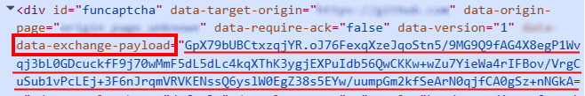

import Tabs from '@theme/Tabs';
import TabItem from '@theme/TabItem';
import ParamItem from '@theme/ParamItem';
import MethodItem from '@theme/MethodItem';
import MethodDescription from '@theme/MethodDescription'
import PriceBlock from '@theme/PriceBlock';
import PriceBlockWrap from '@theme/PriceBlockWrap';
import { ArticleHead } from '../../src/theme/ArticleHead';

<ArticleHead slug="captchas/funcaptcha-task" />

# FunCaptcha 

<PriceBlockWrap>
  <PriceBlock title="FunCaptcha" captchaId="funcaptcha-task"/>
</PriceBlockWrap>


:::warning **Внимание!**
CapMonster Cloud по умолчанию работает через встроенные прокси — они уже включены в стоимость. Указывать собственные прокси требуется только в тех случаях, когда сайт не принимает токен или доступ к встроенным сервисам ограничен.

Если прокси с авторизацией по IP, то необходимо добавить адрес **65.21.190.34** в белый список.
:::

## Параметры запроса

<TabItem value="proxy" label="FunCaptchaTask" className="bordered-panel">
<ParamItem title="type" required type="string" />
**FunCaptchaTask**

---

<ParamItem title="websiteURL" required type="string" />
Адрес страницы, на которой решается капча.

---

<ParamItem title="websitePublicKey" required type="string" />
Ключ FunCaptcha (значение *public key* или *pk*).

---

<ParamItem title="data" type="string" />
Дополнительный параметр. Обязателен, если на сайте используется *data[blob]*. <br />
 **Важно:** Не загружайте фрейм с капчей для извлечения `blob`. После загрузки капчи значение параметра становится невалидным.

---

<ParamItem title="funcaptchaApiJSSubdomain" type="string" />
Поддомен Arkose Labs (значение *surl*). Указывайте в том случае, если он отличается от стандартного: `client-api.arkoselabs.com`

---

<ParamItem title="userAgent" type="string" />
User-Agent браузера. <br />
  **Передавайте только актуальный UA от ОС Windows. Сейчас таковым является**: `userAgentPlaceholder`

---

<ParamItem title="cookies" type="string" />
Передавайте дополнительные cookie в формате:

```
cookieName1=value1; cookieName2=value2
```

---

<ParamItem title="proxyType" type="string" />
**http** - обычный http/https прокси;<br />
**https** - попробуйте эту опцию только если "http" не работает (требуется для некоторых кастомных прокси);<br />
**socks4** - socks4 прокси;<br />
**socks5** - socks5 прокси.

---

<ParamItem title="proxyAddress" type="string" />
<p>
IP адрес прокси IPv4/IPv6. Не допускается:
- использование прозрачных прокси (где сохраняется видимость реального IP клиента);
- использование прокси на локальных машинах.
</p>

---

<ParamItem title="proxyPort" type="integer" />
Порт прокси.

---

<ParamItem title="proxyLogin" type="string" />
Логин прокси-сервера.

---

<ParamItem title="proxyPassword" type="string" />
Пароль прокси-сервера.

</TabItem>

## Метод создания задачи
<Tabs className="full-width-tabs filled-tabs request-tabs" groupId="captcha-type">
<TabItem value="proxyless" label="FunCaptchaTask (без прокси)" default className="method-panel">
<MethodItem>
```http
https://api.capmonster.cloud/createTask
```
</MethodItem>
<MethodDescription>
**Запрос**
```json
{
  "clientKey": "API_KEY",
  "task": {
    "type": "FunCaptchaTask",
    "websiteURL": "https://www.example.com",
    "websitePublicKey": "EX72CCFB-26EX-40E5-91E6-85EX70BE98ED",
    "funcaptchaApiJSSubdomain": "example-api.arkoselabs.com",
    "data": "{\"blob\":\"nj9UbL+yio7goOlTQ/b64t.ayrrBnP6kPgzlKYCP/kv491lKS...Wot/7gjpyIxs7VYb0+QuRcfQ/t6bzh5pXDkOFSskA/V/ITSVZSAlglIplLcdreZ4PE8skfMU6k1Q\"}",
    "userAgent": "userAgentPlaceholder"
  }
}
```
**Ответ**
```json
{
  "errorId":0,
  "taskId":407533077
}
```
</MethodDescription>
</TabItem>

<TabItem value="proxy" label="FunCaptchaTask (при использовании прокси)" default className="method-panel">
<MethodItem>
```http
https://api.capmonster.cloud/createTask
```
</MethodItem>
<MethodDescription>
**Запрос**
```json
{
  "clientKey": "API_KEY",
  "task": {
    "type": "FunCaptchaTask",
    "websiteURL": "https://www.example.com",
    "websitePublicKey": "EX72CCFB-26EX-40E5-91E6-85EX70BE98ED",
    "funcaptchaApiJSSubdomain": "example-api.arkoselabs.com",
    "data": "{\"blob\":\"nj9UbL+yio7goOlTQ/b64t.ayrrBnP6kPgzlKYCP/kv491lKS...Wot/7gjpyIxs7VYb0+QuRcfQ/t6bzh5pXDkOFSskA/V/ITSVZSAlglIplLcdreZ4PE8skfMU6k1Q\"}",
    "userAgent": "userAgentPlaceholder",
    "proxyType": "http",
    "proxyAddress": "8.8.8.8",
    "proxyPort": 8080,
    "proxyLogin": "proxyLoginHere",
    "proxyPassword": "proxyPasswordHere"
  }
}
```
**Ответ**
```json
{
  "errorId":0,
  "taskId":407533077
}
```
</MethodDescription>
</TabItem>
</Tabs>

## Метод получения результата задачи
Используйте метод [getTaskResult](../api/methods/get-task-result.mdx), чтобы получить решение FunCaptcha.

<TabItem value="proxyless" label="FunCaptchaTask (без прокси)" default className="method-panel-full">
<MethodItem>
```http
https://api.capmonster.cloud/getTaskResult
```
</MethodItem>
<MethodDescription>
**Запрос**
```json
{
  "clientKey": "API_KEY",
  "taskId": 407533077
}
```

**Ответ**
```json
{
  "errorId": 0,
  "errorCode": null,
  "errorDescription": null,
  "solution": {
    "token": "337187b9f57678923.5060184402|r=us-west-2|lang=en|pk=EX72CCFB-26EX-40E5-91E6-85EX70BE98ED|at=40|ag=101|cdn_url=https%3A%2F%2Fclient-api.arkoselabs.com%2Fcdn%2Ffc|surl=https%3A%2F%2Fclient-api.arkoselabs.com|smurl=https%3A%2F%2Fclient-api.arkoselabs.com%2Fcdn%2Ffc%2Fassets%2Fstyle-manager",
    "userAgent": "userAgentPlaceholder"
  },
  "status": "ready"
}
```
</MethodDescription>
</TabItem>

## Поиск параметров FunCaptcha

###  `websitePublicKey` и `funcaptchaApiJSSubdomain`

Откройте DevTools → **Elements** и найдите скрытый input с ID `verification-token` или `FunCaptcha-Token`. В них содержатся значения параметров `pk` (*websitePublicKey*) и `surl` (*funcaptchaApiJSSubdomain*).

Получите параметры через консоль:

```js
const v = document.querySelector("#verification-token, #FunCaptcha-Token").value;
const p = Object.fromEntries(v.split("|").map(x => x.split("=")));
console.log("pk:", p.pk);
console.log("surl:", decodeURIComponent(p.surl));
```

### `data`

Если на сайте используется дополнительный параметр `blob`, его значение можно получить следующим образом:

#### 1. Определение источника данных

Параметр `blob` может находиться в разных местах:

* **HTML-атрибут страницы**: например, `data-blob` или другие `data-*` атрибуты.



* **JSON-ответ API**: возвращается после действия пользователя (например, клика или запроса капчи).

* **Query-параметр URL в JSON-ответе**: иногда `blob` передается как часть URL.

#### 2. Выполнение запроса

* **GET-запрос** к странице, где отображается капча

или

* **POST-запрос** к API, который возвращает данные капчи.

> **Важно:** Не загружайте фрейм с капчей для извлечения `blob`. После загрузки капчи значение параметра становится невалидным.

#### 3. Извлечение параметра

* Если ответ **HTML** — используйте регулярное выражение или инструмент для разбора HTML, чтобы найти нужный атрибут.
* Если ответ **JSON** — получите значение соответствующего ключа (например, `data.blob`).
* Если `blob` находится в **URL** — разберите query-параметры и извлеките нужное значение.


