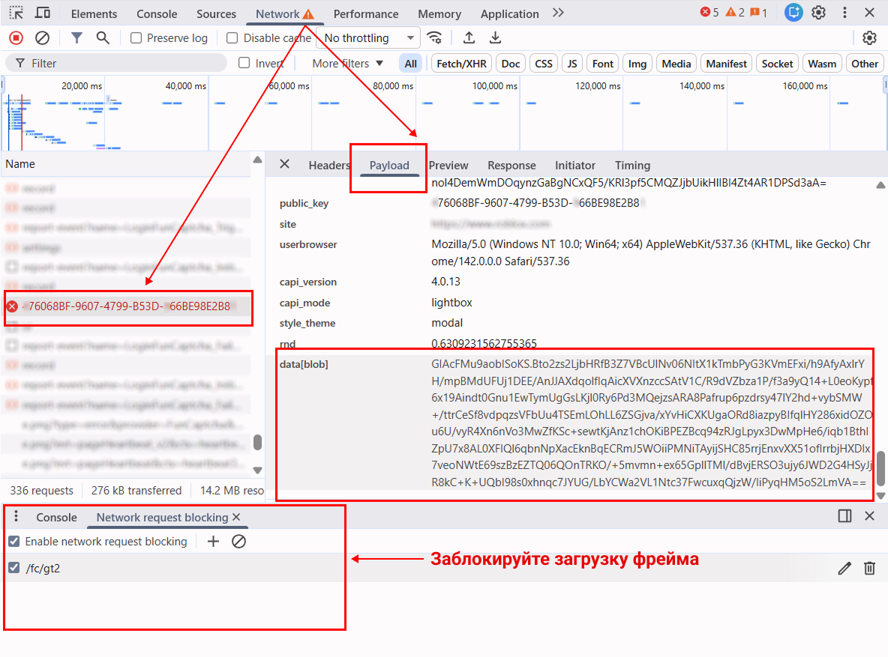

import Tabs from '@theme/Tabs';
import TabItem from '@theme/TabItem';
import ParamItem from '@theme/ParamItem';
import MethodItem from '@theme/MethodItem';
import MethodDescription from '@theme/MethodDescription'
import PriceBlock from '@theme/PriceBlock';
import PriceBlockWrap from '@theme/PriceBlockWrap';
import { ArticleHead } from '../../src/theme/ArticleHead';

<ArticleHead slug="captchas/funcaptcha-task" />

# FunCaptcha 

<PriceBlockWrap>
  <PriceBlock title="FunCaptcha" captchaId="funcaptcha"/>
</PriceBlockWrap>


:::warning **Внимание!**
CapMonster Cloud по умолчанию работает через встроенные прокси — они уже включены в стоимость. Указывать собственные прокси требуется только в тех случаях, когда сайт не принимает токен или доступ к встроенным сервисам ограничен.

Если прокси с авторизацией по IP, то необходимо добавить адрес **65.21.190.34** в белый список.
:::

## Параметры запроса

<TabItem value="proxy" label="FunCaptchaTask" className="bordered-panel">
<ParamItem title="type" required type="string" />
**FunCaptchaTask**

---

<ParamItem title="websiteURL" required type="string" />
Адрес страницы, на которой решается капча.

---

<ParamItem title="websitePublicKey" required type="string" />
Ключ FunCaptcha (значение *public key* или *pk*).

---

<ParamItem title="data" type="string" />
Дополнительный параметр. Обязателен, если на сайте используется *data[blob]*. <br />
 **Важно:** Не загружайте фрейм с капчей для извлечения `blob`. После загрузки капчи значение параметра становится невалидным.

---

<ParamItem title="funcaptchaApiJSSubdomain" type="string" />
Поддомен Arkose Labs (значение *surl*). Указывайте в том случае, если он отличается от стандартного: `client-api.arkoselabs.com`

---

<ParamItem title="userAgent" type="string" />
User-Agent браузера. <br />
  **Передавайте только актуальный UA от ОС Windows. Сейчас таковым является**: `userAgentPlaceholder`

---

<ParamItem title="cookies" type="string" />
Передавайте дополнительные cookie в формате:

```
cookieName1=value1; cookieName2=value2
```

---

<ParamItem title="proxyType" type="string" />
**http** - обычный http/https прокси;<br />
**https** - попробуйте эту опцию только если "http" не работает (требуется для некоторых кастомных прокси);<br />
**socks4** - socks4 прокси;<br />
**socks5** - socks5 прокси.

---

<ParamItem title="proxyAddress" type="string" />
<p>
IP адрес прокси IPv4/IPv6. Не допускается:
- использование прозрачных прокси (где сохраняется видимость реального IP клиента);
- использование прокси на локальных машинах.
</p>

---

<ParamItem title="proxyPort" type="integer" />
Порт прокси.

---

<ParamItem title="proxyLogin" type="string" />
Логин прокси-сервера.

---

<ParamItem title="proxyPassword" type="string" />
Пароль прокси-сервера.

</TabItem>

## Метод создания задачи
<Tabs className="full-width-tabs filled-tabs request-tabs" groupId="captcha-type">
<TabItem value="proxyless" label="FunCaptchaTask (без прокси)" default className="method-panel">
<MethodItem>
```http
https://api.capmonster.cloud/createTask
```
</MethodItem>
<MethodDescription>
**Запрос**
```json
{
  "clientKey": "API_KEY",
  "task": {
    "type": "FunCaptchaTask",
    "websiteURL": "https://www.example.com",
    "websitePublicKey": "EX72CCFB-26EX-40E5-91E6-85EX70BE98ED",
    "funcaptchaApiJSSubdomain": "example-api.arkoselabs.com",
    "data": "{\"blob\":\"nj9UbL+yio7goOlTQ/b64t.ayrrBnP6kPgzlKYCP/kv491lKS...Wot/7gjpyIxs7VYb0+QuRcfQ/t6bzh5pXDkOFSskA/V/ITSVZSAlglIplLcdreZ4PE8skfMU6k1Q\"}",
    "userAgent": "userAgentPlaceholder"
  }
}
```
**Ответ**
```json
{
  "errorId":0,
  "taskId":407533077
}
```
</MethodDescription>
</TabItem>

<TabItem value="proxy" label="FunCaptchaTask (при использовании прокси)" default className="method-panel">
<MethodItem>
```http
https://api.capmonster.cloud/createTask
```
</MethodItem>
<MethodDescription>
**Запрос**
```json
{
  "clientKey": "API_KEY",
  "task": {
    "type": "FunCaptchaTask",
    "websiteURL": "https://www.example.com",
    "websitePublicKey": "EX72CCFB-26EX-40E5-91E6-85EX70BE98ED",
    "funcaptchaApiJSSubdomain": "example-api.arkoselabs.com",
    "data": "{\"blob\":\"nj9UbL+yio7goOlTQ/b64t.ayrrBnP6kPgzlKYCP/kv491lKS...Wot/7gjpyIxs7VYb0+QuRcfQ/t6bzh5pXDkOFSskA/V/ITSVZSAlglIplLcdreZ4PE8skfMU6k1Q\"}",
    "userAgent": "userAgentPlaceholder",
    "proxyType": "http",
    "proxyAddress": "8.8.8.8",
    "proxyPort": 8080,
    "proxyLogin": "proxyLoginHere",
    "proxyPassword": "proxyPasswordHere"
  }
}
```
**Ответ**
```json
{
  "errorId":0,
  "taskId":407533077
}
```
</MethodDescription>
</TabItem>
</Tabs>

## Метод получения результата задачи
Используйте метод [getTaskResult](../api/methods/get-task-result.mdx), чтобы получить решение FunCaptcha.

<TabItem value="proxyless" label="FunCaptchaTask (без прокси)" default className="method-panel-full">
<MethodItem>
```http
https://api.capmonster.cloud/getTaskResult
```
</MethodItem>
<MethodDescription>
**Запрос**
```json
{
  "clientKey": "API_KEY",
  "taskId": 407533077
}
```

**Ответ**
```json
{
  "errorId": 0,
  "errorCode": null,
  "errorDescription": null,
  "solution": {
    "token": "337187b9f57678923.5060184402|r=us-west-2|lang=en|pk=EX72CCFB-26EX-40E5-91E6-85EX70BE98ED|at=40|ag=101|cdn_url=https%3A%2F%2Fclient-api.arkoselabs.com%2Fcdn%2Ffc|surl=https%3A%2F%2Fclient-api.arkoselabs.com|smurl=https%3A%2F%2Fclient-api.arkoselabs.com%2Fcdn%2Ffc%2Fassets%2Fstyle-manager",
    "userAgent": "userAgentPlaceholder"
  },
  "status": "ready"
}
```
</MethodDescription>
</TabItem>

## Поиск параметров FunCaptcha

###  `websitePublicKey` и `funcaptchaApiJSSubdomain`

Откройте DevTools → **Elements** и найдите скрытый input с ID `verification-token` или `FunCaptcha-Token`. В них содержатся значения параметров `pk` (*websitePublicKey*) и `surl` (*funcaptchaApiJSSubdomain*).

Получите параметры через консоль:

```js
const v = document.querySelector("#verification-token, #FunCaptcha-Token").value;
const p = Object.fromEntries(v.split("|").map(x => x.split("=")));
console.log("pk:", p.pk);
console.log("surl:", decodeURIComponent(p.surl));
```

### `data (blob)`

Если на сайте используется дополнительный параметр `blob`, его значение можно получить следующим образом:

#### 1. Определение источника данных

Параметр `blob` может находиться в разных местах:

* **HTML-атрибут страницы**: например, `data-blob` или другие `data-*` атрибуты.


* **JSON-ответ API**: возвращается после действия пользователя (например, клика или запроса капчи).

* **Query-параметр URL в JSON-ответе**: иногда `blob` передается как часть URL.

#### 2. Выполнение запроса

* **GET-запрос** к странице, где отображается капча

или

* **POST-запрос** к API, который возвращает данные капчи.

> **Важно:** Не загружайте фрейм с капчей для извлечения `blob`. После загрузки капчи значение параметра становится невалидным.

#### 3. Извлечение параметра

* Если ответ **HTML** — используйте регулярное выражение или инструмент для разбора HTML, чтобы найти нужный атрибут.
* Если ответ **JSON** — получите значение соответствующего ключа (например, `data.blob`).
* Если `blob` находится в **URL** — разберите query-параметры и извлеките нужное значение.

<div style={{ fontSize: '110%' }}>
  **Также вы можете найти параметр `blob` и его значение с помощью сетевых запросов в DevTools:**
</div>


1. Перейдите на страницу с капчей, откройте DevTools и вызовите появление капчи. Затем откройте вкладку **Network** и найдите запрос вида:
   `https://arkoselabs.example.com/fc/gt2/public_key/176068BF-9607-4799-B53D-366BE98E2B84`

   

2. Заблокируйте загрузку iframe с капчей, чтобы получить валидный `blob`.
   Для этого нажмите **Ctrl + Shift + P** (в Chromium-браузерах), введите **Enable network request blocking**, включите блокировку и добавьте паттерн вида:
   `/fc/gt2`

   После перезагрузки страницы фрейм будет заблокирован. Скопируйте значение параметра `blob` и используйте в запросе на решение капчи.

   


## Автоматическое решение FunCaptcha с `data[blob]`

Примеры на JavaScript (Node.js), Python и C# показывают, как с помощью Playwright получить параметры `public_key` и `blob`, создать задачу в CapMonster Cloud и получить токен решения капчи. Вы можете реализовать аналогичную логику с другими инструментами автоматизации или тестирования.

<TabItem value="js" label="JavaScript" default className="method-panel">
    <details>
      <summary>Node.js</summary>
```javascript
// npm install playwright

const { chromium } = require("playwright");

const apiKey = "YOUR_API_KEY"; // API-ключ CapMonster Cloud
const websiteURL = "https://www.example.com/"; // Страница с FunCaptcha

// Ждём запрос FunCaptcha, проверяем его, извлекаем public_key и blob.
async function captureBlobAndPublicKey(page) {
    return new Promise(resolve => {
        page.on("request", req => {
            const url = req.url();

            // Проверяем, относится ли запрос к инициализации FunCaptcha
            if (url.includes("/fc/gt2/public_key/")) {
                const publicKey = url.split("/fc/gt2/public_key/")[1].split("/")[0];
                const post = req.postData();

                // Проверяем наличие blob в POST-данных и извлекаем его
                if (post && post.includes("data[blob]")) {
                    const params = new URLSearchParams(post);
                    const blob = params.get("data[blob]");

                    console.log("Extracted blob:", blob);
                    console.log("Extracted public_key:", publicKey);

                    resolve({ blob, publicKey });
                }
            }
        });
    });
}

// Создаём задачу FunCaptchaTask в CapMonster Cloud и отправляем параметры.
async function createTask(blob, publicKey) {
    const task = {
        type: "FunCaptchaTask",
        websiteURL,
        websitePublicKey: publicKey,
        data: JSON.stringify({ blob }),
        userAgent:
            "userAgentPlaceholder"
    };

    const res = await fetch("https://api.capmonster.cloud/createTask", {
        method: "POST",
        headers: { "Content-Type": "application/json" },
        body: JSON.stringify({ clientKey: apiKey, task })
    });

    const json = await res.json();

    // Проверяем ответ CapMonster Cloud и ждём taskId
    if (!json.taskId) {
        console.error("createTask error:", json);
        process.exit(1);
    }

    console.log("Task created:", json.taskId);
    return json.taskId;
}

// Ожидание решения задачи
async function getTaskResult(taskId) {
    while (true) {
        const res = await fetch("https://api.capmonster.cloud/getTaskResult", {
            method: "POST",
            headers: { "Content-Type": "application/json" },
            body: JSON.stringify({ clientKey: apiKey, taskId })
        });

        const json = await res.json();

        // Проверяем готовность решения
        if (json.status === "ready") return json.solution;

        console.log("Processing...");
        await new Promise(r => setTimeout(r, 2500));
    }
}

(async () => {
    const browser = await chromium.launch({ headless: false });
    const page = await browser.newPage();

    // Блокировка фрейма капчи
    await page.route("**/fc/gt2/**", route => route.abort());

    console.log("Opening page...");
    await page.goto(websiteURL, { waitUntil: "domcontentloaded" });

    console.log("Capturing public_key + blob...");

    /**
     * ВАЖНО!
     * НА ЭТОМ ШАГЕ НУЖНО ВЫЗВАТЬ КАПЧУ.
     * - нажать Login / Sign up
     * - ввести email / username
     *  - дождаться появления FunCaptcha
     *
     * Пример:
     * await page.click('text="Create account"');
     * await page.waitForTimeout(1000);
     */

    const { blob, publicKey } = await captureBlobAndPublicKey(page);

    // Проверяем, удалось ли получить параметры
    if (!blob || !publicKey) {
        console.error("Failed to extract blob or public_key");
        await browser.close();
        return;
    }

    console.log("Creating CapMonster task...");
    const taskId = await createTask(blob, publicKey);

    console.log("Waiting for solution...");
    const solution = await getTaskResult(taskId);

    // Получаем готовый токен
    console.log("CAPTCHA SOLVED");
    console.log("Token:", solution.token);

    await browser.close();
})();
```
</details>
  </TabItem>

<TabItem value="python" label="Python" className="method-panel">
    <details>
      <summary>Python</summary>
```Python
# pip install playwright
# playwright install

import asyncio
import json
import time
import requests
from playwright.async_api import async_playwright

API_KEY = "YOUR_API_KEY"  # API-ключ CapMonster Cloud
WEBSITE_URL = "https://www.example.com/"  # Страница с FunCaptcha


# Ждём запрос FunCaptcha, перехватываем его и извлекаем public_key и blob
async def capture_blob_and_public_key(page):
    future = asyncio.Future()

    async def on_request(request):
        url = request.url

        # Проверяем, относится ли запрос к инициализации FunCaptcha
        if "/fc/gt2/public_key/" in url:
            public_key = url.split("/fc/gt2/public_key/")[1].split("/")[0]
            post_data = request.post_data

            # Проверяем наличие blob в POST-данных
            if post_data and "data[blob]" in post_data:
                params = dict(x.split("=") for x in post_data.split("&"))
                blob = params.get("data[blob]")

                print("Extracted blob:", blob)
                print("Extracted public_key:", public_key)

                future.set_result((blob, public_key))

    # Подписываемся на запросы сети
    page.on("request", on_request)
    return await future


# Создаём задачу FunCaptchaTask в CapMonster Cloud и отправляем параметры
def create_task(blob, public_key):
    task = {
        "type": "FunCaptchaTask",
        "websiteURL": WEBSITE_URL,
        "websitePublicKey": public_key,
        "data": json.dumps({"blob": blob}),  # Передаём blob
        "userAgent": (
            "userAgentPlaceholder"
        )
    }

    res = requests.post(
        "https://api.capmonster.cloud/createTask",
        json={"clientKey": API_KEY, "task": task},
        headers={"Content-Type": "application/json"}
    )

    data = res.json()

    # Проверяем успешное создание задачи
    if "taskId" not in data:
        raise Exception(f"createTask error: {data}")

    print("Task created:", data["taskId"])
    return data["taskId"]


# Ожидаем решение задачи CapMonster Cloud
def get_task_result(task_id):
    while True:
        res = requests.post(
            "https://api.capmonster.cloud/getTaskResult",
            json={"clientKey": API_KEY, "taskId": task_id},
            headers={"Content-Type": "application/json"}
        )

        data = res.json()

        # Проверяем статус задачи
        if data.get("status") == "ready":
            return data["solution"]

        print("Processing...")
        time.sleep(2.5)


async def main():
    async with async_playwright() as p:
        browser = await p.chromium.launch(headless=False)
        page = await browser.new_page()

        # Блокируем загрузку фрейма FunCaptcha
        await page.route("**/fc/gt2/**", lambda route: route.abort())

        print("Opening page...")
        await page.goto(WEBSITE_URL, wait_until="domcontentloaded")

        print("Capturing public_key + blob...")

        # ------------------------------------------------------------------
        # ВАЖНО!
        # НА ЭТОМ ШАГЕ НУЖНО ВЫЗВАТЬ КАПЧУ.
        # - нажать Login / Sign up
        # - ввести email / username
        # - дождаться появления FunCaptcha
        #
        # Пример:
        # await page.click("text=Sign up")
        # await page.wait_for_timeout(1000)
        # ------------------------------------------------------------------

        blob, public_key = await capture_blob_and_public_key(page)

        # Проверяем, удалось ли получить параметры
        if not blob or not public_key:
            print("Failed to extract blob or public_key")
            await browser.close()
            return

        print("Creating CapMonster task...")
        task_id = create_task(blob, public_key)

        print("Waiting for solution...")
        solution = get_task_result(task_id)

        # Готовый FunCaptcha токен
        print("CAPTCHA SOLVED")
        print("Token:", solution["token"])

        await browser.close()


# Запуск
asyncio.run(main())
```
</details>
  </TabItem>

<TabItem value="js" label="JavaScript" default className="method-panel">
    <details>
      <summary>C#</summary>
```csharp
// dotnet add package Microsoft.Playwright

using Microsoft.Playwright;
using System.Text;
using System.Text.Json;
using System.Net.Http;
using System.Threading.Tasks;

class Program
{
    private static readonly string ApiKey = "YOUR_API_KEY";   // API-ключ CapMonster Cloud
    private static readonly string WebsiteURL = "https://www.example.com/"; // Страница с FunCaptcha
    private static readonly HttpClient http = new HttpClient();

    // Ждём сетевой запрос FunCaptcha, ищем public_key + blob
    static TaskCompletionSource<(string blob, string publicKey)> blobTcs;

    static async Task Main()
    {
        blobTcs = new TaskCompletionSource<(string, string)>();

        using var playwright = await Playwright.CreateAsync();
        var browser = await playwright.Chromium.LaunchAsync(new BrowserTypeLaunchOptions
        {
            Headless = false
        });

        var page = await browser.NewPageAsync();

        // Блокируем загрузку фрейма FunCaptcha
        await page.RouteAsync("**/fc/gt2/**", route => route.AbortAsync());

        // Подписываемся на сетевые запросы
        page.Request += OnRequest;

        Console.WriteLine("Opening page...");
        await page.GotoAsync(WebsiteURL, new PageGotoOptions
        {
            WaitUntil = WaitUntilState.DOMContentLoaded
        });

        Console.WriteLine("Capturing public_key + blob...");

        // ---------------------------------------------------------------
        // ВАЖНО!
        // НА ЭТОМ ШАГЕ НУЖНО ВЫЗВАТЬ КАПЧУ.
        // - кликнуть Login / Sign up
        // - ввести данные
        // - дождаться FunCaptcha
        //
        // Пример:
        // await page.ClickAsync("text=Sign up");
        // await page.WaitForTimeoutAsync(1500);
        // ---------------------------------------------------------------

        var (blob, publicKey) = await blobTcs.Task;

        if (blob == null || publicKey == null)
        {
            Console.WriteLine("Failed to extract blob or public_key");
            await browser.CloseAsync();
            return;
        }

        Console.WriteLine("Creating CapMonster task...");
        var taskId = await CreateTask(blob, publicKey);

        Console.WriteLine("Waiting for solution...");
        var solution = await GetTaskResult(taskId);

        Console.WriteLine("CAPTCHA SOLVED");
        Console.WriteLine("Token: " + solution);

        await browser.CloseAsync();
    }

    // Обработчик сетевых запросов — ищем public_key + blob
    private static async void OnRequest(object sender, IRequest request)
    {
        string url = request.Url;

        // Проверяем, относится ли запрос к FunCaptcha
        if (url.Contains("/fc/gt2/public_key/"))
        {
            string publicKey = url.Split("/fc/gt2/public_key/")[1].Split("/")[0];
            string postData = request.PostData;

            // Проверяем наличие blob в POST-данных
            if (!string.IsNullOrEmpty(postData) && postData.Contains("data[blob]"))
            {
                var parts = postData.Split('&');
                string blob = null;

                foreach (var part in parts)
                {
                    if (part.StartsWith("data[blob]="))
                        blob = part.Substring("data[blob]=".Length);
                }

                Console.WriteLine("Extracted blob: " + blob);
                Console.WriteLine("Extracted public_key: " + publicKey);

                blobTcs.TrySetResult((blob, publicKey));
            }
        }
    }

    // Создаём задачу FunCaptchaTask в CapMonster Cloud
    private static async Task<int> CreateTask(string blob, string publicKey)
    {
        var task = new
        {
            type = "FunCaptchaTask",
            websiteURL = WebsiteURL,
            websitePublicKey = publicKey,
            data = JsonSerializer.Serialize(new { blob }),
            userAgent = "userAgentPlaceholder"
        };

        var payload = new
        {
            clientKey = ApiKey,
            task
        };

        var content = new StringContent(JsonSerializer.Serialize(payload), Encoding.UTF8, "application/json");
        var res = await http.PostAsync("https://api.capmonster.cloud/createTask", content);
        var json = JsonDocument.Parse(await res.Content.ReadAsStringAsync());

        if (!json.RootElement.TryGetProperty("taskId", out var taskIdProp))
        {
            throw new Exception("createTask error: " + json.RootElement.ToString());
        }

        int taskId = taskIdProp.GetInt32();
        Console.WriteLine("Task created: " + taskId);

        return taskId;
    }

    // Ожидаем решение задачи CapMonster Cloud
    private static async Task<string> GetTaskResult(int taskId)
    {
        while (true)
        {
            var payload = new
            {
                clientKey = ApiKey,
                taskId
            };

            var content = new StringContent(JsonSerializer.Serialize(payload), Encoding.UTF8, "application/json");
            var res = await http.PostAsync("https://api.capmonster.cloud/getTaskResult", content);
            var json = JsonDocument.Parse(await res.Content.ReadAsStringAsync());

            if (json.RootElement.GetProperty("status").GetString() == "ready")
            {
                return json.RootElement.GetProperty("solution").GetProperty("token").GetString();
            }

            Console.WriteLine("Processing...");
            await Task.Delay(2500);
        }
    }
}
```
</details>
  </TabItem>
