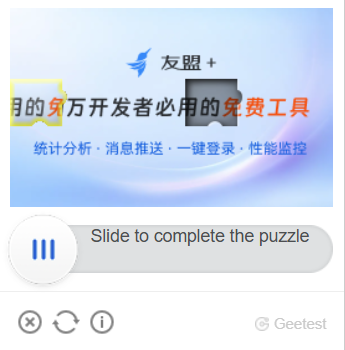
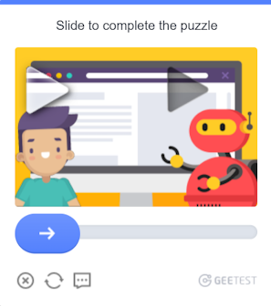
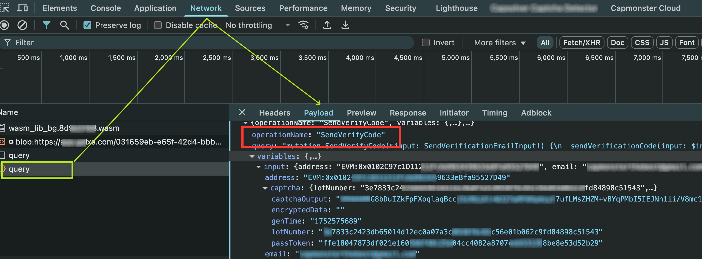

---
sidebar_position: 5
sidebar_label: GeeTest
title: "Распознавание и решение GeeTest — GeeTest Task | API"
description: "Смотрите в документации Capmonster Cloud Docs, как настроить автоматическое распознавание и решить (обойти) капчи GeeTest через API с помощью типа задач GeeTest Task с использованием ваших прокси."
---

import Tabs from '@theme/Tabs';
import TabItem from '@theme/TabItem';
import ParamItem from '@theme/ParamItem';
import MethodItem from '@theme/MethodItem';
import MethodDescription from '@theme/MethodDescription'
import PriceBlock from '../../src/theme/PriceBlock';
import PriceBlockWrap from '@theme/PriceBlockWrap';
import { ArticleHead } from '../../src/theme/ArticleHead';

<ArticleHead slug="captchas/geetest-task" />

# GeeTest

<PriceBlockWrap>
  <PriceBlock title="GeeTestTask" captchaId="geetest"/>
</PriceBlockWrap>

 

:::warning **Внимание!**
CapMonster Cloud по умолчанию работает через встроенные прокси — они уже включены в стоимость. Указывать собственные прокси требуется только в тех случаях, когда сайт не принимает токен или доступ к встроенным сервисам ограничен.

Прокси с авторизацией по IP пока не поддерживаются.
:::

Ваше приложение должно прислать адрес сайта, публичный ключ домена (`gt`) и ключ (`challenge`).

Результатом решения задачи является три или пять токенов для сабмита формы.

:::info
- Параметры `gt`, `challenge` и `geetestApiServerSubdomain` чаще всего находятся внутри JavaScript функции `initGeetest`.
- Также, эти параметры можно получить из HTML кода страницы. Их можно найти в блоке `<sсript>`, который появляется после полной загрузки страницы в браузере.
  
V3


V4 (captcha_id = gt)


:::

<br />

## <span style={{fontSize: '2.25rem'}}>GeeTest V3</span>

### <span style={{fontSize: '1.5rem'}}>Примеры заданий</span>

<Tabs className="full-width-tabs">
  <TabItem value="intelligent" label="Intelligent mode" default className="bordered-panel">
    
  </TabItem>
  <TabItem value="slide" label="Slide CAPTCHA" className="bordered-panel">
    
  </TabItem>
  <TabItem value="icon" label="Icon CAPTCHA" className="bordered-panel">
    
  </TabItem>
  <TabItem value="space" label="Space CAPTCHA" className="bordered-panel">
    
  </TabItem>
</Tabs>

### <span style={{fontSize: '1.5rem'}}>Параметры запроса</span>

  <TabItem value="proxy" label="GeeTestTask (при использовании прокси)" className="bordered-panel">
    <ParamItem title="type" required type="string" />
    **GeeTestTask**

    ---

    <ParamItem title="websiteURL" required type="string" />
    Адрес страницы, на которой решается капча. Правильный Url всегда передается в Referer на запросе https://api-na.geetest.com/gettype.php?. Например: Мы находимся на https://example.com#login, но видим что фактически капча инициализируется не там, а на https://example.com.

    ---

    <ParamItem title="gt" required type="string" />
    Ключ-идентификатор GeeTest `gt` для домена. Статическое значение, редко обновляется.

    ---

    <ParamItem title="challenge" required="required only for V3" type="string" />
    <p>Меняющийся ключ.<br />При каждом обращении к нашему API нужно получать новое значение ключа. Если капча загружена на странице, то значение `challenge` уже недействительно и вы получите в ответ [error](../api/api-errors.mdx) `ERROR_TOKEN_EXPIRED`. <br />За задачи с ошибкой `ERROR_TOKEN_EXPIRED` плата взимается как за успешно решённые задачи.<br />Нужно изучить запросы и найти тот, в котором возвращается это значение и перед каждым созданием задачи на распознавания выполнять этот запрос и парсить `challenge` из него.</p>

    ---

    <ParamItem title="version" type="integer" required="required only for V4"/>
    3

    ---

    <ParamItem title="geetestApiServerSubdomain" type="string" />
    Поддомен сервера Geetest API (должен отличаться от api.geetest.com). 
	<br />Необязательный параметр. Может потребоваться для некоторых сайтов.

    ---

    <ParamItem title="geetestGetLib" type="string" />
    Путь к скрипту капчи для ее отображения на странице. 
	<br />Необязательный параметр. Может потребоваться для некоторых сайтов. 
	<br />Отправляйте JSON в виде строки.

    ---

    <ParamItem title="proxyType" type="string" />
    **http** - обычный http/https прокси;<br />
	**https** - попробуйте эту опцию только если "http" не работает (требуется для некоторых кастомных прокси);<br />
	**socks4** - socks4 прокси;<br />
	**socks5** - socks5 прокси.

    ---

    <ParamItem title="proxyAddress" type="string" />
    <p>
      IP адрес прокси IPv4/IPv6. Не допускается:
		- использование прозрачных прокси (там где можно видеть IP клиента);
		- использование прокси на локальных машинах.
    </p>

    ---

    <ParamItem title="proxyPort" type="integer" />
    Порт прокси.

    ---

    <ParamItem title="proxyLogin" type="string" />
    Логин прокси-сервера.

    ---

    <ParamItem title="proxyPassword" type="string" />
    Пароль прокси-сервера.

    ---

    <ParamItem title="userAgent" type="string" />
    User-Agent браузера. <br />
  **Передавайте только актуальный UA от ОС Windows. Сейчас таковым является**: `userAgentPlaceholder`
  </TabItem>
  


### <span style={{fontSize: '1.5rem'}}>Метод создания задачи</span>

<Tabs className="full-width-tabs filled-tabs request-tabs" groupId="captcha-type">
	<TabItem value="proxyless" label="GeeTestTask (без прокси)" default className="method-panel">
		<MethodItem>
			```http
			https://api.capmonster.cloud/createTask
			```
		</MethodItem>
		<MethodDescription>
			**Запрос**
			```json
			{
				"clientKey":"YOUR_CAPMONSTER_CLOUD_API_KEY",
				"task":
				{
					"type":"GeeTestTask",
					"websiteURL":"https://www.geetest.com/en/demo",
					"gt":"022397c99c9f646f6477822485f30404",
					"challenge":"7f044f48bc951ecfbfc03842b5e1fe59",
					"geetestApiServerSubdomain":"api-na.geetest.com"

				}
			}
			```
			**Ответ**
			```json
			{
			  "errorId":0,
			  "taskId":407533072
			}
			```
		</MethodDescription>
	</TabItem>
	
	<TabItem value="proxy" label="GeeTestTask (при использовании прокси)" className="method-panel">
		<MethodItem>
			```http
			https://api.capmonster.cloud/createTask
			```
		</MethodItem>
		<MethodDescription>
			**Запрос**
			```json 
			  {
				"clientKey":"YOUR_CAPMONSTER_CLOUD_API_KEY",
				"task": {
				  "type":"GeeTestTask",
				  "websiteURL":"https://www.geetest.com/en/demo",
				  "gt":"022397c99c9f646f6477822485f30404",
				  "challenge":"7f044f48bc951ecfbfc03842b5e1fe59",
				  "geetestApiServerSubdomain":"api-na.geetest.com",
				  "proxyType":"http",
				  "proxyAddress":"8.8.8.8",
				  "proxyPort":8080,
				  "proxyLogin":"proxyLoginHere",
				  "proxyPassword":"proxyPasswordHere",
				  "userAgent":"userAgentPlaceholder"
				}
			  }
			```
			**Ответ**
			```json
			{
			  "errorId":0,
			  "taskId":407533072
			}
			```
		</MethodDescription>
	</TabItem>  
</Tabs>

Используйте метод [getTaskResult](../api/methods/get-task-result.mdx), чтобы получить решение GeeTest. В зависимости от загрузки системы вы получите ответ через время в диапазоне от 10 с до 30 с.

### <span style={{fontSize: '1.5rem'}}>Метод получения результата задачи</span>

<TabItem value="proxyless" label="GeeTestTask (без прокси)" default className="method-panel-full">
	<MethodItem>
		```http
		https://api.capmonster.cloud/getTaskResult
		```
	</MethodItem>
	<MethodDescription>
		**Запрос**
		```json
		{
		  "clientKey":"API_KEY",
		  "taskId": 407533072
		}
		```
		**Ответ**
		```json
		{
		  "errorId":0,
		  "status":"ready",
		  "solution": {
			"challenge":"0f759dd1ea6c4wc76cedc2991039ca4f23",
			"validate":"6275e26419211d1f526e674d97110e15",
			"seccode":"510cd9735583edcb158601067195a5eb|jordan"
		  }
		}
		```
	</MethodDescription>
</TabItem>

<br />

<table><tr>
<th><b>Свойство</b></th><th><b>Тип</b></th><th><b>Описание</b></th>
</tr>
<tr><td>challenge</td><td>String</td><td rowspan="3">Все три параметра необходимы при отправке формы на целевом сайте.</td></tr>
<tr><td>validate</td><td>String</td></tr>
<tr><td>seccode</td><td>String</td></tr>
</table>

### Как найти все нужные параметры для создания задачи на решение

#### Вручную

1. Откройте ваш сайт, где отображается капча, в браузере.
2. Правой кнопкой кликните по элементу капчи и выберите **Inspect**.

Все параметры можно найти в *init-params* среди запросов:


#### Автоматически

Для автоматизации поиска параметров их можно извлекать через **браузер** (обычный или headless, например, с **Playwright**) или напрямую из **HTTP-запросов**. Поскольку значения динамических параметров действуют недолго, их рекомендуется использовать сразу после получения.

:::warning **Важно!**
Приведённые фрагменты кода являются базовыми примерами для ознакомления в извлечении необходимых параметров. Точная реализация будет зависеть от вашего сайта с капчей, его структуры и используемых HTML-элементов и селекторов.
:::

<Tabs className="full-width-tabs filled-tabs request-tabs">
  <TabItem value="js" label="JavaScript" default className="method-panel">
    <details>
      <summary>Показать код (в браузере)</summary>

      ```js
      (function detectGeeTestV3Browser() {
        const t = Date.now();
        const url = `https://example.com/api/v1/captcha/gee-test/init-params?t=${t}`;

        fetch(url)
          .then(res => res.json())
          .then(data => {
            const { gt, challenge } = data;
            if (gt && challenge) {
              console.log("GeeTest v3 detected:");
              console.log({ gt, challenge });
            } else {
              console.log("Не удалось найти параметры gt/challenge");
            }
          })
          .catch(err => console.error("Ошибка запроса:", err));
      })();
      ```
    </details>

    <details>
      <summary>Показать код (Node.js)</summary>

      ```js
      async function detectGeeTestV3() {
        const result = {
          version: null,
          data: {},
        };

        const t = Date.now(); // Получаем текущую метку времени
        try {
          const response = await fetch(
            `https://example.com/api/v1/captcha/gee-test/init-params?t=${t}`
          );

          if (response.ok) {
            const data = await response.json();
            const challenge = data.challenge;
            const gt = data.gt;

            if (gt && challenge) {
              result.version = "v3";
              result.data = { gt, challenge };
              console.log(result.data);
            } else {
              console.log("Error: Missing gt or challenge");
            }
          } else {
            console.log("Error: Invalid response status", response.status);
          }
        } catch (error) {
          console.error("Request failed", error);
        }

        return result;
      }

      detectGeeTestV3();
      ```
    </details>
  </TabItem>

  <TabItem value="python" label="Python" className="method-panel">
    <details>
      <summary>Показать код</summary>

      ```python
      import requests
      import asyncio
      import time

      async def detect_gee_test_v3():
        result = {
            'version': None,
            'data': {},
        }

        t = int(time.time() * 1000)
        response = requests.get(f'https://example.com/api/v1/captcha/gee-test/init-params?t={t}')
        
        if response.status_code == 200:
            data = response.json()
            challenge = data.get('challenge')
            gt = data.get('gt')

            if gt and challenge:
                result['version'] = 'v3'
                result['data'] = {'gt': gt, 'challenge': challenge}
                print(result['data'])
            else:
                print('error')

        return result

      asyncio.run(detect_gee_test_v3())
      ```
    </details>
  </TabItem>

  <TabItem value="csharp" label="C#" className="method-panel">
    <details>
      <summary>Показать код</summary>

      ```csharp
      using System;
      using System.Net.Http;
      using System.Threading.Tasks;
      using Newtonsoft.Json.Linq;

      class Program
      {
          static async Task DetectGeeTestV3()
          {
              var result = new
              {
                  version = (string)null,
                  data = new { gt = (string)null, challenge = (string)null },
              };

              using (var client = new HttpClient())
              {
                  long t = DateTimeOffset.Now.ToUnixTimeMilliseconds();
                  var url = $"https://example.com/api/v1/captcha/gee-test/init-params?t={t}";

                  var response = await client.GetAsync(url);

                  if (response.IsSuccessStatusCode)
                  {
                      var responseContent = await response.Content.ReadAsStringAsync();
                      var data = JObject.Parse(responseContent);
                      var challenge = data["challenge"]?.ToString();
                      var gt = data["gt"]?.ToString();

                      if (!string.IsNullOrEmpty(gt) && !string.IsNullOrEmpty(challenge))
                      {
                          result = new
                          {
                              version = "v3",
                              data = new { gt = gt, challenge = challenge }
                          };
                          Console.WriteLine($"GT: {gt}, Challenge: {challenge}");
                      }
                      else
                      {
                          Console.WriteLine("Error: Missing required parameters.");
                      }
                  }
                  else
                  {
                      Console.WriteLine("Error: Failed to get response.");
                  }
              }
          }

          static async Task Main(string[] args)
          {
              await DetectGeeTestV3();
          }
      }
      ```
    </details>
  </TabItem>
</Tabs>

## <span style={{fontSize: '1.5rem'}}>Используйте библиотеку SDK</span>

<Tabs className="full-width-tabs filled-tabs request-tabs" groupId="captcha-type">
  <TabItem value="js" label="JavaScript" default className="method-panel">
  <details>
      <summary>Показать код (для браузера)</summary>
    ```js
    // https://github.com/ZennoLab/capmonstercloud-client-js

    import { 
        CapMonsterCloudClientFactory, 
        ClientOptions, 
        GeeTestRequest 
    } from '@zennolab_com/capmonstercloud-client';

    const API_KEY = "YOUR_API_KEY"; // Укажите ваш API-ключ CapMonster Cloud

    document.addEventListener('DOMContentLoaded', async () => {
        const client = CapMonsterCloudClientFactory.Create(
            new ClientOptions({ clientKey: API_KEY })
        );

        // При необходимости можно проверить баланс 
        const balance = await client.getBalance();
        console.log("Balance:", balance);

        // Базовый пример без прокси
        // CapMonster Cloud автоматически использует свои прокси
        let geetestRequest = new GeeTestRequest({
            websiteURL: "https://example.com/geetest.php", // URL страницы с капчей
            gt: "81dc9bdb52d04dc20036dbd8313ed055",        // Замените на корректное значение
            challenge: "d93591bdf7860e1e4ee2fca799911215"  // Замените на корректное значение
        });

        // Пример использования вашего собственного прокси
        // Раскомментируйте данный блок, если вы хотите использовать собственный прокси

        /*
        const proxy = {
            proxyType: "https",
            proxyAddress: "123.45.67.89",
            proxyPort: 8080,
            proxyLogin: "username",
            proxyPassword: "password"
        };

        geetestRequest = new GeeTestRequest({
            websiteURL: "https://example.com/geetest.php",
            gt: "81dc9bdb52d04dc20036dbd8313ed055",
            challenge: "d93591bdf7860e1e4ee2fca799911215",
            proxy,
            userAgent: "userAgentPlaceholder"
        });
        */

        const result = await client.Solve(geetestRequest);
        console.log("Solution:", result);
    });
    ```
</details>

<details>
      <summary>Показать код (Node.js)</summary>
      ```javascript
      // https://github.com/ZennoLab/capmonstercloud-client-js

      import { CapMonsterCloudClientFactory, ClientOptions, GeeTestRequest } from '@zennolab_com/capmonstercloud-client';

      const API_KEY = "YOUR_API_KEY"; // Укажите ваш API-ключ CapMonster Cloud

      async function solveGeeTest() {
          const client = CapMonsterCloudClientFactory.Create(
              new ClientOptions({ clientKey: API_KEY })
          );

          // При необходимости можно проверить баланс 
          const balance = await client.getBalance();
          console.log("Balance:", balance);

          // Базовый пример без прокси
          // CapMonster Cloud автоматически использует свои прокси
          let geetestRequest = new GeeTestRequest({
              websiteURL: "https://example.com/geetest.php", // URL страницы с капчей
              gt: "81dc9bdb52d04dc20036dbd8313ed055",       // Замените на корректное значение
              challenge: "d93591bdf7860e1e4ee2fca799911215" // Замените на корректное значение
          });

          // Пример использования вашего собственного прокси
          // Раскомментируйте данный блок, если вы хотите использовать собственный прокси

          /*
          const proxy = {
              proxyType: "https",
              proxyAddress: "123.45.67.89",
              proxyPort: 8080,
              proxyLogin: "username",
              proxyPassword: "password"
          };

          geetestRequest = new GeeTestRequest({
              websiteURL: "https://example.com/geetest.php",
              gt: "81dc9bdb52d04dc20036dbd8313ed055",
              challenge: "d93591bdf7860e1e4ee2fca799911215",
              proxy,
              userAgent: "userAgentPlaceholder"
          });
          */

          const result = await client.Solve(geetestRequest);
          console.log("Solution:", result);
      }

      solveGeeTest().catch(console.error);
```
</details>
  </TabItem>

  <TabItem value="python" label="Python" className="method-panel">
  <details>
      <summary>Показать код</summary>
    ```python
    # https://github.com/ZennoLab/capmonstercloud-client-python

    import asyncio
    from capmonstercloudclient import CapMonsterClient, ClientOptions
    from capmonstercloudclient.requests import GeetestRequest
    # from capmonstercloudclient.requests.baseRequestWithProxy import ProxyInfo   # Раскомментируйте, если планируете использовать прокси

    API_KEY = "YOUR_API_KEY"  # Укажите ваш API-ключ CapMonster Cloud

    async def solve_geetest():
        client_options = ClientOptions(api_key=API_KEY)
        cap_monster_client = CapMonsterClient(options=client_options)

        # Базовый пример без прокси
        # CapMonster Cloud автоматически использует свои прокси
        geetest_request = GeetestRequest(
            websiteUrl="https://example.com",
            gt="81dc9bdb52d04dc20036dbd8313ed055",
            challenge="d93591bdf7860e1e4ee2fca799911215"
        )

        # Пример использования вашего собственного прокси
        # Раскомментируйте данный блок, если вы хотите использовать собственный прокси

        # proxy = ProxyInfo(
        #     proxyType="http",
        #     proxyAddress="123.45.67.89",
        #     proxyPort=8080,
        #     proxyLogin="username",
        #     proxyPassword="password"
        # )

        # geetest_request = GeetestRequest(
        #     websiteUrl="https://example.com",
        #     gt="81dc9bdb52d04dc20036dbd8313ed055",
        #     challenge="d93591bdf7860e1e4ee2fca799911215",
        #     proxy=proxy,
        #     userAgent="userAgentPlaceholder"
        # )

        # При необходимости можно проверить баланс 
        balance = await cap_monster_client.get_balance()
        print("Balance:", balance)

        result = await cap_monster_client.solve_captcha(geetest_request)
        print("Solution:", result)

    asyncio.run(solve_geetest())
    ```
    </details>
  </TabItem>

  <TabItem value="csharp" label="C#" className="method-panel">
  <details>
      <summary>Показать код</summary>
    ```csharp
    // https://github.com/ZennoLab/capmonstercloud-client-dotnet

    using System;
    using System.Threading.Tasks;
    using Zennolab.CapMonsterCloud;
    using Zennolab.CapMonsterCloud.Requests;

    class Program
    {
        static async Task Main(string[] args)
        {
            // Ваш API-ключ CapMonster Cloud
            var clientOptions = new ClientOptions
            {
                ClientKey = "YOUR_API_KEY"
            };

            var cmCloudClient = CapMonsterCloudClientFactory.Create(clientOptions);

            // При необходимости можно проверить баланс 
            var balance = await cmCloudClient.GetBalanceAsync();
            Console.WriteLine("Balance: " + balance);

            // Базовый пример без прокси
            // CapMonster Cloud автоматически использует свои прокси
            var geetestRequest = new GeeTestRequest
            {
                WebsiteUrl = "https://example.com/demo/geetest", // URL страницы с капчей
                Gt = "your_gt_value",                             // Замените на корректное значение
                Challenge = "your_challenge_value"               // Замените на корректное значение
            };

            // Пример использования вашего собственного прокси
            // Раскомментируйте данный блок, если вы хотите использовать собственный прокси
            /*
            var geetestRequest = new GeeTestRequest
            {
                WebsiteUrl = "https://example.com/demo/geetest", // URL страницы с капчей
                Gt = "your_gt_value",  
                Challenge = "your_challenge_value",

                Proxy = new ProxyContainer(
                    "123.45.67.89", 
                    8080,           
                    ProxyType.Http,    
                    "username",  
                    "password"
                )
            };
            */

            var geetestResult = await cmCloudClient.SolveAsync(geetestRequest);

            Console.WriteLine("Solution:");
            Console.WriteLine($"Challenge: {geetestResult.Solution.Challenge}");
            Console.WriteLine($"Validate:  {geetestResult.Solution.Validate}");
            Console.WriteLine($"SecCode:   {geetestResult.Solution.SecCode}");
        }
    }
    ```
    </details>
  </TabItem>  
</Tabs>

<br />

## <span style={{fontSize: '2.25rem'}}>GeeTest V4</span>

### <span style={{fontSize: '1.5rem'}}>Пример задания</span>


### <span style={{fontSize: '1.5rem'}}>Параметры запроса</span>

  <TabItem value="proxy" label="GeeTestTask (при использовании прокси)" className="bordered-panel">
    <ParamItem title="type" required type="string" />
    **GeeTestTask**

    ---

    <ParamItem title="websiteURL" required type="string" />
    Адрес страницы, на которой решается капча.

    ---

    <ParamItem title="gt" required type="string" />
    Ключ-идентификатор GeeTest для домена - параметр `captcha_id`.

    ---

    <ParamItem title="version" type="integer" required="required only for V4"/>
    4

    ---

    <ParamItem title="geetestApiServerSubdomain" type="string" />
    Поддомен сервера Geetest API (должен отличаться от api.geetest.com). <br />
	Необязательный параметр. Может потребоваться для некоторых сайтов.

    ---

    <ParamItem title="geetestGetLib" type="string" />
    Путь к скрипту капчи для ее отображения на странице. <br /> 
	Необязательный параметр. Может потребоваться для некоторых сайтов.	<br />
	Отправляйте JSON в виде строки.
	
    ---

    <ParamItem title="initParameters" type="object" />
    Дополнительные параметры для 4 версии, используются вместе с “riskType” (тип капчи/характеристики ее проверки).

    ---

    <ParamItem title="proxyType" type="string" />
    **http** - обычный http/https прокси; <br />
	**https** - попробуйте эту опцию только если "http" не работает (требуется для некоторых кастомных прокси); <br />
	**socks4** - socks4 прокси; <br />
	**socks5** - socks5 прокси.

    ---

    <ParamItem title="proxyAddress" type="string" />
    <p>
      IP адрес прокси IPv4/IPv6. Не допускается:
		- использование прозрачных прокси (там, где можно видеть IP клиента);
		- использование прокси на локальных машинах.
    </p>

    ---

    <ParamItem title="proxyPort" type="integer" />
    Порт прокси.

    ---

    <ParamItem title="proxyLogin" type="string" />
    Логин прокси-сервера.

    ---

    <ParamItem title="proxyPassword" type="string" />
    Пароль прокси-сервера.

    ---

    <ParamItem title="userAgent" type="string" />
    User-Agent браузера, используемый для решения капчи.
  </TabItem>


### <span style={{fontSize: '1.5rem'}}>Метод создания задачи</span>


<Tabs className="full-width-tabs filled-tabs request-tabs" groupId="captcha-type">
	<TabItem value="proxyless" label="GeeTestTask (без прокси)" default className="method-panel">
		<MethodItem>
			```http
			https://api.capmonster.cloud/createTask
			```
		</MethodItem>
		<MethodDescription>
			**Запрос**
			```json
			{
				"clientKey":"YOUR_CAPMONSTER_CLOUD_API_KEY",
				"task":
				{
					"type":"GeeTestTask",
					"websiteURL":"https://gt4.geetest.com/",
					"gt":"54088bb07d2df3c46b79f80300b0abbe",
					"version": 4,
					"initParameters": {
					  "riskType": "slide"

					}
				}
			}
			```
			**Ответ**
			```json
			{
			  "errorId":0,
			  "taskId":407533072
			}
			```
		</MethodDescription>
	</TabItem>
  
	<TabItem value="proxy" label="GeeTestTask (при использовании прокси)" className="method-panel">
		<MethodItem>
			```http
			https://api.capmonster.cloud/createTask
			```
		</MethodItem>
		<MethodDescription>
			**Запрос**
			```json
			{
			  "clientKey":"YOUR_CAPMONSTER_CLOUD_API_KEY",
			  "task": {
				"type":"GeeTestTask",
				"websiteURL":"https://gt4.geetest.com/",
				"gt":"54088bb07d2df3c46b79f80300b0abbe",
				"version": 4,
				"initParameters": {
				  "riskType": "slide"
				},
				"proxyType":"http",
				"proxyAddress":"8.8.8.8",
				"proxyPort":8080,
				"proxyLogin":"proxyLoginHere",
				"proxyPassword":"proxyPasswordHere",
				"userAgent":"userAgentPlaceholder"
			  }
			}
			```
			**Ответ**
			```json
			{
			  "errorId":0,
			  "taskId":407533072
			}
			```
		</MethodDescription>
	</TabItem>  
</Tabs>

Используйте метод [getTaskResult](../api/methods/get-task-result.mdx), чтобы получить решение GeeTest. В зависимости от загрузки системы вы получите ответ через время в диапазоне от 10 с до 30 с.

### <span style={{fontSize: '1.5rem'}}>Метод получения результата задачи</span>

<TabItem value="proxyless" label="GeeTestTask (без прокси)" default className="method-panel-full">
	<MethodItem>
		```http
		https://api.capmonster.cloud/getTaskResult
		```
	</MethodItem>
	<MethodDescription>
		**Запрос**
		```json
		{
		  "clientKey":"API_KEY",
		  "taskId": 407533072
		}
		```
		**Ответ**
		```json
		{
		  "errorId":0,
		  "status":"ready",
		  "solution": {
			"captcha_id":"f5c2ad5a8a3cf37192d8b9c039950f79",
			"lot_number":"bcb2c6ce2f8e4e9da74f2c1fa63bd713",
			"pass_token":"edc7a17716535a5ae624ef4707cb6e7e478dc557608b068d202682c8297695cf",
			"gen_time":"1683794919",
			"captcha_output":"XwmTZEJCJEnRIJBlvtEAZ662T...[cut]...SQ3fX-MyoYOVDMDXWSRQig56"
		  }
		}
		```
	</MethodDescription>
</TabItem>

<br />

<table>
<tr>
<th><b>Свойство</b></th><th><b>Тип</b></th><th><b>Описание</b></th>
</tr>
<tr>
<td>captcha_id</td><td>String</td><td rowspan="5">Все пять параметров необходимы при отправке формы на целевом сайте.<br />
input[name=captcha_id]<br />
input[name=lot_number]<br />
input[name=pass_token]<br />
input[name=gen_time]<br />
input[name=captcha_output]</td>
</tr>
<tr><td>lot_number</td><td>String</td></tr>
<tr><td>pass_token</td><td>String</td></tr>
<tr><td>gen_time</td><td>String</td></tr>
<tr><td>captcha_output</td><td>String</td></tr>
</table>

### Как найти все нужные параметры для создания задачи на решение

#### Вручную

1. Откройте ваш сайт, где отображается капча, в браузере.
2. Правой кнопкой кликните по элементу капчи и выберите **Inspect**.

Параметры могут загружаться в *load?callback*:


#### Автоматически

Удобный способ автоматизировать поиск всех необходимых параметров.
Некоторые параметры генерируются заново при каждой загрузке страницы, поэтому для их извлечения потребуется работать через браузер – обычный или в режиме headless (например, с помощью **Playwright**).
Так как значения динамических параметров хранятся недолго, капчу нужно решать сразу после их получения.

:::warning **Важно!**
Приведённые фрагменты кода являются базовыми примерами для ознакомления в извлечении необходимых параметров. Точная реализация будет зависеть от вашего сайта с капчей, его структуры и используемых HTML-элементов и селекторов.
:::

<Tabs className="full-width-tabs filled-tabs request-tabs">
  <TabItem value="js" label="JavaScript" default className="method-panel">
    <details>
      <summary>Показать код (в браузере)</summary>

      ```js
      (function() {
        function getQueryParams(url) {
          const params = new URLSearchParams(new URL(url).search);
          const captchaId = params.get('captcha_id');
          const challenge = params.get('challenge');
          const riskType = params.get('risk_type');
          return { captchaId, challenge, riskType };
        }

        const observer = new PerformanceObserver((list) => {
          const entries = list.getEntriesByType('resource');
          entries.forEach((entry) => {
            if (entry.name.includes('https://gcaptcha4.geetest.com/load?')) {
              const { captchaId, challenge, riskType } = getQueryParams(entry.name);
              if (captchaId && challenge) {
                console.log('GeeTest v4 detected (via PerformanceObserver):');
                console.log({ captchaId, challenge, riskType });
              }
            }
          });
        });

        observer.observe({ type: 'resource', buffered: true });
      })();
      ```
    </details>

    <details>
      <summary>Показать код (Node.js)</summary>

      ```js
      import { chromium } from "playwright";

      async function detectGeeTestV4(pageUrl) {
        const result = { version: null, data: {} };

        const browser = await chromium.launch({ headless: false });
        const context = await browser.newContext();
        const page = await context.newPage();

        page.on("response", async (response) => {
          const url = response.url();
          if (url.includes("https://gcaptcha4.geetest.com/load?")) {
            const urlParams = new URLSearchParams(url.split("?")[1]);
            const captchaId = urlParams.get("captcha_id");
            const challenge = urlParams.get("challenge");
            const riskType = urlParams.get("risk_type");

            if (captchaId && challenge && !result.version) {
              result.version = "v4";
              result.data = {
                captchaId: captchaId,
                challenge: challenge,
                riskType: riskType,
              };
              console.log("GeeTest v4 detected:");
              console.log(result.data);
            }
          }
        });

        await page.goto(pageUrl, { waitUntil: "networkidle" });
        await page.waitForTimeout(20000);

        if (!result.version) {
          console.log("error");
        }

        await browser.close();
        return result;
      }

      detectGeeTestV4("https://example.com").then((result) => {
        console.log(result);
      });
      ```
    </details>
  </TabItem>

  <TabItem value="python" label="Python" className="method-panel">
    <details>
      <summary>Показать код</summary>

      ```python
      import asyncio
      from playwright.async_api import async_playwright
      from urllib.parse import urlparse, parse_qs

      async def detect_geetest_v4(page_url):
          result = {"version": None, "data": {}}

          async with async_playwright() as p:
              browser = await p.chromium.launch(headless=False)
              context = await browser.new_context()
              page = await context.new_page()

              async def on_request(request):
                  url = request.url
                  if "https://gcaptcha4.geetest.com/load?" in url:
                      query = parse_qs(urlparse(url).query)
                      captcha_id = query.get("captcha_id", [None])[0]
                      challenge = query.get("challenge", [None])[0]
                      risk_type = query.get("risk_type", [None])[0]

                      if captcha_id and challenge and not result["version"]:
                          result["version"] = "v4"
                          result["data"] = {
                              "captchaId": captcha_id,
                              "challenge": challenge,
                              "riskType": risk_type
                          }
                          print("GeeTest v4 detected:")
                          print(result["data"])

              context.on("request", on_request)

              await page.goto(page_url, wait_until="networkidle")
              await asyncio.sleep(10)

              if not result["version"]:
                  print("error")

              await browser.close()
              return result

      asyncio.run(detect_geetest_v4("https://www.example.com"))
      ```
    </details>
  </TabItem>

  <TabItem value="csharp" label="C#" className="method-panel">
    <details>
      <summary>Показать код</summary>

      ```csharp
      using System;
      using System.Threading.Tasks;
      using Microsoft.Playwright;
      using System.Web;

      class Program
      {
          public static async Task Main(string[] args)
          {
              var result = new
              {
                  Version = (string)null,
                  Data = new
                  {
                      CaptchaId = (string)null,
                      Challenge = (string)null,
                      RiskType = (string)null
                  }
              };

              using var playwright = await Playwright.CreateAsync();
              var browser = await playwright.Chromium.LaunchAsync(new BrowserTypeLaunchOptions
              {
                  Headless = false
              });

              var context = await browser.NewContextAsync();
              var page = await context.NewPageAsync();

              page.Request += (_, request) =>
              {
                  var url = request.Url;

                  if (url.Contains("https://gcaptcha4.geetest.com/load?"))
                  {
                      var uri = new Uri(url);
                      var queryParams = HttpUtility.ParseQueryString(uri.Query);
                      var captchaId = queryParams.Get("captcha_id");
                      var challenge = queryParams.Get("challenge");
                      var riskType = queryParams.Get("risk_type");

                      if (!string.IsNullOrEmpty(captchaId) && !string.IsNullOrEmpty(challenge))
                      {
                          Console.WriteLine("GeeTest v4 detected:");
                          Console.WriteLine($"CaptchaId: {captchaId}");
                          Console.WriteLine($"Challenge: {challenge}");
                          Console.WriteLine($"RiskType: {riskType}");
                      }
                  }
              };

              await page.GotoAsync("https://www.example.com/", new PageGotoOptions
              {
                  WaitUntil = WaitUntilState.NetworkIdle
              });

              await Task.Delay(10000);

              await browser.CloseAsync();
          }
      }
      ```
    </details>
  </TabItem>
</Tabs>

## <span style={{fontSize: '1.5rem'}}>Используйте библиотеку SDK</span>

<Tabs className="full-width-tabs filled-tabs request-tabs" groupId="captcha-type">
  <TabItem value="js" label="JavaScript" default className="method-panel">
  <details>
      <summary>Показать код (для браузера)</summary>
    ```js
    // https://github.com/ZennoLab/capmonstercloud-client-js

    import { 
        CapMonsterCloudClientFactory, 
        ClientOptions, 
        GeeTestRequest 
    } from '@zennolab_com/capmonstercloud-client';

    const API_KEY = "YOUR_API_KEY"; // Укажите ваш API-ключ CapMonster Cloud

    document.addEventListener('DOMContentLoaded', async () => {
        const client = CapMonsterCloudClientFactory.Create(
            new ClientOptions({ clientKey: API_KEY })
        );

        // При необходимости можно проверить баланс
        const balance = await client.getBalance();
        console.log("Balance:", balance);

        // Базовый пример без прокси
        // CapMonster Cloud автоматически использует свои прокси
        let geetestRequest = new GeeTestRequest({
            websiteURL: "https://example.com/geetest.php", // URL страницы с капчей
            gt: "81dc9bdb52d04dc20036dbd8313ed055",
            challenge: "d93591bdf7860e1e4ee2fca799911215",
            version: "4",
            initParameters: { riskType: "slide" }
        });

        // Пример использования вашего собственного прокси
        // Раскомментируйте данный блок, если вы хотите использовать собственный прокси

        /*
        const proxy = {
            proxyType: "https",
            proxyAddress: "123.45.67.89",
            proxyPort: 8080,
            proxyLogin: "username",
            proxyPassword: "password"
        };

        geetestRequest = new GeeTestRequest({
            websiteURL: "https://example.com/geetest.php",
            gt: "81dc9bdb52d04dc20036dbd8313ed055",
            challenge: "d93591bdf7860e1e4ee2fca799911215",
            version: "4",
            initParameters: { riskType: "slide" },
            proxy,
            userAgent: "userAgentPlaceholder"
        });
        */

        const result = await client.Solve(geetestRequest);
        console.log("Solution:", result);
    });
    ```
    </details>

    <details>
      <summary>Показать код (Node.js)</summary>
      ```javascript
      // https://github.com/ZennoLab/capmonstercloud-client-js

      import { CapMonsterCloudClientFactory, ClientOptions, GeeTestRequest } from '@zennolab_com/capmonstercloud-client';

      const API_KEY = "YOUR_API_KEY"; // Укажите ваш API-ключ CapMonster Cloud

      async function solveGeeTest() {
          const client = CapMonsterCloudClientFactory.Create(
              new ClientOptions({ clientKey: API_KEY })
          );

          // При необходимости можно проверить баланс
          const balance = await client.getBalance();
          console.log("Balance:", balance);

          // Базовый пример без прокси
          // CapMonster Cloud автоматически использует свои прокси
          let geetestRequest = new GeeTestRequest({
              websiteURL: "https://example.com/geetest.php", // URL страницы с капчей
              gt: "81dc9bdb52d04dc20036dbd8313ed055",
              challenge: "d93591bdf7860e1e4ee2fca799911215",
              version: "4",                                 
              initParameters: { riskType: "slide" }
          });

          // Пример использования вашего собственного прокси
          // Раскомментируйте данный блок, если вы хотите использовать собственный прокси

          /*
          const proxy = {
              proxyType: "https",
              proxyAddress: "123.45.67.89",
              proxyPort: 8080,
              proxyLogin: "username",
              proxyPassword: "password"
          };

          geetestRequest = new GeeTestRequest({
              websiteURL: "https://example.com/geetest.php",
              gt: "81dc9bdb52d04dc20036dbd8313ed055",
              challenge: "d93591bdf7860e1e4ee2fca799911215",
              version: "4",
              initParameters: { riskType: "slide" },
              proxy,
              userAgent: "userAgentPlaceholder"
          });
          */

          const result = await client.Solve(geetestRequest);
          console.log("Solution:", result);
      }

      solveGeeTest().catch(console.error);
```
</details>

  </TabItem>
  
  <TabItem value="python" label="Python" className="method-panel">
  <details>
      <summary>Показать код</summary>

    ```python
    # https://github.com/ZennoLab/capmonstercloud-client-python

    import asyncio
    from capmonstercloudclient import CapMonsterClient, ClientOptions
    from capmonstercloudclient.requests import GeetestRequest
    # from capmonstercloudclient.requests.baseRequestWithProxy import ProxyInfo  # Раскомментируйте, если планируете использовать собственные прокси

    API_KEY = "YOUR_API_KEY"  # Укажите ваш API-ключ CapMonster Cloud

    async def solve_geetest_v4():
        client_options = ClientOptions(api_key=API_KEY)
        cap_monster_client = CapMonsterClient(options=client_options)

        # Базовый пример без прокси
        # CapMonster Cloud автоматически использует свои прокси
        geetest_request = GeetestRequest(
            websiteUrl="https://example.com/",
            gt="54088bb07d2df3c46b79f80300b0abbe",
            version=4,
            initParameters={
                "riskType": "slide"
            }
        )

        # Пример использования вашего собственного прокси
        # Раскомментируйте данный блок, если вы хотите использовать собственный прокси

        # proxy = ProxyInfo(
        #     proxyType="http",
        #     proxyAddress="123.45.67.89",
        #     proxyPort=8080,
        #     proxyLogin="username",
        #     proxyPassword="password"
        # )

        # geetest_request = GeetestRequest(
        #     websiteUrl="https://example.com/",
        #     gt="54088bb07d2df3c46b79f80300b0abbe",
        #     version=4,
        #     initParameters={
        #         "riskType": "slide"
        #     },
        #     proxy=proxy,
        #     userAgent="userAgentPlaceholder"
        # )

        # При необходимости можно проверить баланс
        balance = await cap_monster_client.get_balance()
        print("Balance:", balance)

        result = await cap_monster_client.solve_captcha(geetest_request)
        print("Solution:", result)

    asyncio.run(solve_geetest_v4())
    ```
    </details>
  </TabItem>
  
  <TabItem value="csharp" label="C#" className="method-panel">
  <details>
      <summary>Показать код</summary>
    ```csharp
    // https://github.com/ZennoLab/capmonstercloud-client-dotnet

    using System;
    using System.Collections.Generic;
    using System.Threading.Tasks;
    using Zennolab.CapMonsterCloud;
    using Zennolab.CapMonsterCloud.Requests;

    class Program
    {
        static async Task Main(string[] args)
        {
            // Ваш API-ключ CapMonster Cloud
            var clientOptions = new ClientOptions
            {
                ClientKey = "YOUR_API_KEY"
            };

            var cmCloudClient = CapMonsterCloudClientFactory.Create(clientOptions);

            // При необходимости можно проверить баланс
            var balance = await cmCloudClient.GetBalanceAsync();
            Console.WriteLine("Balance: " + balance);

            // Базовый пример без прокси
            // CapMonster Cloud автоматически использует свои прокси
            var geetestRequest = new GeeTestRequest
            {
                WebsiteUrl = "https://example.com/", // URL страницы с капчей
                Gt = "54088bb07d2df3c46b79f80300b0abbe",
                Version = 4,                             
                InitParameters = new Dictionary<string, string> { { "riskType", "slide" } } // Доп. параметр для V4
            };

            // Пример использования вашего собственного прокси
            // Раскомментируйте данный блок, если вы хотите использовать собственный прокси
            /*
            var geetestRequest = new GeeTestRequest
            {
                WebsiteUrl = "https://example.com/",
                Gt = "54088bb07d2df3c46b79f80300b0abbe",
                Version = 4,
                InitParameters = new Dictionary<string, string> { { "riskType", "slide" } },

                Proxy = new ProxyContainer(
                    "123.45.67.89", 
                    8080,           
                    ProxyType.Http,    
                    "username",   
                    "password" 
                )
            };
            */

            var geetestResult = await cmCloudClient.SolveAsync(geetestRequest);

            Console.WriteLine("Solution:");
            Console.WriteLine($"CaptchaId:     {geetestResult.Solution.CaptchaId}");
            Console.WriteLine($"LotNumber:     {geetestResult.Solution.LotNumber}");
            Console.WriteLine($"PassToken:     {geetestResult.Solution.PassToken}");
            Console.WriteLine($"GenTime:       {geetestResult.Solution.GenTime}");
            Console.WriteLine($"CaptchaOutput: {geetestResult.Solution.CaptchaOutput}");
        }
    }
    ```
    </details>
  </TabItem>
</Tabs>

## Особенности решения GeeTest на app.gal**.com

:::warning **Внимание!**
 Данный раздел актуален **только для капчи GeeTest на сайте `app.gal**.com`**. Для других сайтов использовать эти значения не требуется.
:::

<details>
  <summary>Когда использовать поле <code>challenge</code>?</summary>

Для сайта **`app.gal**.com`** необходимо указывать значение поля `challenge` в зависимости от выполняемого действия.
Если это поле не указано, по умолчанию используется значение **`AddTypedCredentialItems`**, но это подходит не для всех сценариев.

Список возможных значений `challenge`:
| Действие на сайте `app.gal**.com`         | Значение challenge          |
| ----------------------------------------- | --------------------------- |
| Отправка email-кода                       | `SendEmailCode`             |
| Подтверждение действия (например, логина) | `SendVerifyCode`            |
| Получение награды                         | `ClaimUserTask`             |
| Открытие коробки-сюрприза                 | `OpenMysteryBox`            |
| Покупка в GGShop                          | `BuyGGShop`                 |
| Подготовка к покупке билетов              | `PrepareBuyGGRaffleTickets` |
| Добавление учётных данных                 | `AddTypedCredentialItems`   |
| Создание тикета                           | `CreateReportTicket`        |
| Участие в активности                      | `PrepareParticipate`        |
| Обновление данных учётных данных          | `RefreshCredentialValue`    |
| Синхронизация данных                      | `SyncCredentialValue`       |
| Вход через соцсеть                        | `GetSocialAuthUrl`          |


> Значение `challenge` должно совпадать с `operationName`, который можно увидеть в сетевых запросах (`Network`) через DevTools.




</details>

<details>
  <summary>Пример отправки задачи</summary>

```json
{
  "type": "GeeTestTaskProxyless",
  "websiteURL": "https://app.gal**.com/accountSetting/social",
  "gt": "244bcb8b9846215df5af4c624a750db4",
  "challenge": "SendVerifyCode"
}
```

>Примечание: GT-ключ для gal**.com всегда равен 244bcb8b9846215df5af4c624a750db4. Это значение можно оставить по умолчанию.

</details>

<details>
  <summary>Пример ответа</summary>

```json
{
  "errorId": 0,
  "errorCode": null,
  "errorDescription": null,
  "solution": {
    "lot_number": "e0c84aab60867ad1316f8606d31ab58d2a54d8a4ca8e78b9339abd8ea62967cb",
    "captcha_output": "7DlZW2dul...cbEA5uIbwg==",
    "pass_token": "ce024389a0926e0d1081792c83e0c46f882084e45e95afa0e148fd03aed3ae10",
    "gen_time": "1753158042",
    "encryptedData": ""
  },
  "status": "ready"
}
```

Поле `encryptedData` на стороне сайта обычно пустое, так как логика клиента игнорирует его. Хотя значение возвращается через WebAssembly, на практике оно не используется.

</details>
