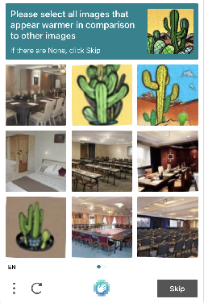

---
sidebar_position: 8
sidebar_label: ComplexImageTask HCaptcha
---

# ComplexImageTask HCaptcha
Объект содержит данные о задаче на решение hCaptcha.

## **Запрос на создание задачи**
### **Структура отправляемого объекта**
:::info Метод
```http
https://api.capmonster.cloud/createTask
```
:::
|**Параметр**|**Тип**|**Обязательный**|**Возможные значения**|**Описание**|
| :- | :- | :- | :- | :- |
|type|String|да|ComplexImageTask|Определяет тип объекта задачи|
|class|String|да|hcaptcha|Определяет класс объекта задачи|
|imageUrls|Array|да (если не заполнено imagesBase64)|[ “[https://i.postimg.cc/kg71cbRt/image-1.jpg](https://i.postimg.cc/kg71cbRt/image-1.jpg)”,… ]|Список с адресами изображений. Максимум 18 элементов.|
|imagesBase64|Array|да (если не заполнено imageUrls)|[ “/9j/4AAQSkZJRgABAQEAAAAAAAD…”,… ]|Список с изображениями в формате base64. Максимум 18 элементов.|
|metadata.Task|String|да|`Please click on the panda` и другие|Текст задания (<u>на английском</u>)|
|exampleImageUrls|Array|не всегда|[ “[https://i.postimg.cc/GmBgwnDm/4type-example-image.png](https://i.postimg.cc/GmBgwnDm/4type-example-image.png)”]|Список с адресами изображений. Должен содержать 1 или несколько элементов в зависимости от типа задания.|
|exampleImagesBase64|Array|не всегда|[ “/9j/4AAQSkZJRgABAQEAAAAAAAD…”]|Список с изображениями в формате base64. Должен содержать 1 или несколько элементов в зависимости от типа задания.|
|metadata.Classes|Array|не всегда|[ "shark", "chicken", "goat", "hedgehog" ] и другие|Список со строковыми значениями, находящимися на правой половине капчи (в том же порядке, как на изображении)|
|userAgent|String|нет|-|User-Agent браузера, используемый при загрузке изображений, если были переданы ссылки в imageUrls. Необходимо использовать подпись современного браузера, иначе Google будет возвращать ошибку, требуя обновить браузер.|
|websiteURL|String|нет|-|Адрес страницы, на которой решается капча|

## **Запрос на получение ответа**
:::info Метод
```http
https://api.capmonster.cloud/getTaskResult
```
:::
Используйте метод [getTaskResult](../api/methods/get-task-result.md), чтобы получить решение капчи. В зависимости от загрузки системы вы получите ответ через время в диапазоне от 300мс до 6 с.

### **Структура объекта solution**
|**Свойство**|**Тип**|**Описание**|
| :- | :- | :- |
|answer|Array of objects|Список ответов на каждое из переданных изображений.|
|metadata.AnswerType|string|Тип возвращаемого ответа.|

### **Тип ответа Grid**
|**Формат ответа**|**Пример ответа**|**Описание**|
| :- | :- | :- |
|Array of boolean|`[true, false, true]`|Список с булевыми значениями, true - означает, что нужно произвести клик на соответствующее этой позиции изображение|

**Пример ответа:**
```json
{
  "errorId":0,
  "status":"ready",
  "solution": {
    "answer": [ false, true ],
    "metadata": { "AnswerType": "Grid" }
  }
}
```

### **Тип ответа Coordinate**
|**Формат ответа**|**Пример ответа**|**Описание**|
| :- | :- | :- |
|Array of objects|`[{ "X":371, "Y":505.0000112 }, { "X":5, "Y":101.2 }]`|Список с координатами, по которым нужно произвести клик на соответствующем изображении|

**Пример ответа:**
```json
{
  "errorId":0,
  "status":"ready",
  "solution": { 
    "answer": [ { "X":371, "Y":505.0000112 }, { "X":5, "Y":101.2 } ],
    "metadata": { "AnswerType": "Coordinate" }
  }
}
```

## **Пример изображения (первый тип)**

 

:::info Правильно выберите тип задания
Данный тип заданий не содержит референсного изображения, такого как в [четвертом типе](#пример-изображения-четвертый-тип)
:::

### **Пример запроса**

:::info Метод
```http
https://api.capmonster.cloud/createTask
```
:::
```json
{
  "clientKey":"dce6bcbb1a728ea8d871de6d169a2057",
  "task": {
    "type": "ComplexImageTask",
    "class": "hcaptcha",
    "imageUrls":[ "https://i.postimg.cc/kg71cbRt/image-1.jpg", "https://i.postimg.cc/6381Zx2j/image.jpg" ],
    "metadata": {
      "Task": "Please click each image containing a mountain"
    },
    "userAgent": "Mozilla/5.0 (Windows NT 10.0; Win64; x64) AppleWebKit/537.36 (KHTML, like Gecko) Chrome/103.0.0.0 Safari/537.36.",
    "websiteUrl": "https://lessons.zennolab.com/captchas/recaptcha/v2_simple.php?level=middle"
  }
}
```

**Пример ответа**

```json
{
  "errorId":0,
  "taskId":407533072
}
```

### **Получение результата**
:::info Метод
```http
https://api.capmonster.cloud/getTaskResult
```
:::
Тип получаемого ответа - [**Grid**](#тип-ответа-grid).

**Пример:**

```json
{
  "errorId":0,
  "status":"ready",
  "solution": {
    "answer": [ false, true ],
    "metadata": { "AnswerType": "Grid" }
  }
}
```

### **Ценообразование**

|**Наименование** |**Стоимость за 1000 картинок, $**|
| :-: | :-: |
|hCaptcha|0,02|

## **Примеры изображений (второй тип)**
||||
| :-: | :-: | :-: |

:::info Передавайте референсные изображения для лучшего решения
Изображения, которые находятся в шапке задания, если они есть, необходимо передавать в параметре `exampleImagesBase64` или `exampleImageUrls`


:::

### **Пример запроса**

:::info Метод
```http
https://api.capmonster.cloud/createTask
```
:::
```json
{
  "clientKey":"dce6bcbb1a728ea8d871de6d169a2057",
  "task": {
    "type": "ComplexImageTask",
    "class": "hcaptcha",
    "exampleImagesBase64":[“/9j/4AAQSkZJRgABAQEAAAAAAAD…”, “/9j/4AAQSkZJRgABAQEAAAAAAAD…”, “/9j/4AAQSkZJRgABAQEAAAAAAAD…”],
    "imagesBase64": [ “/9j/4AAQSkZJRgABAQEAAAAAAAD…” ],
    "metadata": {
      "Task": "Please click on the panda"
    },
    "userAgent": "Mozilla/5.0 (Windows NT 10.0; Win64; x64) AppleWebKit/537.36 (KHTML, like Gecko) Chrome/103.0.0.0 Safari/537.36."
  }
}
```

**Пример ответа**
```json
{
  "errorId":0,
  "taskId":407533072
}
```

### **Получение результата**
:::info Метод
```http
https://api.capmonster.cloud/getTaskResult
```
:::
Тип получаемого ответа - [**Coordinate**](#тип-ответа-coordinate).

**Пример:**
```json
{
  "errorId":0,
  "status":"ready",
  "solution": { 
    "answer": [ { "X":371, "Y":505.0000112 } ],
    "metadata": { "AnswerType": "Coordinate" }
  }
}
```

### **Ценообразование**

|**Наименование** |**Стоимость за 1000 картинок, $**|
| :-: | :-: |
|hCaptcha|0,02|

## **Пример изображения (третий тип)**

 

Этот тип капч должен содержать поле **metadata.Classes**.

### **Пример запроса**

:::info Метод
```http
https://api.capmonster.cloud/createTask
```
:::

```json
{
  "clientKey":"dce6bcbb1a728ea8d871de6d169a2057",
  "task": {
    "type": "ComplexImageTask",
    "class": "hcaptcha",
    "imagesBase64": [ “/9j/4AAQSkZJRgABAQEAAAAAAAD…” ],
    "metadata": {
      "Task": "What animal is shown in the image below?",
      "Classes": [ "shark", "chicken", "goat", "hedgehog" ]
    },
    "userAgent": "Mozilla/5.0 (Windows NT 10.0; Win64; x64) AppleWebKit/537.36 (KHTML, like Gecko) Chrome/103.0.0.0 Safari/537.36."
  }
}
```

**Пример ответа**
```json
{
  "errorId":0,
  "taskId":407533072
}
```

### **Получение результата**
:::info Метод
```http
https://api.capmonster.cloud/getTaskResult
```
:::
Тип получаемого ответа - [**Grid**](#тип-ответа-grid).

**Пример:**

```json
{
  "errorId":0,
  "status":"ready",
  "solution": { 
    "answer": [ false, false, true, false ],
    "metadata": { "AnswerType": "Grid" }
  }
}
```

### **Ценообразование**

|**Наименование** |**Стоимость за 1000 картинок, $**|
| :-: | :-: |
|hCaptcha|0,02|

## **Пример изображения (четвертый тип)**



Для данного запроса обязательное поле **exampleImageUrls** или **exampleImagesBase64**. Оно должно содержать одну картинку.

Поле **imageUrls** или **imagesBase64** должно содержать 9 картинок.

### **Пример запроса**

:::info Метод
```http
https://api.capmonster.cloud/createTask
```
:::

```json
{
  "clientKey":"dce6bcbb1a728ea8d871de6d169a2057",
  "task": {
    "type": "ComplexImageTask",
    "class": "hcaptcha",
    "imageUrls": [
      "https://i.postimg.cc/bwVVWbkG/4type-00.jpg",
      "https://i.postimg.cc/nzBdXP57/4type-01.jpg",
      "https://i.postimg.cc/zf9tXrd8/4type-02.jpg",
      "https://i.postimg.cc/2yY0hxRt/4type-03.jpg",
      "https://i.postimg.cc/rFQfRWhh/4type-04.jpg",
      "https://i.postimg.cc/Jz0PNnvR/4type-05.jpg",
      "https://i.postimg.cc/h48ygNVR/4type-06.jpg",
      "https://i.postimg.cc/yY1yXdtk/4type-07.jpg",
      "https://i.postimg.cc/Prt6qKMp/4type-08.jpg"
     ],
    "exampleImageUrls": [ "https://i.postimg.cc/MpLtdwJV/4type-example.jpg" ],
    "metadata": {
      "Task": "Please select all images that appear warmer in comparison to other images"
    }
  }
}
```

**Пример ответа**
```json
{
  "errorId":0,
  "taskId":407533072
}
```

### **Получение результата**
:::info Метод
```http
https://api.capmonster.cloud/getTaskResult
```
:::
Тип получаемого ответа - [**Grid**](#тип-ответа-grid).

**Пример:**

```json
{
  "errorId":0,
  "status":"ready",
  "solution": { 
    "answer": [ true, false, false, false, false, true, false, false, true ],
    "metadata": { "AnswerType": "Grid" }
  }
}
```

### **Ценообразование**

|**Наименование** |**Стоимость за 1000 картинок, $**|
| :-: | :-: |
|hCaptcha|0,02|

