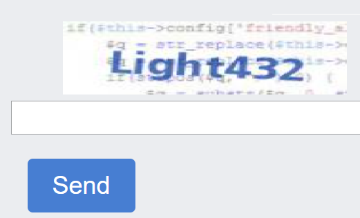

---
sidebar_position: 12
sidebar_label: ImageToText
title: "Автоматическое распознавание и обход простой текстовой капчи — Image-to-Text | API"
description: "Метод Image-to-Text через API CapMonster.Cloud для автоматического распознавания и обхода простой текстовой капчи. Подробное руководство и примеры для автоматического решения простой капчи — изображения с текстом в документации Capmonster Cloud Docs!"
---

import Tabs from '@theme/Tabs';
import TabItem from '@theme/TabItem';
import ParamItem from '@theme/ParamItem';
import MethodItem from '@theme/MethodItem';
import MethodDescription from '@theme/MethodDescription'
import PriceBlock from '../../src/theme/PriceBlock';
import PriceBlockWrap from '@theme/PriceBlockWrap';
import { ArticleHead } from '../../src/theme/ArticleHead';

<ArticleHead slug="captchas/image-to-text" />

# ImageToText 

<PriceBlockWrap>
  <PriceBlock captchaId="text"/>
</PriceBlockWrap>



Это обычная капча, представляющая собой изображение с текстом, который нужно ввести в соответствующую строку. 

:::warning **Внимание!**
Использование прокси-серверов для данной задачи не требуется.
:::


## Параметры запроса
<TabItem value="proxyless" label="ImageToTextTask (без прокси)" default className="bordered-panel">
    <ParamItem title="type" required type="string" />
    **ImageToTextTask**

    ---

    <ParamItem title="body" required type="string" />
    Содержимое файла капчи закодированное в base64*. Убедитесь, что значение отправляется одной строкой, без переносов.

    ---

    <ParamItem title="capMonsterModule" type="string" />
    Имя модуля, например “yandex“. Альтернативный способ передачи имени модуля и список всех доступных модулей можно найти [здесь](../api/module-name.mdx). <br />
    Пример: yandex, special и другие.

    ---

    <ParamItem title="recognizingThreshold" type="integer" />
    Порог распознавания капчи с возможным значением от 0 до 100. Например, если в систему было отправлено значение 90, и задача решилась с уверенностью 80, то деньги за решение не спишутся. В этом случае пользователь получит ответ ERROR_CAPTCHA_UNSOLVABLE. Альтернативный способ установки порога списания денег описан в [статье](../api/threshold.mdx).

    ---

    <ParamItem title="case" type="boolean" />
    Учитывать регистр при решении или нет. Возможные значения: true, false

    ---

    <ParamItem title="numeric" type="integer" />
    1 - если капча состоит только из цифр. <br />
    Возможные значения: 0, 1

    ---

    <ParamItem title="math" type="boolean" />
`false` — по умолчанию не задано; <br />
`true` — капча требует выполнения математического действия (например, капча `2 + 6` вернёт значение `8`).  
**Важно:** для модуля `captcha_math` **не используйте** параметр `math: true`. 
</TabItem>

<br />

*Base64 - это способ кодирования данных, позволяющий представить бинарные данные в виде текста. Пример получения изображения капчи в формате base64 с помощью консоли в **Инструментах разработчика**:

```JavaScript
const captchaUrl = 'https://example.com/captcha.jpg';

function loadAndEncodeCaptchaToBase64(url) {
    fetch(url)
        .then(response => response.blob())
        .then(blob => {
            const reader = new FileReader();
            reader.readAsDataURL(blob);

            reader.onloadend = function() {
                const base64Data = reader.result;                
                console.log('Base64 Encoded Captcha:', base64Data);

                          };
        })
        .catch(error => {
            console.error('Error occurred while loading or encoding the captcha:', error);
        });
}

loadAndEncodeCaptchaToBase64(captchaUrl);

```


## Метод создания задачи

<TabItem value="proxyless" label="ImageToTextTask (без прокси)" default className="method-panel">
	<MethodItem>
		```http
		https://api.capmonster.cloud/createTask
		```
	</MethodItem>
	<MethodDescription>
		**Запрос**
		```json
		{
		  "clientKey":"API_KEY",
		  "task": {
			"type":"ImageToTextTask",
			"body":"BASE64_BODY_HERE!"
		  }
		}
		```
		**Ответ**
		```json
		{
		  "errorId":0,
		  "taskId":407533072
		}
		```
	</MethodDescription>
</TabItem>


## Метод получения результата задачи
Используйте метод [getTaskResult](../api/methods/get-task-result.mdx) чтобы получить решение капчи. В зависимости от загрузки системы вы получите ответ через время в диапазоне от 300 мс до 6 с.

<TabItem value="proxyless" label="ImageToTextTask (без прокси)" default className="method-panel-full">
	<MethodItem>
		```http
		https://api.capmonster.cloud/getTaskResult
		```
	</MethodItem>
	<MethodDescription>
		**Запрос**
		```json
		{
		  "clientKey":"API_KEY",
		  "taskId": 407533072
		}
		```
		**Ответ**
		```json
		{
		  "errorId":0,
		  "status":"ready",
		  "solution": {
			"text":"answer"
		  }
		}
		```
	</MethodDescription>
</TabItem>

<br />

|**Свойство**|**Тип**|**Описание**|
| :-: | :-: | :-: |
|text|String|Текст решения капчи|

## Как найти все нужные параметры для создания задачи на решение

### Вручную

1. Откройте ваш сайт, где отображается капча, в браузере.
2. Правой кнопкой кликните по элементу капчи и выберите **Inspect**.

#### base64

Найдите нужный элемент в DOM-дереве и наведите на него курсор – закодированное в *base64* изображение отобразится непосредственно в атрибутах элемента:


Если изображение ссылается на внешний URL, а не содержит данные в формате base64, его можно найти в разделе сетевых запросов (**Network**). Кликните правой кнопкой мыши по нужному запросу и выберите **Copy image as data URI**. Вы сразу получите кодировку изображения в формате *base64*, скопированную в буфер обмена.


### Автоматически

Для автоматизации поиска параметров их можно извлекать через **браузер** (обычный или headless, например, с **Playwright**) или напрямую из **HTTP-запросов**. Поскольку значения динамических параметров действуют недолго, их рекомендуется использовать сразу после получения.

:::warning **Важно!**
Приведённые фрагменты кода являются базовыми примерами для ознакомления в извлечении необходимых параметров. Точная реализация будет зависеть от вашего сайта с капчей, его структуры и используемых HTML-элементов и селекторов.
:::

<Tabs className="full-width-tabs filled-tabs request-tabs">
  <TabItem value="js" label="JavaScript" default className="method-panel">
    <details>
      <summary>Показать код (для браузера)</summary>
      ```js
      (async () => {
        const img = document.querySelector('img'); // Пример селектора

        const imageUrl = img.src;

        const response = await fetch(imageUrl);

        if (!response.ok) {
          throw new Error("Ошибка загрузки изображения");
        }

        const buffer = await response.arrayBuffer();

        // Преобразуем бинарные данные в base64
        const base64Image = btoa(String.fromCharCode(...new Uint8Array(buffer)));

        console.log(base64Image); 
      })();
      ```
    </details>

    <details>
      <summary>Показать код (Node.js)</summary>
      ```js
      (async () => {
        const imageUrl = "https://example/img/.jpg"; // Ссылка на изображение

        const response = await fetch(imageUrl);

        if (!response.ok) {
          throw new Error("Ошибка загрузки изображения");
        }

        const buffer = await response.arrayBuffer();

        // Преобразуем данные в base64
        const base64Image = Buffer.from(buffer).toString("base64");

        console.log(base64Image);
      })();
      ```
    </details>
  </TabItem>

  <TabItem value="python" label="Python" className="method-panel">
    <details>
      <summary>Показать код</summary>
      ```python
      import requests
      import base64

      # Ссылка на изображение
      image_url = "https://example/img.jpg"

      response = requests.get(image_url)

      if response.status_code == 200:
          # Преобразуем бинарные данные изображения в base64
          base64_image = base64.b64encode(response.content).decode('utf-8')

          print(base64_image)
      else:
          print("Ошибка загрузки изображения")
      ```
    </details>
  </TabItem>

  <TabItem value="csharp" label="C#" className="method-panel">
    <details>
      <summary>Показать код</summary>
      ```csharp
      using System;
      using System.Net.Http;
      using System.Threading.Tasks;

      class Program
      {
          static async Task Main(string[] args)
          {
              // Ссылка на изображение
              string imageUrl = "https://example/img.jpg";

              using (HttpClient client = new HttpClient())
              {
                  try
                  {
                      byte[] imageBytes = await client.GetByteArrayAsync(imageUrl);

                      // Преобразуем бинарные данные изображения в base64
                      string base64Image = Convert.ToBase64String(imageBytes);

                      Console.WriteLine(base64Image);
                  }
                  catch (Exception ex)
                  {
                      Console.WriteLine("Ошибка загрузки изображения: " + ex.Message);
                  }
              }
          }
      }
      ```
    </details>
  </TabItem>
</Tabs>

## Используйте библиотеку SDK

<Tabs className="full-width-tabs filled-tabs request-tabs" groupId="captcha-type">
  <TabItem value="js" label="JavaScript" default className="method-panel">
  <details>
      <summary>Показать код (для браузера)</summary>
    ```js
    // https://github.com/ZennoLab/capmonstercloud-client-js

    import { CapMonsterCloudClientFactory, ClientOptions, ImageToTextRequest, CapMonsterModules } from '@zennolab_com/capmonstercloud-client';

    document.addEventListener('DOMContentLoaded', async () => {
        const cmcClient = CapMonsterCloudClientFactory.Create(
            new ClientOptions({ clientKey: 'YOUR_API_KEY' }) // Укажите ваш API-ключ CapMonster Cloud
        );

        // При необходимости можно проверить баланс
        const balance = await cmcClient.getBalance();
        console.log("Balance:", balance);

        const imageToTextRequest = new ImageToTextRequest({
            body: 'some base64 body', // Замените на реальное значение
            CapMonsterModule: CapMonsterModules.YandexWave,
            Case: true,
            numeric: 1,
            recognizingThreshold: 65,
            math: false
        });

        const result = await cmcClient.Solve(imageToTextRequest);
        console.log("Solution:", result);
    });
    ```
    </details>

    <details>
      <summary>Показать код (Node.js)</summary>
```javascript
// https://github.com/ZennoLab/capmonstercloud-client-js

import { CapMonsterCloudClientFactory, ClientOptions, ImageToTextRequest, CapMonsterModules } from '@zennolab_com/capmonstercloud-client';

const API_KEY = "YOUR_API_KEY"; // Укажите ваш API-ключ CapMonster Cloud

async function solveImageToText() {
    const cmcClient = CapMonsterCloudClientFactory.Create(
        new ClientOptions({ clientKey: API_KEY })
    );

    // При необходимости можно проверить баланс
    const balance = await cmcClient.getBalance();
    console.log("Balance:", balance);

    const imageToTextRequest = new ImageToTextRequest({
        body: 'some base64 body', // Замените на реальное значение
        CapMonsterModule: CapMonsterModules.YandexWave,
        Case: true,
        numeric: 1,
        recognizingThreshold: 65,
        math: false
    });

    const result = await cmcClient.Solve(imageToTextRequest);
    console.log("Solution:", result);
}

solveImageToText().catch(console.error);
```
</details>

  </TabItem>

  <TabItem value="python" label="Python" className="method-panel">
  <details>
      <summary>Показать код</summary>
    ```python
    # https://github.com/ZennoLab/capmonstercloud-client-python

    import asyncio
    import base64
    from capmonstercloudclient import CapMonsterClient, ClientOptions
    from capmonstercloudclient.requests import ImageToTextRequest

    # Укажите ваш API-ключ CapMonster Cloud
    client_options = ClientOptions(api_key="YOUR_API_KEY")
    cap_monster_client = CapMonsterClient(options=client_options)

    # Изображение в формате base64
    image_base64 = "/9j/4AAQSkZJRgABAQAAAQABAAD/2wBDAAgGBgc...wwzqR4U/yZ//Z"  # Замените на реальное значение
    image_bytes = base64.b64decode(image_base64)

    image_to_text_request = ImageToTextRequest(
        image_bytes=image_bytes,
        module_name=None,     # Можно выбрать модуль, например YandexWave
        threshold=50,     
        case=True,     
        numeric=0,    
        math=False         
    )

    async def solve_captcha():
        # При необходимости можно проверить баланс
        balance = await cap_monster_client.get_balance()
        print("Balance:", balance)

        solution = await cap_monster_client.solve_captcha(image_to_text_request)
        return solution

    responses = asyncio.run(solve_captcha())
    print("Solution:", responses)
    ```
    </details>
  </TabItem>

  <TabItem value="csharp" label="C#" className="method-panel">
  <details>
      <summary>Показать код</summary>
    ```csharp
    // https://github.com/ZennoLab/capmonstercloud-client-dotnet

    using System;
    using System.Threading.Tasks;
    using Zennolab.CapMonsterCloud.Requests;
    using Zennolab.CapMonsterCloud;

    class Program
    {
        static async Task Main(string[] args)
        {
            var clientOptions = new ClientOptions
            {
                ClientKey = "YOUR_API_KEY" // Ваш API-ключ CapMonster Cloud
            };

            var cmCloudClient = CapMonsterCloudClientFactory.Create(clientOptions);

            // При необходимости можно проверить баланс 
            var balance = await cmCloudClient.GetBalanceAsync();
            Console.WriteLine("Balance: " + balance);

            var imageToTextRequest = new ImageToTextRequest
            {
                Body = "/9j/4AAQSkZJRgABAQAAAQABA...hMjIyMjIyMjIyMjIyMj", // Замените на реальное значение
                CapMonsterModule = "None",  
                RecognizingThreshold = 70, 
                CaseSensitive = true,
                Numeric = false, 
                Math = false
            };

            var imageToTextResult = await cmCloudClient.SolveAsync(imageToTextRequest);

            Console.WriteLine("Captcha Solved: " + imageToTextResult.Solution.Value);
        }
    }
    ```
    </details>
  </TabItem>
</Tabs>
