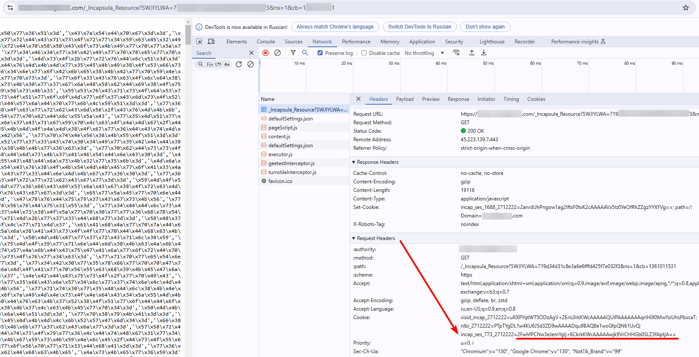

import Tabs from '@theme/Tabs';
import TabItem from '@theme/TabItem';
import ParamItem from '@theme/ParamItem';
import MethodItem from '@theme/MethodItem';
import MethodDescription from '@theme/MethodDescription'
import PriceBlock from '../../src/theme/PriceBlock';
import PriceBlockWrap from '@theme/PriceBlockWrap';
import BlogLink from '@theme/BlogLink';

# Imperva (Incapsula)

<PriceBlockWrap>
  <PriceBlock title="Imperva" captchaId="imperva"/>
</PriceBlockWrap>

<BlogLink url="https://capmonster.cloud/ru/blog/news/imperva-incapsula-news"/>

:::warning **Внимание!**
Решение Imperva (Incapsula), доступное в CapMonster Cloud, предоставляется исключительно для тестирования и анализа работоспособности на ваших собственных веб-ресурсах. Использование данного решения на сторонних сайтах строго запрещено и противоречит политике использования сервиса.
:::


## Параметры запроса

<TabItem value="proxyless" label="CustomTask (без прокси)" default className="bordered-panel">
    <ParamItem title="type" required type="string" />
    **CustomTask**

    ---

    <ParamItem title="class" required type="string" />
    **Imperva**

    ---

    <ParamItem title="websiteURL" required type="string" />
    Адрес основной страницы, на которой находится инкапсула.

    ---
    <ParamItem title="incapsulaScriptUrl (внутри metadata)" required="required" type="string" />
    `"incapsulaScriptUrl": "_Incapsula_Resource?SWJIYLWA=719d34d31c8e3a6e6fffd425f7e032f3"` - Название js файла инкапсулы

    ---

    <ParamItem title="incapsulaCookie (внутри metadata)" required type="string" />
    Ваши куки от incapsula. Можно получить на странице с помощью "document.cookie" или в заголовке запроса Set-Cookie: "incap_sess_*=...; visid_incap_*=..." (см. пример запроса /createTask)
	
	

	---

    <ParamItem title="reese84UrlEndpoint (внутри metadata)" type="string" />
    Название эндпоинта куда отравляется reese84 fingerprint. Можно найти среди запросов, оканчивается на ?d=site.com

    	

    ---

    <ParamItem title="userAgent" type="string" />
    User-Agent браузера. <br /> 
	**Передавайте только актуальный UA от ОС Windows. Сейчас таковым является**: userAgentPlaceholder
</TabItem>


## Метод создания задачи

<TabItem value="proxyless" label="CustomTask (без прокси)" default className="method-panel">
	<MethodItem>
		```http
		https://api.capmonster.cloud/createTask
		```
	</MethodItem>
	<MethodDescription>
		**Запрос**
		```json
		{
			"clientKey": "API_KEY",
			"task": {
				"type": "CustomTask",
				"class": "Imperva",
				"websiteURL": "https://example.com",
				"userAgent": "userAgentPlaceholder",
				"metadata": {
					"incapsulaScriptUrl": "_Incapsula_Resource?SWJIYLWA=719d34d31c8e3a6e6fffd425f7e032f3",
					"incapsulaCookies": "incap_ses_1166_2930313=br7iX33ZNCtf3HlpEXcuEDzz72cAAAAA0suDnBGrq/iA0J4oERYzjQ==; visid_incap_2930313=P3hgPVm9S8Oond1L0sXhZqfK72cAAAAAQUIPAAAAAABoMSY9xZ34RvRseJRiY6s+;",
                                "reese84UrlEndpoint":"Built-with-the-For-hopence-Hurleysurfecting-the-"
				}
			}
		}
		```
		**Ответ**
		```json
		{
		  "errorId":0,
		  "taskId":407533072
		}
		```
	</MethodDescription>
</TabItem>


## Метод получения результата задачи
Используйте метод [getTaskResult](../api/methods/get-task-result.md), чтобы получить решение Imperva.

<TabItem value="proxyless" label="CustomTask (без прокси)" default className="method-panel-full">
	<MethodItem>
		```http
		https://api.capmonster.cloud/getTaskResult
		```
	</MethodItem>
	<MethodDescription>
		**Запрос**
		```json
		{
		  "clientKey":"API_KEY",
		  "taskId": 407533072
		}
		```
		**Ответ**
		```json
		{
			"errorId":0,
			"status":"ready",
			"solution": {
				"domains": {
					"https://example.com": {
						"cookies": {
							"___utmvc": "NMB+nRa4inxXNeXuhPl9w4opzdo2afqlceX5uMBLwrduDVo64yb4KunkabEeLYXmKZuVhloliIv6fWevXUcT1WJiFklg9AghMBMkDFjDAEtAnK639bNQi/ob8l+hp/5wf/WpTQcIkG8F9VifAEcZG7MxawsEpYJxkLji4vDSUbGuHPNf5CzIyEzATfw6UVBRiLiDdUvFWboxszG1T5aUrwQYgIlmm1B2X5ZZW4BzwN3k8Md5J+jIdllfdTaxK9JQfuqYQCdT/g5mifg2TPbrwVQeN14avfo1xQr88Mh+m4oclb0yR6VJp2vaVktDSIe2cwCZ3sKKYE0rzkCpcJb9530gRCOT3YxCtyU4Qqg6yRIf8Rk4q/KRSC8/VJ9ezreZ221mURm4FnFH+OF0PqjAiLd/lVK6oTO6BIet4ykEKCtch9EVk0hgGJieaG1F1Nt5haZcSNjGBa15wPyD2OFZe0kI7VBopsUyWqiD0Ydun6+WD/7aDHROngJj0VIZjSuOnQuVQDK2Vcw9gTVvvqwnDhR28ff0gj5b+LAkvrykfgO/AQO0K/DNCF0HgmWIMiSJeoohCpCa/UArU8tDtETnuxGKGaaJOsGKsPtOS5VRQlyRa+D0inSAVY77lpWF5+9SOS+Ioxlq3r8ovFosR33OOcBCEgAlrkdTNNKvK27mWNwmi+ccKkyuJw5Gtk3SEsYNZ75KU/ok+sKBZM5OIsrmp9ivj+nx0oi7yQf6q0Oksbwr2xTFANsIfpoOJBIMylVSCRGwEbpoN4+IJitczOtb8D/TmfHx5P1td0NWTli7UhqFSADS0CcH+vfBos4nucByHjMxkiKuGcudydlZ4IAzl4j0EhZb9OjqJsVe6NIosjwYuqVWHI6BKpRz4FnaqvW+fbEgNj/SmOrEJ/BbKsOOikJNDw6E6BznYT8oQaV6y5p+HFfut+fP3ocrgdMEjoA16oBDfj0rHopZtpJRk2ss41MOA4XyNbfzXVxotTjUXQnuSJXKqp5n4LUD2nFGFpKTwPOT5bTiFiXyHCwNzscRmlfnv38sjG76999auML2YaK1y1wi4sm9fhrbCJuJ9cSSUAMVyeCJhF6BBZ7K1xcGYsougAqbO+oHt/v2J0dnDBAgqQz43nHMNH0yduHWDZUoFsFGqLU8k9a/YYgznEWQDbXnbXAkLziOTNer9FijatGSGm/USO+Gu6TwbmiCfoRoCtm4LOv0aKpzCh48bVdpgEgU3cKLnY970QqnpcB2HCWyawyWMgW3lpXqRKvCbPXo9kiyIBAssNG+HY4URXrwZnhJsnomsipaxKCyRmAUrGjxxFNe0D7vbXn9uY6KnjlJ01Z2T1f3WgwBTBv1QrJsy33KZPkpKLK4VXmtVwD/NBgtgJx7f2xZrKsqrwS3nwa9nYaA9cbS6h4Akl0Ssruv5bwhcVjd7t5fdnCvH59L7emUBEhWV4GpE9owdZpXbWbW0Sq/ZXWe9QX/g4wKTcSJLDBA+T4tegikJv0NWm1aMI2RMJ58Y38JsWKJnkNgjbHAJ7SuVsAtBY3FBbVYLNlC41ZCs8Ygt5W4HNP5B0tRJxEvzqkdbMPg48oVO9AjohmqSPKaXq1TqRTUEatTvt0LD0Uo6v8FFGbCjuuc0kkq4zslsHxEPcB4PY1UKd5/Xw2ttU2ZeGOBIsG+HVTww2yPCYUNH1orKqEwt5H7oMApKWAy1J4lESr1RUbHCBHj7OikFvg4+clNBDGp0wCk+PigPFFNVWBfxtFwJSCZQTUuev1HpdMz/nEiUSPRL3xFbFDH+Ucmdn8lzwCj2EZSY4Zb8cBT92RzbjjcQoH51pgaSjTn5f9m496SyAu34aqTeGU+fYipD5UsWv5r2csBCVJWKm94Ds1QY3JkIkym69IRWoi3j1PKOKxIKX1QTiMqq+8GEgMgwrXYRhzBAmfp19h/ScvxYdiy0q4z6XzJ0pFs1h1bA+6oqqPOqUvrLVbMP1MM7LZKYlhUyJ70KRsrc13y9fLbJV0Znst7cKhi2RGKbU/8anFlzswtjnDD7Upuw/uO3rfedi33X9NFxUw6+pgUYur8ZWQWY3Gm4kX+ANW0upV4K4y/pj5BcZtCKVSXQ/XcLqWkSOt7acbitnrqOgJdw5LmSBhmB+dZwEMzMdUVhRtDt4+oC5DIgtC0B8FhxFX/BzHv6Gh2eO6HJHmXepSpH3csGFpQyJM/5VgNs0wNFPvl1PDA8GAQsu+bGWLGIycSA+XSZVdsRdnegdRIPi0ktOLsAs+ZIZXebkOCMnZytLnrxmfLkAQVtYoy0Qoh9Bv6QOQsxDUZrRu43oaVC/MLuzhftcv/ZhFtCj6IvqWuCHOUp+zLVpzCyiPvN/5eVoVJrY0Jq/Ky8WLUabkJh4h2CiS+9jipESYH+Tu2qsz3V/pR7swfW8zAwp8a4Hzl+8/eGea9X9NY1htqeqw/BJ3ALeozpaA833KZ4HeWrxLRennaqiOvTSkGKDKJsnT6zRQbMw6geAjXk7EMnZBTgTfrBUqpmCYsExQRiyP7DEEcpgTe3+ry9YzLLFevuyvwBYVI7pmc+AeWBNbcl3e7EwdeKZiprQgt7mASx2KRtkgUzNxH8OiPGvVMrJPYSWxUMgFrwVgxvV1kMb/PEVr0YXoFjccRQwWdsxoMizqBWALnYODaJwwl6RZraZIyPVp3ptW4mCWZCWTg+fFdeUWwzGfC312KHggGX2yntQV/iIE5kQWbk72JFP7Xf3it4XdFWBynaojzykDFXODTCEwGB1NIbmO+aVirjv0Rs6ZoKpxSMB+KHd4/TWRpZ2VzdD0xOTE0NDAscz02NzdiOTY4YjdmYTE5M2FjOTk4N2E5YThhMjljN2E4NjYzNWY4NWIxOWM3NTg4ODQ5NWFjOGE4MmE4OTU2OGEwNzI2ODlkODc4MWIwNmU3MQ==; Max-Age=31536000; Domain=.site.com; Path=/; Secure; SameSite=Lax"
						}
					}
				}
			}
		}
		```
	</MethodDescription>
</TabItem>

## Access denied

Error 16 - данная ошибка связана с применением прокси-серверов, не соответствующих требуемой геолокации.

## Как найти все нужные параметры для создания задачи на решение

### Автоматически

Удобный способ автоматизировать поиск всех необходимых параметров.
Некоторые параметры генерируются заново при каждой загрузке страницы, поэтому для их извлечения потребуется работать через браузер – обычный или в режиме headless (например, с помощью **Playwright**).
Так как значения динамических параметров хранятся недолго, капчу нужно решать сразу после их получения.

:::warning **Важно!**
Приведённые фрагменты кода являются базовыми примерами для ознакомления в извлечении необходимых параметров. Точная реализация будет зависеть от вашего сайта с капчей, его структуры и используемых HTML-элементов и селекторов.
:::

<Tabs className="full-width-tabs filled-tabs request-tabs">
  <TabItem value="js" label="JavaScript" default className="method-panel">
    <details>
      <summary>Показать код (Node.js)</summary>
      ```js
      import { chromium } from "playwright";

      (async () => {
        const browser = await chromium.launch({ headless: false });
        const page = await browser.newPage();

        await page.goto("https://www.example.com/");

        // Извлекаем значение атрибута src из iframe с id main-iframe
        const iframeSrc = await page.$eval("#main-iframe", (iframe) =>
          iframe.getAttribute("src")
        );
        console.log("iframe src:", iframeSrc);

        // Получаем все cookies
        const cookies = await page.context().cookies();

        // Фильтруем cookies, которые начинаются с visid_incap_ или incap_ses_
        const filteredCookies = cookies.filter(
          (cookie) =>
            cookie.name.startsWith("visid_incap_") ||
            cookie.name.startsWith("incap_ses_")
        );

        filteredCookies.forEach((cookie) => {
          console.log(`${cookie.name}=${cookie.value}`);
        });

        await browser.close();
      })();
      ```
    </details>
  </TabItem>

  <TabItem value="python" label="Python" className="method-panel">
    <details>
      <summary>Показать код</summary>
      ```python
      import asyncio
      from playwright.async_api import async_playwright

      async def main():
          async with async_playwright() as p:
              browser = await p.chromium.launch(headless=False)
              page = await browser.new_page()

              await page.goto("https://www.example.com/")

              # Извлекаем значение атрибута src из iframe с id main-iframe
              iframe_src = await page.locator("#main-iframe").get_attribute("src")
              print("iframe src:", iframe_src)  # Выводим значение src

              # Получаем все cookies
              cookies = await page.context.cookies()

              # Фильтруем cookies, которые начинаются с visid_incap_ или incap_ses_
              filtered_cookies = [
                  cookie for cookie in cookies
                  if cookie["name"].startswith("visid_incap_") or cookie["name"].startswith("incap_ses_")
              ]

              for cookie in filtered_cookies:
                  print(f"{cookie['name']}={cookie['value']}")

              await browser.close()

      asyncio.run(main())
      ```
    </details>
  </TabItem>

  <TabItem value="csharp" label="C#" className="method-panel">
    <details>
      <summary>Показать код</summary>
      ```csharp
      using System;
      using System.Linq;
      using System.Threading.Tasks;
      using Microsoft.Playwright;

      class Program
      {
          public static async Task Main(string[] args)
          {
              var playwright = await Playwright.CreateAsync();
              var browser = await playwright.Chromium.LaunchAsync(new BrowserTypeLaunchOptions { Headless = false });
              var page = await browser.NewPageAsync();

              await page.GotoAsync("https://www.example.com/");

              // Извлекаем значение атрибута src из iframe с id main-iframe
              var iframeSrc = await page.GetAttributeAsync("#main-iframe", "src");
              Console.WriteLine("iframe src: " + iframeSrc); // Выводим значение src

              // Получаем все cookies
              var cookies = await page.Context.CookiesAsync();

              // Фильтруем cookies, которые начинаются с visid_incap_ или incap_ses_
              var filteredCookies = cookies.Where(cookie =>
                  cookie.Name.StartsWith("visid_incap_") || cookie.Name.StartsWith("incap_ses_"));

              foreach (var cookie in filteredCookies)
              {
                  Console.WriteLine($"{cookie.Name}={cookie.Value}");
              }

              await browser.CloseAsync();
          }
      }
      ```
    </details>
  </TabItem>
</Tabs>

## Используйте библиотеку SDK

	<Tabs className="full-width-tabs filled-tabs request-tabs" groupId="captcha-type">
		<TabItem value="js" label="JavaScript" default className="method-panel">
			```js
			// https://github.com/ZennoLab/capmonstercloud-client-js

			import { CapMonsterCloudClientFactory, ClientOptions, ImpervaRequest } from '@zennolab_com/capmonstercloud-client';

			document.addEventListener('DOMContentLoaded', async () => {
				const cmcClient = CapMonsterCloudClientFactory.Create(new ClientOptions({ clientKey: '<your capmonster.cloud API key>' }));
				console.log(await cmcClient.getBalance());

				const impervaRequest = new ImpervaRequest({
					websiteURL: 'https://example.com',
					metadata: {
						"incapsulaScriptUrl": "_Incapsula_Resource?SWJIYLWA=719d34d31c8e3a6e6fffd425f7e032f3",
						"incapsulaCookies": "incap_ses_1166_2930313=br7iX33ZNCtf3HlpEXcuEDzz72cAAAAA0suDnBGrq/iA0J4oERYzjQ==; visid_incap_2930313=P3hgPVm9S8Oond1L0sXhZqfK72cAAAAAQUIPAAAAAABoMSY9xZ34RvRseJRiY6s+;",
					},
				});

				console.log(await cmcClient.Solve(impervaRequest));
			});
			```
		</TabItem>
		
		<TabItem value="python" label="Python" default className="method-panel">
			```python
			# https://github.com/ZennoLab/capmonstercloud-client-python
	 
			import asyncio
			from capmonstercloudclient import CapMonsterClient, ClientOptions
			from capmonstercloudclient.requests import ImpervaCustomTaskProxylessRequest
	 
			client_options = ClientOptions(api_key="your_api_key")  # Replace with your CapMonster Cloud API key
			cap_monster_client = CapMonsterClient(options=client_options)
	 
			imperva_request = ImpervaCustomTaskProxylessRequest(
				websiteUrl="https://example.com",  # URL with captcha
				userAgent="userAgentPlaceholder",
				metadata={
					"incapsulaScriptUrl": "_Incapsula_Resource?SWJIYLWA=719d34d31c8e3a6e6fffd425f7e032f3",
					"incapsulaCookies": "incap_ses_1166_2930313=br7iX33ZNCtf3HlpEXcuEDzz72cAAAAA0suDnBGrq/iA0J4oERYzjQ==; visid_incap_2930313=P3hgPVm9S8Oond1L0sXhZqfK72cAAAAAQUIPAAAAAABoMSY9xZ34RvRseJRiY6s+;",
					"reese84UrlEndpoint": "Built-with-the-For-hopence-Hurleysurfecting-the-"
				},
			)
	 
			async def solve_captcha():
				return await cap_monster_client.solve_captcha(imperva_request)
	 
			responses = asyncio.run(solve_captcha())
			print(responses)
			```
		</TabItem>
		
		<TabItem value="csharp" label="C#" className="method-panel">
			```csharp
			// https://github.com/ZennoLab/capmonstercloud-client-dotnet

			using Zennolab.CapMonsterCloud.Requests;
			using Zennolab.CapMonsterCloud;

			class Program
			{
				static async Task MainImperva(string[] args)
				{
					var clientOptions = new ClientOptions
					{
						ClientKey = "your_api_key" // Replace with your CapMonster Cloud API key
					};

					var cmCloudClient = CapMonsterCloudClientFactory.Create(clientOptions);

					var impervaRequest = new ImpervaCustomTaskRequest("incapsulaScriptUrl": "_Incapsula_Resource?SWJIYLWA=719d34d31c8e3a6e6fffd425f7e032f3", "incapsulaCookies": "incap_ses_1166_2930313=br7iX33ZNCtf3HlpEXcuEDzz72cAAAAA0suDnBGrq/iA0J4oERYzjQ==; visid_incap_2930313=P3hgPVm9S8Oond1L0sXhZqfK72cAAAAAQUIPAAAAAABoMSY9xZ34RvRseJRiY6s+;", reese84UrlEndpoint: "Built-with-the-For-hopence-Hurleysurfecting-the-")
					{
						WebsiteUrl = "https://example.com",
						UserAgent = "userAgentPlaceholder", // Use the current userAgent
					};

					var impervaResult = await cmCloudClient.SolveAsync(impervaRequest);

					Console.WriteLine("Captcha Solution: " + JsonSerializer.Serialize(impervaResult.Solution));
				}
			}
			```
		</TabItem>
	</Tabs>
