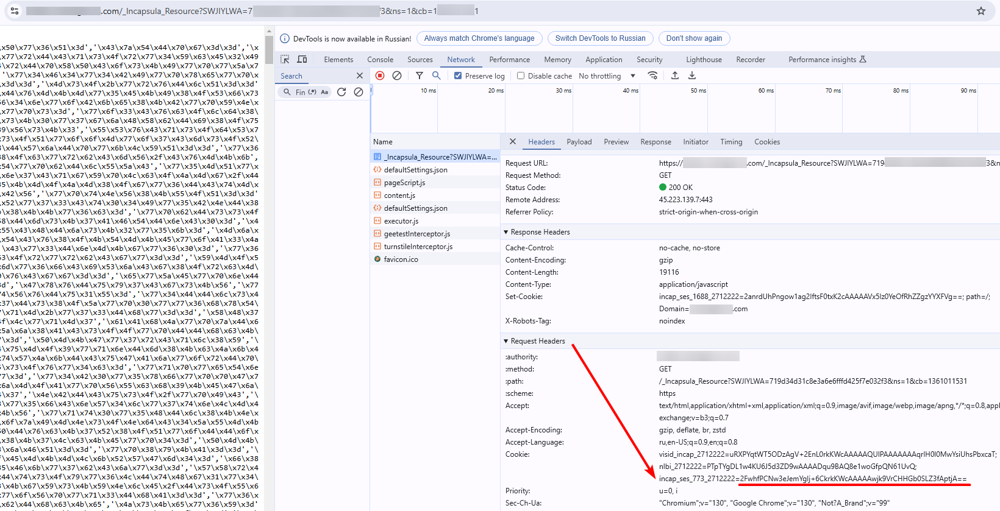
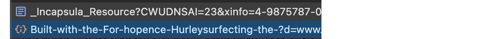

import Tabs from '@theme/Tabs';
import TabItem from '@theme/TabItem';
import ParamItem from '@theme/ParamItem';
import MethodItem from '@theme/MethodItem';
import MethodDescription from '@theme/MethodDescription'
import PriceBlock from '../../src/theme/PriceBlock';
import PriceBlockWrap from '@theme/PriceBlockWrap';
import BlogLink from '@theme/BlogLink';
import { ArticleHead } from '../../src/theme/ArticleHead';

<ArticleHead slug="captchas/incapsula" />

# Imperva (Incapsula)

<PriceBlockWrap>
  <PriceBlock title="Imperva" captchaId="imperva"/>
</PriceBlockWrap>


<BlogLink url="https://capmonster.cloud/ru/blog/news/imperva-incapsula-news"/>

:::warning **Внимание!**
* Для выполнения данной задачи используйте **ваши собственные прокси**.

* Если прокси с авторизацией по IP, то необходимо добавить адрес **65.21.190.34** в белый список.

* После решения вы получите **специальные cookie**, которые необходимо добавить в браузер.
:::


## Параметры запроса

<br />
<span style={{ fontSize: "15px", fontWeight: 700 }}>
>  ВАЖНО: значения некоторых параметров являются динамическими — они меняются при каждом рендеринге страницы с Imperva.  
> Извлекайте их непосредственно перед созданием задачи, чтобы избежать ошибок при решении.
> Примеры автоматического извлечения параметров см. в разделе [Как найти все нужные параметры для создания задачи](#как-найти-все-нужные-параметры-для-создания-задачи).
</span>
<br />

<TabItem value="proxyless" label="CustomTask (без прокси)" default className="bordered-panel">
    <ParamItem title="type" required type="string" />
    **CustomTask**

    --- 

    <ParamItem title="class" required type="string" />
    **Imperva**

    --- 

    <ParamItem title="websiteURL" required type="string" />
    Адрес основной страницы, на которой находится инкапсула.

    --- 

    <ParamItem title="incapsulaScriptUrl (внутри metadata)" required="required" type="string" />
    `"incapsulaScriptUrl": "_Incapsula_Resource?SWJIYLWA=719d34d31c8e3a6e6fffd425f7e032f3"` — название js файла инкапсулы

    --- 

    <ParamItem title="incapsulaCookies (внутри metadata)" required type="string" />
    Ваши куки от Incapsula. Можно получить на странице с помощью `document.cookie` или в заголовке запроса Set-Cookie: `"incap_sess_*=...; visid_incap_*=..."` (см. пример запроса `/createTask`)

    

    --- 

    <ParamItem title="proxyType" required type="string" />
    **http** - обычный http/https прокси;<br />
    **https** - используйте только если http не работает;<br />
    **socks4** - socks4 прокси;<br />
    **socks5** - socks5 прокси.

    --- 

    <ParamItem title="proxyAddress" required type="string" />
    <p>
      IP адрес прокси IPv4/IPv6. Не допускается:
      - использование прозрачных прокси;
      - использование прокси на локальных машинах.
    </p>

    --- 

    <ParamItem title="proxyPort" required type="integer" />
    Порт прокси.

    --- 

    <ParamItem title="proxyLogin" required type="string" />
    Логин прокси-сервера.

    --- 

    <ParamItem title="proxyPassword" required type="string" />
    Пароль прокси-сервера.

    --- 

    <ParamItem title="reese84UrlEndpoint (внутри metadata)" type="string" />
    Название эндпоинта, куда отправляется reese84 fingerprint. Можно найти среди запросов, оканчивается на `?d=site.com`

    

    --- 

    <ParamItem title="userAgent" type="string" />
    User-Agent браузера. <br />
  **Передавайте только актуальный UA от ОС Windows. Сейчас таковым является**: `userAgentPlaceholder`
  
</TabItem>

## Метод создания задачи

<TabItem value="proxyless" label="CustomTask (без прокси)" default className="method-panel">
	<MethodItem>
		```http
		https://api.capmonster.cloud/createTask
		```
	</MethodItem>
	<MethodDescription>
		**Запрос**

    ```json
    {
      "clientKey": "API_KEY",
      "task": {
        "type": "CustomTask",
        "class": "Imperva",
        "websiteURL": "https://example.com",
        "userAgent": "userAgentPlaceholder",
        "metadata": {
          "incapsulaScriptUrl": "_Incapsula_Resource?SWJIYLWA=719d34d31c8e3a6e6fffd425f7e032f3",
          "incapsulaCookies": "incap_ses_1166_2930313=br7iX33ZNCtf3HlpEXcuEDzz72cAAAAA0suDnBGrq/iA0J4oERYzjQ==; visid_incap_2930313=P3hgPVm9S8Oond1L0sXhZqfK72cAAAAAQUIPAAAAAABoMSY9xZ34RvRseJRiY6s+;",
          "reese84UrlEndpoint": "Built-with-the-For-hopence-Hurleysurfecting-the-"
        },
        "proxyType": "http",
        "proxyAddress": "8.8.8.8",
        "proxyPort": 8080,
        "proxyLogin": "proxyLoginHere",
        "proxyPassword": "proxyPasswordHere"
      }
    }
    ```

    **Ответ**

    ```json
    {
      "errorId": 0,
      "taskId": 407533072
    }
    ```

    </MethodDescription>
</TabItem>

## Метод получения результата задачи
Используйте метод [getTaskResult](../api/methods/get-task-result.mdx), чтобы получить решение Imperva.

<TabItem value="proxyless" label="CustomTask (без прокси)" default className="method-panel-full">
	<MethodItem>
		```http
		https://api.capmonster.cloud/getTaskResult
		```
	</MethodItem>
	<MethodDescription>
		**Запрос**
		```json
		{
		  "clientKey":"API_KEY",
		  "taskId": 407533072
		}
		```
		**Ответ**
```json
{
  "errorId":0,
  "status":"ready",
  "solution": {
    "domains": {
      "https://example.com": {
        "cookies": {
          "___utmvc": "NMB+nRa4inxXNeXuhPl9w4opzdo...E4OTU2OGEwNzI2ODlkODc4MWIwNmU3MQ==; Max-Age=31536000; Domain=.site.com; Path=/; Secure; SameSite=Lax"
        }
      }
    }
  }
}
```
	</MethodDescription>
</TabItem>

## Access denied

Error 16 - данная ошибка связана с применением прокси-серверов, не соответствующих требуемой геолокации.

## Как найти все нужные параметры для создания задачи

### Автоматически

Для автоматизации поиска параметров их можно извлекать через **браузер** (обычный или headless, например, с **Playwright**) или напрямую из **HTTP-запросов**. Поскольку значения динамических параметров действуют недолго, их рекомендуется использовать сразу после получения.

:::warning **Важно!**
Приведённые фрагменты кода являются базовыми примерами для ознакомления в извлечении необходимых параметров. Точная реализация будет зависеть от вашего сайта с капчей, его структуры и используемых HTML-элементов и селекторов.
:::

<Tabs className="full-width-tabs filled-tabs request-tabs">
  <TabItem value="js" label="JavaScript" default className="method-panel">
    <details>
      <summary>Показать код (Node.js)</summary>
      ```js
      import { chromium } from "playwright";

      (async () => {
        const browser = await chromium.launch({ headless: false });
        const page = await browser.newPage();

        await page.goto("https://www.example.com/");

        // Извлекаем значение атрибута src из iframe с id main-iframe
        const iframeSrc = await page.$eval("#main-iframe", (iframe) =>
          iframe.getAttribute("src")
        );
        console.log("iframe src:", iframeSrc);

        // Получаем все cookies
        const cookies = await page.context().cookies();

        // Фильтруем cookies, которые начинаются с visid_incap_ или incap_ses_
        const filteredCookies = cookies.filter(
          (cookie) =>
            cookie.name.startsWith("visid_incap_") ||
            cookie.name.startsWith("incap_ses_")
        );

        filteredCookies.forEach((cookie) => {
          console.log(`${cookie.name}=${cookie.value}`);
        });

        await browser.close();
      })();
      ```
    </details>
  </TabItem>

  <TabItem value="python" label="Python" className="method-panel">
    <details>
      <summary>Показать код</summary>
      ```python
      import asyncio
      from playwright.async_api import async_playwright

      async def main():
          async with async_playwright() as p:
              browser = await p.chromium.launch(headless=False)
              page = await browser.new_page()

              await page.goto("https://www.example.com/")

              # Извлекаем значение атрибута src из iframe с id main-iframe
              iframe_src = await page.locator("#main-iframe").get_attribute("src")
              print("iframe src:", iframe_src)  # Выводим значение src

              # Получаем все cookies
              cookies = await page.context.cookies()

              # Фильтруем cookies, которые начинаются с visid_incap_ или incap_ses_
              filtered_cookies = [
                  cookie for cookie in cookies
                  if cookie["name"].startswith("visid_incap_") or cookie["name"].startswith("incap_ses_")
              ]

              for cookie in filtered_cookies:
                  print(f"{cookie['name']}={cookie['value']}")

              await browser.close()

      asyncio.run(main())
      ```
    </details>
  </TabItem>

  <TabItem value="csharp" label="C#" className="method-panel">
    <details>
      <summary>Показать код</summary>
      ```csharp
      using System;
      using System.Linq;
      using System.Threading.Tasks;
      using Microsoft.Playwright;

      class Program
      {
          public static async Task Main(string[] args)
          {
              var playwright = await Playwright.CreateAsync();
              var browser = await playwright.Chromium.LaunchAsync(new BrowserTypeLaunchOptions { Headless = false });
              var page = await browser.NewPageAsync();

              await page.GotoAsync("https://www.example.com/");

              // Извлекаем значение атрибута src из iframe с id main-iframe
              var iframeSrc = await page.GetAttributeAsync("#main-iframe", "src");
              Console.WriteLine("iframe src: " + iframeSrc); // Выводим значение src

              // Получаем все cookies
              var cookies = await page.Context.CookiesAsync();

              // Фильтруем cookies, которые начинаются с visid_incap_ или incap_ses_
              var filteredCookies = cookies.Where(cookie =>
                  cookie.Name.StartsWith("visid_incap_") || cookie.Name.StartsWith("incap_ses_"));

              foreach (var cookie in filteredCookies)
              {
                  Console.WriteLine($"{cookie.Name}={cookie.Value}");
              }

              await browser.CloseAsync();
          }
      }
      ```
    </details>
  </TabItem>
</Tabs>

## Используйте библиотеку SDK

<Tabs className="full-width-tabs filled-tabs request-tabs" groupId="captcha-type">

  <TabItem value="js" label="JavaScript" default className="method-panel">
<details>
      <summary>Показать код (для браузера)</summary>
  ```js
  // https://github.com/ZennoLab/capmonstercloud-client-js

  import { CapMonsterCloudClientFactory, ClientOptions, ImpervaRequest } from '@zennolab_com/capmonstercloud-client';

  const API_KEY = "YOUR_API_KEY"; // Укажите ваш API-ключ CapMonster Cloud

  document.addEventListener("DOMContentLoaded", async () => {
      const cmcClient = CapMonsterCloudClientFactory.Create(
          new ClientOptions({ clientKey: API_KEY })
      );

      // При необходимости можно проверить баланс
      const balance = await cmcClient.getBalance();
      console.log("Balance:", balance);

      const proxy = {
          proxyType: "http",
          proxyAddress: "123.45.67.89",
          proxyPort: 8080,
          proxyLogin: "username",
          proxyPassword: "password"
      };

      // Настройка задачи Imperva (Incapsula)
      const impervaRequest = new ImpervaRequest({
          websiteURL: "https://example.com/", // URL вашей страницы, защищённой Imperva
          metadata: {
              incapsulaScriptUrl: "_Incapsula_Resource?SWJIYLWA=719d34d31c8e3a6e6fffd425f7e032f3",
              incapsulaCookies: "incap_ses_1166_2930313=br7iX33ZNCtf3HlpEXcuEDzz72cAAAAA0suDnBGrq/iA0J4oERYzjQ==; visid_incap_2930313=P3hgPVm9S8Oond1L0sXhZqfK72cAAAAAQUIPAAAAAABoMSY9xZ34RvRseJRiY6s+;"
          },
          proxy
      });

      const result = await cmcClient.Solve(impervaRequest);
      console.log("Solution:", result.solution);
  });
````
</details>

<details>
      <summary>Показать код (Node.js)</summary>
```JavaScript
// https://github.com/ZennoLab/capmonstercloud-client-js

import { CapMonsterCloudClientFactory, ClientOptions, ImpervaRequest } from '@zennolab_com/capmonstercloud-client';

async function main() {
    const cmcClient = CapMonsterCloudClientFactory.Create(
        new ClientOptions({ clientKey: 'YOUR_API_KEY' }) // Укажите ваш API-ключ CapMonster Cloud
    );

    // При необходимости можно проверить баланс
    const balance = await cmcClient.getBalance();
    console.log('Balance:', balance);

    const proxy = {
        proxyType: "http",
        proxyAddress: '123.45.67.89',
        proxyPort: 8080,
        proxyLogin: 'username',
        proxyPassword: 'password'
    };

    // Настройка задачи Imperva (Incapsula)
    const impervaRequest = new ImpervaRequest({
        websiteURL: 'https://example.com/', // URL вашей страницы, защищённой Imperva
        metadata: {
            incapsulaScriptUrl: '_Incapsula_Resource?SWJIYLWA=719d34d31c8e3a6e6fffd425f7e032f3',
            incapsulaCookies: 'incap_ses_1166_2930313=br7iX33ZNCtf3HlpEXcuEDzz72cAAAAA0suDnBGrq/iA0J4oERYzjQ==; visid_incap_2930313=P3hgPVm9S8Oond1L0sXhZqfK72cAAAAAQUIPAAAAAABoMSY9xZ34RvRseJRiY6s+;',
        },
        proxy,
    });

    const result = await cmcClient.Solve(impervaRequest);
    console.log('Solution:', result.solution);
}

main().catch(console.error);
```
</details>

  </TabItem>

  <TabItem value="python" label="Python" className="method-panel">
<details>
      <summary>Показать код</summary>
```python
# https://github.com/ZennoLab/capmonstercloud-client-python

import asyncio
from capmonstercloudclient import CapMonsterClient, ClientOptions
from capmonstercloudclient.requests import ImpervaCustomTaskRequest
from capmonstercloudclient.requests.baseRequestWithProxy import ProxyInfo

API_KEY = "YOUR_API_KEY"  # Укажите ваш API-ключ CapMonster Cloud

async def solve_imperva_captcha():
    client_options = ClientOptions(api_key=API_KEY)
    cap_monster_client = CapMonsterClient(options=client_options)

    # Настройка вашего собственного прокси
    proxy = ProxyInfo(
        proxyType="http",
        proxyAddress="123.45.67.89",
        proxyPort=8080,
        proxyLogin="username",
        proxyPassword="password"
    )

    # Настройка задачи Imperva (Incapsula)
    imperva_request = ImpervaCustomTaskRequest(
        websiteUrl="https://example.com",
        metadata={
            "incapsulaScriptUrl": "_Incapsula_Resource?SWJIYLWA=719d34d31c8e3a6e6fffd425f7e032f3",
            "incapsulaCookie": "incap_ses_1166_2930313=br7iX33ZNCtf3HlpEXcuEDzz72cAAAAA0suDnBGrq/iA0J4oERYzjQ==; visid_incap_2930313=P3hgPVm9S8Oond1L0sXhZqfK72cAAAAAQUIPAAAAAABoMSY9xZ34RvRseJRiY6s+;",
            "reese84UrlEndpoint": "Built-with-the-For-hopence-Hurleysurfecting-the-"
        },
        proxy=proxy
    )

    # При необходимости можно проверить баланс
    balance = await cap_monster_client.get_balance()
    print("Balance:", balance)

    result = await cap_monster_client.solve_captcha(imperva_request)
    print("Solution:", result)

asyncio.run(solve_imperva_captcha())
```
</details>
  </TabItem>

</Tabs>

