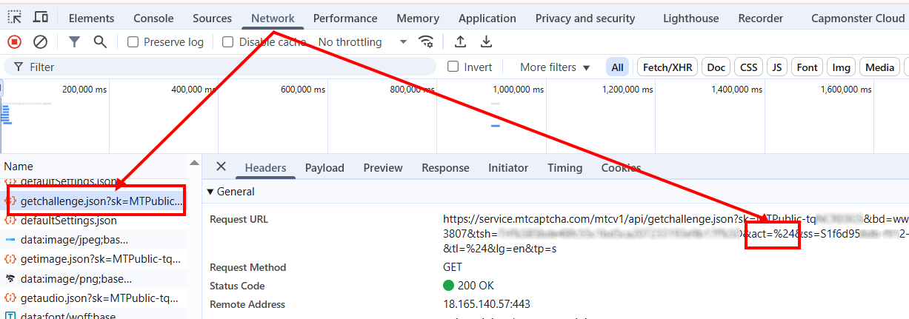

import Tabs from '@theme/Tabs';
import TabItem from '@theme/TabItem';
import ParamItem from '@theme/ParamItem';
import MethodItem from '@theme/MethodItem';
import MethodDescription from '@theme/MethodDescription'
import PriceBlock from '@theme/PriceBlock';
import PriceBlockWrap from '@theme/PriceBlockWrap';

# MTCaptcha

<PriceBlockWrap>
  <PriceBlock title="MTCaptcha task" captchaId="mtcaptcha"/>
</PriceBlockWrap>


:::warning **Внимание!**
CapMonster Cloud по умолчанию работает через встроенные прокси — они уже включены в стоимость. Указывать собственные прокси требуется только в тех случаях, когда сайт не принимает токен или доступ к встроенным сервисам ограничен. Вы можете обратиться в службу поддержки, чтобы уточнить детали и узнать, насколько корректно принимаются токены на конкретном сайте.

Если прокси с авторизацией по IP, то необходимо добавить адрес **65.21.190.34** в белый список.
:::

## Параметры запроса

<TabItem value="proxy" label="MTCaptchaTask" className="bordered-panel">
<ParamItem title="type" required type="string" />
**MTCaptchaTask**

---

<ParamItem title="websiteURL" required type="string" />
Адрес страницы, на которой решается капча.

---

<ParamItem title="websiteKey" required type="string" />
Ключ MTcaptcha, передаётся в запросе в параметрах, как `sk` (*см. пример ниже, как его найти*).

---

<ParamItem title="pageAction" type="string" />
Параметр *action* передаётся в запросе как `act` и отображается при валидации токена. Указывайте его в запросе, только если значение отличается от стандартного - **%24**.  
Пример в html:
```
<script>
var mtcaptchaConfig = {
      "sitekey": "MTPublic-abCDEFJAB",
      "action": "login"
};
</script>
```

---

<ParamItem title="isInvisible" type="bool" />
**true**, если капча невидимая, т.е. имеет скрытое поле для подтверждения. При подозрении на бота вызывается дополнительная проверка.

---

<ParamItem title="userAgent" type="string" />
User-Agent браузера. <br />
  **Передавайте только актуальный UA от ОС Windows. Сейчас таковым является**: `userAgentPlaceholder`

---

<ParamItem title="proxyType" type="string" />
**http** - обычный http/https прокси;<br />
**https** - попробуйте эту опцию только если "http" не работает (требуется для некоторых кастомных прокси);<br />
**socks4** - socks4 прокси;<br />
**socks5** - socks5 прокси.

---

<ParamItem title="proxyAddress" type="string" />
<p>
IP адрес прокси IPv4/IPv6. Не допускается:
- использование имен хостов;
- использование прозрачных прокси (там где можно видеть IP клиента);
- использование прокси на локальных машинах.
</p>

---

<ParamItem title="proxyPort" type="integer" />
Порт прокси.

---

<ParamItem title="proxyLogin" type="string" />
Логин прокси-сервера.

---

<ParamItem title="proxyPassword" type="string" />
Пароль прокси-сервера.

</TabItem>

## Метод создания задачи
<Tabs className="full-width-tabs filled-tabs request-tabs" groupId="captcha-type">
<TabItem value="proxyless" label="MTCaptchaTask (без прокси)" default className="method-panel">
<MethodItem>
```http
https://api.capmonster.cloud/createTask
```
</MethodItem>
<MethodDescription>
**Запрос**
```json
{
  "clientKey": "API_KEY",
  "task": 
  {
    "type": "MTCaptchaTask",
    "websiteURL": "https://www.example.com",
    "websiteKey": "MTPublic-abCDEFJAB",
    "isInvisible": false,
    "pageAction": "login"
  }
}
```
**Ответ**
```json
{
  "errorId":0,
  "taskId":407533077
}
```
</MethodDescription>
</TabItem>

<TabItem value="proxy" label="MTCaptchaTask (при использовании прокси)" default className="method-panel">
<MethodItem>
```http
https://api.capmonster.cloud/createTask
```
</MethodItem>
<MethodDescription>
**Запрос**
```json
{
  "clientKey": "API_KEY",
  "task": 
  {
    "type": "MTCaptchaTask",
    "websiteURL": "https://www.example.com",
    "websiteKey": "MTPublic-abCDEFJAB",
    "isInvisible": false,
    "pageAction": "login",
    "proxyType":"http",
    "proxyAddress":"8.8.8.8",
    "proxyPort":8080,
    "proxyLogin":"proxyLoginHere",
    "proxyPassword":"proxyPasswordHere"
  }
}
```
**Ответ**
```json
{
  "errorId":0,
  "taskId":407533077
}
```
</MethodDescription>
</TabItem>
</Tabs>

## Метод получения результата задачи
Используйте метод [getTaskResult](../api/methods/get-task-result.md), чтобы получить решение MTCaptcha капчи.

<TabItem value="proxyless" label="CustomTask (без прокси)" default className="method-panel-full">
<MethodItem>
```http
https://api.capmonster.cloud/getTaskResult
```
</MethodItem>
<MethodDescription>
**Запрос**
```json
{
  "clientKey": "API_KEY",
  "taskId": 407533077
}
```

**Ответ**
```json
{
  "errorId": 0,
  "errorCode": null,
  "errorDescription": null,
  "solution": {
    "token": "v1(155506dc,c8c2e356,MTPublic-abCDEFJAB,70f03532a53...5FSDA**)"
  },
  "status": "ready"
}
```
</MethodDescription>
</TabItem>

## Как найти параметры капчи

### websiteKey
Этот параметр можно найти во вкладке **Network** в *Инструментах разработчика*.  
Ищите запросы, начинающиеся, например, с `getchallenge.json` — параметр **sk** соответствует `websiteKey`.


### pageAction
В этом же запросе содержится параметр `pageAction`: нужное значение передаётся как **act**.  
По умолчанию оно равно **%24**; если значение отличается (например, *..&act=login&...*), укажите его при создании задачи.



## Используйте библиотеку SDK

<Tabs className="full-width-tabs filled-tabs request-tabs" groupId="captcha-type">

  <TabItem value="js" label="JavaScript" default className="method-panel">

  ```js
  // https://github.com/ZennoLab/capmonstercloud-client-js

  import { CapMonsterCloudClientFactory, ClientOptions, MTCaptchaRequest } from '@zennolab_com/capmonstercloud-client';

  document.addEventListener('DOMContentLoaded', async () => {
    const cmcClient = CapMonsterCloudClientFactory.Create(
      new ClientOptions({ clientKey: '<your capmonster.cloud API key>' })
    );

    console.log(await cmcClient.getBalance());

    const mtcaptchaRequest = new MTCaptchaRequest({
      websiteURL: 'https://www.example.com',     // URL страницы с капчей
      websiteKey: 'MTPublic-abCDEFJAB',          // Замените на корректное значение
      isInvisible: false,                         // "true", если капча невидимая
      pageAction: 'login',
      /*
      // Если нужно использовать прокси:
      proxy: {
        type: 'http',
        address: '127.0.0.1',
        port: 8000,
        login: 'user',
        password: 'password'
      }
      */
    });

    console.log(await cmcClient.Solve(mtcaptchaRequest));
  });
````

  </TabItem>

  <TabItem value="python" label="Python" default className="method-panel">

```python
# https://github.com/ZennoLab/capmonstercloud-client-python

import asyncio
from capmonstercloudclient import CapMonsterClient, ClientOptions
from capmonstercloudclient.requests import MTCaptchaRequest

# Ваш API-ключ от CapMonster Cloud
client_options = ClientOptions(api_key="API_KEY")
cap_monster_client = CapMonsterClient(options=client_options)

# Вариант 1: Без прокси
mtcaptcha_request = MTCaptchaRequest(
    websiteUrl="https://www.example.com", # URL страницы с капчей
    websiteKey="MTPublic-abCDEFJAB", # Замените на корректное значение
    isInvisible=False,   # "true", если капча невидимая
    pageAction="login"
)

# Вариант 2: С прокси
# Раскомментируйте, если нужно использовать прокси

# mtcaptcha_request = MTCaptchaRequest(
#     websiteUrl="https://www.example.com",
#     websiteKey="MTPublic-abCDEFJAB",
#     isInvisible=False,
#     pageAction="login",
#     proxyType="http",
#     proxyAddress="123.45.67.89",
#     proxyPort=8000,
#     proxyLogin="proxyUser",
#     proxyPassword="proxyPass"
# )

async def solve_captcha():
    return await cap_monster_client.solve_captcha(mtcaptcha_request)

responses = asyncio.run(solve_captcha())
print(responses)
```

  </TabItem>

  <TabItem value="csharp" label="C#" className="method-panel">

```csharp
// https://github.com/ZennoLab/capmonstercloud-client-dotnet

using System;
using System.Threading.Tasks;
using Zennolab.CapMonsterCloud;
using Zennolab.CapMonsterCloud.Requests;

class Program
{
    static async Task Main(string[] args)
    {
        // Ваш API-ключ от CapMonster Cloud
        var clientOptions = new ClientOptions
        {
            ClientKey = "your_api_key"
        };

        var cmCloudClient = CapMonsterCloudClientFactory.Create(clientOptions);

        // Вариант 1: MTCaptcha без прокси
        var mtcaptchaRequest = new MTCaptchaTaskRequest
        {
            WebsiteUrl = "https://www.example.com", // URL страницы с капчей
            WebsiteKey = "MTPublic-tqNCRE0GS", // Замените на корректное значение
            Invisible = false,  // "true", если капча невидимая
            PageAction = "login",
            UserAgent = "userAgentPlaceholder" // Используйте актуальный UserAgent
        };

        // Вариант 2: MTCaptcha с прокси
        // Раскомментируйте, если нужно использовать прокси
        /*
        var mtcaptchaRequest = new MTCaptchaTaskRequest
        {
            WebsiteUrl = "https://www.example.com",
            WebsiteKey = "MTPublic-tqNCRE0GS",
            Invisible = false,
            PageAction = "login",
            UserAgent = "userAgentPlaceholder",

            Proxy = new ProxyContainer(
                "123.45.67.89",
                8080,
                ProxyType.Http,
                "proxyLogin",
                "proxyPassword"
            )
        };
        */

        var mtcaptchaResult = await cmCloudClient.SolveAsync(mtcaptchaRequest);

        Console.WriteLine("MTCaptcha Solution: " + mtcaptchaResult.Solution.Value);
    }
}
```

  </TabItem>

</Tabs>
