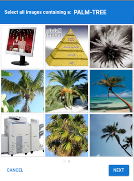

import Tabs from '@theme/Tabs';
import TabItem from '@theme/TabItem';
import ParamItem from '@theme/ParamItem';
import MethodItem from '@theme/MethodItem';
import MethodDescription from '@theme/MethodDescription'
import PriceBlock from '../../src/theme/PriceBlock';
import PriceBlockWrap from '@theme/PriceBlockWrap';
import { ArticleHead } from '../../src/theme/ArticleHead';

<ArticleHead slug="captchas/prosopo-task" />

# Prosopo Procaptcha

<PriceBlockWrap>
  <PriceBlock title="Prosopo captcha" captchaId="prosopo"/>
</PriceBlockWrap>



:::warning **Внимание!**
CapMonster Cloud по умолчанию работает через встроенные прокси — они уже включены в стоимость. Указывать собственные прокси требуется только в тех случаях, когда сайт не принимает токен или доступ к встроенным сервисам ограничен.

Если прокси с авторизацией по IP, то необходимо добавить адрес **65.21.190.34** в белый список.
:::

Основанный на токенах метод автоматического решения капчи Prosopo Procaptcha.

## Параметры запроса

  <TabItem value="proxy" label="ProsopoTask (при использовании прокси)" className="bordered-panel">
    <ParamItem title="type" required type="string" />
    **ProsopoTask**

    ---

    <ParamItem title="websiteURL" required type="string" />
    Полный URL страницы с капчей.

    ---

    <ParamItem title="websiteKey" required type="string" />
    Значение параметра siteKey, найденное на странице.
	
    ---

    <ParamItem title="proxyType" type="string" />
    **http** - обычный http/https прокси;<br />
	**https** - попробуйте эту опцию только если "http" не работает (требуется для некоторых кастомных прокси);<br />
	**socks4** - socks4 прокси;<br />
	**socks5** - socks5 прокси.

    ---

    <ParamItem title="proxyAddress" type="string" />
    <p>
      IP адрес прокси IPv4/IPv6. Не допускается:
		- использование прозрачных прокси (там где можно видеть IP клиента);
		- использование прокси на локальных машинах.
    </p>

    ---

    <ParamItem title="proxyPort" type="integer" />
    Порт прокси.

    ---

    <ParamItem title="proxyLogin" type="string" />
    Логин прокси-сервера.

    ---

    <ParamItem title="proxyPassword" type="string" />
    Пароль прокси-сервера.

  </TabItem>


## Метод создания задачи
<Tabs className="full-width-tabs filled-tabs request-tabs" groupId="captcha-type">
  <TabItem value="proxyless" label="ProsopoTask (без прокси)" default className="method-panel">
	<MethodItem>
		```http
		https://api.capmonster.cloud/createTask
		```
	</MethodItem>
	<MethodDescription>
		**Запрос**
		```json
		{
			"clientKey": "API_KEY",
			"task": 
			{
				"type": "ProsopoTask",
				"websiteURL": "https://www.example.com",
				"websiteKey": "5EZU3LG31uzq1Mwi8inwqxmfvFDpj7VzwDnZwj4Q3syyxBwV"
			}
		}
		```
		**Ответ**
		```json
		{
			"errorId":0,
			"taskId":407533077
		}
		```
	</MethodDescription>
  </TabItem>
  
  <TabItem value="proxy" label="ProsopoTask (при использовании прокси)" default className="method-panel">
	<MethodItem>
		```http
		https://api.capmonster.cloud/createTask
		```
	</MethodItem>
	<MethodDescription>
		**Запрос**
		```json
		{
			"clientKey": "API_KEY",
			"task": 
			{
				"type": "ProsopoTask",
				"websiteURL": "https://www.example.com",
				"websiteKey": "5EZU3LG31uzq1Mwi8inwqxmfvFDpj7VzwDnZwj4Q3syyxBwV",
				"proxyType":"http",
				"proxyAddress":"8.8.8.8",
				"proxyPort":8080,
				"proxyLogin":"proxyLoginHere",
				"proxyPassword":"proxyPasswordHere"
			}
		}
		```
		**Ответ**
		```json
		{
			"errorId":0,
			"taskId":407533077
		}
		```
	</MethodDescription>
  </TabItem>
</Tabs>


## Метод получения результата задачи
Используйте метод [getTaskResult](../api/methods/get-task-result.mdx), чтобы получить решение Prosopo капчи.

<TabItem value="proxyless" label="CustomTask (без прокси)" default className="method-panel-full">
	<MethodItem>
		```http
		https://api.capmonster.cloud/getTaskResult
		```
	</MethodItem>
	<MethodDescription>
		**Запрос**
		```json
		{
			"clientKey":"API_KEY",
			"taskId": 407533077
		}
		```
		**Ответ**
		```json
		{
			"errorId":0,
			"status":"ready",
			"solution": 
			{
				"token": "0x00016c68747470733a2f2f70726f6e6f6465332e70726f736f706f2e696fc0354550516f4d5a454463354c704e376774784d4d7a5950547a4136..."
			}
		}
		```
	</MethodDescription>
</TabItem>

## Как найти websiteKey

1. Откройте сайт, где срабатывает Prosopo-капча.

2. Перейдите в **Инструменты разработчика** (**DevTools**) → **Network**, перезагрузите страницу и найдите запрос, в котором загружается `image`(например, API-запрос `https://example.prosopo.io/v1/prosopo/provider/client/captcha/image`).

3. В **Request Headers** найдите параметр `Prosopo-Site-Key`, скопируйте его значение и используйте при создании запроса.


## Используйте библиотеку SDK

<Tabs className="full-width-tabs filled-tabs request-tabs" groupId="captcha-type">

  <TabItem value="js" label="JavaScript" default className="method-panel">
<details>
      <summary>Показать код (для браузера)</summary>
  ```js
  // https://github.com/ZennoLab/capmonstercloud-client-js

  import { CapMonsterCloudClientFactory, ClientOptions, ProsopoRequest } from '@zennolab_com/capmonstercloud-client';

  const API_KEY = "YOUR_API_KEY"; // Укажите ваш API-ключ CapMonster Cloud

  document.addEventListener("DOMContentLoaded", async () => {
      const client = CapMonsterCloudClientFactory.Create(
          new ClientOptions({ clientKey: API_KEY })
      );

      // Базовый пример без прокси
      // CapMonster Cloud автоматически использует свои прокси
      let prosopoRequest = new ProsopoRequest({
          websiteURL: "https://www.example.com",       // URL страницы с ProCaptcha
          websiteKey: "5EZU3LG31uzq1Mwi8inwqxmfvFDpj7VzwDnZwj4Q3syyxBwV" // Ваш ProCaptcha sitekey
      });

      // Пример использования вашего собственного прокси
      // Раскомментируйте данный блок, если вы хотите использовать собственный прокси
      /*
      const proxy = {
          proxyType: "http",
          proxyAddress: "123.45.67.89",
          proxyPort: 8000,
          proxyLogin: "username",
          proxyPassword: "password"
      };

      prosopoRequest = new ProsopoRequest({
          websiteURL: "https://www.example.com",      
          websiteKey: "5EZU3LG31uzq1Mwi8inwqxmfvFDpj7VzwDnZwj4Q3syyxBwV",
          proxy,
          userAgent: "userAgentPlaceholder"
      });
      */

      // При необходимости можно проверить баланс
      const balance = await client.getBalance();
      console.log("Balance:", balance);

      const result = await client.Solve(prosopoRequest);
      console.log("Solution:", result);
  });
````
</details>

<details>
      <summary>Показать код (Node.js)</summary>
      ```JavaScript
      // https://github.com/ZennoLab/capmonstercloud-client-js

      import { CapMonsterCloudClientFactory, ClientOptions, ProsopoRequest } from '@zennolab_com/capmonstercloud-client';

      const API_KEY = "YOUR_API_KEY"; // Укажите ваш API-ключ CapMonster Cloud

      async function solveProCaptcha() {
          const client = CapMonsterCloudClientFactory.Create(
              new ClientOptions({ clientKey: API_KEY })
          );

          // Базовый пример без прокси
          // CapMonster Cloud автоматически использует свои прокси
          let prosopoRequest = new ProsopoRequest({
              websiteURL: "https://www.example.com",       // URL страницы с ProCaptcha
              websiteKey: "5EZU3LG31uzq1Mwi8inwqxmfvFDpj7VzwDnZwj4Q3syyxBwV" // Ваш ProCaptcha sitekey
          });

          // Пример использования вашего собственного прокси
          // Раскомментируйте данный блок, если вы хотите использовать собственный прокси
          /*
          const proxy = {
              proxyType: "http",
              proxyAddress: "123.45.67.89",
              proxyPort: 8000,
              proxyLogin: "username",
              proxyPassword: "password"
          };

          prosopoRequest = new ProsopoRequest({
              websiteURL: "https://www.example.com",      
              websiteKey: "5EZU3LG31uzq1Mwi8inwqxmfvFDpj7VzwDnZwj4Q3syyxBwV",
              proxy,
              userAgent: "userAgentPlaceholder"
          });
          */

          // При необходимости можно проверить баланс
          const balance = await client.getBalance();
          console.log("Balance:", balance);

          const result = await client.Solve(prosopoRequest);
          console.log("Solution:", result);
      }

      solveProCaptcha().catch(console.error);
```
</details>
  </TabItem>

  <TabItem value="python" label="Python" default className="method-panel">
<details>
      <summary>Показать код</summary>

```python
# https://github.com/ZennoLab/capmonstercloud-client-python

import asyncio
from capmonstercloudclient import CapMonsterClient, ClientOptions
from capmonstercloudclient.requests import ProsopoTaskRequest
# from capmonstercloudclient.requests.baseRequestWithProxy import ProxyInfo  # Раскомментируйте, если планируете использовать прокси

API_KEY = "YOUR_API_KEY"  # Укажите ваш API-ключ CapMonster Cloud

async def solve_prosopo_captcha():
    client_options = ClientOptions(api_key=API_KEY)
    cap_monster_client = CapMonsterClient(options=client_options)

    # Базовый пример без прокси
    # CapMonster Cloud автоматически использует свои прокси
    prosopo_request = ProsopoTaskRequest(
        websiteUrl="https://www.example.com",  
        websiteKey="5EZU3LG31uzq1Mwi8inwqxmfvFDpj7VzwDnZwj4Q3syyxBwV"
    )

    # Пример использования вашего собственного прокси
    # Раскомментируйте данный блок, если вы хотите использовать собственный прокси
    # proxy = ProxyInfo(
    #     proxyType="http",
    #     proxyAddress="123.45.67.89",
    #     proxyPort=8080,
    #     proxyLogin="username",
    #     proxyPassword="password”
    # )
    #
    # prosopo_request = ProsopoTaskRequest(
    #     websiteUrl="https://www.example.com",
    #     websiteKey="5EZU3LG31uzq1Mwi8inwqxmfvFDpj7VzwDnZwj4Q3syyxBwV",
    #     proxy=proxy
    # )

    # При необходимости можно проверить баланс
    balance = await cap_monster_client.get_balance()
    print("Balance:", balance)

    result = await cap_monster_client.solve_captcha(prosopo_request)
    print("Solution:", result)

asyncio.run(solve_prosopo_captcha())
```
</details>
  </TabItem>

  <TabItem value="csharp" label="C#" className="method-panel">
<details>
      <summary>Показать код</summary>

```csharp
// https://github.com/ZennoLab/capmonstercloud-client-dotnet

using System;
using System.Threading.Tasks;
using Zennolab.CapMonsterCloud;
using Zennolab.CapMonsterCloud.Requests;

class Program
{
    static async Task Main(string[] args)
    {
        // Ваш API-ключ от CapMonster Cloud
        var clientOptions = new ClientOptions
        {
            ClientKey = "YOUR_API_KEY"
        };

        var cmCloudClient = CapMonsterCloudClientFactory.Create(clientOptions);

        // Базовый пример без прокси
        // CapMonster Cloud автоматически использует свои прокси
        var prosopoRequest = new ProsopoTaskRequest
        {
            WebsiteUrl = "https://www.example.com",      // URL страницы с ProCaptcha
            WebsiteKey = "5DCKg3w9AvDW92uBzRWrvTiWsu573bTzYmFny8EkXQZxsBib", // Ваш ProCaptcha sitekey

            UserAgent = "userAgentPlaceholder"
        };

        // Пример использования вашего собственного прокси
        // Раскомментируйте данный блок, если вы хотите использовать собственный прокси
        /*
        prosopoRequest = new ProsopoTaskRequest
        {
            WebsiteUrl = "https://www.example.com",
            WebsiteKey = "5DCKg3w9AvDW92uBzRWrvTiWsu573bTzYmFny8EkXQZxsBib",
            UserAgent = "userAgentPlaceholder",

            Proxy = new ProxyContainer(
                "123.45.67.89",   
                8080,             
                ProxyType.Http,  
                "username", 
                "password"
            )
        };
        */

        // При необходимости можно проверить баланс
        var balance = await cmCloudClient.GetBalanceAsync();
        Console.WriteLine("Balance: " + balance);

        var prosopoResult = await cmCloudClient.SolveAsync(prosopoRequest);

        Console.WriteLine("ProCaptcha Solution: " + prosopoResult.Solution.Value);
    }
}
```
</details>
  </TabItem>

</Tabs>
