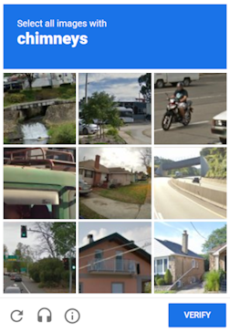

import Tabs from '@theme/Tabs';
import TabItem from '@theme/TabItem';
import ParamItem from '@theme/ParamItem';
import MethodItem from '@theme/MethodItem';
import MethodDescription from '@theme/MethodDescription'
import PriceBlock from '../../src/theme/PriceBlock';
import PriceBlockWrap from '@theme/PriceBlockWrap';
import BlogLink from '@theme/BlogLink';


# RecaptchaV2EnterpriseTask

<PriceBlockWrap>
  <PriceBlock  captchaId="rc2e"/>
  <PriceBlock  captchaId="rc2e-spotify-yahoo"/>
</PriceBlockWrap>

  

:::warning **Внимание!**
CapMonster Cloud по умолчанию работает через встроенные прокси — они уже включены в стоимость. Указывать собственные прокси требуется только в тех случаях, когда сайт не принимает токен или доступ к встроенным сервисам ограничен.

Если прокси с авторизацией по IP, то необходимо добавить адрес **65.21.190.34** в белый список.
:::

Объект содержит данные о задаче на решение ReCaptcha2 от Google версии Enterprise. Для обеспечения универсальности решения этого вида капчи нам необходимо использовать все данные, которые вы используете во время автоматизации заполнения формы на целевом сайте, включая прокси, UserAgent браузера и cookies. Это позволит избежать любых проблем при изменении Google кода своей капчи.

Этот тип капчи не имеет визуальных отличий от ReCaptcha v.2, увидеть разницу можно с помощью кода капчи, например, в инструментах разработчика во вкладке **Сеть** в запросах: 

URL Запроса (anchor): `https://www.google.com/recaptcha/enterprise/anchor?ar=1&k=6Lf26sUnAAAAAIKLuWNYgRsFUfmI-3Lex3xT5N-s&co=aHR0cHM6Ly8yY2FwdGNoYS5jb206NDQz&hl=en&v=1kRDYC3bfA-o6-tsWzIBvp7k&size=normal&cb=43r1q2d3mx66`

Капча может решаться довольно долго по сравнению с обычной капчей, но это компенсируется тем, что полученный `g-recaptcha-response` действует еще 60 секунд после решения капчи.

<BlogLink url="https://capmonster.cloud/ru/blog/re-1/recaptcha-enterprise-how-to-solve-complete-guide"/>

## Параметры запроса
  
  <TabItem value="proxy" label="RecaptchaV2EnterpriseTask (при использовании прокси)" className="bordered-panel">
    <ParamItem title="type" required type="string" />
    **RecaptchaV2EnterpriseTask**

    ---

    <ParamItem title="websiteURL" required type="string" />
    Адрес страницы, на которой решается капча.

    ---

    <ParamItem title="websiteKey" required type="string" />
    Ключ-идентификатор reCAPTCHA на целевой странице.
	<br />`<div class="g-recaptcha" data-sitekey="THIS_ONE"></div>`
	<br/>или `<iframe title="reCAPTCHA" src="...;k=6LdIFr0ZAAAAAO3vz0O0OQrtAefzdJcWQM2TMYQH&amp;...` , где `6LdIFr0ZAAAAAO3vz0O0OQrtAefzdJcWQM2TMYQH` - `websiteKey`

    ---

    <ParamItem title="enterprisePayload" type="string" />
    Некоторые реализации виджета reCAPTCHA Enterprise могут содержать дополнительное поле s в структуре, которая передаётся в метод grecaptcha.enterprise.render вместе с sitekey. Например: `2JvUXHNTnZl1Jb6WEvbDyB...ugQA` из `<pre lang="js" ><code>grecaptcha.enterprise.render("some-div-id", {
	sitekey: "6Lc_aCMTAAAAABx7u2N0D1XnVbI_v6ZdbM6rYf16" 
	theme: "dark" 
	s: "2JvUXHNTnZl1Jb6WEvbDyB...ugQA" 
	});</code></pre>`

    ---

    <ParamItem title="apiDomain" type="string" />
    <p>Адрес домена с которого загружать reCAPTCHA Enterprise. Например: 
	<br/>- [www.google.com](http://www.google.com) 
	<br />- [www.recaptcha.net](http://www.recaptcha.net)</p>
	<p>Не используйте параметр, если не знаете зачем он нужен.</p>

    ---

    <ParamItem title="userAgent" type="string" />
    User-Agent браузера, используемый в эмуляции. Необходимо использовать подпись современного браузера, иначе Google будет возвращать ошибку, требуя обновить браузер.

    ---

    <ParamItem title="cookies" type="string" />
    <p>Дополнительные cookies которые мы должны использовать во время взаимодействия с целевой страницей. <br />**Формат**: cookiename1=cookievalue1; cookiename2=cookievalue2</p>

    ---

    <ParamItem title="proxyType" type="string" />
    **http** - обычный http/https прокси;
	<br />**https** - попробуйте эту опцию только если "http" не работает (требуется для некоторых кастомных прокси);
	<br />**socks4** - socks4 прокси;
	<br />**socks5** - socks5 прокси.

    ---

    <ParamItem title="proxyAddress" type="string" />
    <p>
      IP адрес прокси IPv4/IPv6. Не допускается:
		- использование прозрачных прокси (там где можно видеть IP клиента);
		- использование прокси на локальных машинах.
    </p>

    ---

    <ParamItem title="proxyPort" type="integer" />
    Порт прокси.

    ---

    <ParamItem title="proxyLogin" type="string" />
    Логин прокси-сервера.

    ---

    <ParamItem title="proxyPassword" type="string" />
    Пароль прокси-сервера.

  </TabItem>  

<br />
Для `enterprisePayload` - необходимо заменять функцию `grecaptcha.enterprise.render` перед её вызовом на свою и забирать значение из её параметров. Функция существует после загрузки скрипта, а рендерится капча обычно сразу или по событию страницы, если капча отрендерится с текущим полем `s` на клиенте, то токен с большой вероятностью принят не будет. Оригинальную функцию можно вызывать без поля `s`.

`apiDomain` – это домен, на котором размещается API-интерфейс для взаимодействия с reCAPTCHA, используется для верификации прохождения капчи пользователем.

<details>
    <summary>Скрипт</summary>

```js
var __test_grc = undefined;

var __test_enterprise = undefined;

var __test_render = undefined;

var __test_render_widget = undefined;

var __test_render_args = undefined; // здесь будет лежать объект, с которым вызывается render.

var __test_handler = {
  get: function(target, name, receiver) {
    if (name == 'enterprise') {
      return __test_enterprise ? __test_enterprise : (__test_enterprise = new Proxy(target[name], __test_handler));
    } else if (name == 'render') {
      __test_render = target[name];
      return (function(a, b) {
        __test_render_args = b;
        __test_render_widget = a;
        return __test_render(a, {sitekey: b.sitekey}); });
    } else {
      return target[name];
    }
  }
};

Object.defineProperty(window, 'grecaptcha', {
  enumerable: true,
  configurable: false,
  get: function() {
    return __test_grc;
  },
  set: function(value) {
    __test_grc = new Proxy(value, __test_handler);
  }
});
```
</details>

## Метод создания задачи

<Tabs className="full-width-tabs filled-tabs request-tabs" groupId="captcha-type">
	<TabItem value="proxyless" label="RecaptchaV2EnterpriseTask (без прокси)" default className="method-panel">
		<MethodItem>
			```http
			https://api.capmonster.cloud/createTask
			```
		</MethodItem>
		<MethodDescription>
			**Запрос**
			```json
			{
			  "clientKey":"API_KEY",
			  "task": {
				"type":"RecaptchaV2EnterpriseTask",
				"websiteURL":"https://mydomain.com/page-with-recaptcha-enterprise",
				"websiteKey":"6Lcg7CMUAAAAANphynKgn9YAgA4tQ2KI_iqRyTwd",
				"enterprisePayload": {
				  "s": "SOME_ADDITIONAL_TOKEN"
				}
			  }
			}
			```
			**Ответ**
			```json
			{
			  "errorId":0,
			  "taskId":407533072
			}
			```
		</MethodDescription>
	</TabItem>

	<TabItem value="proxy" label="RecaptchaV2EnterpriseTask (при использовании прокси)" className="method-panel">
		<MethodItem>
			```http
			https://api.capmonster.cloud/createTask
			```
		</MethodItem>
		<MethodDescription>
			**Запрос**
			```json
			{
			  "clientKey":"API_KEY",
			  "task": {
				"type":"RecaptchaV2EnterpriseTask",
				"websiteURL":"https://mydomain.com/page-with-recaptcha-enterprise",
				"websiteKey":"6Lcg7CMUAAAAANphynKgn9YAgA4tQ2KI_iqRyTwd",
				"enterprisePayload": {
				  "s": "SOME_ADDITIONAL_TOKEN"
				},
				"proxyType":"http",
				"proxyAddress":"8.8.8.8",
				"proxyPort":8080,
				"proxyLogin":"proxyLoginHere",
				"proxyPassword":"proxyPasswordHere",
				"userAgent":"userAgentPlaceholder"
			  }
			}
			```
			**Ответ**
			```json
			{
			  "errorId":0,
			  "taskId":407533072
			}
			```
		</MethodDescription>
	</TabItem> 
</Tabs>


## Метод получения результата задачи
Используйте метод [getTaskResult](../api/methods/get-task-result.md) чтобы получить решение ReCaptcha2. В зависимости от загрузки системы вы получите ответ через время в диапазоне от 10 с до 80 с.

<TabItem value="proxyless" label="RecaptchaV2EnterpriseTask (без прокси)" default className="method-panel-full">
	<MethodItem>
		```http
		https://api.capmonster.cloud/getTaskResult
		```
	</MethodItem>
	<MethodDescription>
		**Запрос**
		```json
		{
		  "clientKey":"API_KEY",
		  "taskId": 407533072
		}
		```
		**Ответ**
		```json
		{
		  "errorId":0,
		  "status":"ready",
		  "solution": {
			"gRecaptchaResponse":"3AHJ_VuvYIBNBW5yyv0zRYJ75VkOKvhKj9_xGBJKnQimF72rfoq3Iy-DyGHMwLAo6a3"
		  }
		}
		```
	</MethodDescription>
</TabItem>

<br />

|**Свойство**|**Тип**|**Описание**|
| :- | :- | :- |
|gRecaptchaResponse|String|Хеш который необходимо подставить в форму с reCAPTCHA Enterprise в `<textarea id="g-recaptcha-response" ..></textarea>`. Имеет длину от 500 до 2190 байт.|

## Как найти все нужные параметры для создания задачи на решение

### Вручную

1. Откройте ваш сайт, где отображается капча, в браузере.
2. Правой кнопкой кликните по элементу капчи и выберите **Inspect**.

#### websiteKey

Публичный ключ сайта (sitekey). Найти websiteKey можно в **Элементах**:


Или в **Запросах**:


### Автоматически

Удобный способ автоматизировать поиск всех необходимых параметров.
Некоторые параметры генерируются заново при каждой загрузке страницы, поэтому для их извлечения потребуется работать через браузер – обычный или в режиме headless (например, с помощью **Playwright**).
Так как значения динамических параметров хранятся недолго, капчу нужно решать сразу после их получения.

:::warning **Важно!**
Приведённые фрагменты кода являются базовыми примерами для ознакомления в извлечении необходимых параметров. Точная реализация будет зависеть от вашего сайта с капчей, его структуры и используемых HTML-элементов и селекторов.
:::

<Tabs className="full-width-tabs filled-tabs request-tabs">
  <TabItem value="js" label="JavaScript" default className="method-panel">
    <details>
      <summary>Показать код (в браузере)</summary>

      ```js
      (() => {
        const payload = {};
        let sitekey = null;

        document.querySelectorAll('.g-recaptcha').forEach(div => {
          if (div.dataset.sitekey) sitekey = div.dataset.sitekey;

          for (const [key, value] of Object.entries(div.dataset)) {
            if (key !== 'sitekey') {
              payload[key] = value;
            }
          }
        });

        const scriptTags = Array.from(document.querySelectorAll("script:not([src])"));
        const regex = /grecaptcha\.enterprise\.render\([^,]+,\s*\{(.*?)\}/s;

        scriptTags.forEach(tag => {
          const match = regex.exec(tag.textContent);
          if (match) {
            const obj = match[1];
            const paramRegex = /(\w+)\s*:\s*['"]([^'"]+)['"]/g;
            let p;
            while ((p = paramRegex.exec(obj)) !== null) {
              const key = p[1];
              const val = p[2];
              if (key === "sitekey") sitekey = val;
              else payload[key] = val;
            }
          }
        });

        console.log("sitekey:", sitekey);
        console.log("enterprisePayload:", payload);
      })();
      ```
    </details>

    <details>
      <summary>Показать код (Node.js)</summary>

      ```js
      import { chromium } from 'playwright';

      (async () => {
        const browser = await chromium.launch({ headless: false });
        const context = await browser.newContext();
        const page = await context.newPage();

        let sitekey = null;
        const enterprisePayload = {};

        const targetUrl = 'https://example.com';
        await page.goto(targetUrl, { timeout: 60000 });
        await page.waitForTimeout(3000);

        const recaptchaDivs = await page.$$('.g-recaptcha');
        for (const div of recaptchaDivs) {
          const attrs = ['data-sitekey', 'data-s', 'data-cdata', 'data-type', 'data-context'];
          for (const attr of attrs) {
            const val = await div.getAttribute(attr);
            if (val) {
              const key = attr.replace('data-', '');
              if (key === 'sitekey') {
                sitekey = val;
              } else {
                enterprisePayload[key] = val;
              }
            }
          }
        }

        const inlineScripts = await page.$$eval("script:not([src])", (scripts) =>
          scripts.map((s) => s.textContent)
        );

        const pattern = /grecaptcha\.enterprise\.render\([^,]+,\s*\{(.*?)\}/s;

        for (const script of inlineScripts) {
          const match = script.match(pattern);
          if (match) {
            const obj = match[1];
            const keyValuePattern = /(\w+)\s*:\s*['"]([^'"]+)['"]/g;
            let keyValueMatch;
            while ((keyValueMatch = keyValuePattern.exec(obj)) !== null) {
              const key = keyValueMatch[1];
              const val = keyValueMatch[2];
              if (key === 'sitekey') {
                sitekey = val;
              } else {
                enterprisePayload[key] = val;
              }
            }
            break;
          }
        }

        console.log(`sitekey: ${sitekey}`);
        console.log("enterprisePayload:");
        for (const [key, value] of Object.entries(enterprisePayload)) {
          console.log(`  ${key}: ${value}`);
        }

        await browser.close();
      })();
      ```
    </details>
  </TabItem>

  <TabItem value="python" label="Python" className="method-panel">
    <details>
      <summary>Показать код</summary>

      ```python
      import asyncio
      import re
      from playwright.async_api import async_playwright

      async def extract_recaptcha_v2_enterprise(url):
          async with async_playwright() as p:
              browser = await p.chromium.launch(headless=False)
              context = await browser.new_context()
              page = await context.new_page()

              sitekey = None
              enterprise_payload = {}

              await page.goto(url, timeout=60000)
              await page.wait_for_timeout(3000)

              recaptcha_divs = await page.query_selector_all(".g-recaptcha")
              for div in recaptcha_divs:
                  attrs = ["data-sitekey", "data-s", "data-cdata", "data-type", "data-context"]
                  for attr in attrs:
                      val = await div.get_attribute(attr)
                      if val:
                          key = attr.replace("data-", "")
                          if key == "sitekey":
                              sitekey = val
                          else:
                              enterprise_payload[key] = val

              inline_scripts = await page.locator("script:not([src])").all_text_contents()
              pattern = re.compile(r"grecaptcha\.enterprise\.render\([^,]+,\s*\{(.*?)\}", re.DOTALL)

              for script in inline_scripts:
                  match = pattern.search(script)
                  if match:
                      obj = match.group(1)
                      for pair in re.finditer(r"(\w+)\s*:\s*['\"]([^'\"]+)['\"]", obj):
                          key = pair.group(1)
                          val = pair.group(2)
                          if key == "sitekey":
                              sitekey = val
                          else:
                              enterprise_payload[key] = val
                      break

              await browser.close()

              print(f"sitekey: {sitekey}")
              print("enterprisePayload:")
              for k, v in enterprise_payload.items():
                  print(f"  {k}: {v}")

      asyncio.run(extract_recaptcha_v2_enterprise("https://example.com"))
      ```
    </details>
  </TabItem>

  <TabItem value="csharp" label="C#" className="method-panel">
    <details>
      <summary>Показать код</summary>

      ```csharp
      using System;
      using System.Text.RegularExpressions;
      using System.Threading.Tasks;
      using Microsoft.Playwright;
      using System.Collections.Generic;

      class Program
      {
          public static async Task Main(string[] args)
          {
              await ExtractRecaptchaV2Enterprise("https://example.com");
          }

          public static async Task ExtractRecaptchaV2Enterprise(string url)
          {
              using var playwright = await Playwright.CreateAsync();
              var browser = await playwright.Chromium.LaunchAsync(new BrowserTypeLaunchOptions { Headless = false });
              var context = await browser.NewContextAsync();
              var page = await context.NewPageAsync();

              string sitekey = null;
              var enterprisePayload = new Dictionary<string, string>();

              await page.GotoAsync(url, new PageGotoOptions { Timeout = 60000 });
              await page.WaitForTimeoutAsync(3000);

              var recaptchaDivs = await page.QuerySelectorAllAsync(".g-recaptcha");

              foreach (var div in recaptchaDivs)
              {
                  var sitekeyAttr = await div.GetAttributeAsync("data-sitekey");
                  if (!string.IsNullOrEmpty(sitekeyAttr))
                      sitekey = sitekeyAttr;

                  var attributes = new[] { "data-s", "data-cdata", "data-type", "data-context" };
                  foreach (var attr in attributes)
                  {
                      var value = await div.GetAttributeAsync(attr);
                      if (!string.IsNullOrEmpty(value))
                      {
                          enterprisePayload[attr.Replace("data-", "")] = value;
                      }
                  }
              }

              var scripts = await page.Locator("script:not([src])").AllTextContentsAsync();
              var pattern = new Regex(@"grecaptcha\.enterprise\.render\([^,]+,\s*\{(.*?)\}", 
              RegexOptions.Singleline);

              foreach (var script in scripts)
              {
                  var match = pattern.Match(script);
                  if (match.Success)
                  {
                      var obj = match.Groups[1].Value;

                      var keyMatches = Regex.Matches(obj, @"(\w+)\s*:\s*['""]([^'""]+)['""]");
                      foreach (Match m in keyMatches)
                      {
                          var key = m.Groups[1].Value.Trim();
                          var val = m.Groups[2].Value.Trim();

                          if (key == "sitekey")
                              sitekey = val;
                          else
                              enterprisePayload[key] = val;
                      }
                      break;
                  }
              }

              Console.WriteLine($"Sitekey: {sitekey}");
              Console.WriteLine("Enterprise Payload:");
              foreach (var kv in enterprisePayload)
              {
                  Console.WriteLine($"  {kv.Key}: {kv.Value}");
              }

              await browser.CloseAsync();
          }
      }
      ```
    </details>
  </TabItem>
</Tabs>

## Используйте библиотеку SDK

<Tabs className="full-width-tabs filled-tabs request-tabs" groupId="captcha-type">

  <TabItem value="js" label="JavaScript" default className="method-panel">
    ```js
    // https://github.com/ZennoLab/capmonstercloud-client-js

    import { CapMonsterCloudClientFactory, ClientOptions, RecaptchaV2EnterpriseRequest } from '@zennolab_com/capmonstercloud-client';

    document.addEventListener('DOMContentLoaded', async () => {
      const cmcClient = CapMonsterCloudClientFactory.Create(new ClientOptions({ clientKey: '<your capmonster.cloud API key>' }));
      console.log(await cmcClient.getBalance());

      // Вариант 1: Без прокси

      const recaptchaV2EnterpriseRequest = new RecaptchaV2EnterpriseRequest({
        websiteURL: 'https://mydomain.com/page-with-recaptcha-enterprise', // URL страницы с капчей
        websiteKey: '6Lcg7CMUAAAAANphynKgn9YAgA4tQ2KI_iqRyTwd', // Замените на корректное значение
        enterprisePayload: {
          s: 'SOME_ADDITIONAL_TOKEN',
        },
      });

      //Вариант 2: С прокси (если требуется). Раскомментируйте блок ниже и заполните данные прокси

      // const recaptchaV2EnterpriseRequest = new RecaptchaV2EnterpriseRequest({
      //   websiteURL: 'https://mydomain.com/page-with-recaptcha-enterprise',
      //   websiteKey: '6Lcg7CMUAAAAANphynKgn9YAgA4tQ2KI_iqRyTwd',
      //   enterprisePayload: {
      //     s: 'SOME_ADDITIONAL_TOKEN',
      //   },
      //   proxyType: 'http',
      //   proxyAddress: '8.8.8.8',
      //   proxyPort: 8080,
      //   proxyLogin: 'proxyLoginHere',
      //   proxyPassword: 'proxyPasswordHere',
      //   userAgent: 'userAgentPlaceholder',
      // });

      console.log(await cmcClient.Solve(recaptchaV2EnterpriseRequest));
    });
    ```
    <BlogLink url="https://capmonster.cloud/ru/blog/re-1/javascript-recaptcha-v2"/>
  </TabItem>

  <TabItem value="python" label="Python" className="method-panel">
    ```python
    # https://github.com/ZennoLab/capmonstercloud-client-python

    import asyncio
    from capmonstercloudclient import CapMonsterClient, ClientOptions
    from capmonstercloudclient.requests import RecaptchaV2EnterpriseRequest

    client_options = ClientOptions(api_key="your_api_key")  # Ваш API-ключ CapMonster Cloud
    cap_monster_client = CapMonsterClient(options=client_options)

    # Вариант 1: Без прокси
    recaptcha2request = RecaptchaV2EnterpriseRequest(
        websiteUrl="https://example.com",  # URL страницы с капчей
        websiteKey="6Lf26sUnAAAAAIKLuWNYgRsFUfmI-3Lex3xT5N-s",  # Замените на корректное значение
        enterprisePayload={
            "s": "SOME_ADDITIONAL_TOKEN"
        }
    )

    # Вариант 2: С прокси (если требуется)
    # Раскомментируйте блок ниже и заполните данные прокси

    # recaptcha2request = RecaptchaV2EnterpriseRequest(
    #     websiteUrl="https://example.com",
    #     websiteKey="6Lf26sUnAAAAAIKLuWNYgRsFUfmI-3Lex3xT5N-s",
    #     enterprisePayload={
    #         "s": "SOME_ADDITIONAL_TOKEN"
    #     },
    #     proxy_type="http",
    #     proxy_address="8.8.8.8",   
    #     proxy_port=8080,           
    #     proxy_login="proxyLoginHere",
    #     proxy_password="proxyPasswordHere"
    # )

    async def solve_captcha():
        return await cap_monster_client.solve_captcha(recaptcha2request)

    responses = asyncio.run(solve_captcha())
    print(responses)
    ```
    <BlogLink url="https://capmonster.cloud/ru/blog/re-1/python-recaptcha-v2"/>
  </TabItem>

  <TabItem value="csharp" label="C#" className="method-panel">
    ```csharp
    // https://github.com/ZennoLab/capmonstercloud-client-dotnet

    using System;
    using System.Threading.Tasks;
    using Zennolab.CapMonsterCloud;
    using Zennolab.CapMonsterCloud.Requests;

    class Program
    {
        static async Task Main(string[] args)
        {
            var clientOptions = new ClientOptions
            {
                ClientKey = "your_api_key" // Ваш API-ключ CapMonster Cloud
            };

            var cmCloudClient = CapMonsterCloudClientFactory.Create(clientOptions);

            // Вариант 1: Без прокси
            var recaptchaV2EnterpriseRequest = new RecaptchaV2EnterpriseRequest
            {
                WebsiteUrl = "https://example.com", // URL страницы с капчей
                WebsiteKey = "6Lf26sUnAAAAAIKLuWNYgRsFUfmI-3Lex3xT5N-s", // Замените на корректное значение
                EnterprisePayload = "{\"s\":\"SOME_ADDITIONAL_TOKEN\"}"
            };

            // Вариант 2: С прокси (если требуется)
            // Раскомментируйте блок ниже и заполните данные прокси
            /*
            var recaptchaV2EnterpriseRequest = new RecaptchaV2EnterpriseRequest
            {
                WebsiteUrl = "https://example.com",
                WebsiteKey = "6Lf26sUnAAAAAIKLuWNYgRsFUfmI-3Lex3xT5N-s",
                EnterprisePayload = "{\"s\":\"SOME_ADDITIONAL_TOKEN\"}",

                Proxy = new ProxyContainer(
                    "8.8.8.8",           
                    8080,                
                    ProxyType.Http,      
                    "proxyLoginHere",    
                    "proxyPasswordHere"  
                )
            };
            */

            var recaptchaV2EnterpriseResult = await cmCloudClient.SolveAsync(recaptchaV2EnterpriseRequest);

            Console.WriteLine("Решение капчи: " + recaptchaV2EnterpriseResult.Solution.Value);
        }
    }
    ```
    <BlogLink url="https://capmonster.cloud/ru/blog/re-1/c-recaptcha-v2"/>
  </TabItem>

</Tabs>