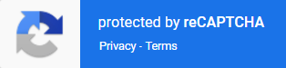

import Tabs from '@theme/Tabs';
import TabItem from '@theme/TabItem';
import ParamItem from '@theme/ParamItem';
import MethodItem from '@theme/MethodItem';
import MethodDescription from '@theme/MethodDescription'
import PriceBlock from '../../src/theme/PriceBlock';
import PriceBlockWrap from '@theme/PriceBlockWrap';
import BlogLink from '@theme/BlogLink';
import { ArticleHead } from '../../src/theme/ArticleHead';

<ArticleHead slug="captchas/recaptcha-v3-enterprise-task" />


# reCAPTCHA v3 Enterprise

<PriceBlockWrap>
  <PriceBlock title="Recaptcha V3 Enterprise" captchaId="recaptcha3e"/>
</PriceBlockWrap>



:::warning **Внимание!**
Задача выполняется через наши собственные прокси-серверы. Дополнительных расходов на прокси не требуется — их использование включено в стоимость.
:::

Данный раздел содержит описание задачи для решения reCAPTCHA v3 Enterprise от Google.

reCAPTCHA v3 Enterprise работает полностью в фоновом режиме и не требует от пользователя выполнения каких-либо действий. Система анализирует поведенческие и технические сигналы посетителя страницы и формирует оценку риска для каждого запроса. На основе полученных данных сайт принимает решение о допустимости действия, используя рейтинг доверия, который обычно находится в диапазоне от **0.1** до **0.9**.


## Параметры запроса

<TabItem value="proxyless" label="RecaptchaV3EnterpriseTaskProxyless (без прокси)" default className="bordered-panel">
    <ParamItem title="type" required type="string" />
    **RecaptchaV3EnterpriseTask**

    ---

    <ParamItem title="websiteURL" required type="string" />
    Адрес страницы, на которой решается капча

    ---

    <ParamItem title="websiteKey" required type="string" />
   Ключ-идентификатор ReCaptcha3 на целевой странице.
   <br/>https://www.google.com/recaptcha/enterprise.js?render=THIS_ONE

   ---

   <ParamItem title="minScore" type="double" />
    Может иметь значение от **0.1** до **0.9**

    ---

    <ParamItem title="pageAction" type="string" />
    <p>Значение параметра `action`, которое передаётся виджетом ReCaptcha в Google и который при последующей верификации на сервере виден владельцу сайта. Значение по умолчанию: *verify*</p>
	<p>Пример в html:
	<br/>*`grecaptcha.execute('site_key', {action:'login_test'})`*.</p>
</TabItem>


## Метод создания задачи
<TabItem value="proxyless" label="RecaptchaV3EnterpriseTaskProxyless (без прокси)" default className="method-panel">
	<MethodItem>
		```http
		https://api.capmonster.cloud/createTask
		```
	</MethodItem>
	<MethodDescription>
		**Запрос**
		```json
		{
		  "clientKey":"API_KEY",
		  "task": {
			"type":"RecaptchaV3EnterpriseTask",
			"websiteURL":"https://example.com",
			"websiteKey":"6Le0xVgUAAAAAIt20XEB4rVhYOODgTl00d4TuRTE",
			"minScore": 0.7
		  }
		}
		```
		**Ответ**
		```json
		{
		  "errorId":0,
		  "taskId":407533072
		}
		```
	</MethodDescription>
</TabItem>


## Метод получения результата задачи

:::warning **Внимание!**
На некоторых сайтах важно, чтобы UserAgent совпадал с тем, что использовался при решении капчи. Поэтому, если вместе с токеном CapMonster Cloud возвращает UserAgent, **обязательно** применяйте его при отправке формы или подтверждении решения на целевой странице.
:::

Используйте метод [getTaskResult](../api/methods/get-task-result.mdx), чтобы получить решение ReCaptcha3. В зависимости от загрузки системы вы получите ответ через время в диапазоне от 10 с до 30 с.

<TabItem value="proxyless" label="RecaptchaV3EnterpriseTaskProxyless (без прокси)" default className="method-panel-full">
	<MethodItem>
		```http
		https://api.capmonster.cloud/getTaskResult
		```
	</MethodItem>
	<MethodDescription>
		**Запрос**
		```json
		{
		  "clientKey":"API_KEY",
		  "taskId": 407533072
		}
		```
		**Ответ**
		```json
		{
		  "errorId":0,
		  "status":"ready",
		  "solution": {
			"gRecaptchaResponse":"3AHJ_VuvYIBNBW5yyv0zRYJ75VkOKvhKj9_xGBJKnQimF72rfoq3Iy-DyGHMwLAo6a3"
		  }
		}
		```

    Для некоторых сайтов ответ может выглядеть примерно следующим образом. При подтверждении решения необходимо использовать UserAgent, полученный в ответе, даже если он отличается от текущего UserAgent браузера:
 
		```json
		{
		  "errorId":0,
		  "status":"ready",
		  "solution": {
			"gRecaptchaResponse":"3AHJ_VuvYIBNBW5yyv0zRYJ75VkOKvhKj9_xGBJKnQimF72rfoq3Iy-DyGHMwLAo6a3",
			"userAgent": "Mozilla/5.0 (Macintosh; Intel Mac OS X 10_15_7) AppleWebKit/537.36 (KHTML, like Gecko) Chrome/138.0.0.0 Safari/537.36"
		  }
		}
		```
	</MethodDescription>
</TabItem>

<br />

|**Свойство**|**Тип**|**Описание**|
| :- | :- | :- |
|gRecaptchaResponse|String|Хеш, который необходимо подставить в форму с ReCaptcha3 в `<textarea id="g-recaptcha-response" ></textarea>`. Имеет длину от 500 до 2190 байт.|


## Отличия **reCAPTCHA v3 Enterprise** от обычной **reCAPTCHA v3**

| Характеристика                 | reCAPTCHA v3                                              | reCAPTCHA v3 Enterprise                                                                                      |
| ------------------------------ | --------------------------------------------------------- | ------------------------------------------------------------------------------------------------------------ |
| **URL скрипта**                | `https://www.google.com/recaptcha/api.js?render=site_key` |    `https://www.google.com/recaptcha/enterprise.js?render=site_key`                                             |
| **Идентификация на сайте**     | iframe и скрипт используют стандартные v3 URL             | iframe и скрипт используют `enterprise` в URL (`/enterprise.js`, `/enterprise/anchor`, `/enterprise/reload`) |


**Практический способ определить:**

1. Откройте страницу с капчей и включите **DevTools > Network**.
2. Найдите скрипты reCAPTCHA:

   * Если URL содержит `/enterprise.js` > это **v3 Enterprise**.
   * Если URL содержит `/api.js` > это обычная **v3**.
3. Также можно посмотреть `iframe` reCAPTCHA: в Enterprise URL iframe содержит `/enterprise/anchor`, а в обычной v3 — `/anchor`.


## Как найти значение `websiteKey` для создания задачи на решение

### Вручную

1. Откройте страницу вашего сайта, на которой отображается капча.
2. Включите **Инструменты разработчика** в браузере и перейдите на вкладку **Сеть (Network)**.
3. Перезагрузите страницу и обратите внимание на запросы, например:

   * `https://www.google.com/recaptcha/enterprise/anchor?ar=1&k=`
   * `https://www.google.com/recaptcha/enterprise.js?render=`
   * `https://www.google.com/recaptcha/enterprise/reload?k=`
   * `https://www.google.com/recaptcha/enterprise/clr?k=`
4. Параметр **k** в этих URL соответствует значению **websiteKey**.


### Автоматически

Для автоматизации поиска параметров их можно извлекать через **браузер** (обычный или headless, например, с **Playwright**) или напрямую из **HTTP-запросов**. Поскольку значения динамических параметров действуют недолго, их рекомендуется использовать сразу после получения.

:::warning **Важно!**
Приведённые фрагменты кода являются базовыми примерами для ознакомления в извлечении необходимых параметров. Точная реализация будет зависеть от вашего сайта с капчей, его структуры и используемых HTML-элементов и селекторов.
:::

<Tabs className="full-width-tabs filled-tabs request-tabs">
  <TabItem value="js" label="JavaScript" default className="method-panel">
    <details>
      <summary>Показать код (для консоли браузера)</summary>

      ```js
      const iframe = document.querySelector('iframe[src*="recaptcha"]');

      if (iframe) {
        const src = iframe.src;
        const k = new URL(src).searchParams.get('k');
        console.log('Site key:', k);
      } else {
        console.log('reCAPTCHA iframe не найден');
      }
      ```
    </details>

    <details>
      <summary>Показать код (Node.js)</summary>

```js
// В данном примере используем Playwright

const { chromium } = require("playwright");

(async () => {
  const browser = await chromium.launch({ headless: false });
  const page = await browser.newPage();

  // Замените на нужный url
  await page.goto("https://example.com/", {
    waitUntil: "load",
  });

  await page.waitForSelector('iframe[src*="recaptcha"]', { timeout: 10000 });

  const k = await page.evaluate(() => {
    const iframe = document.querySelector('iframe[src*="recaptcha"]');
    if (!iframe) return null;
    return new URL(iframe.src).searchParams.get("k");
  });

  console.log("Site key:", k);

  await browser.close();
})();
```
    </details>
  </TabItem>

  <TabItem value="python" label="Python" className="method-panel">
    <details>
      <summary>Показать код</summary>

```python
# В данном примере используем Playwright

from playwright.sync_api import sync_playwright

with sync_playwright() as p:
    browser = p.chromium.launch(headless=False)
    page = browser.new_page()

    # Замените на нужный URL
    page.goto("https://www.example.com/", wait_until="load")

    page.wait_for_selector('iframe[src*="recaptcha"]', timeout=10000)

    k = page.evaluate("""
    () => {
        const iframe = document.querySelector('iframe[src*="recaptcha"]');
        if (!iframe) return null;
        return new URL(iframe.src).searchParams.get("k");
    }
    """)

    print("Site key:", k)
    browser.close()
      ```
    </details>
  </TabItem>

  <TabItem value="csharp" label="C#" className="method-panel">
    <details>
      <summary>Показать код</summary>

```csharp
// В данном примере используем Playwright

using Microsoft.Playwright;
using System;
using System.Threading.Tasks;

class Program
{
    public static async Task Main()
    {
        using var playwright = await Playwright.CreateAsync();
        await using var browser = await playwright.Chromium.LaunchAsync(new BrowserTypeLaunchOptions { Headless = false });
        var page = await browser.NewPageAsync();

        // Замените на нужный URL
        await page.GotoAsync("https://example.com/", new PageGotoOptions { WaitUntil = WaitUntilState.Load });

        await page.WaitForSelectorAsync("iframe[src*='recaptcha']", new PageWaitForSelectorOptions { Timeout = 10000 });

        var k = await page.EvaluateAsync<string>(@"() => {
            const iframe = document.querySelector('iframe[src*=""recaptcha""]');
            if (!iframe) return null;
            return new URL(iframe.src).searchParams.get('k');
        }");

        Console.WriteLine("Site key: " + k);
        await browser.CloseAsync();
    }
}
```
    </details>
  </TabItem>
</Tabs>