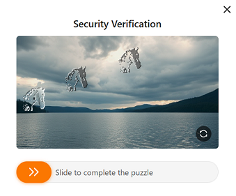
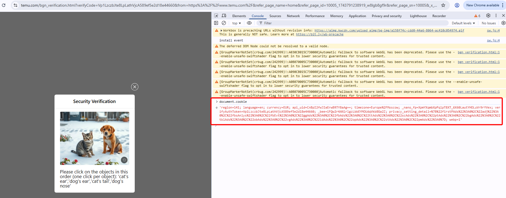

import Tabs from '@theme/Tabs';
import TabItem from '@theme/TabItem';
import ParamItem from '@theme/ParamItem';
import MethodItem from '@theme/MethodItem';
import MethodDescription from '@theme/MethodDescription'
import PriceBlock from '../../src/theme/PriceBlock';
import PriceBlockWrap from '@theme/PriceBlockWrap';
import BlogLink from '@theme/BlogLink';

# Temu

<PriceBlockWrap>
  <PriceBlock title="Temu captcha" captchaId="temu"/>
</PriceBlockWrap>

## Примеры заданий

<Tabs className="full-width-tabs">
  <TabItem value="temu" label="Slider" default>
    
  </TabItem>
  <TabItem value="temu1" label="Click">
    
  </TabItem>
</Tabs>

:::warning **Внимание!**
CapMonster Cloud по умолчанию работает через встроенные прокси — они уже включены в стоимость. Указывать собственные прокси требуется только в тех случаях, когда сайт не принимает токен или доступ к встроенным сервисам ограничен.

Если прокси с авторизацией по IP, то необходимо добавить адрес **65.21.190.34** в белый список.
:::

## Параметры запроса

<TabItem value="proxyless" label="CustomTask (без прокси)" default className="bordered-panel">
    <ParamItem title="type" required type="string" />
    **CustomTask**

    ---

    <ParamItem title="class" required type="string" />
    **Temu**

    ---

    <ParamItem title="websiteURL" required type="string" />
    Полный адрес страницы, на которой прогружена капча (например: https://www.example.com/bgn_verification.html?.......)

    ---

    <ParamItem title="cookie (внутри metadata)" required="required" type="string" />
    Куки, полученные через `document.cookie` на прогруженной странице капчи

    ---

    <ParamItem title="userAgent" type="string" />
    User-Agent браузера. <br />
  **Передавайте только актуальный UA от ОС Windows. Сейчас таковым является**: `userAgentPlaceholder`

    ---

    <ParamItem title="proxyType" type="string" />
    **http** - обычный http/https прокси;<br />
    **https** - используйте только если http не работает;<br />
    **socks4** - socks4 прокси;<br />
    **socks5** - socks5 прокси.

    --- 

    <ParamItem title="proxyAddress" type="string" />
    <p>
      IP адрес прокси IPv4/IPv6. Не допускается:
      - использование прозрачных прокси;
      - использование прокси на локальных машинах.
    </p>

    --- 

    <ParamItem title="proxyPort" type="integer" />
    Порт прокси.

    --- 

    <ParamItem title="proxyLogin" type="string" />
    Логин прокси-сервера.

    --- 

    <ParamItem title="proxyPassword" type="string" />
    Пароль прокси-сервера.

    --- 
</TabItem>


## Метод создания задачи

<Tabs className="full-width-tabs filled-tabs request-tabs" groupId="captcha-type">
  <TabItem value="proxyless" label="CustomTask (без прокси)" default className="method-panel">
    <MethodItem>
      ```http
      https://api.capmonster.cloud/createTask
      ```
    </MethodItem>
    <MethodDescription>

    **Запрос**

    ```json
    {
      "clientKey": "API_KEY",
      "task": {
        "type": "CustomTask",
        "class": "Temu",
        "websiteURL": "https://www.example.com/bgn_verification.html?verifyCode=7PRQIzDznoFE67ecZYtRTw394f6185143a4af80&from=https%3A%2F%2Fwww.example.com%2F&refer_page_name=home&refer_page_id=10005_1743074140645_cwb6un82rq&refer_page_sn=10005&_x_sessn_id=xmp1zuyv7y",
        "userAgent": "userAgentPlaceholder",
        "metadata": {
          "cookie": "region=141; language=en; currency=EUR; api_uid=CnBpI2fwFW2BogBITHVYAg==; timezone=Europe%2FMoscow; _nano_fp=XpmYXqmJnqX8npXblT_T6~7rkpA2LDnz2BPFuT5m; privacy_setting_detail=%7B%22firstPAds%22%3A0%2C%22adj%22%3A0%2C%22fbsAnlys%22%3A0%2C%22fbEvt%22%3A0%2C%22ggAds%22%3A0%2C%22fbAds%22%3A0%2C%22ttAds%22%3A0%2C%22scAds%22%3A0%2C%22ptAds%22%3A0%2C%22bgAds%22%3A0%2C%22tblAds%22%3A0%2C%22obAds%22%3A0%2C%22vgAds%22%3A0%2C%22idAds%22%3A0%2C%22opAds%22%3A0%2C%22stAds%22%3A0%2C%22pmAds%22%3A0%7D; webp=1; _bee=pgoBlKp038lBhEyoQ4yXnuNrw1X5va2U; verifyAuthToken=QkZmx2TJFbSuuRVD_MKJmA0b84fe3df183da8ab"
        }
      }
    }
    ```

    **Ответ**

    ```json
    {
      "errorId": 0,
      "taskId": 407533072
    }
    ```

    </MethodDescription>
  </TabItem>

  <TabItem value="proxy" label="CustomTask (с использованием прокси)" className="method-panel">
    <MethodItem>
      ```http
      https://api.capmonster.cloud/createTask
      ```
    </MethodItem>
    <MethodDescription>

    **Запрос**

    ```json
    {
      "clientKey": "API_KEY",
      "task": {
        "type": "CustomTask",
        "class": "Temu",
        "websiteURL": "https://www.example.com/bgn_verification.html?verifyCode=7PRQIzDznoFE67ecZYtRTw394f6185143a4af80&from=https%3A%2F%2Fwww.example.com%2F&refer_page_name=home&refer_page_id=10005_1743074140645_cwb6un82rq&refer_page_sn=10005&_x_sessn_id=xmp1zuyv7y",
        "userAgent": "userAgentPlaceholder",
        "metadata": {
          "cookie": "region=141; language=en; currency=EUR; api_uid=CnBpI2fwFW2BogBITHVYAg==; timezone=Europe%2FMoscow; _nano_fp=XpmYXqmJnqX8npXblT_T6~7rkpA2LDnz2BPFuT5m; privacy_setting_detail=%7B%22firstPAds%22%3A0%2C%22adj%22%3A0%2C%22fbsAnlys%22%3A0%2C%22fbEvt%22%3A0%2C%22ggAds%22%3A0%2C%22fbAds%22%3A0%2C%22ttAds%22%3A0%2C%22scAds%22%3A0%2C%22ptAds%22%3A0%2C%22bgAds%22%3A0%2C%22tblAds%22%3A0%2C%22obAds%22%3A0%2C%22vgAds%22%3A0%2C%22idAds%22%3A0%2C%22opAds%22%3A0%2C%22stAds%22%3A0%2C%22pmAds%22%3A0%7D; webp=1; _bee=pgoBlKp038lBhEyoQ4yXnuNrw1X5va2U; verifyAuthToken=QkZmx2TJFbSuuRVD_MKJmA0b84fe3df183da8ab"
        },
        "proxyType": "http",
        "proxyAddress": "8.8.8.8",
        "proxyPort": 8080,
        "proxyLogin": "proxyLoginHere",
        "proxyPassword": "proxyPasswordHere"
      }
    }
    ```

    **Ответ**

    ```json
    {
      "errorId": 0,
      "taskId": 407533072
    }
    ```

    </MethodDescription>
  </TabItem>
</Tabs>

## Метод получения результата задачи
Используйте метод [getTaskResult](../api/methods/get-task-result.md), чтобы получить решение Temu.

**Важно!** После получения решения, необходимо очистить куки и подставить новые полученные куки. 

<TabItem value="proxyless" label="CustomTask (без прокси)" default className="method-panel-full">
	<MethodItem>
		```http
		https://api.capmonster.cloud/getTaskResult
		```
	</MethodItem>
	<MethodDescription>
		**Запрос**
		```json
		{
		  "clientKey":"API_KEY",
		  "taskId": 407533072
		}
		```
		**Ответ**
		```json
		{
			"errorId": 0,
			"status": "ready",
			"solution": {
				"domains": {
					"www.example.com": {
						"cookies": {
							"privacy_setting_detail": "%7B%22firstPAds%22%3A1%2C%22adj%22%3A1%2C%22fbsAnlys%22%3A1%2C%22fbEvt%22%3A1%2C%22ggAds%22%3A1%2C%22fbAds%22%3A1%2C%22ttAds%22%3A1%2C%22scAds%22%3A1%2C%22ptAds%22%3A1%2C%22bgAds%22%3A1%2C%22tblAds%22%3A1%2C%22obAds%22%3A1%2C%22vgAds%22%3A1%2C%22idAds%22%3A1%2C%22opAds%22%3A1%2C%22stAds%22%3A1%2C%22pmAds%22%3A1%7D",
							"region": "211",
							"language": "en",
							"currency": "USD",
							"api_uid": "Chgx+mflQkR0G1THhRQIAg",
							"webp": "1",
							"_nano_fp": "XpmYXq98nqUaXpdano_AT7Nbb0dRwziAaAq~s8do",
							"verifyAuthToken": "8VhdGgRPTJaJ0t6msEcXlA598e207617867ac4b",
							"timezone": "America/Buenos_Aires",
							"_bee": "FJBIpQvZnnUGDlamFfP08tIpG1Uyiap2"
						}
					}
				}
			},
		}
		```
	</MethodDescription>
</TabItem>

### Как получить параметр cookie (внутри metadata)
Значение для параметра `cookie` можно получить на странице с капчей через свойство `document.cookie`.
 

## Как найти все нужные параметры для создания задачи на решение

### Автоматически

Удобный способ автоматизировать поиск всех необходимых параметров.
Некоторые параметры генерируются заново при каждой загрузке страницы, поэтому для их извлечения потребуется работать через браузер – обычный или в режиме headless (например, с помощью **Playwright**).
Так как значения динамических параметров хранятся недолго, капчу нужно решать сразу после их получения.

:::warning **Важно!**
Приведённые фрагменты кода являются базовыми примерами для ознакомления в извлечении необходимых параметров. Точная реализация будет зависеть от вашего сайта с капчей, его структуры и используемых HTML-элементов и селекторов.
:::

<Tabs className="full-width-tabs filled-tabs request-tabs">
  <TabItem value="js" label="JavaScript" default className="method-panel">
    <details>
      <summary>Показать код (Node.js)</summary>

      ```js
      import { chromium } from 'playwright';

      (async () => {
        const browser = await chromium.launch();
        const page = await browser.newPage();

        await page.goto('https://example.com');

        // Получаем куки
        const cookies = await page.context().cookies();
        console.log('Cookies:', cookies);

        await browser.close();
      })();
      ```
    </details>
  </TabItem>

  <TabItem value="python" label="Python" className="method-panel">
    <details>
      <summary>Показать код</summary>

      ```python
      import asyncio
      from playwright.async_api import async_playwright

      async def run():
          async with async_playwright() as p:
              browser = await p.chromium.launch()
              page = await browser.new_page()

              await page.goto('https://example.com')

              # Получаем куки
              cookies = await page.context.cookies()
              print('Cookies:', cookies)

              await browser.close()

      asyncio.run(run())
      ```
    </details>
  </TabItem>

  <TabItem value="csharp" label="C#" className="method-panel">
    <details>
      <summary>Показать код</summary>

      ```csharp
      using System;
      using System.Linq;
      using System.Threading.Tasks;
      using Microsoft.Playwright;

      class Program
      {
          public static async Task Main()
          {
              using var playwright = await Playwright.CreateAsync();
              var browser = await playwright.Chromium.LaunchAsync(new BrowserTypeLaunchOptions
              {
                  Headless = true
              });

              var context = await browser.NewContextAsync();
              var page = await context.NewPageAsync();

              await page.GotoAsync("https://example.com");

              var cookies = await context.CookiesAsync();
              Console.WriteLine("Cookies:");
              foreach (var cookie in cookies)
              {
                  Console.WriteLine($"{cookie.Name}: {cookie.Value}");
              }

              await browser.CloseAsync();
          }
      }
      ```
    </details>
  </TabItem>
</Tabs>

## Используйте библиотеку SDK

<Tabs className="full-width-tabs filled-tabs request-tabs" groupId="captcha-type">

  <TabItem value="js" label="JavaScript" default className="method-panel">

  ```js
  // https://github.com/ZennoLab/capmonstercloud-client-js

  import { CapMonsterCloudClientFactory, ClientOptions, TemuRequest } from '@zennolab_com/capmonstercloud-client';

  document.addEventListener('DOMContentLoaded', async () => {
    const cmcClient = CapMonsterCloudClientFactory.Create(
      new ClientOptions({ clientKey: '<your capmonster.cloud API key>' })
    );

    console.log(await cmcClient.getBalance());

    const temuRequest = new TemuRequest({
      class: 'Temu',
      websiteURL: 'https://www.example.com/bgn_verification.html?verifyCode=', // URL страницы с капчей
      userAgent: 'userAgentPlaceholder', // Используйте актуальный UserAgent
      metadata: {
        cookie: 'region=141; language=en; currency=EUR; api_uid=CnBpI2fwFW2BogBITHVYAg==; timezone=Europe%2FMoscow; _nano_fp=XpmYXqmJnqX8npXblT_T6~7rkpA2LDnz2BPFuT5m; privacy_setting_detail=%7B%22firstPAds%22%3A0%2C%22adj%22%3A0%2C%22fbsAnlys%22%3A0%2C%22fbEvt%22%3A0%2C%22ggAds%22%3A0%2C%22fbAds%22%3A0%2C%22ttAds%22%3A0%2C%22scAds%22%3A0%2C%22ptAds%22%3A0%2C%22bgAds%22%3A0%2C%22tblAds%22%3A0%2C%22obAds%22%3A0%2C%22vgAds%22%3A0%2C%22idAds%22%3A0%2C%22opAds%22%3A0%2C%22stAds%22%3A0%2C%22pmAds%22%3A0%7D; webp=1; _bee=pgoBlKp038lBhEyoQ4yXnuNrw1X5va2U; verifyAuthToken=QkZmx2TJFbSuuRVD_MKJmA0b84fe3df183da8ab'
      },
      /*
      // Если нужно использовать прокси:
      proxy: {
        type: 'http',
        address: '127.0.0.1',
        port: 8000,
        login: 'user',
        password: 'password'
      }
      */
    });

    console.log(await cmcClient.Solve(temuRequest));
  });
````

  </TabItem>

  <TabItem value="python" label="Python" default className="method-panel">

```python
# https://github.com/ZennoLab/capmonstercloud-client-python

import asyncio
from capmonstercloudclient import CapMonsterClient, ClientOptions
from capmonstercloudclient.requests import TemuCustomTaskRequest

client_options = ClientOptions(api_key="API_KEY")  # Ваш API-ключ CapMonster Cloud
cap_monster_client = CapMonsterClient(options=client_options)

# Вариант 1: Без прокси
temu_request = TemuCustomTaskRequest(
    websiteUrl="https://www.example.com/bgn_verification.html?verifyCode=",
    userAgent="userAgentPlaceholder",  # Используйте актуальный UserAgent
    metadata={
        "cookie": "region=141; language=en; currency=EUR; api_uid=CnBpI2fwFW2BogBITHVYAg==; timezone=Europe%2FMoscow; _nano_fp=XpmYXqmJnqX8npXblT_T6~7rkpA2LDnz2BPFuT5m; privacy_setting_detail=%7B%22firstPAds%22%3A0%2C%22adj%22%3A0%2C%22fbsAnlys%22%3A0%2C%22fbEvt%22%3A0%2C%22ggAds%22%3A0%2C%22fbAds%22%3A0%2C%22ttAds%22%3A0%2C%22scAds%22%3A0%2C%22ptAds%22%3A0%2C%22bgAds%22%3A0%2C%22tblAds%22%3A0%2C%22obAds%22%3A0%2C%22vgAds%22%3A0%2C%22idAds%22%3A0%2C%22opAds%22%3A0%2C%22stAds%22%3A0%2C%22pmAds%22%3A0%7D; webp=1; _bee=pgoBlKp038lBhEyoQ4yXnuNrw1X5va2U; verifyAuthToken=QkZmx2TJFbSuuRVD_MKJmA0b84fe3df183da8ab"
    }
)

# Вариант 2: С прокси
# Раскомментируйте, если нужно использовать прокси
# temu_request = TemuCustomTaskRequest(
#     websiteUrl="https://www.example.com/bgn_verification.html?verifyCode=",
#     userAgent="userAgentPlaceholder",
#     metadata={ "cookie": "..." },
#     proxyType="http",
#     proxyAddress="123.45.67.89",
#     proxyPort=8080,
#     proxyLogin="proxyUser",
#     proxyPassword="proxyPass"
# )

async def solve_captcha():
    return await cap_monster_client.solve_captcha(temu_request)

responses = asyncio.run(solve_captcha())
print(responses)
```

  </TabItem>

  <TabItem value="csharp" label="C#" className="method-panel">

```csharp
// https://github.com/ZennoLab/capmonstercloud-client-dotnet

using System;
using System.Threading.Tasks;
using Zennolab.CapMonsterCloud;
using Zennolab.CapMonsterCloud.Requests;

class Program
{
    static async Task Main(string[] args)
    {
        // Ваш API-ключ от CapMonster Cloud
        var clientOptions = new ClientOptions
        {
            ClientKey = "your_api_key" // Ваш API-ключ CapMonster Cloud
        };

        var cmCloudClient = CapMonsterCloudClientFactory.Create(clientOptions);

        // Вариант 1: Temu без прокси
        var temuRequest = new TemuCustomTaskRequest(
            cookie: "region=141; language=en; currency=EUR; api_uid=CnBpI2fwFW2BogBITHVYAg==; timezone=Europe%2FMoscow; _nano_fp=XpmYXqmJnqX8npXblT_T6~7rkpA2LDnz2BPFuT5m; privacy_setting_detail=%7B%22firstPAds%22%3A0%2C%22adj%22%3A0%2C%22fbsAnlys%22%3A0%2C%22fbEvt%22%3A0%2C%22ggAds%22%3A0%2C%22fbAds%22%3A0%2C%22ttAds%22%3A0%2C%22scAds%22%3A0%2C%22ptAds%22%3A0%2C%22bgAds%22%3A0%2C%22tblAds%22%3A0%2C%22obAds%22%3A0%2C%22vgAds%22%3A0%2C%22idAds%22%3A0%2C%22opAds%22%3A0%2C%22stAds%22%3A0%2C%22pmAds%22%3A0%7D; webp=1; _bee=pgoBlKp038lBhEyoQ4yXnuNrw1X5va2U; verifyAuthToken=QkZmx2TJFbSuuRVD_MKJmA0b84fe3df183da8ab"
        )
        {
            WebsiteUrl = "https://www.example.com/bgn_verification.html?verifyCode=", // URL страницы с капчей
            UserAgent = "userAgentPlaceholder"
        };

        // Вариант 2: Temu с прокси
        // Раскомментируйте, если нужно использовать прокси
        /*
        var temuRequest = new TemuCustomTaskRequest(
            cookie: "...long cookie..."
        )
        {
            WebsiteUrl = "https://www.example.com/bgn_verification.html?verifyCode=",
            UserAgent = "userAgentPlaceholder",
            Proxy = new ProxyContainer(
                "123.45.67.89",
                8080,
                ProxyType.Http,
                "proxyLogin",
                "proxyPassword"
            )
        };
        */

        var temuResult = await cmCloudClient.SolveAsync(temuRequest);

        Console.WriteLine("Temu Solution: " + temuResult.Solution.Domains);
    }
}
```

  </TabItem>

</Tabs>
