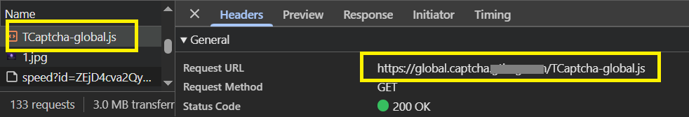

import Tabs from '@theme/Tabs';
import TabItem from '@theme/TabItem';
import ParamItem from '@theme/ParamItem';
import MethodItem from '@theme/MethodItem';
import MethodDescription from '@theme/MethodDescription'
import PriceBlock from '../../src/theme/PriceBlock';
import PriceBlockWrap from '@theme/PriceBlockWrap';
import BlogLink from '@theme/BlogLink';


# TenDI - Tencent captcha

<PriceBlockWrap>
  <PriceBlock title="Tencent captcha" captchaId="tencent"/>
</PriceBlockWrap>


<BlogLink url="https://capmonster.cloud/ru/blog/ten-1/what-is-tencent-captcha-and-how-do-i-bypass-it"/>

:::warning **Внимание!**
CapMonster Cloud по умолчанию работает через встроенные прокси — они уже включены в стоимость. Указывать собственные прокси требуется только в тех случаях, когда сайт не принимает токен или доступ к встроенным сервисам ограничен. Вы можете обратиться в службу поддержки, чтобы уточнить детали и узнать, насколько корректно принимаются токены на конкретном сайте.

Если прокси с авторизацией по IP, то необходимо добавить адрес **65.21.190.34** в белый список.
:::

## Параметры запроса
<TabItem value="proxyless" label="CustomTask (без прокси)" default className="bordered-panel">
    <ParamItem title="type" required type="string" />
    **CustomTask**

    ---

    <ParamItem title="class" required type="string" />
    **TenDI**

    ---

    <ParamItem title="websiteURL" required type="string" />
    Адрес основной страницы, на которой решается капча.

    ---

    <ParamItem title="websiteKey" required type="string" />
    captchaAppId. Например `"websiteKey": "189123456"` - уникальный параметр для вашего сайта. Можно взять с html страницы с капчей или из трафика (см. описание ниже).

    ---

    <ParamItem title="captchaUrl (внутри metadata)" type="string" />
    Ссылка на скрипт с капчей. Обычно заканчивается на `TCaptcha.js` или `TCaptcha-global.js`. Можно найти в списке запросов (см. пример ниже).
	
    ---

    <ParamItem title="userAgent" type="string" />
    User-Agent браузера. <br />
  **Передавайте только актуальный UA от ОС Windows. Сейчас таковым является**: `userAgentPlaceholder`
	
     ---

    <ParamItem title="proxyType" type="string" />
    **http** - обычный http/https прокси;<br />
	**https** - попробуйте эту опцию только если "http" не работает (требуется для некоторых кастомных прокси);<br />
	**socks4** - socks4 прокси;<br />
	**socks5** - socks5 прокси.

     ---

    <ParamItem title="proxyAddress" type="string" />
    <p>
      IP адрес прокси IPv4/IPv6. Не допускается:
		- использование имен хостов;
		- использование прозрачных прокси (там где можно видеть IP клиента);
		- использование прокси на локальных машинах.
    </p>

     ---

    <ParamItem title="proxyPort" type="integer" />
    Порт прокси.

     ---

    <ParamItem title="proxyLogin" type="string" />
    Логин прокси-сервера.

     ---

    <ParamItem title="proxyPassword" type="string" />
    Пароль прокси-сервера.

</TabItem>


## Метод создания задачи

<Tabs className="full-width-tabs filled-tabs request-tabs" groupId="captcha-type">

  <TabItem value="proxyless" label="CustomTask (без прокси)" default className="method-panel">
    <MethodItem>
      ```http
      https://api.capmonster.cloud/createTask
      ```
    </MethodItem>
    <MethodDescription>
      **Запрос**
      ```json
      {
        "clientKey": "API_KEY",
        "task": {
          "type": "CustomTask",
          "class": "TenDI",
          "websiteURL": "https://example.com",
          "websiteKey": "189123456",
          "userAgent": "userAgentPlaceholder",
          "metadata": {
            "captchaUrl": "https://global.captcha.example.com/TCaptcha-global.js"
          }
        }
      }
      ```

      **Ответ**
      ```json
      {
        "errorId": 0,
        "taskId": 407533072
      }
      ```
    </MethodDescription>
  </TabItem>

  <TabItem value="proxy" label="CustomTask (c прокси)" className="method-panel">
    <MethodItem>
      ```http
      https://api.capmonster.cloud/createTask
      ```
    </MethodItem>
    <MethodDescription>
      **Запрос**
      ```json
      {
        "clientKey": "API_KEY",
        "task": {
          "type": "CustomTask",
          "class": "TenDI",
          "websiteURL": "https://example.com",
          "websiteKey": "189123456",
          "userAgent": "userAgentPlaceholder",
          "metadata": {
            "captchaUrl": "https://global.captcha.example.com/TCaptcha-global.js"
          },
          "proxyType": "http",
          "proxyAddress": "8.8.8.8",
          "proxyPort": 8080,
          "proxyLogin": "proxyLoginHere",
          "proxyPassword": "proxyPasswordHere"
        }
      }
      ```

      **Ответ**
      ```json
      {
        "errorId": 0,
        "taskId": 407533072
      }
      ```
    </MethodDescription>
  </TabItem>

</Tabs>

## Метод получения результата задачи
Используйте метод [getTaskResult](../api/methods/get-task-result.md), чтобы получить решение TenDI.

<TabItem value="proxyless" label="CustomTask (без прокси)" default className="method-panel-full">
	<MethodItem>
		```http
		https://api.capmonster.cloud/getTaskResult
		```
	</MethodItem>
	<MethodDescription>
		**Запрос**
		```json
		{
		  "clientKey":"API_KEY",
		  "taskId": 407533072
		}
		```
		**Ответ**
		```json
		{
			"errorId":0,
			"status":"ready",
			"solution": {
			   "data": {
					"randstr": "@EcL",
					"ticket": "tr03lHUhdnuW3neJZu.....7LrIbs*"
				},
				"headers": {
					"User-Agent": "userAgentPlaceholder"
				}
			}
		}
		```
	</MethodDescription>
</TabItem>


## Как получить websiteKey (captchaAppId)
Включите *Инструменты разработчика*, перейдите на вкладку **Network**, активируйте капчу и посмотрите запросы. В некоторых из них будет нужное вам значение параметра. В данном случае `websiteKey=aid`

 

## Как получить captchaUrl
Откройте *Инструменты разработчика*, перейдите на вкладку **Network**, активируйте капчу и изучите сетевые запросы. Среди них появится `TCaptcha.js` или `TCaptcha-global.js`, в котором можно найти подобную ссылку: 



## Как найти все нужные параметры для создания задачи на решение

### Автоматически

Удобный способ автоматизировать поиск всех необходимых параметров.
Некоторые параметры генерируются заново при каждой загрузке страницы, поэтому для их извлечения потребуется работать через браузер – обычный или в режиме headless (например, с помощью **Playwright**).
Так как значения динамических параметров хранятся недолго, капчу нужно решать сразу после их получения.

:::warning **Важно!**
Приведённые фрагменты кода являются базовыми примерами для ознакомления в извлечении необходимых параметров. Точная реализация будет зависеть от вашего сайта с капчей, его структуры и используемых HTML-элементов и селекторов.
:::

<Tabs className="full-width-tabs filled-tabs request-tabs">
  <TabItem value="js" label="JavaScript" default className="method-panel">
    <details>
      <summary>Показать код (Node.js)</summary>
      ```js
      import { chromium } from "playwright";

      (async () => {
        const browser = await chromium.launch({ headless: false });
        const page = await browser.newPage();

        // Ловим запросы
        page.on("request", (request) => {
          const url = request.url();
          if (
            url.startsWith("https://sg.captcha.qcloud.com/cap_union_prehandle?aid=")
          ) {
            const parsedUrl = new URL(url);
            const aid = parsedUrl.searchParams.get("aid");
            console.log("Extracted aid:", aid);
          }
        });

        await page.goto("https://www.example.com/", { waitUntil: "load" });

        await page.waitForTimeout(5000);

        await browser.close();
      })();
      ```
    </details>
  </TabItem>

  <TabItem value="python" label="Python" className="method-panel">
    <details>
      <summary>Показать код</summary>
      ```python
      import asyncio
      from playwright.async_api import async_playwright

      async def main():
          async with async_playwright() as p:
              browser = await p.chromium.launch(headless=False)
              page = await browser.new_page()

              # Ловим запросы
              page.on("request", lambda request: handle_request(request))

              await page.goto("https://www.example.com/", wait_until="load")

              await asyncio.sleep(5)

              await browser.close()

      def handle_request(request):
          url = request.url
          if url.startswith("https://sg.captcha.qcloud.com/cap_union_prehandle?aid="):
              parsed_url = request.url.split('?')[1]
              params = dict(param.split('=') for param in parsed_url.split('&') if '=' in param)
              aid = params.get('aid')
              print("Extracted aid:", aid)

      asyncio.run(main())
      ```
    </details>
  </TabItem>

  <TabItem value="csharp" label="C#" className="method-panel">
    <details>
      <summary>Показать код</summary>
      ```csharp
      using System;
      using System.Threading.Tasks;
      using Microsoft.Playwright;

      class Program
      {
          public static async Task Main()
          {
              using var playwright = await Playwright.CreateAsync();
              await using var browser = await playwright.Chromium.LaunchAsync(new BrowserTypeLaunchOptions {
                 Headless = false });
              var page = await browser.NewPageAsync();

              // Ловим запросы
              page.Request += (_, request) =>
              {
                  var url = request.Url;
                  if (url.StartsWith("https://sg.captcha.qcloud.com/cap_union_prehandle?aid="))
                  {
                      var uri = new Uri(url);
                      var queryParams = System.Web.HttpUtility.ParseQueryString(uri.Query);
                      var aid = queryParams.Get("aid");
                      Console.WriteLine("Extracted aid: " + aid);
                  }
              };

              await page.GotoAsync("https://www.example.com/", new PageGotoOptions {
               WaitUntil = WaitUntilState.Load });

              await Task.Delay(5000);

              await browser.CloseAsync();
          }
      }
      ```
    </details>
  </TabItem>
</Tabs>

## Используйте библиотеку SDK

<Tabs className="full-width-tabs filled-tabs request-tabs" groupId="captcha-type">

  <TabItem value="js" label="JavaScript" default className="method-panel">

  ```js
  // https://github.com/ZennoLab/capmonstercloud-client-js

  import { CapMonsterCloudClientFactory, ClientOptions, TenDIRequest } from '@zennolab_com/capmonstercloud-client';

  document.addEventListener('DOMContentLoaded', async () => {
    const cmcClient = CapMonsterCloudClientFactory.Create(
      new ClientOptions({ clientKey: '<your capmonster.cloud API key>' }) // Ваш API-ключ CapMonster Cloud
    );

    console.log('Баланс:', await cmcClient.getBalance());

    // Основной вариант без прокси
    const tenDIRequest = new TenDIRequest({
      websiteURL: 'https://example.com', // URL страницы с капчей
      websiteKey: 'websiteKey',          // Замените на корректное значение
    });

    // Вариант с прокси (раскомментируйте при необходимости)
    /*
    const tenDIRequest = new TenDIRequest({
      websiteURL: 'https://example.com',
      websiteKey: 'websiteKey',         
      proxy: {
        proxyType: 'http',               
        proxyAddress: '123.45.67.89',    
        proxyPort: 8080,                 
        proxyLogin: 'username',          
        proxyPassword: 'password',       
      },
    });
    */

    const result = await cmcClient.Solve(tenDIRequest);
    console.log('Решение капчи:', result);
  });
````

  </TabItem>

  <TabItem value="python" label="Python" className="method-panel">

```python
# https://github.com/ZennoLab/capmonstercloud-client-python

import asyncio
from capmonstercloudclient import CapMonsterClient, ClientOptions
from capmonstercloudclient.requests import TenDiCustomTaskRequest

client_options = ClientOptions(api_key="your_api_key")  # Ваш API-ключ CapMonster Cloud
cap_monster_client = CapMonsterClient(options=client_options)

# Вариант 1: без прокси
ten_di_request = TenDiCustomTaskRequest(
    websiteUrl="https://example.com",   # URL страницы с капчей
    websiteKey="189956587",             # Замените на корректное значение
    userAgent="userAgentPlaceholder"    # Используйте актуальный UserAgent
)

# Вариант 2: с прокси
# ten_di_request = TenDiCustomTaskRequest(
#     websiteUrl="https://example.com",   
#     websiteKey="189956587",            
#     userAgent="userAgentPlaceholder",   
#     proxyType="http",                   
#     proxyAddress="127.0.0.1",           
#     proxyPort=8080,                     
#     proxyLogin="username",              
#     proxyPassword="password"            
# )

async def solve_captcha():
    return await cap_monster_client.solve_captcha(ten_di_request)

responses = asyncio.run(solve_captcha())
print(responses)
```

  </TabItem>

  <TabItem value="csharp" label="C#" className="method-panel">

```csharp
// https://github.com/ZennoLab/capmonstercloud-client-dotnet

using System;
using System.Threading.Tasks;
using Zennolab.CapMonsterCloud;
using Zennolab.CapMonsterCloud.Requests;

class Program
{
    static async Task Main(string[] args)
    {
        // Ваш API-ключ от CapMonster Cloud
        var clientOptions = new ClientOptions
        {
            ClientKey = "your_api_key" // Ваш API-ключ CapMonster Cloud
        };

        var cmCloudClient = CapMonsterCloudClientFactory.Create(clientOptions);

        // Вариант 1: Без прокси
        var tenDiRequest = new TenDiCustomTaskRequest
        {
            WebsiteUrl = "https://example.com",      // URL страницы с капчей
            WebsiteKey = "189956587",                // Замените на корректное значение
            UserAgent = "userAgentPlaceholder"       // Используйте актуальный UserAgent
        };

        // Вариант 2: С прокси
        // Раскомментируйте, если нужно использовать прокси
        /*
        var tenDiRequest = new TenDiCustomTaskRequest
        {
            WebsiteUrl = "https://example.com",  
            WebsiteKey = "189956587",                
            UserAgent = "userAgentPlaceholder",      

            Proxy = new ProxyContainer(
                "8.8.8.8",           
                8080,                
                ProxyType.Http,       
                "proxyLoginHere",     
                "proxyPasswordHere"   
            )
        };
        */

        var tenDiRequestResult = await cmCloudClient.SolveAsync(tenDiRequest);

        Console.WriteLine("Captcha Solution Data: " + string.Join(", ", tenDiRequestResult.Solution.Data));
        Console.WriteLine("Captcha Solution Headers: " + string.Join(", ", tenDiRequestResult.Solution.Headers));
    }
}
```

  </TabItem>

</Tabs>

