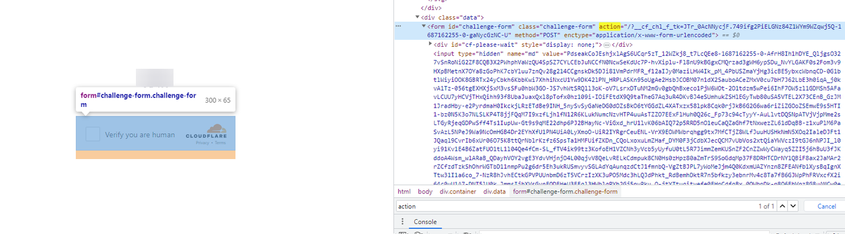

import Tabs from '@theme/Tabs';
import TabItem from '@theme/TabItem';
import ParamItem from '@theme/ParamItem';
import MethodItem from '@theme/MethodItem';
import MethodDescription from '@theme/MethodDescription'
import PriceBlock from '@theme/PriceBlock';
import PriceBlockWrap from '@theme/PriceBlockWrap';
import BlogLink from '@theme/BlogLink';

# TurnstileTask | Cloudflare Challenge

<PriceBlockWrap>
  <PriceBlock title="TurnstileTask" name="turnstileToken"/>
</PriceBlockWrap>

Автоматически поддерживаются все подтипы Turnstile: manual, non-interactive и invisible. Поэтому нет необходимости указывать подтип для обычной капчи.

<BlogLink url="https://capmonster.cloud/ru/blog/Cloudflare/what-is-cloudflare-captcha"/>
<BlogLink url="https://capmonster.cloud/ru/blog/Cloudflare/how-cloudflare-bot-challenge-and-turnstile-protect-web-traffic"/>

:::caution Внимание!
Ознакомьтесь со всеми тремя вариантами распознавания капчи и выберете наиболее предпочтительный для вас. 
:::

## Вариант 1 (Turnstile)
Вам требуется решить **обычную** turstile капчу, как [здесь](https://zenno.link/zl-support). Обратите внимание, что капча на страницах CloudFlare может выглядеть идентично. Посмотрите в конце статьи как отличить обычный Turnstile от Cloudflare Challenge. 

#### Параметры запроса
<TabItem value="proxyless" label="TurnstileTaskProxyless (без прокси)" default className="bordered-panel">
  <ParamItem title="type" required type="string" />
  **TurnstileTaskProxyless**

  ---

  <ParamItem title="websiteURL" required type="string" />
  Адрес страницы, на которой решается капча

  ---

  <ParamItem title="websiteKey" required type="string" />
  Ключ Turnstile

  ---

  <ParamItem title="pageAction" type="string" />
  Поле `action`, которое можно найти в callback функции для загрузки капчи

  ---
  
  <ParamItem title="data" type="string" />
  Значение поля *data* можно взять из параметра `cData`.

</TabItem>


## Вариант 2 (CloudFlare)
Вы работаете через браузер, и Вам требуется получить токен для прохождения CloudFlare

#### Параметры запроса
<TabItem value="proxyless" label="RecaptchaV2EnterpriseTaskProxyless (without proxy)" default className="bordered-panel">
  <ParamItem title="type" required type="string" />
  **TurnstileTaskProxyless**

  ---

  <ParamItem title="websiteURL" required type="string" />
  Адрес страницы, на которой решается капча

  ---

  <ParamItem title="websiteKey" required type="string" />
  Ключ Turnstile

  ---

  <ParamItem title="cloudflareTaskType" required type="string" />
  **token**

  ---

  <ParamItem title="pageAction" required type="string" />
  Поле `action`, которое можно найти в callback функции для загрузки капчи. Если используется *cloudflareTaskType*, то `action` обычно “managed“ или “non-interactive“.

  ---

  <ParamItem title="userAgent" required type="string" />
  User-Agent браузера.<br /> **Передавайте только актуальный UA от ОС Windows. Сейчас таковым является**: userAgentPlaceholder

  ---

  <ParamItem title="data" required type="string" />
  Значение поля *data* можно взять из параметра `cData`.

  ---

  <ParamItem title="pageData" required type="string" />
  Значение поля *pageData* можно взять из параметра `chlPageData`.
  
  ---
  
  <ParamItem title="apiJsUrl" type="string" />
  Строка, которая содержит ссылку на скрипт капчи.

</TabItem>

<br />

Прокси для получения токена передавать не обязательно.

Эти параметры находятся в объекте, который передаётся во время создания капчи в функцию `window.turnstile.render(el, paramsObj)`. Получить их можно, например, с помощью выполнения JavaScript перед загрузкой остальных скриптов:

```js
(function () {
  const obj = {
    render: function () {
      const { action, cData, chlPageData } = arguments[1];
        const params = [
          ["action", action],
          ["data", cData],
          ["pageData", chlPageData],
        ];
        console.table(params)
    }
  };

  Object.defineProperty(window, "turnstile", {
    get: () => {
      return obj;
    },
  });
})();
```

При вызове `window.turnstile.render(el, paramsObj)` загружается капча на странице, и при успешном решении вызывается функция `callback`, которая передает информацию о решении.

`window.turnstile.render(el, paramsObj):`

`el`: DOM-элемент для вставки в него капчи.

`paramsObj`: Объект параметров, содержащий информацию о капче и инструкции для ее решения. Этот объект обычно содержит такие поля, как
*sitekey*, *action*, *cData*, *chlPageData*, *callback*. 

`callback` – функция обратного вызова после успешного прохождения капчи.


## Вариант 3 (CloudFlare)
Вы работаете с помощью запросов, и Вам требуются куки `cf_clearance`. Обязательно нужны ваши прокси

#### Параметры запроса
<TabItem value="proxyless" label="RecaptchaV2EnterpriseTaskProxyless (without proxy)" default className="bordered-panel">
  <ParamItem title="type" required type="string" />
  **TurnstileTask**

  ---

  <ParamItem title="websiteURL" required type="string" />
  Адрес страницы, на которой решается капча

  ---

  <ParamItem title="websiteKey" required type="string" />
  Ключ Turnstile(можно передать любую строку)

  ---

  <ParamItem title="cloudflareTaskType" type="string" />
  **cf_clearance**

  ---

  <ParamItem title="htmlPageBase64" required type="string" />
  Закодированная в base64 html страница **"Just a moment"**, которая выдаётся с кодом 403 при обращении к сайту с данной защитой.<br/> 
  Пример получения строки htmlPageBase64: <br/> 
  *var htmlContent = document.documentElement.outerHTML; <br/>
  var htmlBase64 = btoa(unescape(encodeURIComponent(htmlContent))); <br/>
  console.log(htmlBase64);*

  ---

  <ParamItem title="userAgent" required type="string" />
  User-Agent браузера.<br /> 
  **Передавайте только актуальный UA от ОС Windows. Сейчас таковым является версия**: `userAgentPlaceholder`

  ---

  <ParamItem title="proxyType" required type="string" />
  **http** - regular http/https proxy;<br />
  **https** - try this option only if "http" doesn't work (required for some custom proxies);<br />
  **socks4** - socks4 proxy;<br />
  **socks5** - socks5 proxy.

  ---

  <ParamItem title="proxyAddress" required type="string" />
  <p>
	IP адрес прокси IPv4/IPv6. Не допускается:
	- использование имен хостов;
	- использование прозрачных прокси (там, где можно видеть IP клиента);
	- использование прокси на локальных машинах.
  </p>

  ---

  <ParamItem title="proxyPort" required type="integer" />
  Порт прокси.

  ---

  <ParamItem title="proxyLogin" required type="string" />
  Логин прокси-сервера.

  ---

  <ParamItem title="proxyPassword" required type="string" />
  Пароль прокси-сервера.

</TabItem>


## Примеры запросов
### Вариант 1. Обычный Turnstile:
<TabItem value="proxyless" label="TurnstileTaskProxyless (без прокси)" default className="method-panel">
	<MethodItem>
		```http
		https://api.capmonster.cloud/createTask
		```
	</MethodItem>
	<MethodDescription>
		**Запрос**
		```json
		{
			"clientKey":"API_KEY",
			"task":
			{
				"type":"TurnstileTaskProxyless",
				"websiteURL":"http://tsmanaged.zlsupport.com",
				"websiteKey":"0x4AAAAAAABUYP0XeMJF0xoy"
			}
		}
		```
		**Ответ**
		```json
		{
		  "errorId":0,
		  "taskId":407533072
		}
		```
	</MethodDescription>
</TabItem>

### Вариант 2. CloudFlare (token)
<TabItem value="proxyless" label="TurnstileTask (без прокси)" default className="method-panel">
	<MethodItem>
		```http
		https://api.capmonster.cloud/createTask
		```
	</MethodItem>
	<MethodDescription>
		**Запрос**
		```json
		{
			"clientKey": "API_KEY",
			"task": {
				"type": "TurnstileTask",
				"websiteURL": "https://site.com",
				"websiteKey": "0x4AAAAAAADnPIDROrmt1Wwj",
				"cloudflareTaskType": "token",
				"userAgent":"userAgentPlaceholder",
				"pageAction": "managed",
				"pageData": "HUHDWUHuhuwfiweh32..uh2uhuhyugYUG=",
				"data": "874291f4retD1366"
			}
		}
		```
		**Ответ**
		```json
		{
		  "errorId":0,
		  "taskId":407533072
		}
		```
	</MethodDescription>
</TabItem>

### Вариант 3. CloudFlare (cookie)
<TabItem value="proxyless" label="TurnstileTask (без прокси)" default className="method-panel">
	<MethodItem>
		```http
		https://api.capmonster.cloud/createTask
		```
	</MethodItem>
	<MethodDescription>
		**Запрос**
		```json 
		  {
		  "clientKey":"API_KEY",
		  "task": {
			"type":"TurnstileTask",
			"websiteURL":"https://nowsecure.nl",
			"websiteKey":"xxxxxxxxxx",
			"cloudflareTaskType": "cf_clearance",
			"htmlPageBase64": "PCFET0NUWVBFIGh0...vYm9keT48L2h0bWw+",
			"userAgent": "userAgentPlaceholder",
			"proxyType":"http",
			"proxyAddress":"8.8.8.8",
			"proxyPort":8080,
			"proxyLogin":"proxyLoginHere",
			"proxyPassword":"proxyPasswordHere"
		  }
		}
		```
		**Ответ**
		```json
		{
		  "errorId":0,
		  "taskId":407533072
		}
		```
	</MethodDescription>
</TabItem>

## Метод получения результата задачи
Используйте метод [getTaskResult](../api/methods/get-task-result.md), чтобы получить решение Turnstile. В зависимости от загрузки системы вы получите ответ через время в диапазоне от 5 до 20 с.

|**Свойство**|**Тип**|**Описание**|
| :- | :- | :- |
|cf_clearance|String|Специальные куки cloudflare, которые вы можете подставить в свой браузер|
|token|String|Используйте токен при вызове callback функции|

## Как отличить обычный Turnstile от Cloudflare Challenge.
Cloudflare challenge может выглядеть по-разному. 

**Обычный вариант:**

 

**Стилизованные варианты:**

<figure>


<figcaption>Челлендж органично встроен в сам сайт</figcaption>

</figure>

<figure>

 
<figcaption>Выглядит как обычная капча turnstile, но на самом деле это challenge</figcaption>

</figure>

Чтобы окончательно убедиться в наличии Cloudflare, можно открыть инструменты разработчика, посмотреть трафик, изучить код страницы и увидеть характерные признаки:

- Первый запрос к сайту возвращает код 403:


- Форма с id **challenge-form** имеет атрибут **action** (не путать с action из параметров для капчи turnstile), содержащий параметр `__cf_chl_f_tk=`:



- На странице находится два похожих тега `<script>`, которые создают новое значение в объекте `window`:

 

<details>
        <summary>Пример реализации решения с помощью Selenium на Node.js</summary>

```js

const { Builder } = require('selenium-webdriver');
const chrome = require('selenium-webdriver/chrome');

(async function example() {
  const options = new chrome.Options();
  options.addArguments('--auto-open-devtools-for-tabs')

  const driver = new Builder()
    .forBrowser('chrome')
    .setChromeOptions(options)
    .build();

  try {
    driver.executeScript(`
    window.turnstile = new Proxy(window.turnstile, {
      get(target, prop) {
        if (prop === 'render') {
          return function(a, b) {
            let p = {
              type: "TurnstileTaskProxyless",
              websiteKey: b.sitekey,
              websiteURL: window.location.href,
              data: b.cData,
              pagedata: b.chlPageData,
              action: b.action,
              userAgent: navigator.userAgent
          }
          
          console.log(JSON.stringify(p))
          window.params = p;
          window.turnstileCallback = b.callback;
            return target.render.apply(this, arguments);
          }
        }
        return target[prop];
      }
    });
    `)

    driver.get('SITE WITH CAPTCHA');
    

    const params = await driver.executeScript(`
      return new Promise((resolve, reject) => {
        setTimeout(() => {
          resolve(window.params)
        }, 2000)
      })
    `);

    if (params) {
      const data = {
        clientKey: 'API KEY',
        task: {
          type: 'TurnstileTaskProxyless',
          websiteURL: params.websiteURL,
          websiteKey: params.websiteKey,
          data: params.data,
          action: params.action
        }
      }

      const createResult = await fetch('https://api.capmonster.cloud/createTask', {
        method: 'post',
        body: JSON.stringify(data)
      });

      const createTaskResult = await createResult.json()

      if (createTaskResult.taskId) {
        const asyncDelay = (timeout) =>
          new Promise(resolve => {
              setTimeout(() => {
                  resolve();
              }, timeout);
          });
        
        const getTaskResult = async (taskId) => {
          const taskResult = await fetch('https://api.capmonster.cloud/getTaskResult', {
            method: 'post',
            body: JSON.stringify({
              "clientKey":"API KEY",
              "taskId": createTaskResult.taskId
            })
          });
          const taskResponse = await taskResult.json();
          if (taskResponse.status === 'processing') {
            await asyncDelay(5000);
            return await getTaskResult(taskId)
          }
          return taskResponse;
        }
       
        const taskRes = await getTaskResult(createTaskResult.taskId)

        if (taskRes.solution) {
          await driver.executeScript(`
            window.turnstileCallback(${taskRes.solution.token});
          `);
        }
      }
      
    }

    //DO SOMETHING
  } finally {
    await driver.quit();
  }
})();

```

</details>


## Используйте библиотеку SDK

<Tabs className="full-width-tabs filled-tabs request-tabs" groupId="captcha-type">
  <TabItem value="js" label="JavaScript" default className="method-panel">
    ```js
    // https://github.com/ZennoLab/capmonstercloud-client-js

    import { CapMonsterCloudClientFactory, ClientOptions, TurnstileRequest } from '@zennolab_com/capmonstercloud-client';

    document.addEventListener('DOMContentLoaded', async () => {
      const cmcClient = CapMonsterCloudClientFactory.Create(new ClientOptions({ clientKey: '<your capmonster.cloud API key>' }));
      console.log(await cmcClient.getBalance());

      const turnstileRequest = new TurnstileRequest({
        websiteURL: 'https://tsinvisble.zlsupport.com',
        websiteKey: '0x4AAAAAAABUY0VLtOUMAHxE',
        cloudflareTaskType: 'cf_clearance',
        proxyType: 'http',
        proxyAddress: '8.8.8.8',
        proxyPort: 8080,
        proxyLogin: 'proxyLoginHere',
        proxyPassword: 'proxyPasswordHere',
        pageData: 'pageDataHere',
        data: 'dataHere',
        htmlPageBase64: 'htmlPageBase64Here',
        userAgent: 'userAgentHere',
      });

      console.log(await cmcClient.Solve(turnstileRequest));
    });
    ```
  </TabItem>
  
  <TabItem value="python" label="Python" className="method-panel">
    ```python
    # https://github.com/ZennoLab/capmonstercloud-client-python

    # Cloudflare Turnstile:

    import asyncio
    from capmonstercloudclient import CapMonsterClient, ClientOptions
    from capmonstercloudclient.requests import TurnstileRequest

    client_options = ClientOptions(api_key="your_api_key")  # Replace with your CapMonsterCloud API key
    cap_monster_client = CapMonsterClient(options=client_options)

    turnstile_request = TurnstileRequest(
        websiteURL="http://tsmanaged.zlsupport.com",  # Replace with the URL of the page with the captcha
        websiteKey="0x4AAAAAAABUYP0XeMJF0xoy"  # Replace with the website key for the captcha
    )

    async def solve_captcha():
        return await cap_monster_client.solve_captcha(turnstile_request)

    responses = asyncio.run(solve_captcha())
    print(responses)
    ```

    ```python
    # Cloudflare Challenge (token)

    import asyncio
    from capmonstercloudclient import CapMonsterClient, ClientOptions
    from capmonstercloudclient.requests import TurnstileProxylessRequest

    client_options = ClientOptions(api_key="your_api_key")  # Replace with your CapMonsterCloud API key
    cap_monster_client = CapMonsterClient(options=client_options)

    turnstile_request = TurnstileProxylessRequest(
        websiteURL="https://example.com",  # Replace with the URL of the page with the captcha
        websiteKey="0x4AAAAAAABUYP0XeMJF0xoy",  # Replace with the website key for the captcha
        data="YOUR_DATA_HERE",
        pageAction="managed",
        cloudflareTaskType="token",
        pageData="YOUR_PAGE_DATA_HERE",
        userAgent="Mozilla/5.0 (Windows NT 10.0; Win64; x64) AppleWebKit/537.36 (KHTML, like Gecko) Chrome/130.0.0.0 Safari/537.36"  # Use the current userAgent
    )

    async def solve_captcha():
        return await cap_monster_client.solve_captcha(turnstile_request)

    responses = asyncio.run(solve_captcha())
    print(responses)
    ```

    ```python
    # Cloudflare Challenge (cookie cf_clearance)

    import asyncio
    from capmonstercloudclient import CapMonsterClient, ClientOptions
    from capmonstercloudclient.requests import TurnstileRequest

    client_options = ClientOptions(api_key="your_api_key")  # Replace with your CapMonsterCloud API key
    cap_monster_client = CapMonsterClient(options=client_options)

    turnstile_request = TurnstileRequest(
        websiteURL="https://example.com",  # Replace with the URL of the page with the captcha
        websiteKey="0x4AAAAAAABUYP0XeMJF0xoy",  # Replace with the website key for the captcha
        cloudflareTaskType="cf_clearance",
        userAgent="Mozilla/5.0 (Windows NT 10.0; Win64; x64) AppleWebKit/537.36 (KHTML, like Gecko) Chrome/130.0.0.0 Safari/537.36",  # Use the current userAgent
        htmlPageBase64="htmlPageBase64Here",
        proxyType="http",  # Type of proxy (http, https, socks4, socks5)
        proxyAddress="8.8.8.8",
        proxyPort=8000,
        proxyLogin="proxyLoginHere",
        proxyPassword="proxyPasswordHere"
    )

    async def solve_captcha():
        return await cap_monster_client.solve_captcha(turnstile_request)

    responses = asyncio.run(solve_captcha())
    print(responses)
    ```
  </TabItem>
  
  <TabItem value="csharp" label="C#" className="method-panel">
    ```csharp
    // https://github.com/ZennoLab/capmonstercloud-client-dotnet

    // Cloudflare Turnstile:

    using Zennolab.CapMonsterCloud.Requests;
    using Zennolab.CapMonsterCloud;

    class Program
    {
        static async Task Main(string[] args)
        {
            var clientOptions = new ClientOptions
            {
                ClientKey = "your_api_key" // Replace with your CapMonster Cloud API key
            };

            var cmCloudClient = CapMonsterCloudClientFactory.Create(clientOptions);

            var turnstileRequest = new TurnstileProxylessRequest
            {
                WebsiteUrl = "http://tsmanaged.zlsupport.com",  // Replace with the URL of the page with the captcha
                WebsiteKey = "0x4AAAAAAABUYP0XeMJF0xoy"  // Replace with the website key for the captcha
            };

            var turnstileResult = await cmCloudClient.SolveAsync(turnstileRequest);

            Console.WriteLine("Captcha Solution: " + turnstileResult.Solution.Value);
        }
    }
    ```

    ```csharp
    // Cloudflare Challenge (token):

    using Zennolab.CapMonsterCloud.Requests;
    using Zennolab.CapMonsterCloud;

    class Program
    {
        static async Task Main(string[] args)
        {
            var clientOptions = new ClientOptions
            {
                ClientKey = "your_api_key" // Replace with your CapMonster Cloud API key
            };

            var cmCloudClient = CapMonsterCloudClientFactory.Create(clientOptions);

            var turnstileRequest = new TurnstileProxylessRequest
            {
                WebsiteUrl = "https://example.com",  // Replace with the URL of the page with the captcha
                WebsiteKey = "0x4AAAAAAABUYP0XeMJF0xoy",  // Replace with the website key for the captcha
                Data = "data_here",
                PageAction = "managed",
                CloudflareTaskType = "token",
                PageData = "pagedata_here",
                UserAgent = "Mozilla/5.0 (Windows NT 10.0; Win64; x64) AppleWebKit/537.36 (KHTML, like Gecko) Chrome/130.0.0.0 Safari/537.36" // Use the current UserAgent
            };

            var turnstileResult = await cmCloudClient.SolveAsync(turnstileRequest);

            Console.WriteLine("Captcha Solution: " + turnstileResult.Solution.Value);
        }
    }
    ```

    ```csharp
    // Cloudflare Challenge (cookie cf_clearance):

    using Zennolab.CapMonsterCloud.Requests;
    using Zennolab.CapMonsterCloud;

    class Program
    {
        static async Task Main(string[] args)
        {
            var clientOptions = new ClientOptions
            {
                ClientKey = "your_api_key" // Replace with your CapMonster Cloud API key
            };

            var cmCloudClient = CapMonsterCloudClientFactory.Create(clientOptions);

            var turnstileRequest = new TurnstileRequest
            {
                WebsiteUrl = "https://example.com", // URL with Turnstile challenge
                WebsiteKey = "0x4AAAAAAADnPIDROrmt1Wwj", // Replace with the correct website key
                CloudflareTaskType = "cf_clearance",
                ProxyType = ProxyType.Http, // Replace with the required type
                ProxyAddress = "8.8.8.8",
                ProxyPort = 8000,
                ProxyLogin = "proxyLoginHere",
                ProxyPassword = "proxyPasswordHere",
                PageData = "pageDataHere",
                Data = "pageDataHere",
                HtmlPageBase64 = "htmlPageBase64Here",
                UserAgent = "Mozilla/5.0 (Windows NT 10.0; Win64; x64) AppleWebKit/537.36 (KHTML, like Gecko) Chrome/130.0.0.0 Safari/537.36" // Use an up-to-date userAgent
            };

            var turnstileResult = await cmCloudClient.SolveAsync(turnstileRequest);

            Console.WriteLine("Captcha Solved. cf_clearance cookie: " + turnstileResult.Solution.Clearance);
        }
    }
    ```
  </TabItem>
</Tabs>
