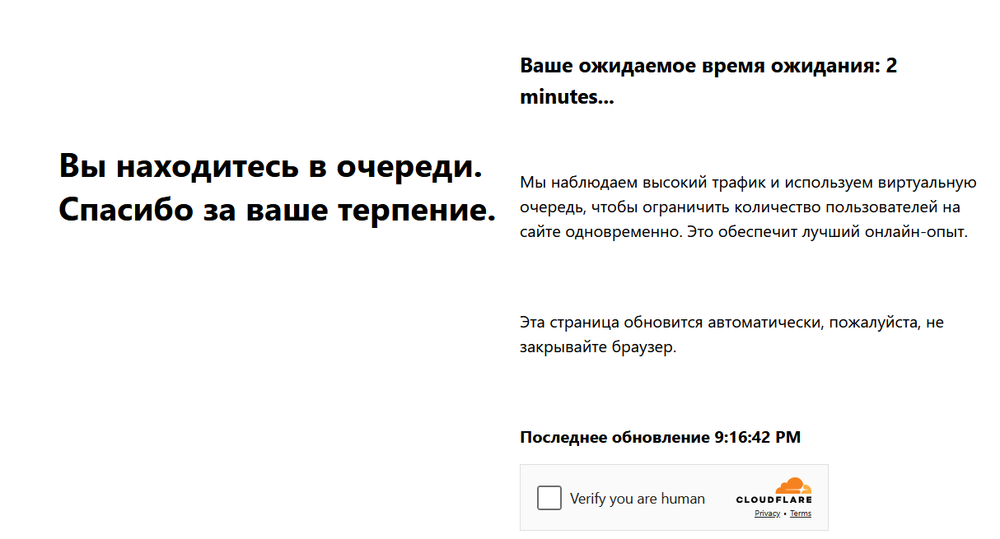

import Tabs from '@theme/Tabs';
import TabItem from '@theme/TabItem';
import ParamItem from '@theme/ParamItem';
import MethodItem from '@theme/MethodItem';
import MethodDescription from '@theme/MethodDescription'
import PriceBlock from '../../src/theme/PriceBlock';
import PriceBlockWrap from '@theme/PriceBlockWrap';
import BlogLink from '@theme/BlogLink';
import { ArticleHead } from '../../src/theme/ArticleHead';

<ArticleHead slug="captchas/turnstile-waitroom-task" />

# Cloudflare Waiting Room

<PriceBlockWrap>
  <PriceBlock title="Cloudflare Waiting Room" captchaId="cf-turnstile"/>
</PriceBlockWrap>

Новый механизм защиты сайтов от чрезмерного количества запросов: пользователю необходимо подождать в среднем около 3 минут, прежде чем продолжить работу с ресурсом:



Также данный тип Cloudflare можно определить по заголовку страницы:

 


<BlogLink url="https://capmonster.cloud/ru/blog/Cloudflare/what-is-cloudflare-captcha"/>
<BlogLink url="https://capmonster.cloud/ru/blog/Cloudflare/how-cloudflare-bot-challenge-and-turnstile-protect-web-traffic"/>

## Параметры запроса

:::warning **Внимание!**
* Для выполнения данной задачи используйте **ваши собственные прокси**.

* После решения вы получите **специальные cookie**, которые необходимо добавить в браузер.
:::

<TabItem value="proxyless" label="RecaptchaV2EnterpriseTaskProxyless (without proxy)" default className="bordered-panel">
  <ParamItem title="type" required type="string" />
  **TurnstileTask**

  ---

  <ParamItem title="websiteURL" required type="string" />
  Адрес страницы, на которой находится проверка

  ---

  <ParamItem title="websiteKey" required type="string" />
  Ключ Cloudflare на целевом сайте

  ---

  <ParamItem title="cloudflareTaskType" required type="string" />
  **wait_room**

  ---

  <ParamItem title="htmlPageBase64" required type="string" />
  HTML-страница в **формате base64**, на которой присутствует заголовок `<title>Waiting Room powered by Cloudflare</title>`

  ---

  <ParamItem title="userAgent" required type="string" />
  User-Agent браузера.<br /> 
  **Передавайте только актуальный UA от ОС Windows. Сейчас таковым является версия**: `userAgentPlaceholder`

  ---

  <ParamItem title="proxyType" required type="string" />
  **http** - обычный HTTP/HTTPS-прокси;<br />
  **https** - пробуйте этот вариант, если «http» не работает (требуется для некоторых кастомных прокси);<br />
  **socks4** - прокси типа SOCKS4;<br />
  **socks5** - прокси типа SOCKS5.

  ---

  <ParamItem title="proxyAddress" required type="string" />
  <p>
	IP адрес прокси IPv4/IPv6. Не допускается:
	- использование прозрачных прокси (там, где можно видеть IP клиента);
	- использование прокси на локальных машинах.
  </p>

  ---

  <ParamItem title="proxyPort" required type="integer" />
  Порт прокси.

  ---

  <ParamItem title="proxyLogin" required type="string" />
  Логин прокси-сервера.

  ---

  <ParamItem title="proxyPassword" required type="string" />
  Пароль прокси-сервера.

</TabItem>
---
## Метод создания задачи

<TabItem value="proxyless" label="TurnstileTask (без прокси)" default className="method-panel">
	<MethodItem>
		```http
		https://api.capmonster.cloud/createTask
		```
	</MethodItem>
	<MethodDescription>
		**Запрос**
		```json 
		{
		  "clientKey":"API_KEY",
		  "task": {
			"type":"TurnstileTask",
			"websiteURL":"https://example.com",
			"websiteKey":"xxxxxxxxxx",
			"cloudflareTaskType": "wait_room",
			"htmlPageBase64": "PCFET0NUWVBFIGh0...vYm9keT48L2h0bWw+",
			"userAgent": "userAgentPlaceholder",
			"proxyType":"http",
			"proxyAddress":"8.8.8.8",
			"proxyPort":8080,
			"proxyLogin":"proxyLoginHere",
			"proxyPassword":"proxyPasswordHere"
		  }
		}
		```
		**Ответ**
		```json
		{
		  "errorId":0,
		  "taskId":407533072
		}
		```
	</MethodDescription>
</TabItem>
---
## Метод получения результата задачи
Используйте метод [getTaskResult](../api/methods/get-task-result.mdx), чтобы получить решение Waiting Room. В зависимости от загрузки системы вы получите ответ через время в диапазоне от 5 до 20 с.

<TabItem value="proxyless" label="TurnstileTask (без прокси)" default className="method-panel-full">
  <MethodItem>
    ```http
    https://api.capmonster.cloud/getTaskResult
    ```
  </MethodItem>
  <MethodDescription>
    **Запрос**
    ```json
    {
      "clientKey": "API_KEY",
      "taskId": 407533072
    }
    ```

    **Ответ**
    ```json
    {
      "errorId": 0,
      "status": "ready",
      "solution": {
        "cf_clearance": "1tarGvbY2_ZhQdYxpSBloao.FoOn9VtcJtmb_IQ_hCE-1761217338-1.2.1.1-vyVPoLYIGX0VCJomVuLjF7n0kdM0PXaPjpDsRcohxGr7hb2CE7WfcHpmQZ70goqEjdWxPsDhSVaKNTz9opxWguiNdWEEq_.SceWXIqfP7tnEb69f3bP0mixNqcWy_5P_9INpoAEqr1k7aYU0r45PT4gPr5pwHxedVySyLRdoBXIJasdTE52YOQ3NPdGWTwQ_3h2n_wYqqIvf0kCSAvimRrmsgZxomlyejwqPI6ZHi.w"
      }
    }
    ```
  </MethodDescription>
</TabItem>

|**Свойство**|**Тип**|**Описание**|
| :- | :- | :- |
|cf_clearance|String|Специальные куки cloudflare, которые вы можете подставить в свой браузер|
