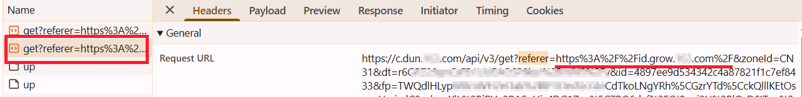

import Tabs from '@theme/Tabs';
import TabItem from '@theme/TabItem';
import ParamItem from '@theme/ParamItem';
import MethodItem from '@theme/MethodItem';
import MethodDescription from '@theme/MethodDescription'
import PriceBlock from '@theme/PriceBlock';
import PriceBlockWrap from '@theme/PriceBlockWrap';


# Yidun - NECaptcha

<PriceBlockWrap>
  <PriceBlock title="Yidun task" name="yidunToken"/>
</PriceBlockWrap>


:::warning **Внимание!**
Данная задача будет выполняться с использованием наших прокси-серверов.
:::

## Параметры запроса

  <TabItem value="proxy" label="YidunTask (при использовании прокси)" className="bordered-panel">
    <ParamItem title="type" required type="string" />
    **YidunTask**

    ---

    <ParamItem title="websiteURL" required type="string" />
    Полный URL страницы с капчей.

    ---

    <ParamItem title="websiteKey" required type="string" />
    Значение параметра siteKey, найденное на странице (*см. пример ниже, как его найти*).
	
    ---

	<ParamItem title="userAgent" type="string" />
    User-Agent браузера. <br /> 
	**Передавайте только актуальный UA от ОС Windows. Сейчас таковым является**: userAgentPlaceholder

	---

    <ParamItem title="proxyType" type="string" />
    **http** - обычный http/https прокси;<br />
	**https** - попробуйте эту опцию только если "http" не работает (требуется для некоторых кастомных прокси);<br />
	**socks4** - socks4 прокси;<br />
	**socks5** - socks5 прокси.

    ---

    <ParamItem title="proxyAddress" type="string" />
    <p>
      IP адрес прокси IPv4/IPv6. Не допускается:
		- использование имен хостов;
		- использование прозрачных прокси (там где можно видеть IP клиента);
		- использование прокси на локальных машинах.
    </p>

    ---

    <ParamItem title="proxyPort" type="integer" />
    Порт прокси.

    ---

    <ParamItem title="proxyLogin" type="string" />
    Логин прокси-сервера.

    ---

    <ParamItem title="proxyPassword" type="string" />
    Пароль прокси-сервера.

  </TabItem>

### Как получить websiteURL и websiteKey
Откройте *Инструменты разработчика*, активируйте капчу, перейдите во вкладку **Network** и среди запросов найдите тот, который начинается на `get?referer=` или `check?referer=`. Значение *referer* - это `websiteURL`. 



Иногда в URL `referer` закодирован, например: *https%3A%2F%2Fid.example.com%2F*. Чтобы получить читаемый адрес, его нужно декодировать, например, с помощью консоли в браузере:


Значение *id* - это `websiteKey`.


## Метод создания задачи
<Tabs className="full-width-tabs filled-tabs request-tabs" groupId="captcha-type">
  <TabItem value="proxyless" label="YidunTask (без прокси)" default className="method-panel">
	<MethodItem>
		```http
		https://api.capmonster.cloud/createTask
		```
	</MethodItem>
	<MethodDescription>
		**Запрос**
		```json
		{
			"clientKey": "API_KEY",
			"task": 
			{
				"type": "YidunTask",
				"websiteURL": "https://www.example.com",
				"websiteKey": "6cw0f0485d5d46auacf9b735d20218a5",
				"userAgent": "userAgentPlaceholder"
			}
		}
		```
		**Ответ**
		```json
		{
			"errorId":0,
			"taskId":407533077
		}
		```
	</MethodDescription>
  </TabItem>
  
  <TabItem value="proxy" label="YidunTask (при использовании прокси)" default className="method-panel">
	<MethodItem>
		```http
		https://api.capmonster.cloud/createTask
		```
	</MethodItem>
	<MethodDescription>
		**Запрос**
		```json
		{
			"clientKey": "API_KEY",
			"task": 
			{
				"type": "YidunTask",
				"websiteURL": "https://www.example.com",
				"websiteKey": "6cw0f0485d5d46auacf9b735d20218a5",
				"userAgent": "userAgentPlaceholder",
				"proxyType":"http",
				"proxyAddress":"8.8.8.8",
				"proxyPort":8080,
				"proxyLogin":"proxyLoginHere",
				"proxyPassword":"proxyPasswordHere"
			}
		}
		```
		**Ответ**
		```json
		{
			"errorId":0,
			"taskId":407533077
		}
		```
	</MethodDescription>
  </TabItem>
</Tabs>


## Метод получения результата задачи
Используйте метод [getTaskResult](../api/methods/get-task-result.md), чтобы получить решение Yidun капчи.

<TabItem value="proxyless" label="CustomTask (без прокси)" default className="method-panel-full">
  <MethodItem>
    ```http
    https://api.capmonster.cloud/getTaskResult
    ```
  </MethodItem>
  <MethodDescription>

  **Запрос**
  ```json
  {
    "clientKey": "API_KEY",
    "taskId": 407533077
  }
  ```

  **Ответ**
  ```json
  {
    "errorId": 0,
    "errorCode": null,
    "errorDescription": null,
    "solution": {
      "token": "CN31_9AwsPmaYcJameP_09rA0vkVMQsPij...RXTlFJFc3"
    },
    "status": "ready"
  }
  ```
  </MethodDescription>
</TabItem>
