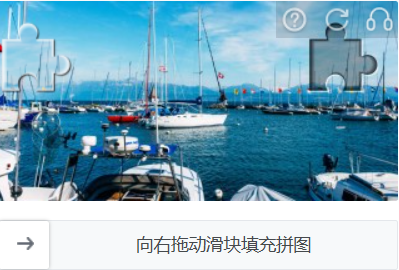
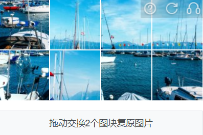
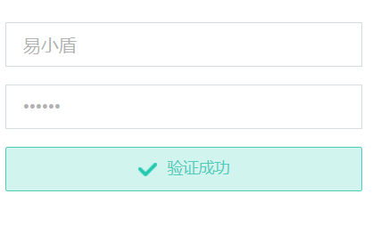
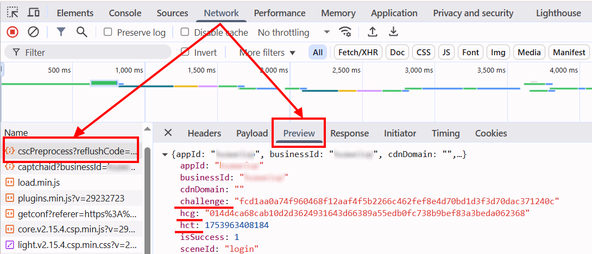

import Tabs from '@theme/Tabs';
import TabItem from '@theme/TabItem';
import ParamItem from '@theme/ParamItem';
import MethodItem from '@theme/MethodItem';
import MethodDescription from '@theme/MethodDescription'
import PriceBlock from '@theme/PriceBlock';
import PriceBlockWrap from '@theme/PriceBlockWrap';
import { ArticleHead } from '../../src/theme/ArticleHead';

<ArticleHead slug="captchas/yidun-task" />


# Yidun - NECaptcha

<PriceBlockWrap>
  <PriceBlock title="Yidun task" captchaId="yidun"/>
</PriceBlockWrap>

## Примеры заданий

<Tabs className="full-width-tabs">
  <TabItem value="jigsaw" label="Jigsaw" default>
    
  </TabItem>
  <TabItem value="picture-click" label="Picture-click">
    
  </TabItem>
  <TabItem value="avoid" label="Avoid">
    
  </TabItem>
  <TabItem value="icon-click" label="Icon-click">
    
  </TabItem>
  <TabItem value="inference" label="Inference">
    
  </TabItem>
  <TabItem value="sense" label="Sense">
    
  </TabItem>
  <TabItem value="space-inference" label="Space-inference">
    
  </TabItem>
</Tabs>

:::warning **Внимание!**
CapMonster Cloud по умолчанию работает через встроенные прокси — они уже включены в стоимость. Указывать собственные прокси требуется только в тех случаях, когда сайт не принимает токен или доступ к встроенным сервисам ограничен.

Если прокси с авторизацией по IP, то необходимо добавить адрес **65.21.190.34** в белый список.
:::

## Параметры запроса

<TabItem value="proxy" label="YidunTask (при использовании прокси)" className="bordered-panel">

  <ParamItem title="type" required type="string" />
  **YidunTask**

  ---

  <ParamItem title="websiteURL" required type="string" />
  Полный URL страницы с капчей.

  ---

  <ParamItem title="websiteKey" required type="string" />
  Значение параметра siteKey, найденное на странице (*см. пример ниже, как его найти*).

  ---

  <ParamItem title="userAgent" type="string" />
  User-Agent браузера. <br />
  **Передавайте только актуальный UA от ОС Windows. Сейчас таковым является**: `userAgentPlaceholder`

  ---

  <ParamItem title="yidunGetLib" type="string" optional />
  Путь к JavaScript-файлу, загружающему капчу на странице.  
  **Важно**: указывайте полную ссылку (https://...).  
  Рекомендуется использовать, если на сайте присутствуют поля `challenge`, `hcg`, `hct`.

  ---

  <ParamItem title="yidunApiServerSubdomain" type="string" optional />
  Поддомен Yidun API сервера.  
  **Важно**: должен отличаться от стандартных `c.dun.163.com` и `c-v6.dun.163.com`.  
  Допустимо указывать как с https://, так и без.  
  Обязателен, если используется кастомный сервер (часто бывает в Enterprise-версиях).

  ---

  <ParamItem title="challenge" type="string" optional />
  Уникальный идентификатор текущей капчи.  
  Обычно передаётся в сетевых запросах при инициализации или отображении капчи.  
  Признак Enterprise-капчи.

  ---

  <ParamItem title="hcg" type="string" optional />
  Хеш капчи, используется при формировании запроса.  
  Можно получить вместе с `challenge`.

  ---

  <ParamItem title="hct" type="integer" optional />
  Числовой временной идентификатор/штамп, используемый при валидации Enterprise-версии.

  ---

  <ParamItem title="proxyType" type="string" />
  **http** - обычный http/https прокси;<br />
  **https** - попробуйте эту опцию, только если "http" не работает (требуется для некоторых кастомных прокси);<br />
  **socks4** - socks4 прокси;<br />
  **socks5** - socks5 прокси.

  ---

  <ParamItem title="proxyAddress" type="string" />
  <p>
    IP адрес прокси IPv4/IPv6. Не допускается:
    - использование прозрачных прокси (там где можно видеть IP клиента);
    - использование прокси на локальных машинах.
  </p>

  ---

  <ParamItem title="proxyPort" type="integer" />
  Порт прокси.

  ---

  <ParamItem title="proxyLogin" type="string" />
  Логин прокси-сервера.

  ---

  <ParamItem title="proxyPassword" type="string" />
  Пароль прокси-сервера.

  ---

</TabItem>

## Метод создания задачи
<Tabs className="full-width-tabs filled-tabs request-tabs" groupId="captcha-type">
  <TabItem value="proxyless" label="YidunTask (без прокси)" default className="method-panel">
    <MethodItem>
      ```http
      https://api.capmonster.cloud/createTask
      ```
    </MethodItem>
    <MethodDescription>
      
      **Запрос**
      ```json
      {
        "clientKey": "API_KEY",
        "task": {
          "type": "YidunTask",
          "websiteURL": "https://www.example.com",
          "websiteKey": "6cw0f0485d5d46auacf9b735d20218a5",
          "userAgent": "userAgentPlaceholder"
        }
      }
      ```

      **Ответ**
      ```json
      {
        "errorId": 0,
        "taskId": 407533077
      }
      ```
    </MethodDescription>
  </TabItem>

  <TabItem value="proxy" label="YidunTask (с прокси)" className="method-panel">
    <MethodItem>
      ```http
      https://api.capmonster.cloud/createTask
      ```
    </MethodItem>
    <MethodDescription>
      
      **Запрос**
      ```json
      {
        "clientKey": "API_KEY",
        "task": {
          "type": "YidunTask",
          "websiteURL": "https://www.example.com",
          "websiteKey": "6cw0f0485d5d46auacf9b735d20218a5",
          "userAgent": "userAgentPlaceholder",
          "proxyType": "http",
          "proxyAddress": "8.8.8.8",
          "proxyPort": 8080,
          "proxyLogin": "proxyLoginHere",
          "proxyPassword": "proxyPasswordHere"
        }
      }
      ```

      **Ответ**
      ```json
      {
        "errorId": 0,
        "taskId": 407533077
      }
      ```
    </MethodDescription>
  </TabItem>
</Tabs>

## Метод получения результата задачи
Используйте метод [getTaskResult](../api/methods/get-task-result.mdx), чтобы получить решение Yidun капчи.

<TabItem value="proxyless" label="CustomTask (без прокси)" default className="method-panel-full">
  <MethodItem>
    ```http
    https://api.capmonster.cloud/getTaskResult
    ```
  </MethodItem>
  <MethodDescription>

  **Запрос**
  ```json
  {
    "clientKey": "API_KEY",
    "taskId": 407533077
  }
  ```

  **Ответ**
  ```json
  {
    "errorId": 0,
    "errorCode": null,
    "errorDescription": null,
    "solution": {
      "token": "CN31_9AwsPmaYcJameP_09rA0vkVMQsPij...RXTlFJFc3"
    },
    "status": "ready"
  }
  ```
  </MethodDescription>
</TabItem>

### Когда нужны `yidunGetLib` и `yidunApiServerSubdomain`?
Если на странице в сетевых запросах (**Network**) вы находите параметры `challenge`, `hcg`, `hct` - значит, используется Enterprise (или Business) версия Yidun, и следует дополнительно передать `yidunGetLib` и `yidunApiServerSubdomain` для корректного решения.

<details>
  <summary>Пример задачи</summary>

```json
{
  "type": "YidunTask",
  "websiteURL": "https://id7.cloud.example.com/IframeLogin.html",
  "websiteKey": "0f123r2a6am56431yg17n8rz6grz0ym6",
  "userAgent": "userAgentPlaceholder",
  "yidunGetLib": "https://example.com/captcha/b/v3//static/load.min.js",
  "yidunApiServerSubdomain": "csc-captcha-example.com",
  "challenge": "abc55382321547556267884cc3ba57c3d8a7c14f541fd9c6a7f1ce3173d3b9a1",
  "hcg": "9a217825f3dcfac3d34e551e93819d610dec931e5e2a2236edf0e1f3f320c191",
  "hct": 1751469954806
}
```
</details> 
---

## Как найти `websiteURL` и `websiteKey`
Откройте *Инструменты разработчика*, активируйте капчу, перейдите во вкладку **Network** и среди запросов найдите тот, который начинается на `get?referer=` или `check?referer=`. Значение *referer* - это `websiteURL`. 


Иногда в URL `referer` закодирован, например: *https%3A%2F%2Fid.example.com%2F*. Чтобы получить читаемый адрес, его нужно декодировать, например, с помощью консоли в браузере:


Значение *id* - это `websiteKey`.


---

**Для Yidun Enterprise:**

`websiteURL`, `websiteKey` и `yidunApiServerSubdomain` можно найти аналогично обычной Yidun капче в запросах, начинающихся на `get?referer=` или `check?referer=`


---
**`yidunGetLib`**

Путь к JavaScript-файлу, который отвечает за загрузку капчи на странице, обычно можно найти в сетевых запросах. Чаще всего он имеет имя вроде `load.min.js`.


---
**`challenge`**, **`hcg`**, **`hct`**

Все эти параметры можно найти в сетевых запросах. Обычно соответствующий запрос начинается с `cscPreprocess?reflushCode=`.



## Используйте библиотеку SDK

<Tabs className="full-width-tabs filled-tabs request-tabs" groupId="captcha-type">

  <TabItem value="js" label="JavaScript" default className="method-panel">
<details>
      <summary>Показать код (для браузера)</summary>
  ```js
  // https://github.com/ZennoLab/capmonstercloud-client-js

  import { CapMonsterCloudClientFactory, ClientOptions, YidunRequest } from '@zennolab_com/capmonstercloud-client';

  const API_KEY = "YOUR_API_KEY"; // Укажите ваш API-ключ CapMonster Cloud

  document.addEventListener("DOMContentLoaded", async () => {
      const client = CapMonsterCloudClientFactory.Create(
          new ClientOptions({ clientKey: API_KEY })
      );

      // Базовый пример без прокси
      // CapMonster Cloud автоматически использует свои прокси
      let yidunRequest = new YidunRequest({
          websiteURL: "https://www.example.com",  // URL страницы с капчей
          websiteKey: "6cw0f0485d5d46auacf9b735d20218a5",
          userAgent: "userAgentPlaceholder"
      });

      // Пример использования вашего собственного прокси
      // Раскомментируйте данный блок, если вы хотите использовать собственный прокси
      /*
      const proxy = {
          proxyType: "http",
          proxyAddress: "123.45.67.89",
          proxyPort: 8080,
          proxyLogin: "username",
          proxyPassword: "password"
      };

      yidunRequest = new YidunRequest({
          websiteURL: "https://www.example.com",                 
          websiteKey: "6cw0f0485d5d46auacf9b735d20218a5",
          userAgent: "userAgentPlaceholder",
          proxy
      });
      */

      // При необходимости можно проверить баланс
      const balance = await client.getBalance();
      console.log("Balance:", balance);

      const result = await client.Solve(yidunRequest);
      console.log("Solution:", result);
  });
````
</details>

<details>
      <summary>Показать код (Node.js)</summary>
      ```JavaScript
      // https://github.com/ZennoLab/capmonstercloud-client-js

      import { CapMonsterCloudClientFactory, ClientOptions, YidunRequest } from '@zennolab_com/capmonstercloud-client';

      const API_KEY = "YOUR_API_KEY"; // Укажите ваш API-ключ CapMonster Cloud

      async function solveYidun() {
          const client = CapMonsterCloudClientFactory.Create(
              new ClientOptions({ clientKey: API_KEY })
          );

          // Базовый пример без прокси
          // CapMonster Cloud автоматически использует свои прокси
          let yidunRequest = new YidunRequest({
              websiteURL: "https://www.example.com", // URL страницы с капчей
              websiteKey: "6cw0f0485d5d46auacf9b735d20218a5",
              userAgent: "userAgentPlaceholder"
          });

          // Пример использования вашего собственного прокси
          // Раскомментируйте данный блок, если вы хотите использовать собственный прокси

          /*
          const proxy = {
              proxyType: "http",
              proxyAddress: "123.45.67.89",
              proxyPort: 8080,
              proxyLogin: "username",
              proxyPassword: "password"
          };

          yidunRequest = new YidunRequest({
              websiteURL: "https://www.example.com",  // URL страницы с капчей
              websiteKey: "6cw0f0485d5d46auacf9b735d20218a5",
              userAgent: "userAgentPlaceholder",
              proxy
          });
          */

          // При необходимости можно проверить баланс
          const balance = await client.getBalance();
          console.log("Balance:", balance);

          const result = await client.Solve(yidunRequest);
          console.log("Solution:", result);
      }

      solveYidun().catch(err => console.error("Ошибка:", err));
```     

</details>
  </TabItem>

  <TabItem value="python" label="Python" default className="method-panel">
<details>
      <summary>Показать код</summary>
```python
# https://github.com/ZennoLab/capmonstercloud-client-python

import asyncio
from capmonstercloudclient import CapMonsterClient, ClientOptions
from capmonstercloudclient.requests import YidunRequest
# from capmonstercloudclient.requests.baseRequestWithProxy import ProxyInfo  # Раскомментируйте, если планируете использовать прокси

API_KEY = "YOUR_API_KEY"  # Укажите ваш API-ключ CapMonster Cloud

async def solve_yidun_captcha():
    client_options = ClientOptions(api_key=API_KEY)
    cap_monster_client = CapMonsterClient(options=client_options)

    # Базовый пример без прокси
    # CapMonster Cloud автоматически использует свои прокси
    yidun_request = YidunRequest(
        websiteUrl="https://www.example.com",  # URL страницы с капчей
        websiteKey="6cw0f0485d5d46auacf9b735d20218a5",
        userAgent="userAgentPlaceholder"  # Используйте актуальный UserAgent
    )

    # Пример использования вашего собственного прокси
    # Раскомментируйте данный блок, если вы хотите использовать собственный прокси

    # proxy = ProxyInfo(
    #     proxyType="http",
    #     proxyAddress="123.45.67.89",
    #     proxyPort=8080,
    #     proxyLogin="username",
    #     proxyPassword="password"
    # )
    #
    # yidun_request = YidunRequest(
    #     websiteUrl="https://www.example.com",
    #     websiteKey="6cw0f0485d5d46auacf9b735d20218a5",
    #     userAgent="userAgentPlaceholder",
    #     proxy=proxy
    # )

    # При необходимости можно проверить баланс
    balance = await cap_monster_client.get_balance()
    print("Balance:", balance)

    result = await cap_monster_client.solve_captcha(yidun_request)
    print("Solution:", result)

asyncio.run(solve_yidun_captcha())
```
</details>

  </TabItem>

  <TabItem value="csharp" label="C#" className="method-panel">

<details>
      <summary>Показать код</summary>
```csharp
// https://github.com/ZennoLab/capmonstercloud-client-dotnet

using System;
using System.Threading.Tasks;
using Zennolab.CapMonsterCloud;
using Zennolab.CapMonsterCloud.Requests;

class Program
{
    static async Task Main(string[] args)
    {
        // Укажите ваш API-ключ CapMonster Cloud
        var clientOptions = new ClientOptions
        {
            ClientKey = "YOUR_API_KEY"
        };

        var cmCloudClient = CapMonsterCloudClientFactory.Create(clientOptions);

        // Базовый пример без прокси
        // CapMonster Cloud автоматически использует свои прокси
        var yidunRequest = new YidunTaskRequest
        {
            WebsiteUrl = "https://example.com",  // URL страницы с капчей
            WebsiteKey = "7ce0f0475b5d46acacf9b732a29218d9",
            UserAgent = "userAgentPlaceholder"
        };

        // Пример использования вашего собственного прокси
        // Раскомментируйте данный блок, если вы хотите использовать собственный прокси

        /*
        var yidunRequest = new YidunTaskRequest
        {
            WebsiteUrl = "https://example.com",
            WebsiteKey = "6ce0f0475b5d46acacf9b732d29218d8",
            UserAgent = "userAgentPlaceholder",

            Proxy = new ProxyContainer(
                "123.45.67.89",  
                8080,              
                ProxyType.Http,    
                "username",       
                "password"     
            )
        };
        */

        // При необходимости можно проверить баланс
        var balance = await cmCloudClient.GetBalanceAsync();
        Console.WriteLine("Balance: " + balance);

        var yidunResult = await cmCloudClient.SolveAsync(yidunRequest);

        Console.WriteLine("Solution: " + yidunResult.Solution.Value);
    }
}
```
</details>
  </TabItem>

</Tabs>

