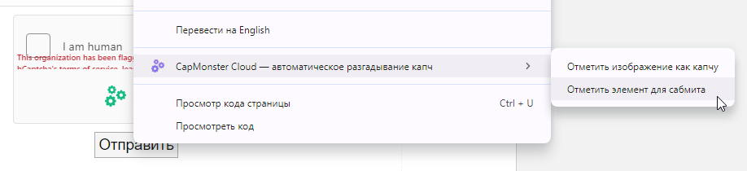
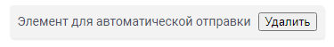
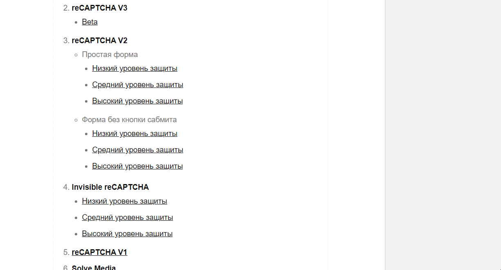

# Автосабмит в расширении
Часто возникает необходимость выполнить какое-либо целевое действие (например, нажатие кнопки) после непосредственного решения капчи.  
Расширение CapMonster Cloud позволяет выбрать элемент для автоматического клика по какому-либо элементу.

## Инструкция выбора элемента для автосабмита
1. Перейдите на сайт с капчей.
2. Кликните правой кнопкой мыши по кнопке (или другому элементу), которая должна быть нажата после решения капчи. 
3. В открывшемся меню выберите "CapMonster Cloud - автоматическое разгадывание капч" -> "Отметить элемент для сабмита". 
 

4. После этого на форме отобразится информационное сообщение "Элемент для автоматической отправки" и кнопка "Удалить", позволяющая удалить элемент для автосабмита.   
 

5. При последующих решениях капч на данной странице расширением после успешного решения капчи будет автоматически нажиматься элемент, выбранный для сабмита. 

## Возможность использования автосабмита
В настоящее время автосабмит может быть использован только в расширении **Google Chrome** при решении **токеном**. 
Автосабмит доступен для следующих типов капч:
- ReCaptcha,
- GeeTest,
- Turnstile.
