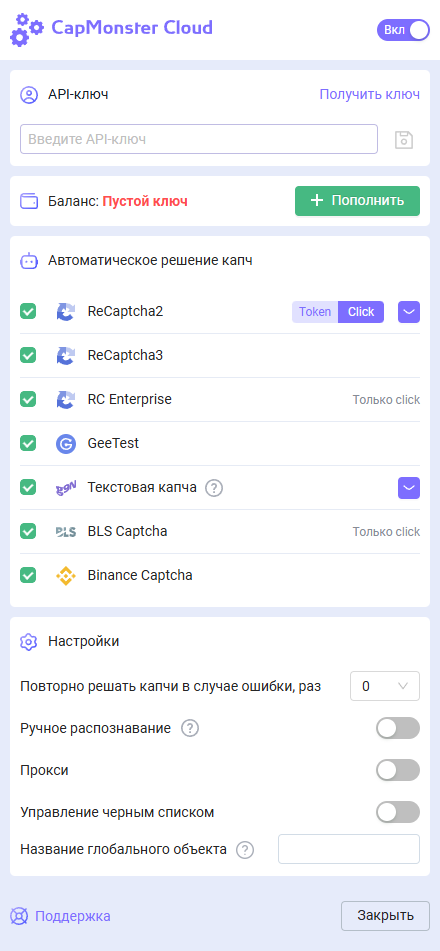

import { ArticleHead } from '../../src/theme/ArticleHead';

<ArticleHead slug="extension/extension-firefox" />

# Расширение для браузера Firefox

## Описание
С помощью данного расширения можно распознавать капчи в автоматическом режиме прямо в браузере.

Расширение предназначено для работы в браузере Mozilla Firefox.

-----
## Автоматическая установка
1. Откройте [Интернет-магазин Firefox](https://addons.mozilla.org/ru/firefox/addon/capmonster-cloud/).
2. Нажмите **Добавить в Firefox**.
3. Подтвердите добавление расширения, нажав кнопку "Добавить" в модальном окне.
   

Чтобы начать работу с расширением, нажмите на его значок справа от адресной строки. Переходите к [настройкам](#настройки).

*Если по какой-то причине не удалось установить расширение из интернет-магазина, воспользуйтесь инструкцией по ручной установке.*

    
Ручная установка расширения

1. Скачайте [архив с расширением](https://zenno.link/firefox-actual-build).

2. Откройте браузер Firefox и перейдите к работе с расширениями:
   
   
3. Нажмите кнопку шестеренки, в открывшемся выпадающем списке выберите пункт **Установить дополнение из файла…**
   
   
4. Выберите скачанный архив с расширением.

5. После загрузки расширения перейдите в **Управление расширениями** и нажмите на установленное расширение. 
   
   
6. Перейдите во вкладку **Разрешения** и убедитесь, что все разрешения выданы.
   

    
Ручное обновление расширения

Если вы устанавливаете расширение поверх предыдущей версии, после обновления исходных файлов необходимо также нажать кнопку **Обновить** на странице **Управление расширениями**. (Инструкции по открытию этой страницы приведены выше в разделе **Ручная установка**.)

-----
## Настройки

    
Как закрепить расширение

По умолчанию вновь установленное расширение автоматически закрепляется на панели браузера. 
   

После активации вы увидите окно:

 
### API ключ
Введите API-ключ в соответствующее поле(**1**), нажмите кнопку **Сохранить**(**2**). Если вы ввели правильный ключ, то ниже отобразится ваш баланс(**3**)

 
### Автоматическое решение капч
Здесь вы можете выбрать те типы капч, которые расширение будет распознавать автоматически

 

:::info !

Может потребоваться перезагрузка страницы с капчей для вступления изменений в силу!

:::
### Повторно решать капчи в случае ошибки
Если с первой попытки не удалось решить капчу, то расширение будет отправлять повторные задание, пока капча не будет решена, либо пока не будет достигнут лимит, указанный в данной настройке.
### Прокси
 

Здесь можно указать прокси, который будет отправлен вместе с задачей на распознавание.

“Логин” и “Пароль” указывать необязательно.
### Управление чёрным списком
С помощью чёрного списка можно настроить сайты, на которых расширение будет игнорировать капчу.

После включения данной опции появится поле для ввода сайтов:

 

Домены нужно указывать вместе с протоколом (https:// или http://)
Можно использовать маски поиска:

- ? - любой один символ кроме точки
- \* - любое количество любых символов

Примеры:

|**Фильтр**|**Пояснение**|
| :-: | :-: |
|`https://zennolab.com`|Запрет работы расширения на сайте `https://zennolab.com`|
|`https://*.zennolab.com`|Запрет работы расширения на всех поддоменах `https://zennolab.com`|
|`https://www.google.*`|Запрет работы расширения на google во всех зонах (ru, com, com.ua и т.д.)|

При возникновении ошибок в разгадывании капч см. [глоссарий ошибок](/api/api-errors.mdx).

## Маппинг (отображение) параметров капч

Расширение CapMonster Cloud предоставляет удобный способ просмотра параметров различных типов капч, необходимых для их правильной отправки на сервер и успешного решения. Отображаемые данные позволяют убедиться в корректности передаваемых параметров и могут использоваться в качестве примера при формировании ваших API-запросов.

### Поддерживаемые типы капч и их параметры

| Тип капчи                   | Какие параметры отображаются                                                                                              |
| --------------------------- | ------------------------------------------------------------------------------------------------------------------------- |
| **reCAPTCHA V2**            | `class`, `imageUrls`, `Task` (внутри `metadata`), `Grid` (внутри `metadata`), `recognizingThreshold`, `userAgent`, `type` |
| **reCAPTCHA V2 Invisible**  | `class`, `imageUrls`, `Task` (внутри `metadata`), `Grid` (внутри `metadata`), `recognizingThreshold`, `userAgent`, `type` |
| **reCAPTCHA V2 Enterprise** | `class`, `imageUrls`, `Task` (внутри `metadata`), `Grid` (внутри `metadata`), `recognizingThreshold`, `userAgent`, `type` |
| **reCAPTCHA V3**            | `websiteURL`, `websiteKey`, `pageAction`, `minScore`, `type`                                                              |
| **GeeTest v3**              | `websiteURL`, `gt`, `challenge`, `userAgent`, `type`                                                                      |
| **GeeTest v4**              | `websiteURL`, `gt` (`captcha_id`), `userAgent`, `version`, `type`                                                         |
| **Cloudflare Turnstile**    | `websiteURL`, `websiteKey`, `userAgent`, `type`                                                                           |
| **Cloudflare Challenge**    | `websiteURL`, `websiteKey`, `userAgent`, `pageAction`, `data`, `pageData`, `cloudflareTaskType`, `type`                   |
| **ImageToText**             | `body` (в формате `base64`), `type`                                                                                       |
| **BLS**                     | `class`, `imagesBase64`, `Task` (внутри `metadata`), `TaskArgument` (внутри `metadata`), `type`                           |
| **Binance**                 | `websiteURL`, `websiteKey`, `validateId`, `userAgent`, `type`                                                             |

Чтобы воспользоваться этой функцией, активируйте расширение, откройте страницу с капчей (убедитесь, что её тип поддерживается и выбран для решения), затем выполните следующие шаги:

1. Откройте **Инструменты разработчика (DevTools)** и перейдите на вкладку **Capmonster Cloud**:
   
   

2. Перезагрузите страницу.

Параметры выбранной капчи отобразятся автоматически:

