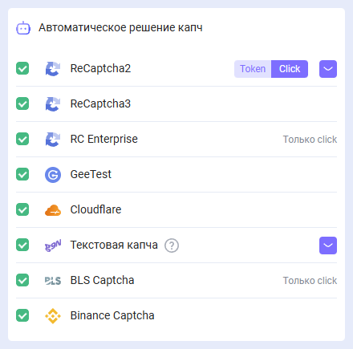

# Расширение для браузера Chrome

## Описание
С помощью данного расширения можно распознавать капчи в автоматическом режиме прямо в браузере.

Расширение предназначено для работы в браузере Google Chrome.

-----
## Автоматическая установка
**Важно!** В режиме инкогнито и гостевом режиме устанавливать расширения нельзя.

1. Откройте [Интернет-магазин Chrome](https://chrome.google.com/webstore/detail/capmonster-cloud-%E2%80%94-automa/pabjfbciaedomjjfelfafejkppknjleh?hl=ru).
1. Нажмите **Установить**.

Чтобы начать работу с расширением, нажмите на его значок справа от адресной строки. Переходите к [настройкам](#настройки).

*Если по какой-то причине не удалось установить расширение из библиотеки Google Chrome, воспользуйтесь инструкцией по ручной установке.*

    
Ручная установка расширения

1. Скачайте [архив с раcширением](https://zenno.link/chrome-actual-build).

2. Распакуйте скачанный архив в папку с любым именем. 
   
   **ВНИМАНИЕ**: данную папку впоследствии удалять нельзя иначе расширение в браузере перестанет работать.
3. В браузере Google Chrome перейдите на страницу “Управление расширениями”, одним из трёх способов:
   1. Введите в адресную строку браузера chrome://extensions и нажмите клавишу Enter.
   2. Через меню: нажмите в правом верхнем углу (возле изображения профиля) три вертикальные точки, затем “Дополнительные инструменты”, потом “Расширения”.

  

   3. Либо перейдите в настройки Google Chrome и справа в меню выберите пункт “Расширения” (в самом низу)

  

4. Включите “Режим разработчика”
5. Снизу появится новое меню в котором нужно выбрать кнопку “Загрузить распакованное расширение”. 

  

6. Появится стандартный для Вашей ОС диалог поиска файлов/директорий, отыщите и выберете папку, в которую распаковали архив.
7. После этого расширение должно появиться в списке установленных

  

    
Ручное обновление расширения

Если вы устанавливаете расширение поверх предыдущей версии, то при обновлении исходных файлов расширения Вам так же нужно нажать кнопку обновить на странице “Управление расширениями” (как открыть эту страницу описано, выше в секции “Ручная установка”)

-----
## Настройки

    
Как закрепить расширение

По умолчанию вновь установленное расширение скрыто. Чтоб оно постоянно отображалось его нужно закрепить, кликнув на соответствующий значок.

После активации Вы увидите перед собой такое окно:

 
### API ключ
Введите API ключ в соответствующее поле(1), нажмите кнопку сохранить(2). Если Вы ввели правильный ключ, то чуть ниже отобразится Ваш баланс(3)

 

### Автоматическое решение капч
Здесь Вы можете выбрать те типы капч, которые расширение будет распознавать автоматически

 

:::info !
Может потребоваться перезагрузка страницы с капчей для вступления изменений в силу!
:::

### Повторно решать капчи в случае ошибки
Если с первой попытки не удалось решить капчу, то расширение будет отправлять повторные задание, пока капча не будет решена, либо пока не будет достигнут лимит, указанный в данной настройке.

### Прокси
 

Здесь можно указать прокси, который будет отправлен вместе с задачей на распознавание.

“Логин” и “Пароль” указывать не обязательно.

### Управление чёрным списком
С помощью чёрного списка можно настроить сайты, на которых расширение будет игнорировать капчу.

После включения данной опции появится поле для ввода сайтов:

 

Домены нужно указывать вместе с протоколом (https:// или http://)
Можно использовать маски поиска:

- ? - любой один символ кроме точки
- \* - любое количество любых символов

Примеры:

|**Фильтр**|**Пояснение**|
| :-: | :-: |
|`https://zennolab.com`|Запрет работы расширения на сайте `https://zennolab.com`|
|`https://*.zennolab.com`|Запрет работы расширения на всех поддоменах `https://zennolab.com`|
|`https://www.google.*`|Запрет работы расширения на google во всех зонах (ru, com, com.ua и т.д.)|

При возникновении ошибок в разгадывании капч см. [глоссарий ошибок](/api/api-errors.md).

## Маппинг (отображение) параметров капч

Расширение CapMonster Cloud предоставляет удобный способ просмотра параметров различных типов капч, необходимых для их правильной отправки на сервер и успешного решения. Отображаемые данные позволяют убедиться в корректности передаваемых параметров и могут использоваться в качестве примера при формировании ваших API-запросов.

### Поддерживаемые типы капч и их параметры

| Тип капчи                     | Какие параметры отображаются                                                                 |
|------------------------------|----------------------------------------------------------------------------------------------|
| **reCAPTCHA V2**             | `class`, `imageUrls`, `Task` (внутри `metadata`), `Grid` (внутри `metadata`), `recognizingThreshold`, `userAgent`, `type` |
| **reCAPTCHA V2 Invisible**  | `class`, `imageUrls`, `Task` (внутри `metadata`), `Grid` (внутри `metadata`), `recognizingThreshold`, `userAgent`, `type` |
| **reCAPTCHA V2 Enterprise** | `class`, `imageUrls`, `Task` (внутри `metadata`), `Grid` (внутри `metadata`), `recognizingThreshold`, `userAgent`, `type` |
| **GeeTest v3**              | `websiteURL`, `gt`, `challenge`, `userAgent`, `type`                                         |
| **GeeTest v4**              | `websiteURL`, `gt` (`captcha_id`), `userAgent`, `version`, `type`                            |
| **Cloudflare Turnstile**    | `websiteURL`, `websiteKey`, `userAgent`, `type`                                              |
| **Cloudflare Challenge**    | `websiteURL`, `websiteKey`, `userAgent`, `pageAction`, `data`, `pageData`, `cloudflareTaskType`, `type` |
| **ImageToText**             | `body` (в формате `base64`), `type`                                                          |
| **BLS**                     | `class`, `imagesBase64`, `Task` (внутри `metadata`), `TaskArgument` (внутри `metadata`), `type` |
| **Binance**                 | `websiteURL`, `websiteKey`, `validateId`, `userAgent`, `type`                                |

Чтобы воспользоваться этой функцией, активируйте расширение, откройте страницу с капчей (убедитесь, что её тип поддерживается и выбран для решения), затем выполните следующие шаги:

1. Откройте **Инструменты разработчика** (DevTools) и перейдите на вкладку **Capmonster Cloud**:
   
   

2. Перезагрузите страницу.

Параметры выбранной капчи отобразятся автоматически:

