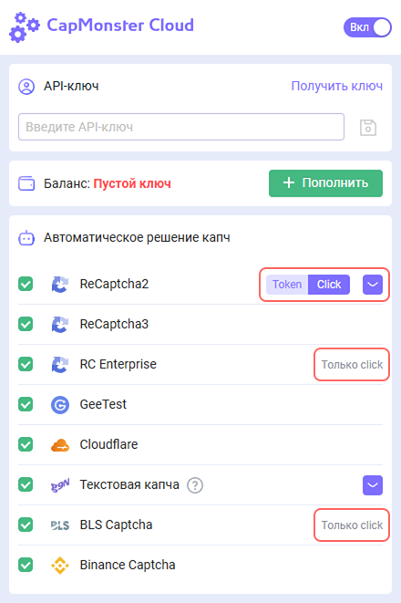

import { ArticleHead } from '../../src/theme/ArticleHead';

<ArticleHead slug="extension/install-instruction" />

# Инструкция по установке расширения CapMonster Cloud в браузер ProjectMaker

:::info
Расширение работает только с типом браузера Chromium!
:::

## Способ №1: Установка с помощью CRX-файла.
1. Скачайте [CRX-файл CapMonster Cloud](https://chrome.google.com/webstore/detail/capmonster-cloud-%E2%80%94-automa/pabjfbciaedomjjfelfafejkppknjleh?hl=ru);

:::info
Инструкцию по установке CRX-файла можно посмотреть [тут](https://zennolab.atlassian.net/wiki/spaces/RU/pages/2081423361#%D0%9A%D0%B0%D0%BA-%D1%81%D0%BA%D0%B0%D1%87%D0%B0%D1%82%D1%8C-crx-%D1%84%D0%B0%D0%B9%D0%BB-%D1%80%D0%B0%D1%81%D1%88%D0%B8%D1%80%D0%B5%D0%BD%D0%B8%D1%8F).
:::

2. Откройте ProjectMaker;

3. Добавьте экшен **Установить расширение**. В настройках экшена укажите путь до CRX-файла;

4. Добавьте экшен **Активировать расширение**;

5. В настройках экшена установите ID расширения **pabjfbciaedomjjfelfafejkppknjleh**;

6. Введите API-ключ из личного кабинета CapMonster Cloud в открывшемся окне расширения.

## Способ №2: Установка через интернет-магазин Google Chrome.
1. Откройте ProjectMaker;
2. Перейдите на страницу расширения `<https://chrome.google.com/webstore/detail/capmonster-cloud-%E2%80%94-automa/pabjfbciaedomjjfelfafejkppknjleh?hl=ru>` ;
3. Установить расширение, нажав кнопку **Установить**;
4. Добавьте экшен **Активировать расширение**. В настройках экшена вставить ID расширения; **pabjfbciaedomjjfelfafejkppknjleh**;

5. Введите API-ключ из личного кабинета CapMonster Cloud в открывшемся окне расширения.
:::info
В новой версии расширения CapMonster Cloud добавлена возможность решения  `reCAPTCHA2`, `reCAPTCHA Enterprise` с помощью кликов.
:::
 
:::caution
Обратите внимание, что при установке расширения, по дефолту устанавливается тип решения  `reCAPTCHA2`, `reCAPTCHA Enterprise` **через клики**.
:::
Для удобства использования расширения CapMonster Cloud в браузере ProjectMaker мы подготовили проект для автоматизации установки расширения, ввода API-ключа, а также выбор типа решения `reCAPTCHA2`, `reCAPTCHA Enterprise`.

***Минимальная версия ZennoPoster 7.6.1***

:::caution
При установке расширения CapMonster Cloud через CRX-файл необходимо следить за актуальностью версии расширения. В случае обновления версии нужно заново скачать актуальный CRX-файл и переустановить его.
:::
:::caution
При использовании расширения CapMonster Cloud необходимо удалить из вашего проекта экшены распознавания капчи.
:::