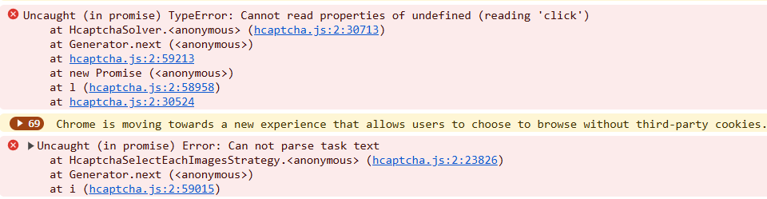

import { ArticleHead } from '../../src/theme/ArticleHead';

<ArticleHead slug="extension/known-issues" />

# Известные проблемы


<details>
        <summary>store.steampowered.com</summary>

Наш сервис умеет решать только капчи на английском языке, на данном сайте определение языка капчи идет не от системных настроек, а от выбранного на сайте языка, поэтому для корректного решение обязательно выбирайте английский язык.

</details>

<details>
        <summary>Ошибка 'Uncaught (in promise) TypeError: Cannot read properties of undefined (reading 'click')'</summary>

Если при решении капчи методом кликов (ComplexImageTask) через расширение CapMonster Cloud возникает ошибка 'Uncaught (in promise) TypeError: Cannot read properties of undefined (reading 'click')', как показано на скриншоте, рекомендуется установить значение 'Задержка между кликами' в расширении — это может помочь решить проблему.

</details>

<details>
  <summary>Расширение не реагирует на Cloudflare Turnstile</summary>

## Доступ к `websiteKey` через Shadow DOM  

Иногда ключ капчи (**`websiteKey`**) скрыт внутри `shadow-root` с режимом *closed*.  
Например, в iframe с адресом:  
`https://challenges.cloudflare.com/cdn-cgi/challenge-platform/h/g/turnstile/if/.../0x4AAAAAAA1a2345abc-/auto/...`

Ключ `websiteKey` в этом случае равен *0x4AAAAAAA1a2345abc*.  

Если расширение успеет загрузиться **раньше**, чем данный iframe, можно сделать `shadowRoot` открытым и извлечь `websiteKey`.  
Если же iframe уже загружен — получить ключ будет невозможно.

В качестве альтернативы расширению для тестирования и отладки можно использовать **Selenium** (или другие headless-браузеры), а при необходимости — запускать его вместе с расширением.

---

## Пример: открытие `shadowRoot` через Selenium

```python
from selenium import webdriver
from selenium.webdriver.common.by import By
import time

# Настройка WebDriver
options = webdriver.ChromeOptions()
driver = webdriver.Chrome(options=options)

# Открытие страницы
driver.get("https://example.com")

# Встраивание JavaScript для открытия ShadowRoot
inject_script = """
const originalAttachShadow = Element.prototype.attachShadow;
Element.prototype.attachShadow = function(...args) {
    if (args[0] && args[0].mode === 'closed') {
        args[0].mode = 'open';
    }
    const shadowRoot = originalAttachShadow.apply(this, args);
    return shadowRoot;
};
console.log('ShadowRoot mode changed to open.');
"""
driver.execute_script(inject_script)

# Даем время странице прогрузиться
time.sleep(3)

# Пример взаимодействия с теневым DOM после изменения attachShadow
shadow_host = driver.find_element(By.CSS_SELECTOR, "shadow-host-selector")  # Укажите реальный селектор
shadow_root = driver.execute_script("return arguments[0].shadowRoot", shadow_host)

# Взаимодействие с элементами в теневом DOM
button = shadow_root.find_element(By.CSS_SELECTOR, "button")
button.click()

# Закрытие браузера
driver.quit()
```
Чтобы использовать Selenium совместно с расширением, подключите расширение при запуске браузера:

```python
options = webdriver.ChromeOptions()
options.add_extension('your_extension.crx')  # путь к расширению
driver = webdriver.Chrome(options=options)
```
О том, как скачать crx-файл, вы можете узнать [здесь](https://zennolab.atlassian.net/wiki/spaces/RU/pages/2081423361#%D0%9A%D0%B0%D0%BA-%D1%81%D0%BA%D0%B0%D1%87%D0%B0%D1%82%D1%8C-crx-%D1%84%D0%B0%D0%B9%D0%BB-%D1%80%D0%B0%D1%81%D1%88%D0%B8%D1%80%D0%B5%D0%BD%D0%B8%D1%8F).

</details>