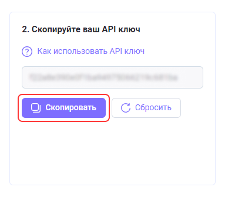
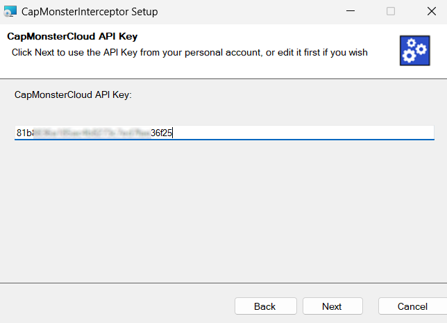

# Распознавание капч через API других сервисов
CapMonster Cloud поддерживает API сервисов: Anti-Captcha (v1.0, v2.0), RuCaptcha, RipCaptcha, 2Captcha, BypassCaptcha, DeathByCaptcha. Таким образом, вы можете разгадывать капчу через CapMonster.Cloud, даже если в вашей программе нет интеграции с нашим сервисом.

Для этого необходимо установить  [**CapMonsterInterceptor**](https://static.zenno.services/ccl/interceptor.msi) (OC Windows)
 Поддержка других платформ в разработке.

В процессе установки потребуется указать API-ключ вашего аккаунта, который вы сможете найти в [личном кабинете](https://capmonster.cloud/Dashboard).

 

По завершению на рабочем столе будет создан ярлык CapMonsterInterceptor. После запуска программа будет доступна в трее. Никаких настроек не требуется.

 

Когда CapMonsterInterceptor запущен, все капчи отправленные на распознавание в сервисы *Anti-Captcha (v1.0, v2.0), RuCaptcha, RipCaptcha, 2Captcha, BypassCaptcha, DeathByCaptcha* будут перехватываться и перенаправляться в CapMonster.Cloud.
## **Пример**
Просто выберите один из сервисов распознавания в своей программе, где требуется ввод капчи. В нашем примере это будет *DeathByCaptcha*.

- **примечание для DeathByCaptcha:** для идентификации пользователя API DeathByCaptcha использует логин и пароль, а не API ключ. В этом случае нужно заполнить 2 поля случайными значениями.

 

Введите любой API-ключ (*Например, qwerty*).

Теперь можете запускать свою программу. Все капчи, отправленные на другой сервис (в примере DeathByCaptcha), будут перехватываться и отправляться в CapMonsterCloud. 

Щёлкнув 2 раза по иконке CapMonsterInterceptor в трее, вы сможете увидеть статистику перехваченных капч, отправленных на распознавание.

 
## **Ответы на вопросы**

    
Как изменить API-ключ, указанный при установке CapMonsterInterceptor?

Щелкните 2 раза по иконке CapMonsterInterceptor в трее. В окне программы найдите блок «Settings», замените ключ на новый и нажмите кнопку «Save».

 

    
Что делать, если возникла ошибка: Сделана попытка доступа к сокету методом, запрещённым правами доступа.

 

Если при запуске возникнет ошибка, это означает, что 80 и\или 443 порт занят другим приложением.

Для исправления данной ошибки необходимо завершить процесс, который занимает данные порты.

Запускаем командную строку через меню пуск → поиск → cmd

 

Вводим команду netstat -a -o | findstr :443

Ключ ***-a*** указывает, что нас интересуют все активные подключения, ***-o*** — для каждого из них нужно отобразить *PID* (идентификатор процесса).
**findstr :443** покажет нам только тот процесс, который занимает нужный нам порт.

В правой колонке отобразится PID процесса, как на скриншоте.
Запомните его или запишите.

Открываем диспетчер задач, переходим во вкладку «Подробности», находим процесс с нужным идентификатором и завершаем задачу.

