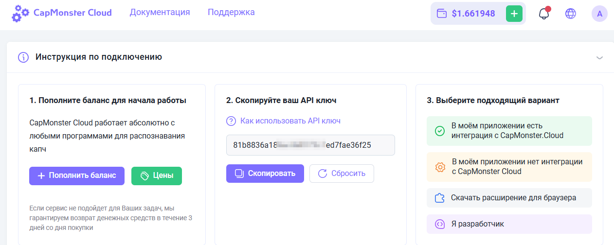
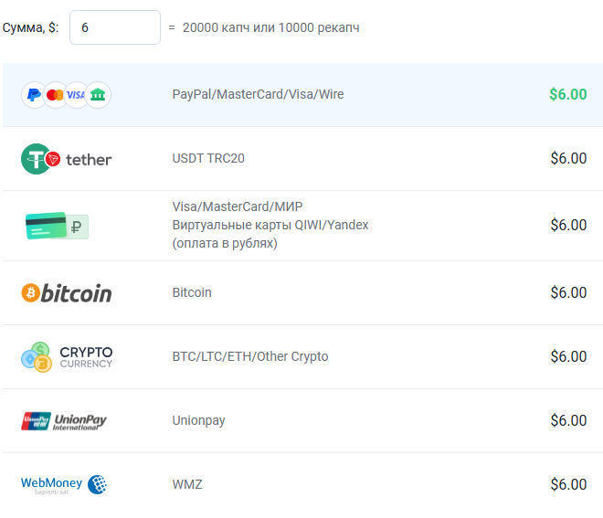
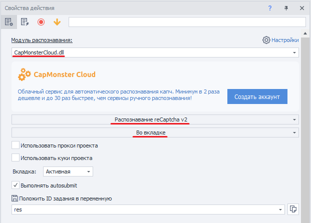
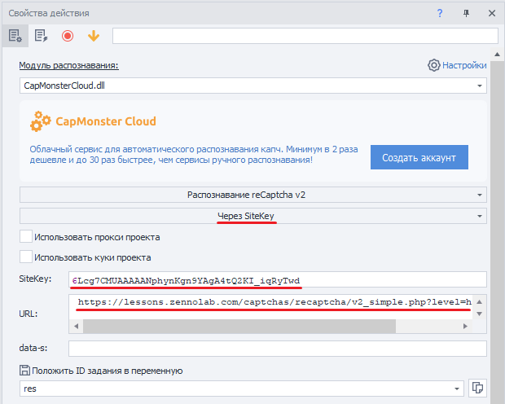
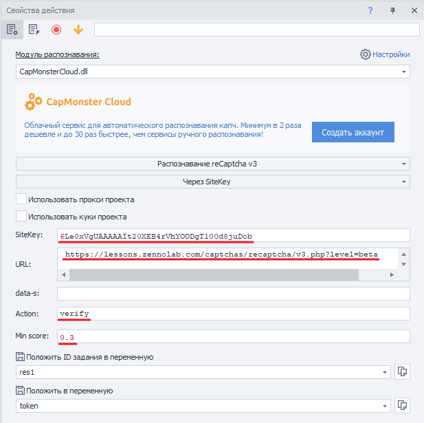
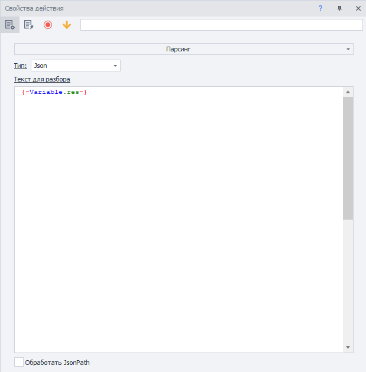
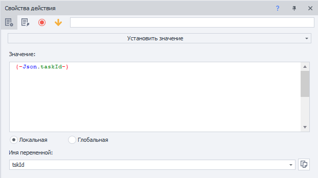
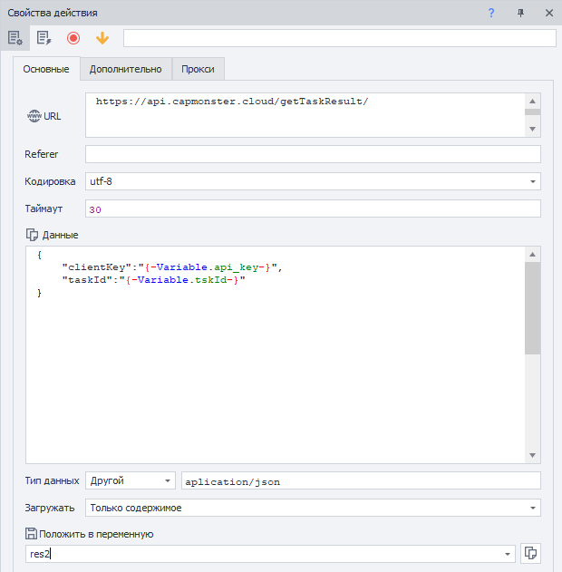

---
sidebar_position: 0
# id: my-home-doc
# slug: /
---

# Начало работы

Раздел содержит инструкции по началу работы с сервисом, а также описывает основные методы отправки капч и их распознавания.

## Шаг 1. Создайте аккаунт

Прежде чем перейти к решению капч, зарегистрируйтесь в [CapMonster Cloud](https://capmonster.cloud/) удобным для вас способом. Затем перейдите в [Личный кабинет](https://capmonster.cloud/Dashboard), где вы найдёте всю необходимую информацию — текущий баланс, API-ключ и статистику по успешно решённым и нерешённым задачам.



## Шаг 2. Пополните баланс

Сервис поддерживает несколько способов пополнения.



Теперь вы можете решать капчи автоматически с помощью [расширения](https://docs.capmonster.cloud/docs/extension) или создавая задачи через API.

## Методы отправки и получения результата

:::info Адрес метода
```http
https://api.capmonster.cloud
```
Формат запроса: `JSON POST`.
Формат ответа всегда в формате `JSON`.
:::

**Чтобы решить капчу, вам нужно:**

1. Создать задачу капчи методом [createTask](api/methods/create-task.md).  
2. Подождать некоторое время. В зависимости от загрузки системы ответ приходит в диапазоне от 300 мс до 6 с.  
3. Запросить решение капчи методом [getTaskResult](api/methods/get-task-result.md). Если капча ещё не решена, вернуться к пункту 2.

Дополнительный метод:

- [Получить](api/methods/get-balance.md) актуальный баланс аккаунта.

### Примеры кода

Для вашего удобства мы создали готовые библиотеки для быстрой интеграции API CapMonster.Cloud в свой код. Распознавайте различные виды капч по самым низким ценам на рынке!

|**Язык**|**Ссылка на репозиторий**|
| :- | :- | 
|С#|- [Nuget](https://www.nuget.org/packages/Zennolab.CapMonsterCloud.Client)<br /> - [Github](https://github.com/ZennoLab/capmonstercloud-client-dotnet) |
|Python|- [PyPl](https://pypi.org/project/capmonstercloudclient/)<br /> - [Github](https://github.com/ZennoLab/capmonstercloud-client-python)|
|JS|- [Npm](https://www.npmjs.com/package/@zennolab_com/capmonstercloud-client)<br /> - [Github](https://github.com/ZennoLab/capmonstercloud-client-js)|
|GO|- [Pkg.go.dev](https://pkg.go.dev/github.com/ZennoLab/capmonstercloud-client-go)<br /> - [Github](https://github.com/ZennoLab/capmonstercloud-client-go)|
|PHP|- [Packagist](https://packagist.org/packages/zennolab/capmonstercloud.client)<br /> - [Github](https://github.com/ZennoLab/capmonstercloud-client-php)|

## Методы распознавания капчи

### 1. Через токен

Это базовый способ распознавания капчи, при котором необходимо:

- вручную найти параметры на странице, такие как:  
  - `sitekey` (или `websiteKey`) — уникальный идентификатор капчи;  
  - `websiteURL` — адрес страницы, где отображается капча;  
- проанализировать JavaScript-код и сетевые запросы для получения этих данных;  
- отправить задачу на CapMonster Cloud с нужными параметрами;  
- получить в ответ **токен** — уникальный код, подтверждающий решение капчи;  
- выполнить **autosubmit** — отправить токен обратно на сайт для подтверждения прохождения капчи.

> Подходит для разработчиков, готовых вручную разбирать код и строить логику отправки решения.

---

### 2. Через клики

Метод, имитирующий действия пользователя (движение мыши, клики, выбор изображений). Используется через официальное браузерное расширение и не требует:

- ручного поиска `sitekey` или других параметров;  
- анализа HTML или JavaScript;  
- реализации механизма autosubmit.

Этот метод полезен, если:

- сайт использует нестандартную реализацию капчи;  
- параметры шифруются или динамически подставляются;  
- submit-функция спрятана глубоко в скриптах.

> Оптимален для сложных случаев и пользователей без опыта программирования.

---

Оба метода используют CapMonster Cloud для распознавания, но различаются по сложности настройки.  
Выбор метода зависит от конкретного сайта и уровня подготовки пользователя.

Также есть отличная возможность применять метод кликов в [ZennoPoster](https://zennolab.com/en/products/zennoposter/). Для этого достаточно установить наше расширение CapMonster Cloud (см. раздел [Инструкция по установке расширения CapMonster Cloud в браузер ProjectMaker](extension/install-instruction.md)) в проект с движком Chromium, ввести API-ключ и использовать расширение при работе с проектом аналогично тому, как это обычно происходит в системном браузере Chrome.

## Примеры сабмита токенов в ZennoPoster

С помощью экшенов:

1. Интегрируйте CapMonster Cloud в ProjectMaker (“Настройки” → “Каптчи” → Выберите модуль CapMonster Cloud, введите свой API-ключ);

2. Добавьте действия “Очистить куки” → “Переход на страницу” (например, для reCaptcha v.2 — [https://lessons.zennolab.com/captchas/recaptcha/v2_simple.php?level=high](https://lessons.zennolab.com/captchas/recaptcha/v2_simple.php?level=high)) → “Распознать ReCaptcha”;

3. В свойствах действия “Распознать ReCaptcha” выберите модуль CapMonsterCloud.dll, укажите тип капчи (reCaptcha v.2) и способ разгадывания (**Во вкладке** или **Через sitekey**):



4. При выборе способа **Через sitekey** укажите данные капчи (`sitekey`) и URL (адрес страницы, на которой нужно решить капчу):



### reCaptcha v.3

1. Добавьте действия “Очистить куки” → “Переход на страницу” (например, [https://lessons.zennolab.com/captchas/recaptcha/v3.php?level=beta](https://lessons.zennolab.com/captchas/recaptcha/v3.php?level=beta)) → “Распознать ReCaptcha”;

2. В свойствах действия “Распознать ReCaptcha” выберите модуль CapMonsterCloud.dll, укажите тип капчи (reCaptcha v.3), способ (Во вкладке или Через Sitekey), а также укажите `Action` и `minScore`:



<!-- ### hCaptcha

1. Добавьте в проект, где уже совершен переход на страницу с капчей, экшен “Распознать hCaptcha”;

2. В свойствах действия “Распознать hCaptcha” выберите способ (Во вкладке или Через Sitekey). При выборе через Sitekey укажите sitekey и URL с капчей:

 -->

### С помощью HTTP-запросов

Для некоторых типов капч готовые экшены в ProjectMaker отсутствуют, поэтому необходимо использовать расширение или самостоятельно составлять запросы для решения капчи.

1. Добавьте действие “Обработка переменных” (Добавить действие → Данные → Обработка переменных), выберите “Установить значение” и пропишите ваш API-ключ CapMonster Cloud:


2. Добавьте действие “HTTP” → “POST-запрос” (при необходимости укажите данные прокси):


3. Добавьте действие “Обработка JSON/XML” (Добавить действие → Данные → Обработка JSON/XML), выберите “Парсинг”, тип — JSON, и для текста разбора укажите “Установить значение из переменной”:



4. Добавьте действие “Обработка переменных” и установите значение `{-Json.taskId-}`:



5. Сформируйте новый POST-запрос для получения результата:



6. Добавьте действие “Парсинг” в “Обработке JSON/XML”:


7. Подставьте полученный токен в нужную форму капчи (изучив код страницы) с помощью действия “Установить значение”:


