---
sidebar_position: 0
# id: my-home-doc
# slug: /
---

# Начало работы

В данном разделе вы можете изучить способы отправки капч в CapMonster Cloud и методы распознавания.

:::info Адрес метода
```http
https://api.capmonster.cloud
```
Формат запроса: `JSON POST`.
Формат ответа всегда в формате `JSON`.
:::


**Чтобы решить капчу, вам нужно**:

1. Создать задачу капчи методом [createTask](api/methods/create-task.md).
2. Подождать некоторое время. В зависимости от загрузки системы вы получите ответ через время в диапазоне от 300мс до 6с.
3. Запросить решение капчи методом [getTaskResult](api/methods/get-task-result.md). Если капча еще не была решена, перейти к п.2.

Дополнительный метод:

- [Получить](api/methods/get-balance.md) актуальный баланс аккаунта.

### Примеры кода

Для вашего удобства мы создали готовые библиотеки для быстрой интеграции API CapMonster.Cloud в свой код. Распознавайте reCAPTCHA, hCaptcha и другие виды капч по самым низким ценам на рынке!

|**Язык**|**Ссылка на репозиторий**|
| :- | :- | 
|С#|- [Nuget](https://www.nuget.org/packages/Zennolab.CapMonsterCloud.Client)<br /> - [Github](https://github.com/ZennoLab/capmonstercloud-client-dotnet) |
|Python|- [PyPl](https://pypi.org/project/capmonstercloudclient/)<br /> - [Github](https://github.com/ZennoLab/capmonstercloud-client-python)|
|JS|- [Npm](https://www.npmjs.com/package/@zennolab_com/capmonstercloud-client)<br /> - [Github](https://github.com/ZennoLab/capmonstercloud-client-js)|
|GO|- [Pkg.go.dev](https://pkg.go.dev/github.com/ZennoLab/capmonstercloud-client-go)<br /> - [Github](https://github.com/ZennoLab/capmonstercloud-client-go)|
|PHP|- [Packagist](https://packagist.org/packages/zennolab/capmonstercloud.client)<br /> - [Github](https://github.com/ZennoLab/capmonstercloud-client-php)|


## Методы распознавания

В сервисе CapMonster Cloud есть 2 метода распознавания капч:

1. Через token.
2. Через клики.

Первый метод (**через token**) – это первоначальный базовый метод распознавания, где необходимо вручную искать параметры и функции в коде страниц сайтов, а затем конструировать запросы с использованием данных параметров или скрипта и выполнять autosubmit для отправки token и сигнала сайту, что капча решена и требуется проверить правильность ввода. Token – это уникальная комбинация символов, ответ от сервера, который генерируется в итоге успешного решения капчи и используется для его подтверждения. Autosubmit – функция, которая автоматически отправляет токен в форму капчи и подтверждает решение. 

Параметрами для поиска являются, например, sitekey (websiteKey) – уникальный идентификатор, который используется для связи капчи и целевого сайта,  websiteURL – адрес страницы, где находится капча. 

После анализа кода страницы и оформления запроса данные капчи отправляются на сервис CapMonster Cloud для распознавания. В результате успешного разгадывания сайт, инициировавший запрос, получает токен для последующего сабмита. Этот метод пользователь может использовать в своем коде, правильно оформив задачу для отправки на сервер, получения результата и подтверждения решения капчи. 

Второй метод (**через клики**) позволяет распознавать сложные капчи так, как это делает реальный человек, используя настоящие клики. Это доказывает сайту, что капчу распознает человек вручную, а не бот. Этот метод используется в браузерном расширении для Chrome или Firefox.

Еще одно немаловажное достоинство данного метода распознавания заключается в том, что не требуется самостоятельно искать параметры для отправки на сервис и выполнять *autosubmit*. Не секрет, что на этом шаге можно столкнуться с достаточно серьезной и трудоемкой задачей (особенно для новичков в программировании) поиска параметра и функций в скриптах и данных в запросах, html-верстке сайтов и структуре скриптов, через которые обычно реализован *submit* (подтверждение решения капчи).

Эта проблема часто усугубляется еще и тем, что на сайтах могут применяться разные нестандартные способы реализации задания параметров и реализации функции *submit*. Например, если применяется много сторонних параметров в запросах или шифрование этих параметров. Кликовый метод решения в большинстве случаев позволяет обойти подобные трудности без дополнительных сложных исследований и экспериментов. 

Также есть отличная возможность применять метод кликов в ZennoPoster. Для этого достаточно установить наше расширение CapMonster Cloud (см. раздел [Инструкция по установке расширения CapMonster Cloud в браузер ProjectMaker](extension/install-instruction.md)) в проект с движком Chromium, ввести API-ключ и использовать расширение при работе с проектом аналогично тому, как это обычно происходит в системном браузере Chrome. 

## Примеры сабмита токенов в Zennoposter

С помощью экшенов:

1. Интегрируйте CapMonster Cloud в ProjectMaker (“Настройки” - “Каптчи” - Выберите модуль CapMonster Cloud, введите свой API-ключ);

2. Добавьте действия “Очистить куки” - “Переход на страницу” (например, для reCaptcha v.2 – [https://lessons.zennolab.com/captchas/recaptcha/v2_simple.php?level=high](https://lessons.zennolab.com/captchas/recaptcha/v2_simple.php?level=high)) - “Распознать ReCaptcha”;

3. В Свойствах действия “Распознать ReCaptcha” необходимо выбрать модуль CapMonsterCloud.dll, указать тип капчи (reCaptcha v.2) и способ разгадывания (**Во вкладке** или **Через sitekey**):

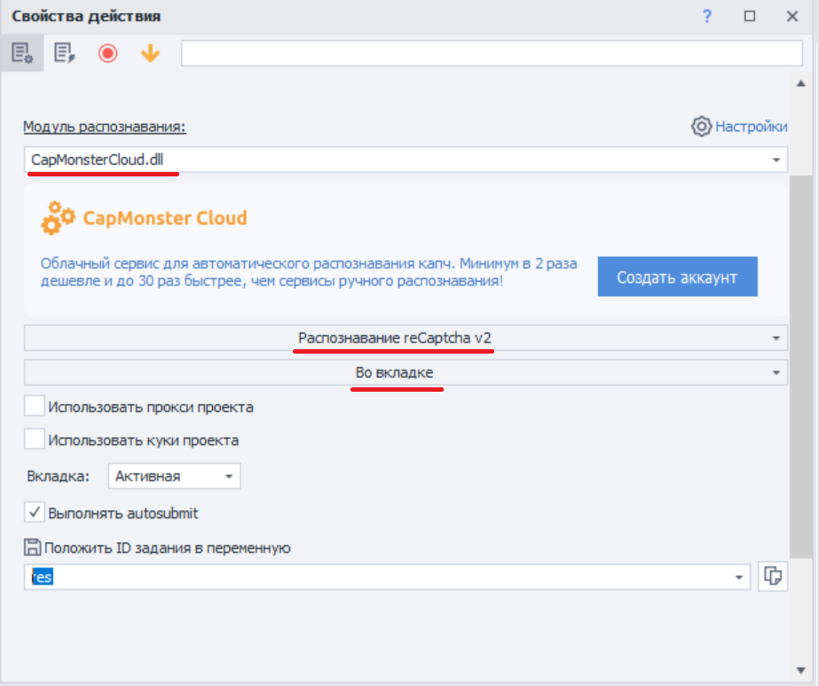

4. В случае выбора способа **Через sitekey** укажите данные капчи (sitekey) и url (адрес страницы, на которой нужно решить капчу):  

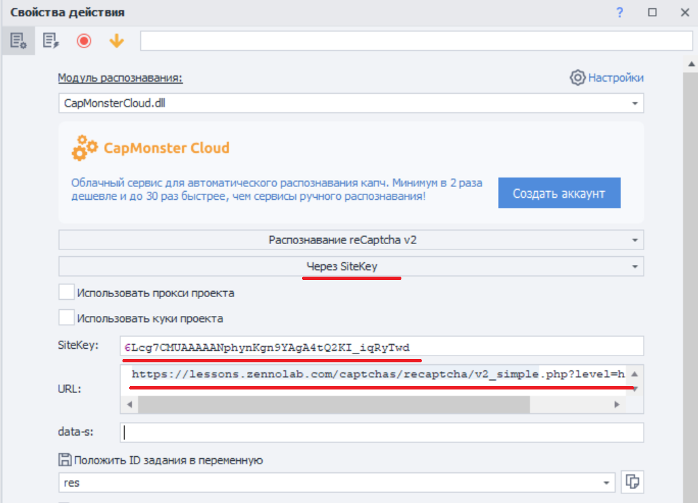

### reCaptcha v.3

1. Добавьте действия “Очистить куки” - “Переход на страницу” (например, [https://lessons.zennolab.com/captchas/recaptcha/v3.php?level=beta](https://lessons.zennolab.com/captchas/recaptcha/v3.php?level=beta)) - “Распознать ReCaptcha”;

2. В Свойствах действия “Распознать ReCaptcha” выберите модуль CapMonsterCloud.dll, укажите  тип капчи (reCaptcha v.3), способ (Во вкладке или Через Sitekey), также укажите Action и minScore: 

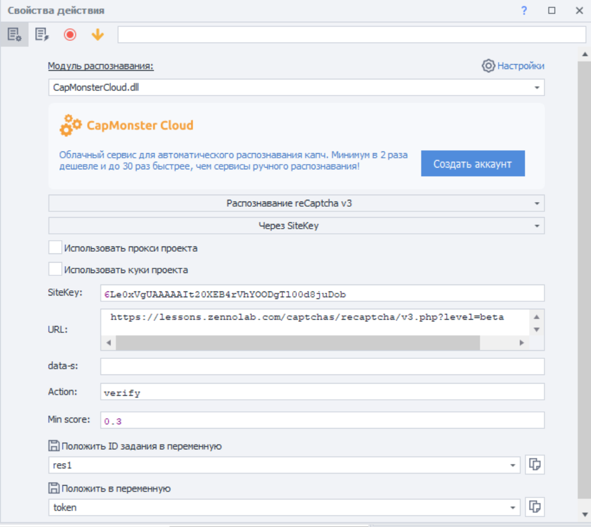

### hCaptcha 

1. Добавьте в свой проект, где уже совершен переход на страницу с капчей, экшен “Распознать hCaptcha”;

2. В Свойствах действия “Распознать hCaptcha” выберите способ (Во вкладке или Через Sitekey). При выборе через Sitekey нужно указать sitekey и URL, где находится капча: 

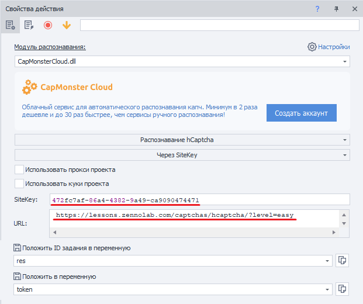

### С помощью HTTP-запросов 

Для некоторых типов капч готовые экшены в ProjectMaker отсутствуют, в этом случае необходимо использовать расширение или самостоятельно составлять запросы для решения капчи.

1. “Обработка переменных” (“Добавить действие” - “Данные” - “Обработка переменных”), в свойствах выберите “Установить значение” и пропишите в значении ваш API-ключ от CapMonster Cloud:

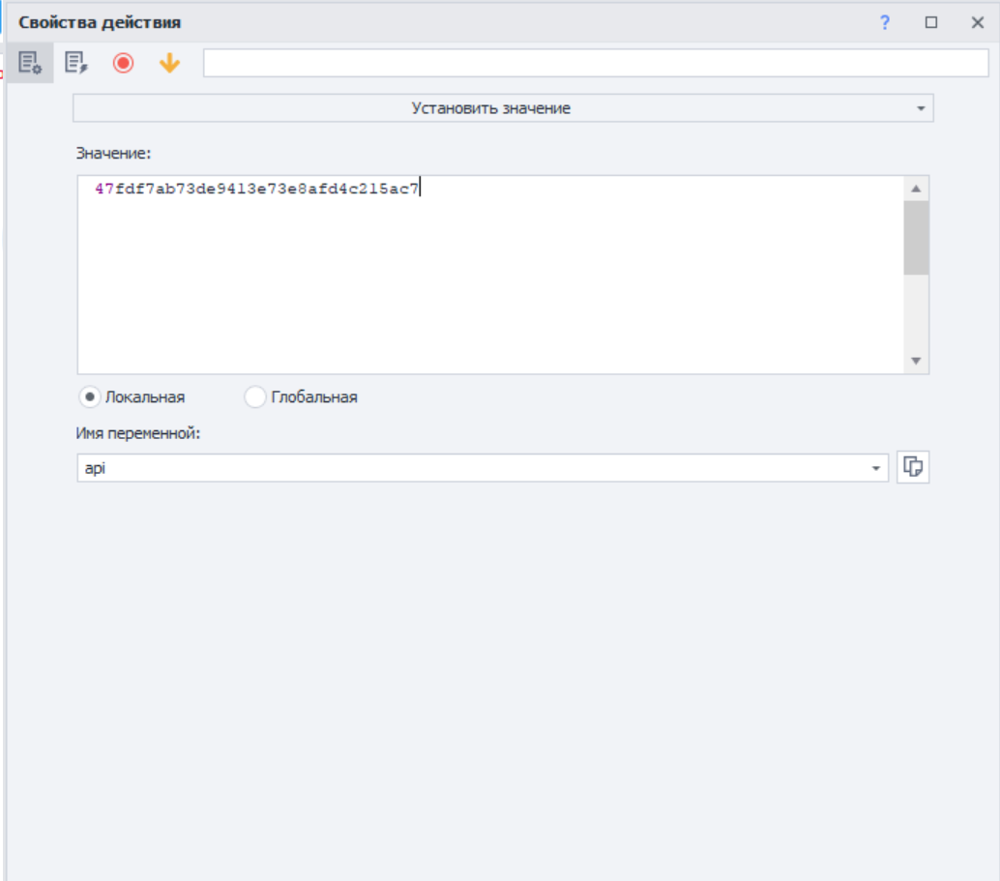

2. “Добавить действие” - “HTTP” - “POST-запрос” (дополнительно добавьте значения ваших прокси, если нужно):

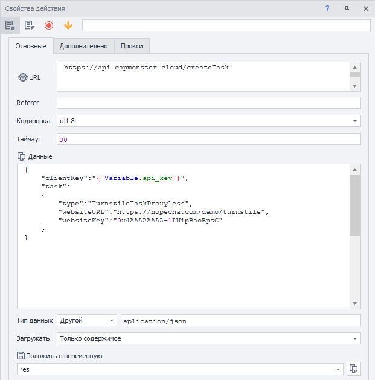

3. Добавьте действие “Обработка JSON/XML” (“Добавить действие” - “Данные” - “Обработка JSON/XML”), в свойствах выберите “парсинг”, тип “Json” и для текста для разбора правой кнопки мыши выберите “Установить значение из переменной”: 

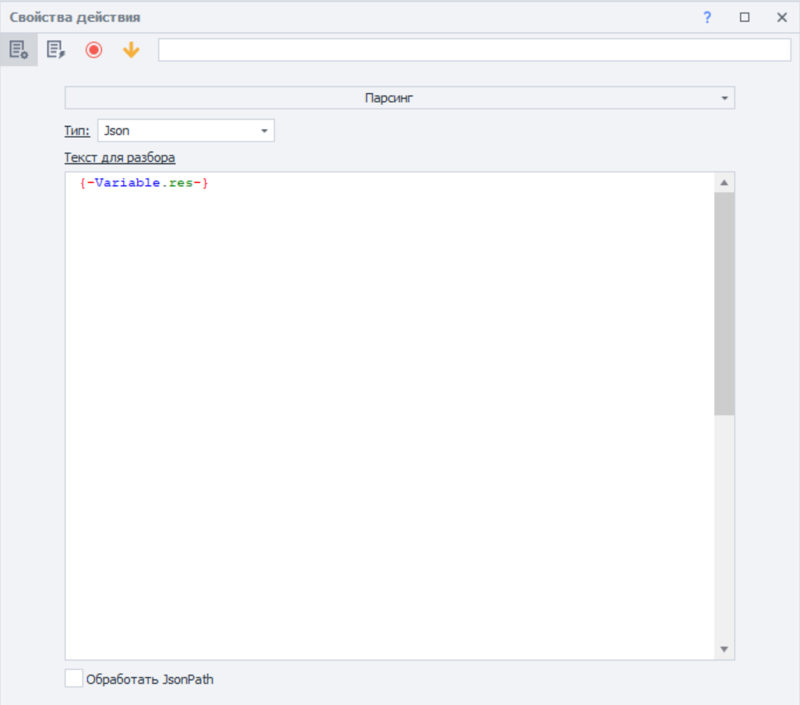

4. Добавьте экшен “Обработка переменных”,  в нем установите значение \{-Json.taskId-\}: 

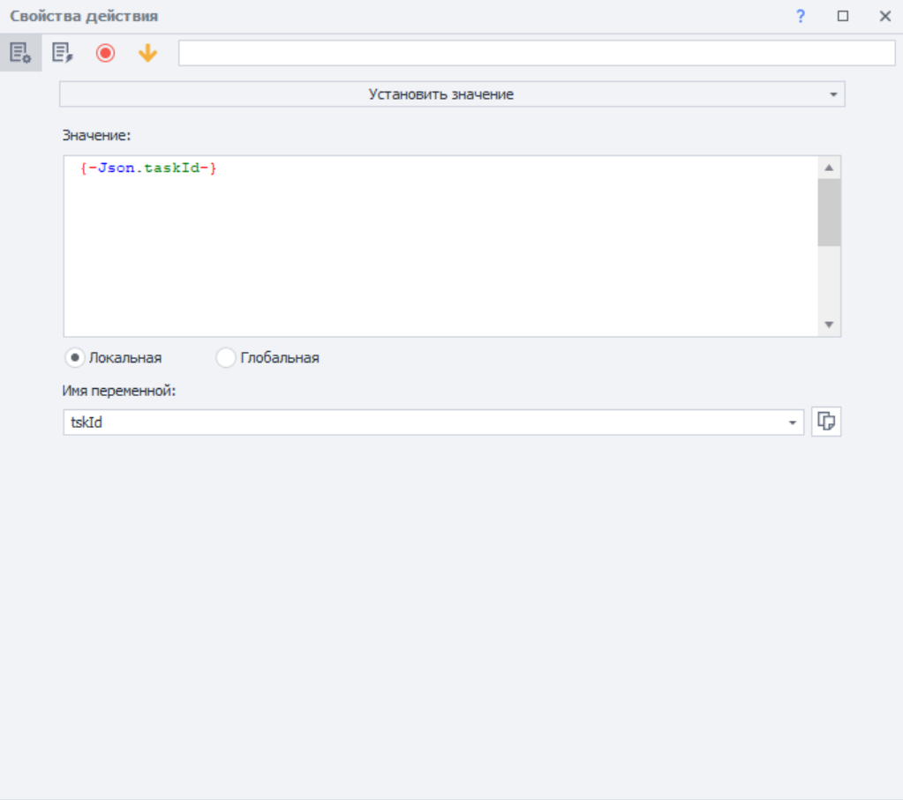

5. Сформируйте новый POST-запрос для получения результата:

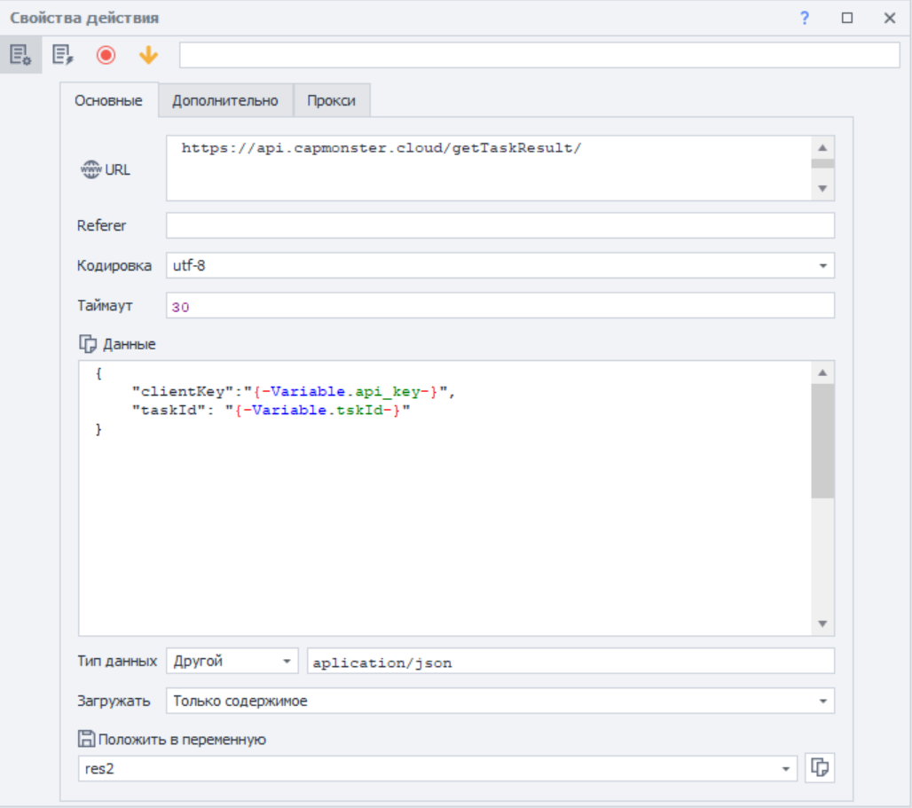

6. Добавьте значение “Парсинг” в экшене “Обработка JSON/XML”: 

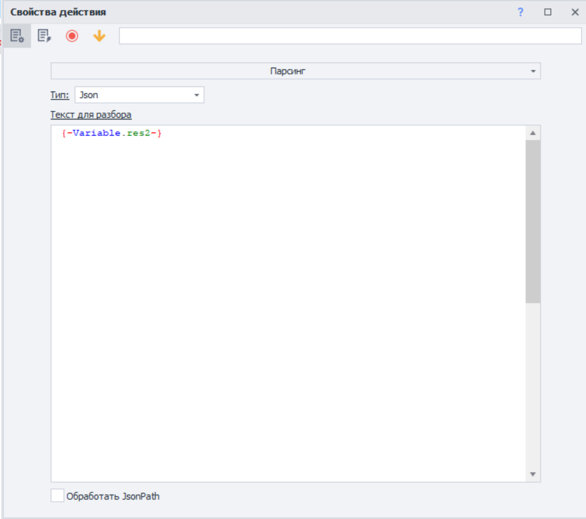

7. Далее необходимо подставить значение токена в нужную форму капчи (изучив код страницы) с помощью экшена “Установить значение”, например: 

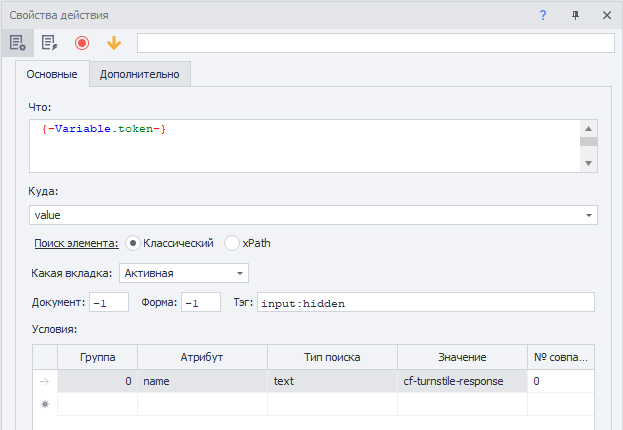