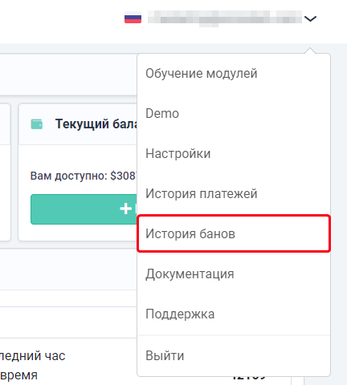

# Reasons for blocking
##  **How to find out the reason for the ban?**
In case of blocking, you’ll see a notification in your [personal account](https://capmonster.cloud/Dashboard).
Ban history is available in the settings.

 
##  **The main reasons for getting a ban:**

- **KeyDoesntExist** (multiple requests without a key / with an invalid key)
- **ZeroBalance** (multiple requests with zero balance)
- **WrongTaskId**
  - when exceeding the limit of the 120 requests per task
  - multiple requests to getTaskResult with wrong TaskId
- **BadProxy** (multiple requests with a banned proxy)

Users receive a ban for repeated actions for a limited period of time.
##  **When will the ban be removed?**

The duration of the block is 10 minutes, provided that you do not continue to break the rules described above.

    
I am constantly banned. What should I do?

The reason is that your app/script sends multiple incorrect API requests. 

**I am a user**

If you are not the developer of the app/script that sends captchas, contact their support and explain that the captcha recognition service blocks you for multiple incorrect requests (read the explanation of the reasons for getting a ban).

**I am a developer**

If you are a developer, make changes yourself according to the rules and limits.
  

