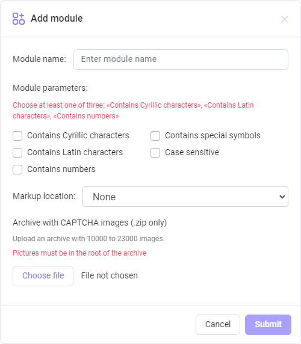
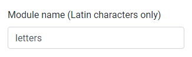
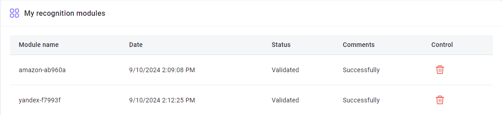
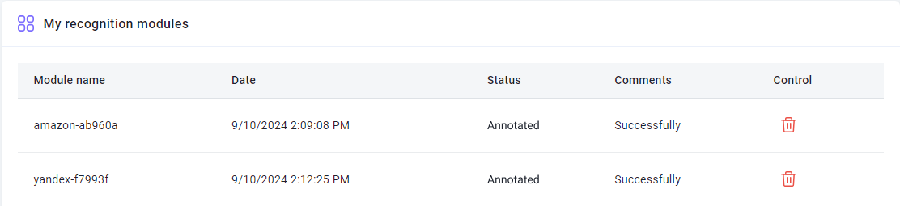

# Creating a user module


## **Description**

This function helps to create user modules that will be trained to solve a certain type of captcha. 

To go to the [module training page](https://capmonster.cloud/UserModules), click the email in the upper-right area of the website and select the relevant option in the menu.


---

## **How it works**

Briefly:

1. Collect captchas and archive them
2. Send them to us, specifying the module name
3. Deposit $10 to the balance (it will remain on your balance)
4. We create the module
5. You send requests from your soft, specifying the name of the created module.

Now let's go into the details of each step.

---

### **1. Collecting captchas**

#### **How many captchas do you need?**

To answer this question, mark the types of symbols that your captcha contains, in the form on the [Module training page](https://capmonster.cloud/UserModules). After that, a hint telling you how many captchas to upload will appear above the button for selecting the archive for uploading:


#### **Supported image formats**

- jpg
- jpeg
- png

#### **How to collect captchas?**

Let's look at the example with [ZennoPoster](https://zennolab.atlassian.net/wiki/spaces/EN/pages/924581921/ZennoPoster).

Imagine you are registering accounts on the website and it has a captcha a module for which you want to create. There are several options:

- Most probably, you already have a running project for this website, which means you are already solving this captcha. In the action [Recognize captcha](https://zennolab.atlassian.net/wiki/spaces/EN/pages/924582077/Recognize+captcha), in the *More* tab you can find the [Saving](https://zennolab.atlassian.net/wiki/spaces/EN/pages/924582077/Recognize+captcha#Saving) option, that is created for such cases.
- You can go an easier way: go to the captcha page. It always has the Refresh button. Send the captcha to the solver or [solve manually](https://zennolab.atlassian.net/wiki/spaces/EN/pages/924484621/Entering+captchas+manually) (previously set in the [Saving](https://zennolab.atlassian.net/wiki/spaces/EN/pages/924582077/Recognize+captcha#Saving) action), refresh the captcha, and send it for solving again. Repeat these steps until you collect enough captchas.

:::warning
Do not run captcha collection in tens and hundreds of threads! Few websites would like that.
:::

---

### **2. Sending the captcha archive**



#### **2.1. Name**

First, set the module name (Latin characters only).



The module name must not contain the word **captcha**.

#### **2.2. Types of symbols**

Mark the types of symbols that your captcha contains.

What you mark here affects the number of captchas you will need to upload to train the module.

You can choose one or several options from the suggested.


:::info
You should mark at least one of the following options: "Contains Cyrillic characters", "Contains Latin characters", "Contains numbers"
:::

#### **2.3. Markup location**

Specify where captcha answers are located.


It's quite simple: 

- **None** - select it if you don't have answers to captchas (in this case, module training may take longer).
- **Located in file names** - select it if the name of every captcha image is the answer to it (sometimes a captcha answers cannot be saved in the file name: operating systems do not allow some symbols in file names).
- **Located in a separate file in the archieve** - select it if answers are saved in a file (it should be a simple text file—.txt).
  - File name- answers.txt
  - Should be located inside the archive with captchas
  - Format - CaptchaFileName:CaptchaAnswer, each captcha on a new line. Example:

```
captcha1.png:d9li1

captcha2.png:2zhnw

captcha3.png:99loe
```

#### **2.4. Sending the archive**

When you specified the module name, selected symbol types, and location of answers, you need to upload the zip archive with the captchas and send us.


#### **2.5. Payment**

- If you did all that correctly, your request will appear in the table with the **Validated** status.
- After that, you need to deposit $10 per module.

:::note
The funds allocated to training are not debited but stay on the balance. You can spend them on solving any captchas, anytime.
:::

- After successful deposit, the status of the **first** uploaded module will change to **Paid**.

---

### **3. Statuses**

#### **Validated**



You get this status after you send the form (given that you have done everything correctly). 

:::note
Modules with this status can be deleted. If you uploaded the module but realized that you sent a wrong archive or gave a bad name for the module, you can delete it, make changes, and send it again.
:::

#### **Paid**


Your payment for the module was accepted.

#### **ValidatedInDepth**


Preparatory works.

#### **Annotated**



Captcha marking completed. Training is in progress.

#### **Trained**


The module is ready! You can now submit captchas to it.

### **4. Sending captchas to a certain module**

There are several ways to specify a module that will solve the captchas:

- [Add the argument CapMonsterModule with the module name when sending a /createTask request ](../captchas/image-to-text.md) (if you interact directly with our API)
- [Specify a module name in ApiKey](module-name.md) (very handy when you use third-party programs and cannot modify the requests)

---

## **FAQ**

<details>
    <summary>How long does the module training take?</summary>

It usually takes one day.

**Note:** Training goes on business days from Monday to Friday. If you sent a request on Friday, training will be completed at the beginning of the next week.

</details>

<details>
    <summary>I want to train several modules at once, how can I do it correctly?</summary>

The algorithm is simple: you just upload the captcha archive and pay for it. Then, you upload the second archive and pay for it. You do that for all archives.

Training takes one day per module.

</details>

<details>
    <summary>I see the "Error" sign in the "Comment" column next to my module. What should I do?</summary>


Don't panic Just wait a bit. 

If nothing changed in a day, [contact support](https://helpdesk.zennolab.com/en) and we will definitely help you.

</details>

<details>
    <summary>I uploaded a wrong archive, can I resend it?</summary>

If you didn't pay for the module and it has the **Validated** status, you can delete it. You can find more information in the description of the **Validated** status.

</details>

<details>
    <summary>What is the “Manage” column in the table? I have nothing there</summary>

You will see the "Delete" button in this column. But it's only available for the modules with the **Validated** status. 

For modules with other statuses, this column remains empty.

</details>

<details>
    <summary>Why were some symbols added to my module name?</summary>

This is done to make the module name unique. Some systems users may choose the same name for their module. To avoid confusion, the system automatically generates and adds random symbols to module names. This way, every user will send captchas to their module—no confusion.

</details>

<details>
    <summary>Can I get a trained module for the CapMonster2 program?</summary>

No. The trained module is only available in CapMonster.Cloud.

</details>

<details>
    <summary>I am not satisfied with the quality of training. What to do?</summary>

[Contact our support service](https://helpdesk.zennolab.com/).

</details>

<details>
    <summary>I have a question that is not covered here. Where should I contact?</summary>

[Contact our support service](https://helpdesk.zennolab.com/).

</details>

<!-- ![ref1]Как долго длится обучение модуля?

Обучение одного обычно происходит в течение суток.

**Обратите внимание:** обучение производится в рабочие дни с понедельника по пятницу. Если Вы отправили заявку в пятницу, то он будет готов в начале следующей недели. -->

<!-- ![ref1]Я хочу обучить сразу несколько модулей, как мне правильно это сделать?

Алгоритм простой: загружаете первый архив с капчами, оплачиваете его. Затем загружаете второй архив, оплачиваете. И так поступаете со всеми архивами.

Время готовности модулей оценивайте в расчёте, приблизительно, сутки на один модуль. -->

<!-- ![ref1]Напротив моего модуля в колонке “Комментарий” появилась надпись “Ошибка” : Что мне делать?

 

Не паникуйте  Подождите немного. 

Если спустя сутки ничего не изменилось, [напишите в поддержку](https://helpdesk.zennolab.com/ru) и мы Вам обязательно поможем. -->

<!-- ![ref1]Я загрузил не тот архив, могу ли я его переотправить?

Если Вы ещё не оплатили модуль и у него статус **Validated**, то Вы можете самостоятельно его удалить. Подробности Вы можете найти в описании статуса **Validated**. -->

<!-- ![ref1]Что за колонка “Управление” в таблице? У меня там ничего нет.

В данной колонке появляется кнопка “Удалить”, но только для модулей со статусом **Validated**. 

Для модулей с другими статусами данная колонка остаётся пустой. -->

<!-- ![ref1]Почему к имени моего модуля были добавлены какие-то символы?

Это сделано для того, чтобы имя модуля было уникальным: несколько пользователей системы могут выбрать одно и тоже имя для своего модуля и чтоб избежать путаницы система автоматически генерирует и добавляет случайные символы к имени модуля. Таким образом каждый пользователь точно будет слать капчи на свой модуль. -->

<!-- ![ref1]Могу ли я получить обученный модуль для программы CapMonster2?

Нет. Обученный модуль доступен только в рамках сервиса CapMonster Cloud. -->

<!-- ![ref1]Меня не устраивает качество обучения. Что делать?

[Пишите в поддержку](https://helpdesk.zennolab.com/ru). 

![ref1]У меня есть вопрос, который здесь не освещён. Куда мне обращаться?

[Пишите в поддержку](https://helpdesk.zennolab.com/ru). 

[ref1]: Aspose.Words.aac7548a-0b79-486d-96ce-e145c7faf5a6.001.png -->
