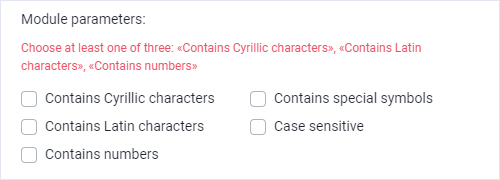
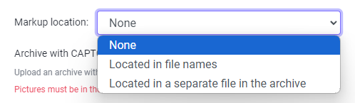
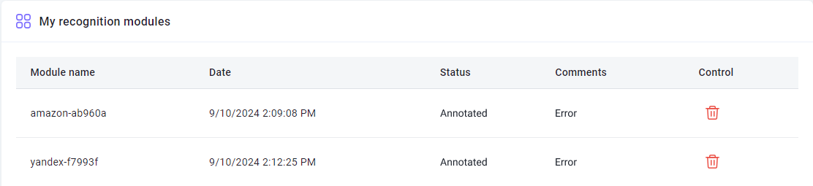

---
sidebar_position: 10
sidebar_label: Creating a user module
title: "Creating a custom module to configure captcha recognition"
description: "Creating a custom module allows you to create custom modules that will be trained for one specific type of captcha. This will allow faster and more efficient recognition of non-standard captchas and reduce the probability of errors."
---

import { ArticleHead } from '../../../../../src/theme/ArticleHead';

<ArticleHead slug="api/user-module" />

# Creating a user module


## Description

The custom module creation feature allows you to train the system to recognize a specific type of captcha. This improves the speed and accuracy of recognizing non-standard captchas and reduces the likelihood of errors.

To go to the [module training page](https://capmonster.cloud/UserModules), click your email in the top-right corner of the site and select the corresponding menu option.


---

## How it works

The process can be summarized as follows:

1. Collect captchas and archive them.
2. Send the archive to us, specifying the module name.
3. Deposit $10 to your balance (the funds remain on your balance and are not deducted).
4. We create the module.
5. Submit tasks for recognition, specifying the name of the created module.

Each step is described in more detail below.

---

### 1. Collecting captchas

#### How many captchas do you need?

On the [Module training page](https://capmonster.cloud/UserModules), mark the types of characters that appear in your captcha. After that, a hint will appear showing how many captchas you need to collect and upload:


#### Supported image formats

- jpg
- jpeg
- png

#### How to collect captchas?

For example, using [ZennoPoster](https://zennolab.atlassian.net/wiki/spaces/EN/pages/924581921/ZennoPoster).

Suppose you are registering accounts on a website that uses the captcha for which you want to create a custom module. There are several ways to collect such captchas:

* You might already have a working project for this website and are already solving this captcha. In this case, in the [Recognize captcha](https://zennolab.atlassian.net/wiki/spaces/EN/pages/924582077/Recognize+captcha) action, under the *More* tab, you will find the [Saving](https://zennolab.atlassian.net/wiki/spaces/EN/pages/924582077/Recognize+captcha#Saving) option, which is designed for such cases.
* Another option: open the page with the captcha that has a **Refresh** button. Send the captcha to the solver or [solve manually](https://zennolab.atlassian.net/wiki/spaces/EN/pages/924484621/Entering+captchas+manually) (after enabling the [Saving captchas](https://zennolab.atlassian.net/wiki/spaces/EN/pages/924582077/Recognize+captcha#Saving) option in the action). Then refresh the captcha image and repeat the process until you have collected the required number of captchas.

:::warning Attention
It is not recommended to collect captchas in tens or hundreds of threads simultaneously, as this may cause issues with the website.
:::

---

### 2. Sending the captcha archive


#### 2.1. Name

First, you need to set the module name. It must contain only Latin characters.


:::warning
The module name must not contain the word **captcha**.
:::

#### 2.2. Types of symbols

Select the types of characters that appear in your captcha.
The selected options determine the total number of captchas required to train the module.

You can mark one or several items from the suggested list.



:::info
You should mark at least one of the following options: "Contains Cyrillic characters", "Contains Latin characters", "Contains numbers"
:::

#### 2.3. Markup location

Specify where captcha answers are located.



It's quite simple: 

- **None** - select it if you don't have answers to captchas (in this case, module training may take longer).
- **Located in file names** - select it if the name of every captcha image is the answer to it (sometimes a captcha answers cannot be saved in the file name: operating systems do not allow some symbols in file names).
- **Located in a separate file in the archieve** - select it if answers are saved in a file (it should be a simple text file—.txt).
  - File name- answers.txt
  - Should be located inside the archive with captchas
  - Format - CaptchaFileName:CaptchaAnswer, each captcha on a new line. Example:

```
captcha1.png:d9li1

captcha2.png:2zhnw

captcha3.png:99loe
```

#### 2.4. Sending the archive

When you specified the module name, selected symbol types, and location of answers, you need to upload the zip archive with the captchas and send us.


#### 2.5. Payment

- If you did all that correctly, your request will appear in the table with the **Validated** status.
- After that, you need to deposit $10 per module.

:::note
The funds for training are not charged; they remain on your balance.
You can use them to recognize any captchas at any time.
:::

- After successful deposit, the status of the **first** uploaded module will change to **Paid**.

---

### 3. Statuses

#### Validated


You get this status after you send the form (given that you have done everything correctly). 

:::note
For modules with this status, deletion is available — if you uploaded the wrong archive or set an incorrect module name, you can delete the module, make the necessary corrections, and submit it again.
:::

#### Paid


Your payment for the module was accepted.

#### ValidatedInDepth


Preparatory works.

#### Annotated


Captcha marking completed. Training is in progress.

#### Trained


The module is ready! You can now submit captchas to it.

### 4. Sending captchas to a certain module

There are several ways to specify a module that will solve the captchas:

- [Add the argument CapMonsterModule with the module name when sending a /createTask request ](../captchas/image-to-text.mdx) (if you interact directly with our API)
- [Specify a module name in ApiKey](module-name.mdx) (very handy when you use third-party programs and cannot modify the requests)

---

## FAQ

<details>
    <summary>How long does the module training take?</summary>

It usually takes one day.

**Note:** Training goes on business days from Monday to Friday. If you sent a request on Friday, training will be completed at the beginning of the next week.

</details>

<details>
    <summary>I want to train several modules at once, how can I do it correctly?</summary>

Upload the first captcha archive and pay for it, then repeat the process for the second archive, and so on for all modules.

The estimated time for one module to be ready is about one business day.

</details>

<details>
    <summary>I see the "Error" sign in the "Comment" column next to my module. What should I do?</summary>



Don't panic Just wait a bit. 

If nothing changed in a day, [contact support](https://helpdesk.zennolab.com) and we will definitely help you.

</details>

<details>
    <summary>I uploaded a wrong archive, can I resend it?</summary>

If you didn't pay for the module and it has the **Validated** status, you can delete it. You can find more information in the description of the **Validated** status.

</details>

<details>
    <summary>What is the “Manage” column in the table? I have nothing there</summary>

In this column, the **Delete** button is displayed only for modules with the **Validated** status.

For modules with other statuses, this column remains empty.

</details>

<details>
    <summary>Why were some symbols added to my module name?</summary>

The module name is automatically modified to ensure uniqueness. Since multiple users may choose the same name, the system adds random characters to avoid confusion. This guarantees that each captcha will be directed specifically to your module.

</details>

<details>
    <summary>Can I get a trained module for the CapMonster2 program?</summary>

No. The trained module is only available in CapMonster.Cloud.

</details>

<details>
    <summary>I am not satisfied with the quality of training. What to do?</summary>

Please contact [our support service](https://helpdesk.zennolab.com/).

</details>

<details>
    <summary>I have a question that is not covered here. Where should I contact?</summary>

Please contact [our support service](https://helpdesk.zennolab.com/).

</details>