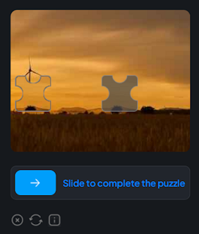

import Tabs from '@theme/Tabs';
import TabItem from '@theme/TabItem';
import ParamItem from '@theme/ParamItem';
import MethodItem from '@theme/MethodItem';
import MethodDescription from '@theme/MethodDescription'
import PriceBlock from '../../../../../src/theme/PriceBlock';
import PriceBlockWrap from '@theme/PriceBlockWrap';
import { ArticleHead } from '../../../../../src/theme/ArticleHead';

<ArticleHead slug="captchas/Basilisk-task" />

# Basilisk - FaucetPay Captcha

<PriceBlockWrap>
  <PriceBlock title="Basilisk" captchaId="faucetpay"/>
</PriceBlockWrap>



:::warning **Attention!**
CapMonster Cloud uses built-in proxies by default — their cost is already included in the service. You only need to specify your own proxies in cases where the website does not accept the token or access to the built-in services is restricted. 

If you are using a proxy with IP authorization, make sure to whitelist the address **65.21.190.34**.
:::


## Request parameters
<TabItem value="proxyless" label="RecaptchaV2EnterpriseTaskProxyless (without proxy)" default className="bordered-panel">

  <ParamItem title="type" required type="string" />  
  **CustomTask**

  ---

  <ParamItem title="class" required type="string" />  
  **Basilisk**

  ---

  <ParamItem title="websiteURL" required type="string" />  
  The address of the main page where the captcha is solved.

  ---

  <ParamItem title="websiteKey" required type="string" />  
  Can be found in the HTML code in the attribute **data-sitekey** of the captcha container  
  or in the payload of a POST request to  
  `https://basiliskcaptcha.com/challenge/check-site` in the field **site_key**.

  ---

  <ParamItem title="userAgent" type="string" />  
  Browser User-Agent.  
  **Pass only a valid UA from Windows OS. Currently it is**: `userAgentPlaceholder`

  ---

  <ParamItem title="proxyType" type="string" />  
  - **http** — standard http/https proxy  
  - **https** — try this if "http" doesn't work (needed for some custom proxies)  
  - **socks4** — socks4 proxy  
  - **socks5** — socks5 proxy

  ---

  <ParamItem title="proxyAddress" type="string" />  
  IP address of the proxy (IPv4/IPv6). Not allowed:  
  - transparent proxies (those exposing the client IP)  
  - local machine proxies

  ---

  <ParamItem title="proxyPort" type="integer" />  
  Proxy port.

  ---

  <ParamItem title="proxyLogin" type="string" />  
  Proxy login.

  ---

  <ParamItem title="proxyPassword" type="string" />  
  Proxy password.

  ---

</TabItem>


## Create task method
<Tabs className="full-width-tabs filled-tabs request-tabs" groupId="captcha-type">
  <TabItem value="proxyless" label="CustomTask (without proxy)" default className="method-panel">
    <MethodItem>
      ```http
      https://api.capmonster.cloud/createTask
      ```
    </MethodItem>
    <MethodDescription>

    **Request**

    ```json
    {
      "clientKey": "API_KEY",
      "task": {
        "type": "CustomTask",
        "class": "Basilisk",
        "websiteURL": "https://domain.io/account/register",
        "websiteKey": "b7890hre5cf2544b2759c19fb2600897",
        "userAgent": "userAgentPlaceholder"
      }
    }
    ```

    **Response**

    ```json
    {
      "errorId": 0,
      "taskId": 407533072
    }
    ```

    </MethodDescription>
  </TabItem>

  <TabItem value="proxy" label="CustomTask (with proxy)" className="method-panel">
    <MethodItem>
      ```http
      https://api.capmonster.cloud/createTask
      ```
    </MethodItem>
    <MethodDescription>

    **Request**

    ```json
    {
      "clientKey": "API_KEY",
      "task": {
        "type": "CustomTask",
        "class": "Basilisk",
        "websiteURL": "https://domain.io/account/register",
        "websiteKey": "b7890hre5cf2544b2759c19fb2600897",
        "userAgent": "userAgentPlaceholder",
        "proxyType": "http",
        "proxyAddress": "8.8.8.8",
        "proxyPort": 8080,
        "proxyLogin": "proxyLoginHere",
        "proxyPassword": "proxyPasswordHere"
      }
    }
    ```

    **Response**

    ```json
    {
      "errorId": 0,
      "taskId": 407533072
    }
    ```

    </MethodDescription>
  </TabItem>
</Tabs>


## Get task result method
Use the method [getTaskResult](../api/methods/get-task-result.mdx), to get the Basilisk solution.

<TabItem value="proxyless" label="GeeTestTaskProxyless (without proxy)" default className="method-panel-full">
	<MethodItem>
		```http
		https://api.capmonster.cloud/getTaskResult
		```
	</MethodItem>
	<MethodDescription>
		**Request**
		```json
		{
		  "clientKey":"API_KEY",
		  "taskId": 407533072
		}
		```
		**Response**
		```json
		{
		   "errorId":0,
		   "status":"ready",
		   "solution": {
			  "data": {
				   "captcha_response": "5620301f30daf284b829fba66fa9b3d0"
			   },
			   "headers": {
				   "User-Agent": "userAgentPlaceholder"
			   }
		   }
		}
		```
	</MethodDescription>
</TabItem>

## How to find all required parameters for task creation

### Manually

1. Open your website where the captcha appears in the browser.
2. Right-click on the captcha element and select **Inspect**.

#### websiteKey

In the **Network** tab, filter requests using keywords related to captchas, such as *site_key*. These requests will contain the *site_key* parameter – a value used to identify the website during the captcha solving process:


### Automatically

A convenient way to automate the search for all necessary parameters.
Some parameters are regenerated every time the page loads, so you'll need to extract them through a browser — either regular or headless (e.g., using **Playwright**).
Since the values of dynamic parameters are short-lived, the captcha must be solved immediately after retrieving them.

:::warning **Important!**
The code snippets provided are basic examples for familiarization with extracting the required parameters. The exact implementation will depend on your captcha page, its structure, and the HTML elements/selectors it uses.
:::

<Tabs className="full-width-tabs filled-tabs request-tabs">
  <TabItem value="js" label="JavaScript" default className="method-panel">
    <details>
      <summary>Show code (for browser)</summary>
      ```js
      // Look for an element with the data-sitekey attribute
      const captchaElement = document.querySelector('[data-sitekey]');

      // Extract the sitekey value
      if (captchaElement) {
        const siteKey = captchaElement.getAttribute('data-sitekey');
        console.log('Found site-key:', siteKey);
      } else {
        console.log('site-key not found');
      }
      ```
    </details>

    <details>
      <summary>Show code (Node.js)</summary>
      ```js
      import { chromium } from 'playwright';

      async function extractSiteKey() {
        const browser = await chromium.launch({ headless: true });
        const page = await browser.newPage();

        const url = 'https://example.com';
        await page.goto(url);

        // Look for an element with the data-sitekey attribute
        const captchaElement = await page.$('[data-sitekey]');

        // Extract the sitekey value
        if (captchaElement) {
          const siteKey = await captchaElement.getAttribute('data-sitekey');
          console.log('Found site-key:', siteKey);
        } else {
          console.log('site-key not found');
        }

        await browser.close();
      }

      extractSiteKey();
      ```
    </details>
  </TabItem>

  <TabItem value="python" label="Python" className="method-panel">
    <details>
      <summary>Show code</summary>
      ```python
      import asyncio
      from playwright.async_api import async_playwright

      async def main():
          async with async_playwright() as p:
              browser = await p.chromium.launch(headless=False)
              page = await browser.new_page()

              url = 'https://example.com/captcha-page'
              await page.goto(url)

              # Look for an element with the data-sitekey attribute
              captcha_element = await page.query_selector('[data-sitekey]')

              # Extract the sitekey value if the element is found
              if captcha_element:
                  site_key = await captcha_element.get_attribute('data-sitekey')
                  print('Found site-key:', site_key)
              else:
                  print('site-key not found')

              await browser.close()

      asyncio.run(main())
      ```
    </details>
  </TabItem>

  <TabItem value="csharp" label="C#" className="method-panel">
    <details>
      <summary>Show code</summary>
      ```csharp
      using System;
      using System.Threading.Tasks;
      using Microsoft.Playwright;

      class Program
      {
          static async Task Main(string[] args)
          {
              string url = "https://example.com/captcha-page";

              using var playwright = await Playwright.CreateAsync();
              var browser = await playwright.Chromium.LaunchAsync(new BrowserTypeLaunchOptions { 
              Headless = false });
              var page = await browser.NewPageAsync();

              await page.GotoAsync(url);

              // Look for an element with the data-sitekey attribute
              var captchaElement = await page.QuerySelectorAsync("[data-sitekey]");

              // Extract the sitekey value if the element is found
              if (captchaElement != null)
              {
                  var siteKey = await captchaElement.GetAttributeAsync("data-sitekey");
                  Console.WriteLine("Found site-key: " + siteKey);
              }
              else
              {
                  Console.WriteLine("site-key not found");
              }

              await browser.CloseAsync();
          }
      }
      ```
    </details>
  </TabItem>
</Tabs>

## Use the SDK Library

<Tabs className="full-width-tabs filled-tabs request-tabs" groupId="captcha-type">

  <TabItem value="js" label="JavaScript" default className="method-panel">

  ```js
  // https://github.com/ZennoLab/capmonstercloud-client-js

  import { CapMonsterCloudClientFactory, ClientOptions, BasiliskRequest } from '@zennolab_com/capmonstercloud-client';

  document.addEventListener('DOMContentLoaded', async () => {
    const cmcClient = CapMonsterCloudClientFactory.Create(
      new ClientOptions({ clientKey: '<your capmonster.cloud API key>' })
    );

    console.log(await cmcClient.getBalance());

    // Option without proxy
    const basiliskRequest = new BasiliskRequest({
      websiteURL: 'https://example.com', // Page URL with captcha
      websiteKey: 'websiteKey',          // Replace with the correct value
    });

    // Option with proxy
    /*
    const basiliskRequest = new BasiliskRequest({
      websiteURL: 'https://example.com', 
      websiteKey: 'websiteKey',          
      proxyAddress: '8.8.8.8',
      proxyPort: 8080,
      proxyLogin: 'proxyLoginHere',
      proxyPassword: 'proxyPasswordHere',
    });
    */

    console.log(await cmcClient.Solve(basiliskRequest));
  });
````

  </TabItem>

  <TabItem value="python" label="Python" className="method-panel">

```python
# https://github.com/ZennoLab/capmonstercloud-client-python

import asyncio
from capmonstercloudclient import CapMonsterClient, ClientOptions
from capmonstercloudclient.requests import BasiliskCustomTaskRequest

# Your CapMonster Cloud API key
client_options = ClientOptions(api_key="your_api_key")  # Your CapMonster Cloud API key
cap_monster_client = CapMonsterClient(options=client_options)

# Option without proxy
basilisk_request = BasiliskCustomTaskRequest(
    websiteUrl="https://example.com",                  # Page URL with captcha
    websiteKey="b3760bfe5cf4254b2759c19fg2698og"       # Replace with the correct value
)

# Option with proxy
# Uncomment the block below and specify the proxy data
# basilisk_request = BasiliskCustomTaskRequest(
#     websiteUrl="https://example.com",                
#     websiteKey="b3760bfe5cf4254b2759c19fg2698og",     
#     proxyType="http",           
#     proxyAddress="127.0.0.1",   
#     proxyPort=8080,             
#     proxyLogin="username",      
#     proxyPassword="password"    
# )

async def solve_captcha():
    return await cap_monster_client.solve_captcha(basilisk_request)

responses = asyncio.run(solve_captcha())
print(responses)
```

  </TabItem>

  <TabItem value="csharp" label="C#" className="method-panel">

```csharp
// https://github.com/ZennoLab/capmonstercloud-client-dotnet

using System;
using System.Threading.Tasks;
using Zennolab.CapMonsterCloud;
using Zennolab.CapMonsterCloud.Requests;

class Program
{
    static async Task Main(string[] args)
    {
        // Your CapMonster Cloud API key
        var clientOptions = new ClientOptions
        {
            ClientKey = "your_api_key" // Your CapMonster Cloud API key
        };

        var cmCloudClient = CapMonsterCloudClientFactory.Create(clientOptions);

        // Option without proxy
        var basiliskRequest = new BasiliskCustomTaskRequest
        {
            WebsiteUrl = "https://example.com",                 // Page URL with captcha
            WebsiteKey = "b3760bfe5cf4254b2759c19fg2698og"      // Replace with the correct value
        };

        // Option with proxy
        // Uncomment the block below and specify the proxy data
        /*
        var basiliskRequest = new BasiliskCustomTaskRequest
        {
            WebsiteUrl = "https://example.com",                         
            WebsiteKey = "b3760bfe5cf4254b2759c19fg2698og",     
            Proxy = new ProxyContainer(
                "8.8.8.8",            
                8080,                 
                ProxyType.Http,       
                "proxyLoginHere",     
                "proxyPasswordHere"   
            )
        };
        */

        var basiliskResult = await cmCloudClient.SolveAsync(basiliskRequest);

        Console.WriteLine("Captcha Solution Data: " + string.Join(", ", basiliskResult.Solution.Data));
        Console.WriteLine("Captcha Solution Headers: " + string.Join(", ", basiliskResult.Solution.Headers));
    }
}
```

  </TabItem>

</Tabs>

