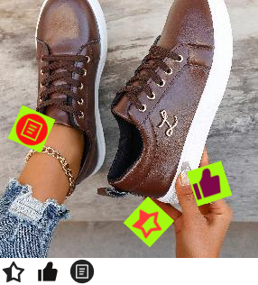
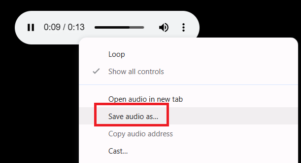

import Tabs from '@theme/Tabs';
import TabItem from '@theme/TabItem';
import ParamItem from '@theme/ParamItem';
import MethodItem from '@theme/MethodItem';
import MethodDescription from '@theme/MethodDescription';
import PriceBlock from '../../../../../src/theme/PriceBlock';
import PriceBlockWrap from '@theme/PriceBlockWrap';
import TaskImageWrapper from '@theme/TaskImageWrapper';
import TaskImageBlock from '@theme/TaskImageBlock';
import TaskImage from '@theme/TaskImage';
import { TaskImageText } from '../../../../../src/theme/TaskImageText';
import BlogLink from '@theme/BlogLink';
import { ArticleHead } from '../../../../../src/theme/ArticleHead';

<ArticleHead slug="captchas/ComplexImageTask-Recognition" />

# ComplexImageTask Recognition

<TaskImageWrapper>
  <TaskImageBlock link="/docs/captchas/ComplexImageTask-Recognition#oocl_rotate_new">
    <TaskImage></TaskImage>
    <TaskImageText title="Oocl_rotate_new" captchaId="complex-rec_oocl_rotate_new" />
  </TaskImageBlock>

  <TaskImageBlock link="/docs/captchas/ComplexImageTask-Recognition#oocl_rotate_double_new">
    <TaskImage></TaskImage>
    <TaskImageText title="Oocl_rotate_double_new" captchaId="complex-rec_oocl_rotate_double_new" />
  </TaskImageBlock>

  <TaskImageBlock link="/docs/captchas/ComplexImageTask-Recognition#betpunch_3x3_rotate">
    <TaskImage></TaskImage>
    <TaskImageText title="Betpunch_3x3_rotate request" captchaId="complex-rec_betpunch_3x3_rotate_request" />
  </TaskImageBlock>

  <TaskImageBlock link="/docs/captchas/ComplexImageTask-Recognition#bls">
    <TaskImage></TaskImage>
    <TaskImageText  captchaId="complex-rec_bls" />
  </TaskImageBlock>

  <TaskImageBlock link="/docs/captchas/ComplexImageTask-Recognition#shein">
    <TaskImage></TaskImage>
    <TaskImageText title="shein" captchaId="complex-rec_oocl_rotate_new" />
  </TaskImageBlock>

  <TaskImageBlock link="/docs/captchas/ComplexImageTask-Recognition#baidu">
    <TaskImage></TaskImage>
    <TaskImageText title="baidu" captchaId="complex-rec_baidu" />
  </TaskImageBlock>

  <TaskImageBlock link="/docs/captchas/ComplexImageTask-Recognition#bills_audio">
    <TaskImage></TaskImage>
    <TaskImageText title="bills_audio" captchaId="complex-rec_bills_audio" />
  </TaskImageBlock>
</TaskImageWrapper>

---

:::warning **Attention!**
Using proxy servers is not required for this task.
:::

## Request parameters

<TabItem value="proxyless" label="ComplexImageTask (without proxy)" default className="bordered-panel">
    <ParamItem title="type" required type="string" />
    **ComplexImageTask**

    ---

    <ParamItem title="class" required type="string" />
    **recognition**

    ---

    <ParamItem title="imagesBase64" required type="array" />
    Images array in base64 encoding.
    Example: [ “/9j/4AAQSkZJRgABAQEAAAAAAAD…”]

    ---

    <ParamItem title="Task (inside metadata)" required type="string" />
    Possible values: `oocl_rotate_new` and others <br />
    Task name (<u>in English</u>).

</TabItem>

## oocl_rotate_new

### Create task `oocl_rotate_new`

<PriceBlockWrap>
  <PriceBlock  captchaId="complex-rec_oocl_rotate_new" />
</PriceBlockWrap>

In the request we pass two images: background and circle.

<TabItem value="proxyless" label="RecaptchaV2TaskProxyless (without proxy)" default className="method-panel">
	<MethodItem>
		```http
		https://api.capmonster.cloud/createTask
		```
	</MethodItem>
	<MethodDescription>
		**Request**
		```json
		{
			"clientKey": "API_KEY",
			"task": {
				"type": "ComplexImageTask",
				"class": "recognition",
				"imagesBase64": [
					"{background_base64}",
					"{circle_base64}"
				],
				"metadata": {
					"Task": "oocl_rotate_new"
				}
			}
		}
		```

    	Background example (*background_base64*):

    	

    	Circle example (*circle_base64*):

    	

    	**Response**
    	```json
    	{
    	  "errorId":0,
    	  "taskId":407533072
    	}
    	```
    </MethodDescription>

</TabItem>

### Get task result `oocl_rotate_new`

<TabItem value="proxyless" label="GeeTestTaskProxyless (without proxy)" default className="method-panel-full">
	<MethodItem>
		```http
		https://api.capmonster.cloud/getTaskResult
		```
	</MethodItem>
	<MethodDescription>
		**Request**
		```json
		{
		  "clientKey":"API_KEY",
		  "taskId": 407533072
		}
		```
		**Response**
		Degrees by which the circle should be rotated clockwise.
		```json
		{
		  "errorId":0,
		  "status":"ready",
		  "errorCode":null,
		  "errorDescription":null,
		  "solution": 
		  {
			  "answer":[130.90909],
			  "metadata":{"AnswerType":"NumericArray"}
		  }		   
		}
		```
	</MethodDescription>
</TabItem>

## oocl_rotate_double_new

### Create task `oocl_rotate_double_new`

<PriceBlockWrap>
  <PriceBlock  captchaId="complex-rec_oocl_rotate_double_new"/>
</PriceBlockWrap>

In the request we pass three images: background, ring, circle.

<TabItem value="proxyless" label="ComplexImageTask (без прокси)" default className="method-panel">
	<MethodItem>
		```http
		https://api.capmonster.cloud/createTask
		```
	</MethodItem>
	<MethodDescription>
		**Request**
		```json
		{ 
			"clientKey": "API_KEY",
			"task": {
				"type": "ComplexImageTask",
				"class": "recognition",
				"imagesBase64": [
					"{background_base64}",
					"{ring_base64}",
					"{circle_base64}"
				],
				"metadata": {
					"Task": "oocl_rotate_double_new"
				}
			}
		}
		```

    	Background (*background_base64*):

    	

    	Ring (*ring_base64*):

    	

    	Circle (*circle_base64*):

    	

    	**Response**
    	```json
    	{
    	  "errorId":0,
    	  "taskId":407533072
    	}
    	```
    </MethodDescription>

</TabItem>

### Get task result `oocl_rotate_double_new`

<TabItem value="proxyless" label="ComplexImageTask (without proxy)" default className="method-panel-full">
	<MethodItem>
		```http
		https://api.capmonster.cloud/getTaskResult
		```
	</MethodItem>
	<MethodDescription>
		**Request**
		```json
		{
		  "clientKey":"API_KEY",
		  "taskId": 407533072
		}
		```
		**Response**
		Degrees by which the ring should be turned counterclockwise and the circle clockwise.
		```json
		{
		  "errorId":0,
		  "status":"ready",
		  "errorCode":null,
		  "errorDescription":null,
		  "solution": 
		  {
			  "answer":[130.90909],
			  "metadata":{"AnswerType":"NumericArray"}
		  }		   
		}
		```
	</MethodDescription>
</TabItem>

## betpunch_3x3_rotate

### Create task `betpunch_3x3_rotate`

<PriceBlockWrap>
  <PriceBlock captchaId="complex-rec_betpunch_3x3_rotate_request" />
</PriceBlockWrap>

In the request we pass nine images. The images must be passed in the following order:


<TabItem value="proxyless" label="ComplexImageTask (без прокси)" default className="method-panel">
	<MethodItem>
		```http
		https://api.capmonster.cloud/createTask
		```
	</MethodItem>
	<MethodDescription>
		**Request**
		```json
		{ 
			"clientKey": "API_KEY",
			"task": {
				"type": "ComplexImageTask",
				"class": "recognition",
				"imagesBase64": [
					"{image_1_Base64}",
					"{image_2_Base64}",
					"{image_3_Base64}",
					"{image_4_Base64}",
					"{image_5_Base64}",
					"{image_6_Base64}",
					"{image_7_Base64}",
					"{image_8_Base64}",
					"{image_9_Base64}",
				],
				"metadata": {
					"Task": "betpunch_3x3_rotate"
				}
			}
		}
		```

    	**Response**
    	```json
    	{
    	  "errorId":0,
    	  "taskId":407533072
    	}
    	```
    </MethodDescription>

</TabItem>

### Get task result `betpunch_3x3_rotate`

<TabItem value="proxyless" label="ComplexImageTask (without proxy)" default className="method-panel-full">
	<MethodItem>
		```http
		https://api.capmonster.cloud/getTaskResult
		```
	</MethodItem>
	<MethodDescription>
		**Request**
		```json
		{
		  "clientKey":"API_KEY",
		  "taskId": 407533072
		}
		```
		**Response**
		"answer":[X,X,X,X,X,X,X,X,X], where X is an integer value from 1 to 4 for each image. 4 - means that the image does not need to be rotated; 1-3 - the number of counterclockwise rotations of the image.
		```json
		{
			"errorId":0,
			"status":"ready",
			"errorCode":null,
			"errorDescription":null,
			"solution":
			{
				"answer":[4,4,4,4,4,3,1,2,2],
				"metadata":{"AnswerType":"NumericArray"}
			}
		}
		```
	</MethodDescription>
</TabItem>

## bls

### Create task `bls`

<PriceBlockWrap>
  <PriceBlock  captchaId="complex-rec_bls" />
</PriceBlockWrap>

In the request, we send 9 images in base64 format.
We also pass the sought value TaskArgument in the metadata.

<BlogLink url="https://capmonster.cloud/en/blog/news/bls-solve-extension" />

<TabItem value="proxyless" label="ComplexImageTask (without proxy)" default className="method-panel">
	<MethodItem>
		```http
		https://api.capmonster.cloud/createTask
		```
	</MethodItem>
	<MethodDescription>
		**Request**
		```json
		{
			"clientKey":{{API_key}},
			"task": 
			{
				"type": "ComplexImageTask",
				"class": "recognition",
				"imagesBase64": [
					"image1_to_base64",
					"image2_to_base64",
					"image3_to_base64",
					"image4_to_base64",
					"image5_to_base64",
					"image6_to_base64",
					"image7_to_base64",
					"image8_to_base64",
					"image9_to_base64"
				],
				"metadata": {
					"Task": "bls_3x3",
					"TaskArgument": "123"
				}
			}
		}
		```

    	Example task:

    	

    	Send images converted to base64:

    	
    	
    	
    	
    	
    	
    	
    	
    	

    	For this example: "TaskArgument": "546"

    	**Response**
    	```json
    	{
    	  "errorId":0,
    	  "taskId":143998457
    	}
    	```
    </MethodDescription>

</TabItem>

### Get task result `bls`

<TabItem value="proxyless" label="ComplexImageTask (without proxy)" default className="method-panel-full">
	<MethodItem>
		```http
		https://api.capmonster.cloud/getTaskResult
		```
	</MethodItem>
	<MethodDescription>
		**Request**
		```json
		{
		  "clientKey":"API_KEY",
		  "taskId": 143998457
		}
		```
		**Response**
		An array of values with elements true or false, depending on whether the number in the image is the sought argument or not.  
		```json
		{
		  "errorId":0,
		  "status":"ready",
		  "errorCode":null,
		  "errorDescription":null,
		  "solution": 
		  {
			"answer":[true,true,false,false,true,false,false,true,true],
			"metadata":{"AnswerType":"Grid"}
		  }
		}
		```
	</MethodDescription>
</TabItem>

## shein

### Create task `shein`

<PriceBlockWrap>
  <PriceBlock title="shein" captchaId="complex-rec_oocl_rotate_new" />
</PriceBlockWrap>

In the request, we pass one image in base64 format.

<TabItem value="proxyless" label="ComplexImageTask (without proxy)" default className="method-panel">
	<MethodItem>
		```http
		https://api.capmonster.cloud/createTask
		```
	</MethodItem>
	<MethodDescription>
		**Request**
		```json
{
		    "clientKey": "API_KEY",
		    "task": {
			"type": "ComplexImageTask",
			"class": "recognition",
			"imagesBase64": [
			   "base64"
			],
			"metadata": {
			    "Task": "shein"
		        }
	        }
}
		```

    	Example task:

    	
    	

    	**Response**
    	```json
    	{
    	  "errorId":0,
    	  "taskId":143998457
    	}
    	```
    </MethodDescription>

</TabItem>

### Get task result `shein`

<TabItem value="proxyless" label="ComplexImageTask (without proxy)" default className="method-panel-full">
	<MethodItem>
		```http
		https://api.capmonster.cloud/getTaskResult
		```
	</MethodItem>
	<MethodDescription>
		**Request**
		```json
		{
		  "clientKey":"API_KEY",
		  "taskId": 143998457
		}
		```
		**Response**
		Coordinates to be clicked on in a specific order.  
		```json
{
    "solution":
	{
	    "answer":[{"X":68.99999964,"Y":201.954889},{"X":127.99999783999999,"Y":281.54887104},{"X":181.00000776,"Y":49.894734680000006}],
		"metadata":{"AnswerType":"Coordinate"}
	},
		"cost":0.0003,
		"status":"ready",
		"errorId":0,
		"errorCode":null,
		"errorDescription":null
}
		```
	</MethodDescription>
</TabItem>

## baidu

### Create task `baidu`

<PriceBlockWrap>
  <PriceBlock title="baidu" captchaId="complex-rec_baidu" />
</PriceBlockWrap>

:::warning **Attention!**
At the beginning of the solving process, temporary *unsolvable* responses may occur. This is **not an error** – the captcha will continue to be solved successfully after initialization.  
:::

In the request, we pass one image in base64 format.

<TabItem value="proxyless" label="ComplexImageTask (without proxy)" default className="method-panel">
	<MethodItem>
		```http
		https://api.capmonster.cloud/createTask
		```
	</MethodItem>
	<MethodDescription>
		**Request**
		```json
		{
			"clientKey": "API_KEY",
			"task":
			{
				"type": "ComplexImageTask",
				"class": "recognition",
				"imagesBase64": ["base64"],
				"metadata": {
					"Task": "baidu"
				}
			}
		}
		```

    	Example task:

    	

    	**Response**
    	```json
    	{
    		"errorId":0,
    		"taskId":143998457
    	}
    	```
    </MethodDescription>

</TabItem>

### Get task result `baidu`

<TabItem value="proxyless" label="ComplexImageTask (without proxy)" default className="method-panel-full">
	<MethodItem>
		```http
		https://api.capmonster.cloud/getTaskResult
		```
	</MethodItem>
	<MethodDescription>
		**Request**
		```json
		{
			"clientKey":"API_KEY",
			"taskId": 143998457
		}
		```
		**Response**
		The degrees by which the image needs to be rotated clockwise.
		```json
		{
			"solution":
			{
				"answer":[297],
				"metadata":{"AnswerType":"NumericArray"}
			},
			"cost":0.0005,
			"status":"ready",
			"errorId":0,
			"errorCode":null,
			"errorDescription":null
		}
		```
	</MethodDescription>
</TabItem>
---

## bills_audio

### Create task `bills_audio`

<PriceBlockWrap>
  <PriceBlock title="bills_audio" captchaId="complex-rec_bills_audio" />
</PriceBlockWrap>

The `bills_audio` captcha is an audio version of the "receipt captcha," where generated images or data simulate receipts and contain, for example, numbers, amounts, and dates. In this type of task, the user is asked to listen to an audio file and confirm the correctness of the input based on what they hear. This format may look like the following:

 

<TabItem value="proxyless" label="ComplexImageTask (proxyless)" default className="method-panel">
    <MethodItem>
    ```http
    https://api.capmonster.cloud/createTask
    ```
    </MethodItem>
    <MethodDescription>
    **Request**
    ```json
    {
        "clientKey": "API_KEY",
        "task": {
            "type": "ComplexImageTask",
            "class": "recognition",
            "imagesBase64": [
                "UklGRnjuAwBXQVZFZm10...f/2f/9/6z/vf8MAAAA"
            ],
            "metadata": {
                "Task": "bills_audio",
                "PayloadType": "Audio"
            }
        }
    }
    ```

    **Response**
    ```json
    {
        "errorId": 0,
        "taskId": 143998457
    }
    ```
    </MethodDescription>
</TabItem>

### Get task result `bills_audio`

<TabItem value="proxyless" label="ComplexImageTask (proxyless)" default className="method-panel-full">
    <MethodItem>
    ```http
    https://api.capmonster.cloud/getTaskResult
    ```
    </MethodItem>
    <MethodDescription>
    **Request**
    ```json
    {
        "clientKey": "API_KEY",
        "taskId": 143998457
    }
    ```
    **Response**  
    The response contains the digits extracted from the audio.
    ```json
    {
        "solution": {
            "answer": [6, 8, 4, 1, 2, 3],
            "metadata": {"AnswerType": "Text"}
        },
        "cost": 0.0008,
        "status": "ready",
        "errorId": 0,
        "errorCode": null,
        "errorDescription": null
    }
    ```
    </MethodDescription>
</TabItem>

### How to get the audio file from the page and convert it to Base64

1. Open the captcha page, launch **DevTools**, and go to the **Network** tab.  
2. Activate the captcha’s audio mode by clicking the corresponding button.  
3. In the list of requests, find a URL like:  
   `blob:https://example.com/3be79ac6-1b3d-43ef-9a8a-7ad8877b3606`  
4. Copy this URL and open it in the browser’s address bar — the captcha audio file in **.wav** format will open.  




5. Save the file and convert it from **.wav** to **Base64** in any convenient way — for example, using Node.js code:
```JavaScript
const fs = require("fs");

// Path to the source .wav file
const filePath = "C:\\Users\\User\\Downloads\\file-acbe-4fb3-9f8e-f989ba6c7fde.wav";

const fileBuffer = fs.readFileSync(filePath);

// Convert to Base64
const base64 = fileBuffer.toString("base64");

// Save the Base64 string to a text file
fs.writeFileSync("output.txt", base64);

console.log("The file has been successfully converted to Base64 and saved as output.txt");
```

6. Use the resulting Base64 string in the request to CapMonster Cloud.

---

## How to find Base64

Images on web pages can be represented either as a URL or directly encoded in Base64 format. To find the required value, right-click on the image, select **Inspect**, and carefully examine the **Elements** section or the network requests grid—there you can find the URL or the encoded content.

### Manually

1. Open your website where the captcha appears in the browser.
2. Right-click on the captcha element and select **Inspect**.


### Automatically

A convenient way to automate the search for all necessary parameters.
Some parameters are regenerated every time the page loads, so you'll need to extract them through a browser — either regular or headless (e.g., using **Playwright**).
Since the values of dynamic parameters are short-lived, the captcha must be solved immediately after retrieving them.

:::warning **Important!**
The code snippets provided are basic examples for familiarization with extracting the required parameters. The exact implementation will depend on your captcha page, its structure, and the HTML elements/selectors it uses.
:::

<Tabs className="full-width-tabs filled-tabs request-tabs">

  <TabItem value="js" label="JavaScript" default className="method-panel">
    <details>
      <summary>Show Code (Node.js)</summary>

      ```js
      import { chromium } from 'playwright';

      // Function to extract base64 from src
      async function getBase64FromSrc(elementHandle) {
        const src = await elementHandle.getAttribute('src');
        if (src && src.startsWith('data:image')) {
          return src.split(',')[1];
        }
        return null;
      }

      // Function to get base64 using a screenshot (if src is not in base64)
      async function elementToBase64(elementHandle) {
        const base64 = await getBase64FromSrc(elementHandle);
        if (base64) {
          return base64; // If the image is already in base64, return it
        }
        const buffer = await elementHandle.screenshot();
        return buffer.toString('base64');
      }

      // Function to convert an array of elements into an array of base64 strings
      async function multipleElementsToBase64(elements) {
        const base64Array = [];
        for (const el of elements) {
          const base64 = await elementToBase64(el);
          base64Array.push(base64);
        }
        return base64Array;
      }

      // -------------------------------------------------------------
      // Preparing base64 for different captcha types
      // -------------------------------------------------------------

      // 1. oocl_rotate_new (background + circle)
      async function prepareOoclRotateNew(page) {
        const background = await page.$('img.background');
        const circle = await page.$('img.circle');

        const backgroundBase64 = await elementToBase64(background);
        const circleBase64 = await elementToBase64(circle);

        return { backgroundBase64, circleBase64 };
      }

      // 2. oocl_rotate_double_new (background + ring + circle)
      async function prepareOoclRotateDoubleNew(page) {
        const background = await page.$('img.background');
        const ring = await page.$('img.ring');
        const circle = await page.$('img.circle');

        const backgroundBase64 = await elementToBase64(background);
        const ringBase64 = await elementToBase64(ring);
        const circleBase64 = await elementToBase64(circle);

        return { backgroundBase64, ringBase64, circleBase64 };
      }

      // 3. betpunch_3x3_rotate (9 small images)
      async function prepareBetpunch3x3(page) {
        const sectors = await page.$$('img.sector');

        const sectorsBase64 = await multipleElementsToBase64(sectors);

        return { sectorsBase64 };
      }

      // 4. bls (9 small images for clicking)
      async function prepareBls(page) {
        const sectors = await page.$$('img.sector');

        const sectorsBase64 = await multipleElementsToBase64(sectors);

        return { sectorsBase64 };
      }

      // 5. shein (1 large image)
      async function prepareShein(page) {
        const captchaImage = await page.$('img.captcha');

        const captchaBase64 = await elementToBase64(captchaImage);

        return { captchaBase64 };
      }

      // Playwright example
      async function run() {
        const browser = await chromium.launch();
        const page = await browser.newPage();
        await page.goto('https://example.com'); // Replace with the actual URL

        // Example of getting base64 for oocl_rotate_new
        const { backgroundBase64, circleBase64 } = await prepareOoclRotateNew(page);
        console.log('Base64 background:', backgroundBase64);
        console.log('Base64 circle:', circleBase64);

        await browser.close();
      }

      run();
      ```
    </details>
  </TabItem>

  <TabItem value="python" label="Python" className="method-panel">
    <details>
      <summary>Show Code</summary>

      ```python
      import base64
      import asyncio
      from playwright.async_api import async_playwright

      # Function to extract base64 from src
      async def get_base64_from_src(element_handle):
          src = await element_handle.get_attribute("src")
          if src and src.startswith("data:image"):
              return src.split(",")[1]
          return None

      # Function to get base64 using a screenshot (if src is not in base64)
      async def element_to_base64(element_handle):
          base64_str = await get_base64_from_src(element_handle)
          if base64_str:
              return base64_str  # If the image is already in base64, return it
          screenshot = await element_handle.screenshot()
          return base64.b64encode(screenshot).decode("utf-8")

      # Function to convert an array of elements into an array of base64 strings
      async def multiple_elements_to_base64(elements):
          base64_list = []
          for el in elements:
              base64_str = await element_to_base64(el)
              base64_list.append(base64_str)
          return base64_list

      # -------------------------------------------------------------
      # Preparing base64 for different captcha types
      # -------------------------------------------------------------

      # 1. oocl_rotate_new (background + circle)
      async def prepare_oocl_rotate_new(page):
          background = await page.query_selector("img.background")
          circle = await page.query_selector("img.circle")

          background_base64 = await element_to_base64(background)
          circle_base64 = await element_to_base64(circle)

          return {"backgroundBase64": background_base64, "circleBase64": circle_base64}

      # 2. oocl_rotate_double_new (background + ring + circle)
      async def prepare_oocl_rotate_double_new(page):
          background = await page.query_selector("img.background")
          ring = await page.query_selector("img.ring")
          circle = await page.query_selector("img.circle")

          background_base64 = await element_to_base64(background)
          ring_base64 = await element_to_base64(ring)
          circle_base64 = await element_to_base64(circle)

          return {"backgroundBase64": background_base64, "ringBase64": ring_base64, "circleBase64": circle_base64}

      # 3. betpunch_3x3_rotate (9 small images)
      async def prepare_betpunch3x3(page):
          sectors = await page.query_selector_all("img.sector")
          sectors_base64 = await multiple_elements_to_base64(sectors)

          return {"sectorsBase64": sectors_base64}

      # 4. bls (9 small images for clicking)
      async def prepare_bls(page):
          sectors = await page.query_selector_all("img.sector")
          sectors_base64 = await multiple_elements_to_base64(sectors)

          return {"sectorsBase64": sectors_base64}

      # 5. shein (1 large image)
      async def prepare_shein(page):
          captcha_image = await page.query_selector("img.captcha")
          captcha_base64 = await element_to_base64(captcha_image)

          return {"captchaBase64": captcha_base64}

      # Playwright example
      async def run():
          async with async_playwright() as p:
              browser = await p.chromium.launch()
              page = await browser.new_page()
              await page.goto("https://example.com")

              # Example of getting base64 for oocl_rotate_new
              result = await prepare_oocl_rotate_new(page)
              print(result)

              await browser.close()

      if __name__ == "__main__":
          asyncio.run(run())
      ```
    </details>
  </TabItem>

  <TabItem value="csharp" label="C#" className="method-panel">
    <details>
      <summary>Show Code</summary>

      ```csharp
      using System;
      using System.Collections.Generic;
      using System.Threading.Tasks;
      using Microsoft.Playwright;

      class Program
      {
          // Function to extract base64 from src
          private static async Task<string?> GetBase64FromSrcAsync(IElementHandle elementHandle)
          {
              var src = await elementHandle.GetAttributeAsync("src");
              if (!string.IsNullOrEmpty(src) && src.StartsWith("data:image"))
              {
                  return src.Split(',')[1];
              }
              return null;
          }

          // Function to get base64 using a screenshot (if src is not in base64)
          private static async Task<string> ElementToBase64Async(IElementHandle elementHandle)
          {
              var base64Str = await GetBase64FromSrcAsync(elementHandle);
              if (base64Str != null)
              {
                  return base64Str; // If the image is already in base64, return it
              }

              var screenshot = await elementHandle.ScreenshotAsync();
              return Convert.ToBase64String(screenshot);
          }

          // Function to convert an array of elements into an array of base64 strings
          private static async Task<List<string>> MultipleElementsToBase64Async(IEnumerable<IElementHandle> elements)
          {
              var base64List = new List<string>();
              foreach (var el in elements)
              {
                  var base64Str = await ElementToBase64Async(el);
                  base64List.Add(base64Str);
              }
              return base64List;
          }

          // -------------------------------------------------------------
          // Preparing base64 for different captcha types
          // -------------------------------------------------------------

          // 1. oocl_rotate_new (background + circle)
          private static async Task<Dictionary<string, string>> PrepareOoclRotateNewAsync(IPage page)
          {
              var background = await page.QuerySelectorAsync("img.background");
              var circle = await page.QuerySelectorAsync("img.circle");

              var backgroundBase64 = await ElementToBase64Async(background);
              var circleBase64 = await ElementToBase64Async(circle);

              return new Dictionary<string, string>
              {
                  ["backgroundBase64"] = backgroundBase64,
                  ["circleBase64"] = circleBase64
              };
          }

          // 2. oocl_rotate_double_new (background + ring + circle)
          private static async Task<Dictionary<string, string>> PrepareOoclRotateDoubleNewAsync(IPage page)
          {
              var background = await page.QuerySelectorAsync("img.background");
              var ring = await page.QuerySelectorAsync("img.ring");
              var circle = await page.QuerySelectorAsync("img.circle");

              var backgroundBase64 = await ElementToBase64Async(background);
              var ringBase64 = await ElementToBase64Async(ring);
              var circleBase64 = await ElementToBase64Async(circle);

              return new Dictionary<string, string>
              {
                  ["backgroundBase64"] = backgroundBase64,
                  ["ringBase64"] = ringBase64,
                  ["circleBase64"] = circleBase64
              };
          }

          // 3. betpunch_3x3_rotate (9 small images)
          private static async Task<Dictionary<string, List<string>>> PrepareBetpunch3x3Async(IPage page)
          {
              var sectors = await page.QuerySelectorAllAsync("img.sector");
              var sectorsBase64 = await MultipleElementsToBase64Async(sectors);

              return new Dictionary<string, List<string>>
              {
                  ["sectorsBase64"] = sectorsBase64
              };
          }

          // 4. bls (9 small images for clicking)
          private static async Task<Dictionary<string, List<string>>> PrepareBlsAsync(IPage page)
          {
              var sectors = await page.QuerySelectorAllAsync("img.sector");
              var sectorsBase64 = await MultipleElementsToBase64Async(sectors);

              return new Dictionary<string, List<string>>
              {
                  ["sectorsBase64"] = sectorsBase64
              };
          }

          // 5. shein (1 large image)
          private static async Task<Dictionary<string, string>> PrepareSheinAsync(IPage page)
          {
              var captchaImage = await page.QuerySelectorAsync("img.captcha");
              var captchaBase64 = await ElementToBase64Async(captchaImage);

              return new Dictionary<string, string>
              {
                  ["captchaBase64"] = captchaBase64
              };
          }

          public static async Task Main()
          {
              using var playwright = await Playwright.CreateAsync();
              var browser = await playwright.Chromium.LaunchAsync();
              var page = await browser.NewPageAsync();
              await page.GotoAsync("https://example.com");

              var result = await PrepareOoclRotateNewAsync(page);
              Console.WriteLine($"Background base64 length: {result["backgroundBase64"].Length}");
              Console.WriteLine($"Circle base64 length: {result["circleBase64"].Length}");

              await browser.CloseAsync();
          }
      }
      ```
    </details>
  </TabItem>

</Tabs>

<details>
        <summary>Example of Searching for oocl Parameters in Node.js</summary>

```js
import { chromium } from "playwright";

// Proxy (optional)
// const proxyHost = "";
// const proxyUsername = "";
// const proxyPassword = "";

async function getBase64FromSrc(elementHandle) {
  const src = await elementHandle.getAttribute("src");
  if (src && src.startsWith("data:image")) {
    return src.split(",")[1];
  }
  return null;
}

async function elementToBase64(elementHandle) {
  const base64 = await getBase64FromSrc(elementHandle);
  if (base64) {
    return base64;
  }
  const buffer = await elementHandle.screenshot();
  return buffer.toString("base64");
}

async function extractVerifyImagesBase64(page) {
  const imgSelectors = [".verify-img-panel img", ".verify-sub-block img"];

  const imageHandles = (
    await Promise.all(imgSelectors.map((selector) => page.$$(selector)))
  ).flat();

  if (imageHandles.length === 0) {
    throw new Error(
      "No images found in verify-img-panel or verify-sub-block."
    );
  }

  const imagesBase64 = [];
  for (const handle of imageHandles) {
    const base64 = await elementToBase64(handle);
    imagesBase64.push({
      src: await handle.getAttribute("src"),
      base64,
    });
  }

  return imagesBase64;
}

async function run() {
  const browser = await chromium.launch({
    headless: false,
    // proxy: {
    //   server: `http://${proxyHost}`,
    //   username: proxyUsername,
    //   password: proxyPassword,
    // },
  });

  const page = await browser.newPage();
  await page.goto(
    "https://example.com/registration/form?appurl=https://example.com"
  );

  try {
    const images = await extractVerifyImagesBase64(page);
    for (const { src, base64 } of images) {
      console.log("Source:", src);
      console.log("Base64:", base64);
    }
  } catch (err) {
    console.error(err.message);
  }

  await browser.close();
}

run();
```
</details>

## Use the SDK Library

<Tabs className="full-width-tabs filled-tabs request-tabs" groupId="captcha-type">

  <TabItem value="js" label="JavaScript" default className="method-panel">

```js
// https://github.com/ZennoLab/capmonstercloud-client-js

import { CapMonsterCloudClientFactory, ClientOptions, ComplexImageTaskRecognitionRequest } from '@zennolab_com/capmonstercloud-client';

document.addEventListener('DOMContentLoaded', async () => {
  const cmcClient = CapMonsterCloudClientFactory.Create(
    new ClientOptions({ clientKey: '<your capmonster.cloud API key>' })
  );
  console.log(await cmcClient.getBalance());

  const citRecognitionRequest = new ComplexImageTaskRecognitionRequest({
    imagesBase64: ['/9xwee/'], // Image in base64 format
    metaData: { Task: 'oocl_rotate' },
  });

  console.log(await cmcClient.Solve(citRecognitionRequest));
});
```

  </TabItem>

  <TabItem value="python" label="Python" className="method-panel">

```python
# https://github.com/ZennoLab/capmonstercloud-client-python

import asyncio
from capmonstercloudclient import CapMonsterClient, ClientOptions
from capmonstercloudclient.requests import RecognitionComplexImageTaskRequest

# Your CapMonster Cloud API key
client_options = ClientOptions(api_key="your_api_key")
cap_monster_client = CapMonsterClient(options=client_options)

complexImage_request = RecognitionComplexImageTaskRequest(
    imagesBase64=[
        "/9xwee/"  # Image in base64 format
    ],
    metadata={"Task": "oocl_rotate"}
)

async def solve_captcha():
    solution = await cap_monster_client.solve_captcha(complexImage_request)
    return solution

responses = asyncio.run(solve_captcha())
print(responses)
```

  <BlogLink url="https://capmonster.cloud/ru/blog/re-1/python-recaptcha-v2"/>
  </TabItem>

  <TabItem value="csharp" label="C#" className="method-panel">

```csharp
// https://github.com/ZennoLab/capmonstercloud-client-dotnet

using Zennolab.CapMonsterCloud.Requests;
using Zennolab.CapMonsterCloud;

class Program
{
    static async Task MainComplexImageTaskRecognition(string[] args)
    {
        var clientOptions = new ClientOptions
        {
            ClientKey = "your_api_key" // Your CapMonster Cloud API key 
        };

        var cmCloudClient = CapMonsterCloudClientFactory.Create(clientOptions);

        var recognitionCITRequest = new RecognitionComplexImageTaskRequest
        {
            ImagesBase64 = new List<string>
            {
                "/9j/4AAQSkZJRgABAQEAAAAAAAD…" // Image in base64 format
            },
            Metadata = new RecognitionComplexImageTaskRequest.RecognitionMetadata
            {
                Task = "oocl_rotate_new"
            }
        };

        var recognitionCITResult = await cmCloudClient.SolveAsync(recognitionCITRequest);

        if(recognitionCITResult.Solution.Answer.IsGrid)
            Console.WriteLine("Captcha Solution: " + recognitionCITResult.Solution.Answer.GridAnswer);
        else if (recognitionCITResult.Solution.Answer.IsNumeric)
            Console.WriteLine("Captcha Solution: " + recognitionCITResult.Solution.Answer.NumericAnswer);
    }
}
```

  </TabItem>

</Tabs>
