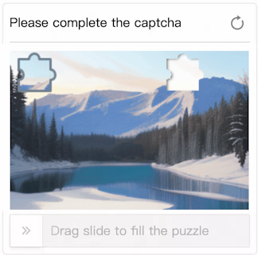
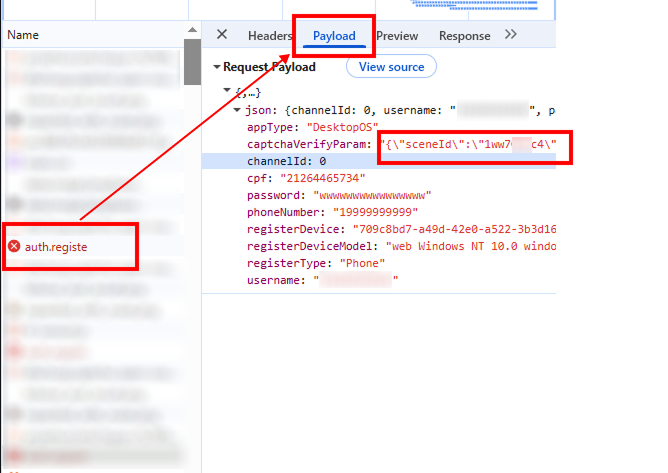
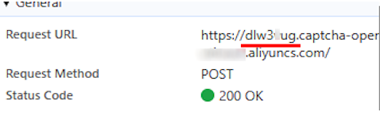

import Tabs from '@theme/Tabs';
import TabItem from '@theme/TabItem';
import ParamItem from '@theme/ParamItem';
import MethodItem from '@theme/MethodItem';
import ImageWrap from '@theme/ImageWrap';
import ImagesLayout from '@theme/ImagesLayout';
import MethodDescription from '@theme/MethodDescription'
import PriceBlock from '@theme/PriceBlock';
import PriceBlockWrap from '@theme/PriceBlockWrap';
import { ArticleHead } from '../../../../../src/theme/ArticleHead';

<ArticleHead slug="captchas/alibaba-task" />

# Alibaba Cloud Captcha

<PriceBlockWrap>
  <PriceBlock title="Alibaba Captcha" captchaId="alibabacaptcha"/>
</PriceBlockWrap>

## Task examples

Below are examples of Alibaba Captcha task types that are currently supported by the CapMonster Cloud service:

<ImagesLayout gap="16px" columns={3}>
  <ImageWrap title="Puzzle CAPTCHA"></ImageWrap>
  <ImageWrap title="Image restoration CAPTCHA"></ImageWrap>
</ImagesLayout>

:::warning **Attention!**
CapMonster Cloud uses built-in proxies by default — their cost is already included in the service. You only need to specify your own proxies in cases where the website does not accept the token or access to the built-in services is restricted.

If you are using a proxy with IP authorization, make sure to whitelist the address **65.21.190.34**.
:::

## Request parameters

<TabItem value="proxy" label="CustomTask (with proxy)" className="bordered-panel">

  <ParamItem title="type" required type="string" />
  **CustomTask**

  ---

  <ParamItem title="class" required type="string" />
  **alibaba**

   --- 

  <ParamItem title="websiteURL" required type="string" />
  Full URL of the page with the CAPTCHA.

  ---

  <ParamItem title="sceneId (inside metadata)" required type="string" />

  CAPTCHA scenario identifier, passed in the following format: `"sceneId":"1ww7426c4"` (see [the corresponding section](#sceneid) for how to find this value)

  ---
  <ParamItem title="prefix (inside metadata)" required type="string" />

  CAPTCHA initialization parameter, passed in the URL of the request used to load the task text on the page.<br />
  For example, if the URL looks like: `https://dlw3kug.captcha-open.example.aliyuncs.com/`, then the value of the `prefix` parameter corresponds to the subdomain — `dlw3kug`.

  ---

  <ParamItem title="userAgent" type="string" />
   Browser User-Agent.  
   **Pass only a valid UA from Windows OS. Currently it is**: `userAgentPlaceholder`

  ---

  <ParamItem title="proxyType" type="string" />
  **http** - standard http/https proxy;<br />
  **https** - try this if "http" doesn't work (needed for some custom proxies);<br />
  **socks4** - socks4 proxy;<br />
  **socks5** - socks5 proxy.

  ---

  <ParamItem title="proxyAddress" type="string" />
  <p>
    IP address of the proxy (IPv4/IPv6). Not allowed:
    - using transparent proxies (those exposing the client IP);
    - using local machine proxies.
  </p>

  ---

  <ParamItem title="proxyPort" type="integer" />
  Proxy port.

  ---

  <ParamItem title="proxyLogin" type="string" />
  Proxy login.

  ---

  <ParamItem title="proxyPassword" type="string" />
  Proxy password.

  ---

</TabItem>

## Create task method

<Tabs className="full-width-tabs filled-tabs request-tabs" groupId="captcha-type">
  <TabItem value="proxyless" label="CustomTask (without proxy)" default className="method-panel">
    <MethodItem>
    ```http
    https://api.capmonster.cloud/createTask
    ```
    </MethodItem>
    <MethodDescription>
      
      **Request**
      ```json
      {
        "clientKey": "API_KEY",
        "task": {
          "type": "CustomTask",
          "class": "alibaba",
          "websiteURL": "https://www.example.com",
          "userAgent": "userAgentPlaceholder"
          "metadata": {
			"sceneId":"1ww7426c4",
			"prefix":"dlw3kug"
		}
	}
      ```

      **Response**
      ```json
      {
        "errorId": 0,
        "taskId": 407533077
      }
      ```
    </MethodDescription>
  </TabItem>

    <TabItem value="proxy" label="CustomTask (with proxy)" className="method-panel">
    <MethodItem>
      ```http
      https://api.capmonster.cloud/createTask
      ```
    </MethodItem>
    <MethodDescription>
      
      **Request**
      ```json
      {
        "clientKey": "API_KEY",
        "task": {
          "type": "CustomTask",
          "class": "alibaba",
          "websiteURL": "https://www.example.com",
          "userAgent": "userAgentPlaceholder"
          "metadata": {
			"sceneId":"1ww7426c4",
			"prefix":"dlw3kug",
          "proxyType": "http",
          "proxyAddress": "8.8.8.8",
          "proxyPort": 8080,
          "proxyLogin": "proxyLoginHere",
          "proxyPassword": "proxyPasswordHere"
        }
      }
      ```

      **Response**
      ```json
      {
        "errorId": 0,
        "taskId": 407533077
      }
      ```
    </MethodDescription>
  </TabItem>
</Tabs>

## Get task result method

Use the [getTaskResult](../api/methods/get-task-result.mdx) method to obtain the Alibaba Captcha solution.

<TabItem value="proxyless" label="CustomTask (without proxy)" default className="method-panel-full">
  <MethodItem>
    ```http
    https://api.capmonster.cloud/getTaskResult
    ```
  </MethodItem>
  <MethodDescription>

  **Request**
  ```json
  {
    "clientKey": "API_KEY",
    "taskId": 407533077
  }
```

**Response**

```json
{
  "errorId": 0,
  "errorCode": null,
  "errorDescription": null,
  "status": "ready",
  "solution": {
    "data": {
      "tokens": "{\"sceneId\":\"1ww7426c4\",\"certifyId\":\"kBjCxX2W2c\",\"deviceToken\":\"U0dfV0VCIzM3...wOGJkMjY=\",\"data\":\"JRMnX3B...EUQdCpLkqSj7THYNf3dn\"}"
    }
  }
}
```

  </MethodDescription>
</TabItem>

## How to find all required parameters for task creation

## `sceneId`

`sceneId` can be obtained after successfully solving the CAPTCHA once:

1. Solve the CAPTCHA manually on the website.
2. Open **DevTools** → **Network** tab.
3. Find the request sent after successful verification (e.g., verify, check, validate).
4. In the **Payload** or **Response**, locate the `sceneId` parameter.



This parameter can also be found using search across network requests:

1. Open the page with the CAPTCHA, then go to **DevTools** → **Network** tab.
3. Use search (Ctrl + F) with the keyword `sceneId` or `CaptchaSceneId`.


## `prefix`

`prefix` can be obtained from the request URL used on the website to load the CAPTCHA task text:

1. Open the page with the CAPTCHA.
2. Find the request related to loading the task (usually via **DevTools** → **Network**).

