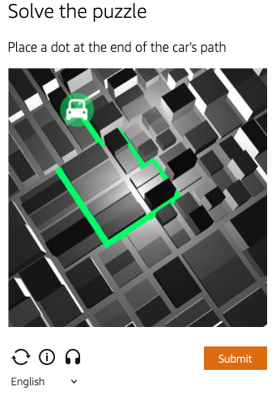

import Tabs from '@theme/Tabs';
import TabItem from '@theme/TabItem';
import ParamItem from '@theme/ParamItem';
import MethodItem from '@theme/MethodItem';
import MethodDescription from '@theme/MethodDescription'
import PriceBlock from '../../../../../src/theme/PriceBlock';
import PriceBlockWrap from '@theme/PriceBlockWrap';
import BlogLink from '@theme/BlogLink';
import { ArticleHead } from '../../../../../src/theme/ArticleHead';

<ArticleHead slug="amazon-task" />

# AmazonTask | AWS WAF Captcha and Challenge

<PriceBlockWrap>
  <PriceBlock title="AmazonTask" captchaId="amazonwaf"/>
</PriceBlockWrap>

### <span style={{fontSize: '1.5rem'}}>Examples of tasks</span>

<Tabs className="full-width-tabs">
  <TabItem value="waf1" label="Click" default>
    
  </TabItem>
  <TabItem value="waf2" label="Puzzle">
    
  </TabItem>
</Tabs>

Solving captcha and challenge in AWS WAF

<BlogLink url="https://capmonster.cloud/en/blog/scraping/amazon-captcha-web-scraping"/>

:::warning **Attention!**
CapMonster Cloud uses built-in proxies by default — their cost is already included in the service. You only need to specify your own proxies in cases where the website does not accept the token or access to the built-in services is restricted.

If you are using a proxy with IP authorization, make sure to whitelist the address **65.21.190.34**.
:::

## Request parameters
## Option 1
<TabItem value="proxyless" label="AmazonTask (without proxy)" default className="bordered-panel">
    <ParamItem title="type" required type="string" />
    **AmazonTask**

    --- 

    <ParamItem title="websiteURL" required type="string" />
    The main page address where the captcha is solved.

    ---
	
    <ParamItem title="websiteKey" required type="string" />
    Can be found in the `apiKey` field when rendering captcha.

    ---

    <ParamItem title="captchaScript" required type="string" />
    Link to jsapi.js on the HTML page, looks like \<Integration URL\>/jsapi.js.

    ---

    <ParamItem title="cookieSolution" type="boolean" />
    Default is **false** — the response will include "captcha_voucher" and "existing_token".  
    If you need the "aws-waf-token" cookie, set to **true**.

    ---

  <ParamItem title="userAgent" type="string" />
  Browser User-Agent. <br />
  **Pass only a valid UA from Windows OS. Currently it is**: `userAgentPlaceholder`

  ---

  <ParamItem title="proxyType" type="string" />
  **http** - regular http/https proxy;<br />
  **https** - try this option only if "http" does not work (required for some custom proxies);<br />
  **socks4** - socks4 proxy;<br />
  **socks5** - socks5 proxy.

  ---

  <ParamItem title="proxyAddress" type="string" />
  <p>
    IPv4/IPv6 proxy address. Not allowed:
    - using transparent proxies (where the client IP is visible);
    - using proxies on local machines.
  </p>

  ---

  <ParamItem title="proxyPort" type="integer" />
  Proxy port.

  ---

  <ParamItem title="proxyLogin" type="string" />
  Proxy server login.

  ---

  <ParamItem title="proxyPassword" type="string" />
  Proxy server password.

  ---
</TabItem>

## Option 2 
<TabItem value="proxyless" label="AmazonTaskProxyless (without proxy)" default className="bordered-panel">
    <ParamItem title="type" required type="string" />
    **AmazonTask**

    --- 

    <ParamItem title="websiteURL" required type="string" />
    The main page address where the captcha is solved.

    ---

    <ParamItem title="challengeScript" required type="string" />
    Link to `challenge.js` (see description below).

    ---

    <ParamItem title="websiteKey" required type="string" />
    A string that can be obtained from the HTML captcha page or using JavaScript: `window.gokuProps.key`.

    ---

    <ParamItem title="context" required type="string" />
    A string that can be obtained from the HTML captcha page or using JavaScript: `window.gokuProps.context`.

    ---

    <ParamItem title="iv" required type="string" />
    A string that can be obtained from the HTML captcha page or using JavaScript: `window.gokuProps.iv`.

    ---

    <ParamItem title="captchaScript" type="string" />
    Link to captcha.js (may be absent if only a challenge is present).

    ---

    <ParamItem title="cookieSolution" type="boolean" />
    Default is **false** — the response will include "captcha_voucher" and "existing_token".  
    If you need the "aws-waf-token" cookie, set to **true**.

    ---

  <ParamItem title="proxyType" type="string" />
  **http** - standard http/https proxy;<br />
  **https** - try this option only if "http" does not work (required for some custom proxies);<br />
  **socks4** - socks4 proxy;<br />
  **socks5** - socks5 proxy.

  ---

  <ParamItem title="proxyAddress" type="string" />
  <p>
    Proxy IPv4/IPv6 address. Not allowed:
    - transparent proxies (where the client IP can be seen);
    - proxies on local machines.
  </p>

  ---

  <ParamItem title="proxyPort" type="integer" />
  Proxy port.

  ---

  <ParamItem title="proxyLogin" type="string" />
  Proxy server login.

  ---

  <ParamItem title="proxyPassword" type="string" />
  Proxy server password.

---

</TabItem>

  ## Option 3

If the site uses an invisible captcha and only `challenge.js` is loaded, use this option.  
In this case, you don’t need to pass all parameters from option 2 — they can remain empty. Pass only the `challenge.js` value.

<TabItem value="proxyless" label="AmazonTaskProxyless (without proxy)" default className="bordered-panel">
    <ParamItem title="type" required type="string" />
    **AmazonTask**

    --- 

    <ParamItem title="websiteURL" required type="string" />
    The main page address where the captcha is solved.

    ---

    <ParamItem title="challengeScript" required type="string" />
    Link to challenge.js.

    ---

    <ParamItem title="captchaScript" required type="string" />
    Link to captcha.js. In this option, provide any string.

    ---

    <ParamItem title="websiteKey" required type="string" />
    Provide any string.

    ---

    <ParamItem title="context" required type="string" />
    Provide any string.

    ---

    <ParamItem title="iv" required type="string" />
    Provide any string.

    ---

    <ParamItem title="cookieSolution" type="boolean" />
    Set to **true** to get the "aws-waf token". 

    ---

  <ParamItem title="proxyType" type="string" />
  **http** - standard http/https proxy;<br />
  **https** - try this option only if "http" does not work (required for some custom proxies);<br />
  **socks4** - socks4 proxy;<br />
  **socks5** - socks5 proxy.

  ---

  <ParamItem title="proxyAddress" type="string" />
  <p>
    Proxy IPv4/IPv6 address. Not allowed:
    - transparent proxies (where the client IP can be seen);
    - proxies on local machines.
  </p>

  ---

  <ParamItem title="proxyPort" type="integer" />
  Proxy port.

  ---

  <ParamItem title="proxyLogin" type="string" />
  Proxy server login.

  ---

  <ParamItem title="proxyPassword" type="string" />
  Proxy server password.

---

</TabItem>


### How to obtain `websiteKey`, `context`, `iv`, and `challengeScript` parameters
When navigating to the site, you get a **405** response and an HTML page with captcha. You can extract all parameters from this page:  
  
  


## Task creation methods
## Option 1
<Tabs className="full-width-tabs filled-tabs request-tabs" groupId="captcha-type">
  <TabItem value="proxyless" label="AmazonTask (without proxy)" default className="method-panel">
    <MethodItem>
      ```http
      https://api.capmonster.cloud/createTask
      ```
    </MethodItem>
    <MethodDescription>

    **Request**

    ```json
    {
      "clientKey": "API_KEY",
      "task": {
        "type": "AmazonTask",
        "websiteURL": "https://example.com/index.html",
        "websiteKey": "h15hX7brbaRTR...Za1_1",
        "userAgent": "userAgentPlaceholder",
        "captchaScript": "https://234324vgvc23.yejk.captcha-sdk.awswaf.com/234324vgvc23/jsapi.js",
        "cookieSolution": true
      }
    }
    ```

    **Response**

    ```json
    {
      "errorId": 0,
      "taskId": 407533072
    }
    ```

    </MethodDescription>
  </TabItem>

  <TabItem value="proxy" label="AmazonTask (with proxy)" className="method-panel">
    <MethodItem>
      ```http
      https://api.capmonster.cloud/createTask
      ```
    </MethodItem>
    <MethodDescription>

    **Request**

    ```json
    {
      "clientKey": "API_KEY",
      "task": {
        "type": "AmazonTask",
        "websiteURL": "https://example.com/index.html",
        "websiteKey": "h15hX7brbaRTR...Za1_1",
        "userAgent": "userAgentPlaceholder",
        "captchaScript": "https://234324vgvc23.yejk.captcha-sdk.awswaf.com/234324vgvc23/jsapi.js",
        "cookieSolution": true,
        "proxyType": "http",
        "proxyAddress": "8.8.8.8",
        "proxyPort": 8080,
        "proxyLogin": "proxyLoginHere",
        "proxyPassword": "proxyPasswordHere"
      }
    }
    ```

    **Response**

    ```json
    {
      "errorId": 0,
      "taskId": 407533072
    }
    ```

    </MethodDescription>
  </TabItem>
</Tabs>

## Option 2
<Tabs className="full-width-tabs filled-tabs request-tabs" groupId="captcha-type">
  <TabItem value="proxyless" label="AmazonTask (without proxy)" default className="method-panel">
    <MethodItem>
      ```http
      https://api.capmonster.cloud/createTask
      ```
    </MethodItem>
    <MethodDescription>

    **Request**

    ```json
    {
      "clientKey": "API_KEY",
      "task": {
        "type": "AmazonTask",
        "websiteURL": "https://example.com",
        "challengeScript": "https://41bcdd4fb3cb.610cd090.us-east-1.token.awswaf.com/41bcdd4fb3cb/0d21de737ccb/cd77baa6c832/challenge.js",
        "captchaScript": "https://41bcdd4fb3cb.610cd090.us-east-1.captcha.awswaf.com/41bcdd4fb3cb/0d21de737ccb/cd77baa6c832/captcha.js",
        "websiteKey": "AQIDA...wZwdADFLWk7XOA==",
        "context": "qoJYgnKsc...aormh/dYYK+Y=",
        "iv": "CgAAXFFFFSAAABVk",
        "cookieSolution": true
      }
    }
    ```

    **Response**

    ```json
    {
      "errorId": 0,
      "taskId": 407533072
    }
    ```

    </MethodDescription>
  </TabItem>

  <TabItem value="proxy" label="AmazonTask (with proxy)" className="method-panel">
    <MethodItem>
      ```http
      https://api.capmonster.cloud/createTask
      ```
    </MethodItem>
    <MethodDescription>

    **Request**

    ```json
    {
      "clientKey": "API_KEY",
      "task": {
        "type": "AmazonTask",
        "websiteURL": "https://example.com",
        "challengeScript": "https://41bcdd4fb3cb.610cd090.us-east-1.token.awswaf.com/41bcdd4fb3cb/0d21de737ccb/cd77baa6c832/challenge.js",
        "captchaScript": "https://41bcdd4fb3cb.610cd090.us-east-1.captcha.awswaf.com/41bcdd4fb3cb/0d21de737ccb/cd77baa6c832/captcha.js",
        "websiteKey": "AQIDA...wZwdADFLWk7XOA==",
        "context": "qoJYgnKsc...aormh/dYYK+Y=",
        "iv": "CgAAXFFFFSAAABVk",
        "cookieSolution": true,
        "proxyType": "http",
        "proxyAddress": "8.8.8.8",
        "proxyPort": 8080,
        "proxyLogin": "proxyLoginHere",
        "proxyPassword": "proxyPasswordHere"
      }
    }
    ```

    **Response**

    ```json
    {
      "errorId": 0,
      "taskId": 407533072
    }
    ```

    </MethodDescription>
  </TabItem>
</Tabs>

## Option 3
<Tabs className="full-width-tabs filled-tabs request-tabs" groupId="captcha-type">
  <TabItem value="proxyless" label="AmazonTask (without proxy)" default className="method-panel">
    <MethodItem>
      ```http
      https://api.capmonster.cloud/createTask
      ```
    </MethodItem>
    <MethodDescription>

    **Request**

    ```json
    {
      "clientKey": "API_KEY",
      "task": {
        "type": "AmazonTask",
        "websiteURL": "https://example.com",
        "challengeScript": "https://41bcdd4fb3cb.610cd090.us-east-1.token.awswaf.com/41bcdd4fb3cb/0d21de737ccb/cd77baa6c832/challenge.js",
        "captchaScript": "",
        "websiteKey": "",
        "context": "",
        "iv": "",
        "cookieSolution": true
      }
    }
    ```

    **Response**

    ```json
    {
      "errorId": 0,
      "taskId": 407533072
    }
    ```

    </MethodDescription>
  </TabItem>

  <TabItem value="proxy" label="AmazonTask (with proxy)" className="method-panel">
    <MethodItem>
      ```http
      https://api.capmonster.cloud/createTask
      ```
    </MethodItem>
    <MethodDescription>

    **Request**

    ```json
    {
      "clientKey": "API_KEY",
      "task": {
        "type": "AmazonTask",
        "websiteURL": "https://example.com",
        "challengeScript": "https://41bcdd4fb3cb.610cd090.us-east-1.token.awswaf.com/41bcdd4fb3cb/0d21de737ccb/cd77baa6c832/challenge.js",
        "captchaScript": "",
        "websiteKey": "",
        "context": "",
        "iv": "",
        "cookieSolution": true,
        "proxyType": "http",
        "proxyAddress": "8.8.8.8",
        "proxyPort": 8080,
        "proxyLogin": "proxyLoginHere",
        "proxyPassword": "proxyPasswordHere"
      }
    }
    ```

    **Response**

    ```json
    {
      "errorId": 0,
      "taskId": 407533072
    }
    ```

    </MethodDescription>
  </TabItem>
</Tabs>

## Get task result method
Use the [getTaskResult](../api/methods/get-task-result.md) method to get the AmazonTask solution.							  


<TabItem value="proxyless" label="GeeTestTaskProxyless (without proxy)" default className="method-panel-full">
	<MethodItem>
		```http
		https://api.capmonster.cloud/getTaskResult
		```
	</MethodItem>
	<MethodDescription>
		**Request**
		```json
		{
		  "clientKey":"API_KEY",
		  "taskId": 407533072
		}
		```
		**Response**
		```json
		{
			"errorId":0,
			"status":"ready",
			"solution": {
				"cookies": {
					"aws-waf-token": "10115f5b-ebd8-45c7-851e-cfd4f6a82e3e:EAoAua1QezAhAAAA:dp7sp2rXIRcnJcmpWOC1vIu+yq/A3EbR6b6K7c67P49usNF1f1bt/Af5pNcZ7TKZlW+jIZ7QfNs8zjjqiu8C9XQq50Pmv2DxUlyFtfPZkGwk0d27Ocznk18/IOOa49Rydx+/XkGA7xoGLNaUelzNX34PlyXjoOtL0rzYBxMAQy0D1tn+Q5u97kJBjs5Mytqu9tXPIPCTSn4dfXv5llSkv9pxBEnnhwz6HEdmdJMdfur+YRW1MgCX7i3L2Y0/CNL8kd8CEhTMzwyoXekrzBM="
				},
				"userAgent": "userAgentPlaceholder"
			}
		}
		```
	</MethodDescription>
</TabItem>

## How to find all required parameters for task creation

### Automatically

A convenient way to automate the search for all necessary parameters.
Some parameters are regenerated every time the page loads, so you'll need to extract them through a browser — either regular or headless (e.g., using **Playwright**).
Since the values of dynamic parameters are short-lived, the captcha must be solved immediately after retrieving them.

:::warning **Important!**
The code snippets provided are basic examples for familiarization with extracting the required parameters. The exact implementation will depend on your captcha page, its structure, and the HTML elements/selectors it uses.
:::

<Tabs className="full-width-tabs filled-tabs request-tabs">
  <TabItem value="js" label="JavaScript" default className="method-panel">
    <details>
      <summary>Show code (Node.js)</summary>
      ```js
      import { chromium } from "playwright";

      const CAPTCHA_URL = "https://example.com";

      (async () => {
        const browser = await chromium.launch({ headless: false });
        const page = await browser.newPage();

        await page.goto(CAPTCHA_URL);

        const captchaParams = await page.evaluate(() => {
          const gokuProps = window.gokuProps || {};
          const scripts = Array.from(document.querySelectorAll("script"));

          return {
            websiteKey: gokuProps.key || "Not found",
            context: gokuProps.context || "Not found",
            iv: gokuProps.iv || "Not found",
            challengeScriptUrl:
              scripts.find((script) => script.src.includes("challenge.js"))?.src ||
              "Not found",
            captchaScriptUrl:
              scripts.find((script) => script.src.includes("captcha.js"))?.src ||
              "Not found",
          };
        });

        console.log("Captcha params:", captchaParams);

        await browser.close();
      })();
      ```
    </details>
  </TabItem>

  <TabItem value="python" label="Python" className="method-panel">
  <details>
    <summary>Show code</summary>
    ```python
    import asyncio
    from playwright.async_api import async_playwright

    CAPTCHA_URL = "https://example.com"

    async def main():
        async with async_playwright() as p:
            browser = await p.chromium.launch(headless=False)
            page = await browser.new_page()

            await page.goto(CAPTCHA_URL)

            captcha_params = await page.evaluate("""
                () => {
                    const gokuProps = window.gokuProps || {};
                    const scripts = Array.from(document.querySelectorAll('script'));

                    return {
                        websiteKey: gokuProps.key || "Not found",
                        context: gokuProps.context || "Not found",
                        iv: gokuProps.iv || "Not found",
                        challengeScriptUrl: scripts.find(script => script.src.includes('challenge.js'))?.src || 
                            "Not found",
                        captchaScriptUrl: scripts.find(script => script.src.includes('captcha.js'))?.src || 
                            "Not found"
                    };
                }
            """)

            print("Captcha params:", captcha_params)

            await browser.close()

    asyncio.run(main())
    ```
  </details>
</TabItem>

  <TabItem value="csharp" label="C#" className="method-panel">
    <details>
      <summary>Show code</summary>
      ```csharp
      using System;
      using System.Collections.Generic;
      using System.Threading.Tasks;
      using Microsoft.Playwright;

      class Program
      {
          public static async Task Main(string[] args)
          {
              const string CAPTCHA_URL = "https://example.com";

              using var playwright = await Playwright.CreateAsync();
              var browser = await playwright.Chromium.LaunchAsync(new BrowserTypeLaunchOptions
              {
                  Headless = false
              });

              var context = await browser.NewContextAsync();
              var page = await context.NewPageAsync();

              await page.GotoAsync(CAPTCHA_URL);

              var captchaParams = await page.EvaluateAsync<Dictionary<string, string>>(@"
                  (() => {
                      const gokuProps = window.gokuProps || {};
                      const scripts = Array.from(document.querySelectorAll('script'));
                      return {
                          websiteKey: gokuProps.key || 'Not found',
                          context: gokuProps.context || 'Not found',
                          iv: gokuProps.iv || 'Not found',
                          challengeScriptUrl: scripts.find(script => script.src.includes('challenge.js'))?.src || 
                          'Not found',
                          captchaScriptUrl: scripts.find(script => script.src.includes('captcha.js'))?.src || 
                          'Not found'
                      };
                  })()
              ");

              Console.WriteLine("Captcha params:");
              foreach (var param in captchaParams)
              {
                  Console.WriteLine($"{param.Key}: {param.Value}");
              }

              await browser.CloseAsync();
          }
      }
      ```
    </details>
  </TabItem>
</Tabs>

## Use the SDK Library

<Tabs className="full-width-tabs filled-tabs request-tabs" groupId="captcha-type">

  <TabItem value="js" label="JavaScript" default className="method-panel">

  ```js
  // https://github.com/ZennoLab/capmonstercloud-client-js

  import { CapMonsterCloudClientFactory, ClientOptions, AmazonRequest } from '@zennolab_com/capmonstercloud-client';

  document.addEventListener('DOMContentLoaded', async () => {
    const cmcClient = CapMonsterCloudClientFactory.Create(
      new ClientOptions({
        clientKey: '<your capmonster.cloud API key>',
      })
    );

    console.log(await cmcClient.getBalance());

    // Option 1. Without proxy
    const amazonRequest = new AmazonRequest({
      websiteURL: 'https://example.com', // Page URL with captcha
      websiteKey: 'websiteKey', // Replace with correct value
      challengeScript: 'https://41bcdd4fb3cb.610cd090.us-east-1.token.awswaf.com/41bcdd4fb3cb/0d21de737ccb/cd77baa6c832/challenge.js',
      captchaScript: 'https://41bcdd4fb3cb.610cd090.us-east-1.captcha.awswaf.com/41bcdd4fb3cb/0d21de737ccb/cd77baa6c832/captcha.js',
      context: 'qoJYgnKsc...aormh/dYYK+Y=',
      iv: 'CgAAXFFFFSAAABVk',
    });

    /*
    // Option 2. With proxy
    const amazonRequest = new AmazonRequest({
      websiteURL: 'https://example.com',
      websiteKey: 'websiteKey', 
      challengeScript: 'https://41bcdd4fb3cb.610cd090.us-east-1.token.awswaf.com/41bcdd4fb3cb/0d21de737ccb/cd77baa6c832/challenge.js',
      captchaScript: 'https://41bcdd4fb3cb.610cd090.us-east-1.captcha.awswaf.com/41bcdd4fb3cb/0d21de737ccb/cd77baa6c832/captcha.js',
      context: 'qoJYgnKsc...aormh/dYYK+Y=',
      iv: 'CgAAXFFFFSAAABVk',
      proxyAddress: '8.8.8.8',
      proxyPort: 8080,
      proxyLogin: 'proxyLoginHere',
      proxyPassword: 'proxyPasswordHere',
    });
    */

    console.log(await cmcClient.Solve(amazonRequest));
  });
````

  </TabItem>

  <TabItem value="python" label="Python" className="method-panel">

```python
# https://github.com/ZennoLab/capmonstercloud-client-python

import asyncio
from capmonstercloudclient import CapMonsterClient, ClientOptions
from capmonstercloudclient.requests import AmazonWafRequest

# Specify your API key from CapMonster Cloud
client_options = ClientOptions(api_key="your_api_key")  # Your CapMonster Cloud API key
cap_monster_client = CapMonsterClient(options=client_options)

# Option 1. Without proxy
amazon_waf_request = AmazonWafRequest(
    websiteUrl="https://example.com", # Page URL with captcha
    challengeScript="https://example.com/path/to/challenge.js", # Replace with the correct value  
    captchaScript="https://example.com/path/to/captcha.js",  
    websiteKey="your_website_key",                          
    context="your_context_value",                             
    iv="your_iv_value",                                       
    cookieSolution=False
)

# Option 2. With proxy
# Uncomment the block below and specify the proxy data

# amazon_waf_request = AmazonWafRequest(
#     websiteUrl="https://example.com",
#     challengeScript="https://example.com/path/to/challenge.js",
#     captchaScript="https://example.com/path/to/captcha.js",
#     websiteKey="your_website_key",
#     context="your_context_value",
#     iv="your_iv_value",
#     cookieSolution=False,
#     proxyType="http",
#     proxyAddress="127.0.0.1",  
#     proxyPort=8080,             
#     proxyLogin="username",      
#     proxyPassword="password"    
# )

async def solve_captcha():
    return await cap_monster_client.solve_captcha(amazon_waf_request)

response = asyncio.run(solve_captcha())
print(response)
```

  </TabItem>

  <TabItem value="csharp" label="C#" className="method-panel">

```csharp
// https://github.com/ZennoLab/capmonstercloud-client-dotnet

using System;
using System.Threading.Tasks;
using Zennolab.CapMonsterCloud;
using Zennolab.CapMonsterCloud.Requests;

class Program
{
    static async Task Main(string[] args)
    {
        // Your CapMonster Cloud API key
        var clientOptions = new ClientOptions
        {
            ClientKey = "your_api_key" // Your CapMonster Cloud API key
        };

        var cmCloudClient = CapMonsterCloudClientFactory.Create(clientOptions);

        // Option 1: Without proxy
        var amazonWafRequest = new AmazonWafRequest
        {
            WebsiteUrl = "https://example.com",   // Page URL with captcha
            ChallengeScript = "URL_of_challenge.js",   // Replace with the correct value
            CaptchaScript = "URL_of_captcha.js",       
            WebsiteKey = "website_key",                  
            Context = "context_value",                   
            Iv = "iv_value",                            
            CookieSolution = false
        };

        // Option 2: With proxy
        // Uncomment the block below and specify the proxy data
        /*
        var amazonWafRequest = new AmazonWafRequest
        {
            WebsiteUrl = "https://example.com",
            ChallengeScript = "URL_of_challenge.js",
            CaptchaScript = "URL_of_captcha.js",
            WebsiteKey = "website_key",
            Context = "context_value",
            Iv = "iv_value",
            CookieSolution = false,

            Proxy = new ProxyContainer(
                "8.8.8.8",            
                8080,                 
                ProxyType.Http,       
                "proxyLoginHere",     
                "proxyPasswordHere"   
            )
        };
        */

        var solveResult = await cmCloudClient.SolveAsync(amazonWafRequest);

        Console.WriteLine("ExistingToken: " + solveResult.Solution.ExistingToken);
        Console.WriteLine("CaptchaVoucher: " + solveResult.Solution.CaptchaVoucher);
    }
}
```

  </TabItem>

</Tabs>

