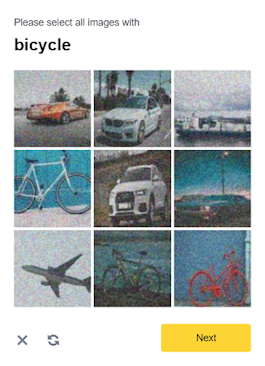

import Tabs from '@theme/Tabs';
import TabItem from '@theme/TabItem';
import ParamItem from '@theme/ParamItem';
import MethodItem from '@theme/MethodItem';
import MethodDescription from '@theme/MethodDescription'
import PriceBlock from '../../../../../src/theme/PriceBlock';
import PriceBlockWrap from '@theme/PriceBlockWrap';
import { ArticleHead } from '../../../../../src/theme/ArticleHead';

<ArticleHead slug="captchas/binance" />

# Binance - Binance captcha

<PriceBlockWrap>
  <PriceBlock title="Binance captcha" captchaId="binance"/>
</PriceBlockWrap>



:::warning **Attention!**
* CapMonster Cloud uses built-in proxies by default — their cost is already included in the service. You only need to specify your own proxies in cases where the website does not accept the token or access to the built-in services is restricted.

* If you are using a proxy with IP authorization, make sure to whitelist the address **65.21.190.34**.
* Use only to log in with your account. 
:::

## Request parameters

  <TabItem value="proxy" label="BinanceTask (with proxy)" default className="bordered-panel">

    <ParamItem title="type" required type="string" />
    **BinanceTask**

    ---

    <ParamItem title="websiteURL" required type="string" />
    The address of the main page where the captcha is solved.

    ---

    <ParamItem title="websiteKey" required type="string" />
    A unique parameter for your website's section. The value of the parameter `bizId`, `bizType`, or `bizCode`. It can be taken from the traffic (see the description below).

    ---

    <ParamItem title="validateId" required type="string" />
    A dynamic key. The value of the parameter `validateId`, `securityId`, or `securityCheckResponseValidateId`. It can be taken from the traffic (see the description below).

    ---

    <ParamItem title="userAgent" type="string" />
    Browser User-Agent.  
  **Pass only a valid UA from Windows OS. Currently it is**: `userAgentPlaceholder`
	
	 ---

    <ParamItem title="proxyType" type="string" />
    **http** - regular http/https proxy;<br />**https** - try this option only if "http" doesn't work (required for some custom proxies);<br />**socks4** - socks4 proxy;<br />**socks5** - socks5 proxy.
	
	 ---

    <ParamItem title="proxyAddress" type="string" />
      IPv4/IPv6 proxy IP address. Not allowed:
      - using transparent proxies (where you can see the client's IP);
      - using proxies on local machines.

     ---

    <ParamItem title="proxyPort" type="integer" />
    Proxy port.

     ---

    <ParamItem title="proxyLogin" type="string" />
    Proxy-server login.

     ---

    <ParamItem title="proxyPassword" type="string" />
    Proxy-server password.

  </TabItem>


## Create task method

<Tabs className="full-width-tabs filled-tabs request-tabs" groupId="captcha-type">
  <TabItem value="proxyless" label="BinanceTask (without proxy)" default className="method-panel">
	<MethodItem>
		```http
		https://api.capmonster.cloud/createTask
		```
	</MethodItem>
	<MethodDescription>
		**Request**
		```json
		{
			"clientKey": "API_KEY",
			"task": 
			{
				"type": "BinanceTask",
				"websiteURL": "https://example.com",
				"websiteKey": "login",
				"validateId": "cb0bfefa598b4c3887661fde54ecd57b",
				"userAgent": "userAgentPlaceholder"
			}
		}
		```
		**Response**
		```json
		{
			"errorId":0,
			"taskId":407533072
		}
		```
	</MethodDescription>
  </TabItem>

  <TabItem value="proxy" label="BinanceTask (with proxy)" default className="method-panel">
	<MethodItem>
		```http
		https://api.capmonster.cloud/createTask
		```
	</MethodItem>
	<MethodDescription>
		**Request**
		```json
		{
			"clientKey": "API_KEY",
			"task": 
			{
				"type": "BinanceTask",
				"websiteURL": "https://example.com",
				"websiteKey": "login",
				"validateId": "cb0bfefa598b4c3887661fde54ecd57b",
				"userAgent": "userAgentPlaceholder",
				"proxyType":"http",
				"proxyAddress":"8.8.8.8",
				"proxyPort":8080,
				"proxyLogin":"proxyLoginHere",
				"proxyPassword":"proxyPasswordHere"
			}
		}
		```
		**Response**
		```json
		{
			"errorId":0,
			"taskId":407533072
		}
		```
	</MethodDescription>
  </TabItem>
</Tabs>


## Get task result method
Use the method [getTaskResult](../api/methods/get-task-result.mdx) to obtain the Binance solution.

<TabItem value="proxyless" label="CustomTask (without proxy)" default className="method-panel-full">
	<MethodItem>
		```http
		https://api.capmonster.cloud/getTaskResult
		```
	</MethodItem>
	<MethodDescription>
		**Request**
		```json
		{
			"clientKey":"API_KEY",
			"taskId": 407533072
		}
		```
		**Response**
		```json
		{
			"errorId":0,
			"status":"ready",
			"solution": 
			{
				"token":"captcha#09ba4905a79f44f2a99e44f234439644-ioVA7neog7eRHCDAsC0MixpZvt5kc99maS943qIsquNP9D77",
				"userAgent":"userAgentPlaceholder"
			}
		}
		```
	</MethodDescription>
</TabItem>

## How to obtain `websiteKey` and `validateId`
Enable Developer Tools, go to the Network tab, activate the CAPTCHA, and look at the requests. Some of them will contain the required parameter values.
For example, the parameters:

bizCode: "CMC_register",
securityId: "09295759baca4d4fbeae80d9ffeaefd8"

 

or 

bizId: "CMC_register",
securityCheckResponseValidateId: "09295759baca4d4fbeae80d9ffeaefd8"

 

or 

bizType: "login",
validateId: "ff965ea6216b46f3825fa827ecaf297f"

 

or

bizId: "login",
securityCheckResponseValidateId: "ff965ea6216b46f3825fa827ecaf297f"

 

The necessary parameters to solve the captcha can be obtained by executing JavaScript: 
```javascript
let originalBCaptcha = window.BCaptcha;
let BCaptchaData;

Object.defineProperty(window, 'BCaptcha', {
  get: function() {
    return function(args) {
      const BCaptcha = new originalBCaptcha(args);
      let BCaptchaShow = BCaptcha.__proto__.show;
      
      BCaptcha.__proto__.show = function(args) {
        BCaptchaData = args;
        return 1;
      };
      
      return BCaptcha;
    };
  }
});
```
Then, you can retrieve the parameters, for example, like this `BCaptchaData.securityCheckResponseValidateId`.

## Use the SDK library

<Tabs className="full-width-tabs filled-tabs request-tabs" groupId="captcha-type">

  <TabItem value="js" label="JavaScript" default className="method-panel">
<details>
      <summary>Show code (for browser)</summary>
  ```js
  // https://github.com/ZennoLab/capmonstercloud-client-js

import { CapMonsterCloudClientFactory, ClientOptions, BinanceRequest } from '@zennolab_com/capmonstercloud-client';

const API_KEY = "YOUR_API_KEY";  // Specify your CapMonster Cloud API key

document.addEventListener("DOMContentLoaded", async () => {
    const client = CapMonsterCloudClientFactory.Create(
        new ClientOptions({ clientKey: API_KEY })
    );

    // Basic example without proxy
    // CapMonster Cloud automatically uses its own proxies
    let binanceRequest = new BinanceRequest({
        websiteURL: 'https://example.com', // URL of the page with Binance captcha
        websiteKey: 'login',           // Replace with the correct value
        validateId: 'cb0bfefa598b4c3887661fde54ecd57b'
    });

    // Example of using your own proxy
    // Uncomment this block if you want to use your own proxy
    /*
    const proxy = {
        proxyType: "http",
        proxyAddress: "123.45.67.89",
        proxyPort: 8080,
        proxyLogin: "username",
        proxyPassword: "password"
    };

    binanceRequest = new BinanceRequest({
        websiteURL: 'https://example.com',
        websiteKey: 'login',
        validateId: 'cb0bfefa598b4c3887661fde54ecd57b',
        proxy
    });
    */

    // Optionally, you can check the balance
    const balance = await client.getBalance();
    console.log("Balance:", balance);

    const result = await client.Solve(binanceRequest);
    console.log("Solution:", result);
});
```
</details>


<details>
      <summary>Show code (Node.js)</summary>
```javascript
// https://github.com/ZennoLab/capmonstercloud-client-js

import { CapMonsterCloudClientFactory, ClientOptions, BinanceRequest } from '@zennolab_com/capmonstercloud-client';

const API_KEY = "YOUR_API_KEY";  // Specify your CapMonster Cloud API key

async function solveBinanceCaptcha() {
    const client = CapMonsterCloudClientFactory.Create(
        new ClientOptions({ clientKey: API_KEY })
    );

    // Basic example without proxy
    // CapMonster Cloud automatically uses its own proxies
    let binanceRequest = new BinanceRequest({
        websiteURL: 'https://example.com', // URL of the page with Binance captcha
        websiteKey: 'login',           // Replace with the correct value
        validateId: 'cb0bfefa598b4c3887661fde54ecd57b'
    });

    // Example of using your own proxy
    // Uncomment this block if you want to use your own proxy
    /*
    const proxy = {
        proxyType: "http",
        proxyAddress: "123.45.67.89",
        proxyPort: 8080,
        proxyLogin: "username",
        proxyPassword: "password"
    };

    binanceRequest = new BinanceRequest({
        websiteURL: 'https://example.com',
        websiteKey: 'login',
        validateId: 'cb0bfefa598b4c3887661fde54ecd57b',
        proxy
    });
    */

    // Optionally, you can check the balance
    const balance = await client.getBalance();
    console.log("Balance:", balance);

    const result = await client.Solve(binanceRequest);
    console.log("Solution:", result);
}

solveBinanceCaptcha().catch(console.error);
```
</details>
  </TabItem>

  <TabItem value="python" label="Python" default className="method-panel">
<details>
      <summary>Show code</summary>
```python
# https://github.com/ZennoLab/capmonstercloud-client-python

import asyncio
from capmonstercloudclient import CapMonsterClient, ClientOptions
from capmonstercloudclient.requests import BinanceTaskRequest
# from capmonstercloudclient.requests.baseRequestWithProxy import ProxyInfo  # Uncomment if you plan to use a proxy

API_KEY = "YOUR_API_KEY"  # Specify your CapMonster Cloud API key

async def solve_binance():
    client_options = ClientOptions(api_key=API_KEY)
    cap_monster_client = CapMonsterClient(options=client_options)

    # Basic example without proxy
    # CapMonster Cloud automatically uses its own proxies
    binance_request = BinanceTaskRequest(
        websiteUrl="https://example.com",                  # URL of the page with Binance captcha
        websiteKey="login",                                # Replace with the correct value
        validateId="cb0bfefa598b4c3887661fde54ecd57b",    # Replace with the current validateId
        userAgent="userAgentPlaceholder"                   # Use a valid UserAgent
    )

    # Example of using your own proxy
    # Uncomment this block if you want to use a proxy
    #
    # proxy = ProxyInfo(
    #     proxyType="http",
    #     proxyAddress="123.45.67.89",
    #     proxyPort=8080,
    #     proxyLogin="username",
    #     proxyPassword="password"
    # )
    #
    # binance_request = BinanceTaskRequest(
    #     websiteUrl="https://example.com",
    #     websiteKey="login",
    #     validateId="cb0bfefa598b4c3887661fde54ecd57b",
    #     userAgent="userAgentPlaceholder",
    #     proxy=proxy
    # )

    # Optionally, you can check the balance
    balance = await cap_monster_client.get_balance()
    print("Balance:", balance)

    result = await cap_monster_client.solve_captcha(binance_request)
    print("Solution:", result)

asyncio.run(solve_binance())
```
</details>
  </TabItem>

  <TabItem value="csharp" label="C#" className="method-panel">
<details>
      <summary>Show code</summary>

```csharp
// https://github.com/ZennoLab/capmonstercloud-client-dotnet

using System;
using System.Threading.Tasks;
using Zennolab.CapMonsterCloud;
using Zennolab.CapMonsterCloud.Requests;

class Program
{
    static async Task Main(string[] args)
    {
        // Specify your CapMonster Cloud API key
        var clientOptions = new ClientOptions
        {
            ClientKey = "YOUR_API_KEY"
        };

        var cmCloudClient = CapMonsterCloudClientFactory.Create(clientOptions);

        // Basic example without proxy
        // CapMonster Cloud automatically uses its own proxies
        var binanceRequest = new BinanceTaskRequest
        {
            WebsiteUrl = "https://example.com",               // URL of the page with Binance captcha
            WebsiteKey = "login",                             // Replace with the correct value
            ValidateId = "cb0bfefa598b4c3887661fde54ecd57b",
            UserAgent = "userAgentPlaceholder"                // Use a valid UserAgent
        };

        // Example of using your own proxy
        // Uncomment this block if you want to use a proxy
        /*
        binanceRequest = new BinanceTaskRequest
        {
            WebsiteUrl = "https://example.com",
            WebsiteKey = "login",
            ValidateId = "cb0bfefa598b4c3887661fde54ecd57b",
            UserAgent = "userAgentPlaceholder",
            Proxy = new ProxyContainer(
                "123.45.67.89",  
                8080,   
                ProxyType.Http,   
                "username", 
                "password"   
            )
        };
        */

        // Optionally, you can check the balance
        var balance = await cmCloudClient.GetBalanceAsync();
        Console.WriteLine("Balance: " + balance);

        var binanceResult = await cmCloudClient.SolveAsync(binanceRequest);

        Console.WriteLine("Binance Solution: " + binanceResult.Solution.Value);
    }
}
```
</details>
  </TabItem>

</Tabs>

