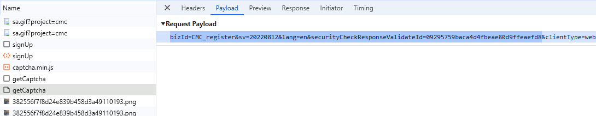

import Tabs from '@theme/Tabs';
import TabItem from '@theme/TabItem';
import ParamItem from '@theme/ParamItem';
import MethodItem from '@theme/MethodItem';
import MethodDescription from '@theme/MethodDescription'
import PriceBlock from '../../../../../src/theme/PriceBlock';
import PriceBlockWrap from '@theme/PriceBlockWrap';


# Binance - Binance captcha

<PriceBlockWrap>
  <PriceBlock title="Binance captcha" captchaId="binance"/>
</PriceBlockWrap>

:::warning **Attention!**
* This task will be performed using our proxy servers.
* Use only to log in with your account. 
:::

## Request parameters

  <TabItem value="proxy" label="BinanceTask (using proxy)" default className="bordered-panel">

    <ParamItem title="type" required type="string" />
    **BinanceTask**

    ---

    <ParamItem title="websiteURL" required type="string" />
    The address of the main page where the captcha is solved.

    ---

    <ParamItem title="websiteKey" required type="string" />
    A unique parameter for your website's section. The value of the parameter `bizId`, `bizType`, or `bizCode`. It can be taken from the traffic (see the description below).

    ---

    <ParamItem title="validateId" required type="string" />
    A dynamic key. The value of the parameter `validateId`, `securityId`, or `securityCheckResponseValidateId`. It can be taken from the traffic (see the description below).

    ---

    <ParamItem title="userAgent" type="string" />
    The browser's User-Agent. **You can provide your own or specify the latest UA from Windows OS.**: `userAgentPlaceholder`
	
	 ---

    <ParamItem title="proxyType" type="string" />
    **http** - regular http/https proxy;<br />**https** - try this option only if "http" doesn't work (required for some custom proxies);<br />**socks4** - socks4 proxy;<br />**socks5** - socks5 proxy.
	
	 ---

    <ParamItem title="proxyAddress" type="string" />
      IPv4/IPv6 proxy IP address. Not allowed:
      - using of hostnames;
      - using transparent proxies (where you can see the client's IP);
      - using proxies on local machines.

     ---

    <ParamItem title="proxyPort" type="integer" />
    Proxy port.

     ---

    <ParamItem title="proxyLogin" type="string" />
    Proxy-server login.

     ---

    <ParamItem title="proxyPassword" type="string" />
    Proxy-server password.

  </TabItem>


### How to obtain `websiteKey` and `validateId`
Enable Developer Tools, go to the Network tab, activate the CAPTCHA, and look at the requests. Some of them will contain the required parameter values.
For example, the parameters:

bizCode: "CMC_register",
securityId: "09295759baca4d4fbeae80d9ffeaefd8"

 

or 

bizId: "CMC_register",
securityCheckResponseValidateId: "09295759baca4d4fbeae80d9ffeaefd8"

 

or 

bizType: "login",
validateId: "ff965ea6216b46f3825fa827ecaf297f"

 

or

bizId: "login",
securityCheckResponseValidateId: "ff965ea6216b46f3825fa827ecaf297f"

 

The necessary parameters to solve the captcha can be obtained by executing JavaScript: 
	```json
		let originalBCaptcha = window.BCaptcha;
		let BCaptchaData;
		Object.defineProperty(window, 'BCaptcha', {
			get: function() {
				return function(args) {
					const BCaptcha = new originalBCaptcha(args);
					let BCaptchaShow = BCaptcha.__proto__.show
					BCaptcha.__proto__.show = function(args) {
						BCaptchaData = args;
						return 1;
					};
					return BCaptcha;
				}
			}
		});
	```
Then, you can retrieve the parameters, for example, like this `BCaptchaData.securityCheckResponseValidateId`.


## Create task method

<Tabs className="full-width-tabs filled-tabs request-tabs" groupId="captcha-type">
  <TabItem value="proxyless" label="BinanceTask (without proxy)" default className="method-panel">
	<MethodItem>
		```http
		https://api.capmonster.cloud/createTask
		```
	</MethodItem>
	<MethodDescription>
		**Request**
		```json
		{
			"clientKey": "API_KEY",
			"task": 
			{
				"type": "BinanceTask",
				"websiteURL": "https://example.com",
				"websiteKey": "login",
				"validateId": "cb0bfefa598b4c3887661fde54ecd57b",
				"userAgent": "userAgentPlaceholder"
			}
		}
		```
		**Response**
		```json
		{
			"errorId":0,
			"taskId":407533072
		}
		```
	</MethodDescription>
  </TabItem>

  <TabItem value="proxy" label="BinanceTask (using proxy)" default className="method-panel">
	<MethodItem>
		```http
		https://api.capmonster.cloud/createTask
		```
	</MethodItem>
	<MethodDescription>
		**Request**
		```json
		{
			"clientKey": "API_KEY",
			"task": 
			{
				"type": "BinanceTask",
				"websiteURL": "https://example.com",
				"websiteKey": "login",
				"validateId": "cb0bfefa598b4c3887661fde54ecd57b",
				"userAgent": "userAgentPlaceholder",
				"proxyType":"http",
				"proxyAddress":"8.8.8.8",
				"proxyPort":8080,
				"proxyLogin":"proxyLoginHere",
				"proxyPassword":"proxyPasswordHere"
			}
		}
		```
		**Response**
		```json
		{
			"errorId":0,
			"taskId":407533072
		}
		```
	</MethodDescription>
  </TabItem>
</Tabs>


## Get task result method
Use the method [getTaskResult](../api/methods/get-task-result.md) to obtain the Binance solution.

<TabItem value="proxyless" label="CustomTask (without proxy)" default className="method-panel-full">
	<MethodItem>
		```http
		https://api.capmonster.cloud/getTaskResult
		```
	</MethodItem>
	<MethodDescription>
		**Request**
		```json
		{
			"clientKey":"API_KEY",
			"taskId": 407533072
		}
		```
		**Response**
		```json
		{
			"errorId":0,
			"status":"ready",
			"solution": 
			{
				"token":"captcha#09ba4905a79f44f2a99e44f234439644-ioVA7neog7eRHCDAsC0MixpZvt5kc99maS943qIsquNP9D77",
				"userAgent":"userAgentPlaceholder"
			}
		}
		```
	</MethodDescription>
</TabItem>

## Use the SDK library

<Tabs className="full-width-tabs filled-tabs request-tabs" groupId="captcha-type">

  <TabItem value="js" label="JavaScript" default className="method-panel">

  ```js
  // https://github.com/ZennoLab/capmonstercloud-client-js

  import { CapMonsterCloudClientFactory, ClientOptions, BinanceRequest } from '@zennolab_com/capmonstercloud-client';

  document.addEventListener('DOMContentLoaded', async () => {
    const cmcClient = CapMonsterCloudClientFactory.Create(
      new ClientOptions({ clientKey: '<your capmonster.cloud API key>' })
    );

    console.log(await cmcClient.getBalance());

    // Option 1: without proxy
    const binanceRequest = new BinanceRequest({
      websiteURL: 'https://example.com', // URL of the page with captcha
      websiteKey: 'websiteKey',           // Replace with the correct value
      validateId: 'validateId',
    });

    // Option 2: with proxy
    /*
    const binanceRequest = new BinanceRequest({
      websiteURL: 'https://example.com', 
      websiteKey: 'websiteKey',          
      validateId: 'validateId',
      proxyType: 'http',
      proxyAddress: '8.8.8.8',
      proxyPort: 8080,
      proxyLogin: 'proxyLoginHere',
      proxyPassword: 'proxyPasswordHere',
    });
    */

    console.log(await cmcClient.Solve(binanceRequest));
  });
````

  </TabItem>

  <TabItem value="python" label="Python" default className="method-panel">

```python
# https://github.com/ZennoLab/capmonstercloud-client-python

import asyncio
from capmonstercloudclient import CapMonsterClient, ClientOptions
from capmonstercloudclient.requests import BinanceTaskRequest

client_options = ClientOptions(api_key="your_api_key")  # Your CapMonster Cloud API key
cap_monster_client = CapMonsterClient(options=client_options)

# Option 1: Without proxy
binance_request = BinanceTaskRequest(
    websiteUrl="https://example.com",   # URL of the page with captcha
    websiteKey="login",                 # Replace with the correct value
    validateId="cb0bfefa598b4c3887661fde54ecd57b", 
    userAgent="userAgentPlaceholder"    # Use the actual UserAgent
)

# Option 2: With proxy
# Uncomment if you need to use a proxy

# binance_request = BinanceTaskRequest(
#     websiteUrl="https://example.com",
#     websiteKey="login",
#     validateId="cb0bfefa598b4c3887661fde54ecd57b",
#     userAgent="userAgentPlaceholder",
#     proxyType="http",
#     proxyAddress="8.8.8.8",
#     proxyPort=8080,
#     proxyLogin="proxyLoginHere",
#     proxyPassword="proxyPasswordHere"
# )

async def solve_captcha():
    return await cap_monster_client.solve_captcha(binance_request)

responses = asyncio.run(solve_captcha())
print(responses)
```

  </TabItem>

  <TabItem value="csharp" label="C#" className="method-panel">

```csharp
// https://github.com/ZennoLab/capmonstercloud-client-dotnet

using System;
using System.Threading.Tasks;
using Zennolab.CapMonsterCloud;
using Zennolab.CapMonsterCloud.Requests;

class Program
{
    static async Task Main(string[] args)
    {
        // Your CapMonster Cloud API key
        var clientOptions = new ClientOptions
        {
            ClientKey = "your_api_key" // Your CapMonster Cloud API key
        };

        var cmCloudClient = CapMonsterCloudClientFactory.Create(clientOptions);

        // Option 1: Without proxy
        var binanceRequest = new BinanceTaskRequest
        {
            WebsiteUrl = "https://example.com",               // URL of the page with captcha
            WebsiteKey = "login",                             // Replace with the correct value
            ValidateId = "cb0bfefa598b4c3887661fde54ecd57b",
            UserAgent = "userAgentPlaceholder"                // Use the actual UserAgent
        };

        // Option 2: With proxy
        // Uncomment if you need to use a proxy
        /*
        var binanceRequest = new BinanceTaskRequest
        {
            WebsiteUrl = "https://example.com",
            WebsiteKey = "login",
            ValidateId = "cb0bfefa598b4c3887661fde54ecd57b",
            UserAgent = "userAgentPlaceholder",
            Proxy = new ProxyContainer(
                "123.45.67.89",
                8080,
                ProxyType.Http,
                "proxyLogin",
                "proxyPassword"
            )
        };
        */

        var binanceResult = await cmCloudClient.SolveAsync(binanceRequest);

        Console.WriteLine("Captcha Solution: " + binanceResult.Solution.Value);
    }
}
```

  </TabItem>

</Tabs>

