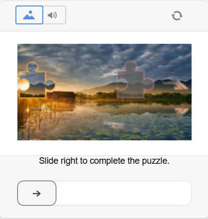
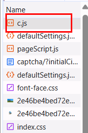
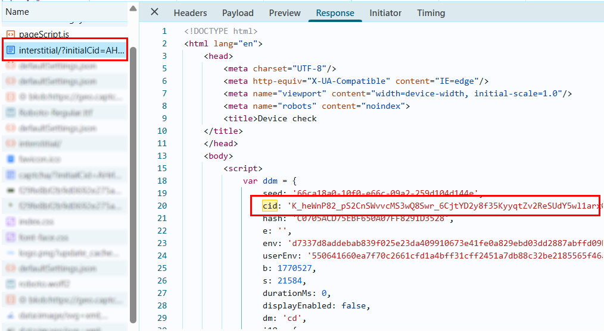

import Tabs from '@theme/Tabs';
import TabItem from '@theme/TabItem';
import ParamItem from '@theme/ParamItem';
import MethodItem from '@theme/MethodItem';
import MethodDescription from '@theme/MethodDescription'
import PriceBlock from '../../../../../src/theme/PriceBlock';
import PriceBlockWrap from '@theme/PriceBlockWrap';

# DataDome

<PriceBlockWrap>
  <PriceBlock title="DataDome"  captchaId="datadome"/>
</PriceBlockWrap>

This type of captcha usually requires the user to solve a puzzle by moving a slider for verification.



:::warning **Warning!**

* Use **your own proxies** to perform this task.
* If your proxy uses IP-based authorization, you must whitelist the address **65.21.190.34**.
* After solving, you will receive **special cookies** that must be added to the browser.
:::

## Request parameters

<TabItem value="proxyless" label="CustomTask (without proxy)" default className="bordered-panel">
    <ParamItem title="type" required type="string" />
    **CustomTask**
    
---

<ParamItem title="class" required type="string" />
**DataDome**

---

<ParamItem title="websiteURL" required type="string" />
The main page URL where the captcha is solved.

---

<ParamItem title="captchaUrl (inside metadata)" required="required" type="string" />
`"captchaUrl"` - link to the captcha. Usually in the format: `"https://geo.captcha-delivery.com/captcha/?initialCid=..."`.

---

<ParamItem title="datadomeCookie (inside metadata)" required type="string" />
Your DataDome cookies. Can be obtained from the page using `document.cookie` (if cookies do not have the *HttpOnly* flag), in the request header Set-Cookie: "datadome=...", or directly from the HTML code `initialCid` ([*see examples on how to find datadomeCookie*](#how-to-find-datadomecookie)).

---

<ParamItem title="proxyType" required type="string" />
**http** - standard http/https proxy;<br />
**https** - use this only if "http" does not work (required for some custom proxies);<br />
**socks4** - socks4 proxy;<br />
**socks5** - socks5 proxy.

---

<ParamItem title="proxyAddress" required type="string" />
<p>
  IPv4/IPv6 proxy address. Not allowed:
    - transparent proxies (where the client IP is visible);
    - proxies on local machines.
</p>

---

<ParamItem title="proxyPort" required type="integer" />
Proxy port.

---

<ParamItem title="proxyLogin" required type="string" />
Proxy server login.

---

<ParamItem title="proxyPassword" required type="string" />
Proxy server password.

---

<ParamItem title="userAgent" type="string" />
Browser User-Agent.  
  **Pass only a valid UA from Windows OS. Currently it is**: `userAgentPlaceholder`

---

</TabItem>

## Create task method

:::warning **Important**
During page loading, DataDome may use one of two scripts: `c.js` or `i.js`.
If `c.js` is used on the target site, extracted cookies may not work for verification. Before solving, check which script is loaded (**DevTools → Network / HTML**).
:::

**Option with `c.js`:**



**Option with `i.js`:**


<TabItem value="proxyless" label="CustomTask (without proxy)" default className="method-panel">
	<MethodItem>
		```http
		https://api.capmonster.cloud/createTask
		```
	</MethodItem>
	<MethodDescription>
		**Request**
```json
{
  "clientKey": "API_KEY",
  "task": {
    "type": "CustomTask",
    "class": "DataDome",
    "websiteURL": "https://example.com",
    "userAgent": "userAgentPlaceholder",
    "metadata": {
      "captchaUrl": "https://geo.captcha-delivery.com/interstitial/?initialCid=AHrlqAAAAAMA9UvsL58YLqIAXNLFPg%3D%3D&hash=C0705ACD75EBF650A07FF8291D3528&cid=7sfa5xUfDrR4bQTp1c2mhtiD7jj9TXExcQypjdNAxKVFyIi1S9tE0~_mqLa2EFpOuzxKcZloPllsNHjNnqzD9HmBA4hEv7SsEyPYEidCBvjZEaDyfRyzefFfolv0lAHM&referer=https%3A%2F%2Fwww.example.com.au%2F&s=6522&b=978936&dm=cm",
      "datadomeCookie": "datadome=VYUWrgJ9ap4zmXq8Mgbp...64emvUPeON45z"
    },
    "proxyType": "http",
    "proxyAddress": "123.45.67.89",
    "proxyPort": 8080,
    "proxyLogin": "proxyUsername",
    "proxyPassword": "proxyPassword"
  }
}
```
		**Response**
		```json
		{
		  "errorId":0,
		  "taskId":407533072
		}
		```
	</MethodDescription>
</TabItem>

## Get task result method

Use the [getTaskResult](../api/methods/get-task-result.md) method to get the solved DataDome captcha.

<TabItem value="proxyless" label="CustomTask (without proxy)" default className="method-panel-full">
	<MethodItem>
		```http
		https://api.capmonster.cloud/getTaskResult
		```
	</MethodItem>
	<MethodDescription>
		**Request**
		```json
		{
		  "clientKey":"API_KEY",
		  "taskId": 407533072
		}
		```
		**Response**

```json
{
  "errorId": 0,
  "status": "ready",
  "solution": {
    "domains": {
      "www.example.com": {
        "cookies": {
          "datadome": "P1w0VnjFcTFslfps0J4FaPpY_QPbPBW4MeYxj4LW~pztIfJiSSuBPr8oQTUHzdrfgv137FbOBd3kCUOOgny7LhIkhm5e1qdtzYM4s2e46U_qfERK4KiCy22MOSIDsDyh"
        },
        "localStorage": null
      }
    },
    "url": null,
    "fingerprint": null,
    "headers": null,
    "data": null
  }
}
```
</MethodDescription>

</TabItem>

## How to find `datadomeCookie`

### Using Developer Tools

**Option 1:**

1. Open the DataDome-protected site in a browser (Chrome, Firefox).

2. Press F12 → go to the **Application** tab → **Cookies**.

3. Find the domain of the site (e.g., [www.example.com](http://www.example.com)).

Among the cookies, look for the `datadome` key — this is the required `datadomeCookie`.


**Option 2:**

1. Open the site where the DataDome captcha triggers.

2. Go to **DevTools → Network**, reload the page, and find the request loading the page with `initialCid`.

Example URL:

`https://geo.captcha-delivery.com/interstitial/?initialCid=...&hash=...&cid=...`


or:

3. Open the **Response** of this request. In the HTML code, find the object:

`var ddm = { ... };`

4. Inside this object, locate the `cid` parameter. Its value is the current `datadomeCookie`.



**Option 3:**

1. Open the site where the DataDome captcha triggers.

2. Go to **DevTools → Network**, reload the page, and find a request with **403** status.

3. Go to the **Headers → Response Headers** tab. In the headers, find `Set-Cookie:` and copy the value of the `datadome` parameter (`datadome=<value>`).


{/* ## Use SDK Library

<Tabs className="full-width-tabs filled-tabs request-tabs" groupId="captcha-type">
  <TabItem value="js" label="JavaScript" default className="method-panel">
    ```js
    // https://github.com/ZennoLab/capmonstercloud-client-js

    import { CapMonsterCloudClientFactory, ClientOptions, DataDomeRequest } from '@zennolab_com/capmonstercloud-client';

    document.addEventListener('DOMContentLoaded', async () => {
      const cmcClient = CapMonsterCloudClientFactory.Create(new ClientOptions({ clientKey: '<your capmonster.cloud API key>' }));
      console.log(await cmcClient.getBalance());

      const dataDomeRequest = new DataDomeRequest({
        websiteURL: 'https://example.com',
        userAgent: 'Mozilla/5.0 (iPhone; CPU iPhone OS 17_5_1 like Mac OS X) AppleWebKit/605.1.15 (KHTML, like Gecko) Version/17.5.1 Mobile/21F90 Safari/604.1',
        metadata: {
          captchaUrl: 'https://geo.captcha-delivery.com/captcha/?initialCid=12434324',
          datadomeCookie: '',
        },
      });

      console.log(await cmcClient.Solve(dataDomeRequest));
    });
    ```
  </TabItem>

  <TabItem value="python" label="Python" className="method-panel">
    ```python
    # https://github.com/ZennoLab/capmonstercloud-client-python

    import asyncio
    from capmonstercloudclient import CapMonsterClient, ClientOptions
    from capmonstercloudclient.requests import DataDomeCustomTaskProxylessRequest

    client_options = ClientOptions(api_key="your_api_key")  # Replace with your CapMonster Cloud API key
    cap_monster_client = CapMonsterClient(options=client_options)

    data_dome_request = DataDomeCustomTaskProxylessRequest(
        websiteUrl="https://example.com",  # URL with the captcha

        userAgent="Mozilla/5.0 (iPhone; CPU iPhone OS 17_5_1 like Mac OS X) AppleWebKit/605.1.15 (KHTML, like Gecko) Version/17.5.1 Mobile/21F90 Safari/604.1",  # Use the current userAgent
        metadata={
            "htmlPageBase64": "PGh0bWw+PGhlYWQ+PHRpdGxlPn...+48L2h0bWw+",  # Replace with your HTML base64 or use captchaUrl
            "datadomeCookie": "datadome=oZJnhpo...1PuyGg"  # Replace with your DataDome cookie
        }
    )

    async def solve_captcha():
        return await cap_monster_client.solve_captcha(data_dome_request)

    responses = asyncio.run(solve_captcha())
    print(responses)
    ```
  </TabItem>
  
	<TabItem value="csharp" label="C#" className="method-panel">
		```csharp
		// https://github.com/ZennoLab/capmonstercloud-client-dotnet

		using Zennolab.CapMonsterCloud.Requests;
		using Zennolab.CapMonsterCloud;

		class Program
		{
			static async Task MainDatadome(string[] args)
			{
				var clientOptions = new ClientOptions
				{
					ClientKey = "your_api_key" // Replace with your CapMonster Cloud API key
				};

				var cmCloudClient = CapMonsterCloudClientFactory.Create(clientOptions);

				var DataDomeRequest = new DataDomeCustomTaskRequest(datadomeCookie: "datadome=6BvxqELMoorFNoo7GT1...JyfP_mhz", captchaUrl: "https://example.com", htmlPageBase64: "PGh0bWw+PGhlYWQ+PHRpdGxlPmJs...N0E5QTA1")
				{
					WebsiteUrl = "https://example.com",
					UserAgent = "Mozilla/5.0 (iPhone; CPU iPhone OS 17_5_1 like Mac OS X) AppleWebKit/605.1.15 (KHTML, like Gecko) Version/17.5.1 Mobile/21F90 Safari/604.1", // Use the current userAgent
				};

				var DataDomeResult = await cmCloudClient.SolveAsync(DataDomeRequest);

				Console.WriteLine("Captcha Solution: " + JsonSerializer.Serialize(DataDomeResult.Solution));
			}
		}
		```
	</TabItem>
</Tabs>
 */}
