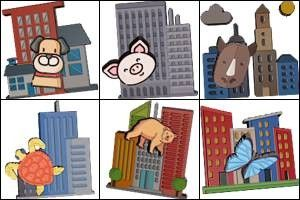
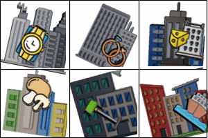
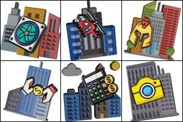
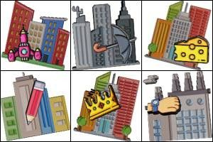
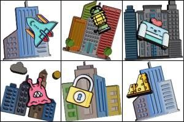

---
sidebar_position: 3
sidebar_label: FunCaptchaTask
---

# FunCaptchaTask
This type solving task FunCaptcha. Your app submits website address, public key and proxy.

The result of solving task is a token for the submit form.

:::warning **Attention!**
If the proxy is authorized by IP, then be sure to add **116.203.55.208** to the white list.
:::

## **Object structure**

|**Parameter**|**Type**|**Required**|**Value**|
| :- | :- | :- | :- |
|type|String|yes|**FunCaptchaTaskProxyless** or **FunCaptchaTask** (When using a proxy).|
|websiteURL|String|yes|Address of a webpage with FunCaptcha.|
|funcaptchaApiJSSubdomain|String|no|A special subdomain of funcaptcha.com, from which the JS captcha widget should be loaded. It can be found in an element named `fc-token` - the value after the `surl`. It is required if you use a domain other than `client-api.arkoselabs.com`.|
|websitePublicKey|String|yes|FunCaptcha website key. `<div id="funcaptcha" data-pkey="THAT_ONE"></div>`|
|data|String|no|Additional parameter that may be required by FunCaptcha implementation.<br/> Use this property to send "blob" value as a stringified array. See example how it may look like: {"\blob\":\"HERE_COMES_THE_blob_VALUE\"}*|
|proxyType|String|yes (if using **FunCaptchaTask**)| Type of the proxy<br/> **http** - usual http/https proxy;<br/>**https** - try this only if "http" doesn't work (required by some custom proxy servers);<br />**socks4** - socks4 proxy;<br />**socks5** - socks5 proxy.|
|proxyAddress|String|yes (If using **FunCaptchaTask**)|<p>Proxy IP address IPv4/IPv6. Not allowed to use:</p><p>- host names instead of IPs</p><p>- transparent proxies (where client IP is visible)</p><p>- proxies from local networks (192.., 10.., 127...).</p>|
|proxyPort|Integer|yes (If using **FunCaptchaTask**)|Proxy port.|
|proxyLogin|String|no|Proxy login.|
|proxyPassword|String|no|Proxy password.|
|userAgent|String|yes|Browser's User-Agent which is used in emulation. |
|cookies|String|no|<p>Additional cookies which we must use during interaction with target page.</p><p>**Format**: cookiename1=cookievalue1; cookiename2=cookievalue2</p>|

## **Request example**

:::info Method
<https://api.capmonster.cloud/createTask>
:::

### FunCaptchaTask (With proxy)
```json
{
  "clientKey":"dce6bcbb1a728ea8d871de6d169a2057",
  "task": {
    "type":"FunCaptchaTask",
    "websiteURL":"http://mywebsite.com/",
    "funcaptchaApiJSSubdomain":"mywebsite-api.funcaptcha.com",
    "data": "{\"blob\":\"dyXvXANMbHj1iDyz.Qj97JtSqR2n%2BuoY1V%2FbdgbrG7p%2FmKiqdU9AwJ6MifEt0np4vfYn6TTJDJEfZDlcz9Q1XMn9przeOV%2FCr2%2FIpi%2FC1s%3D\"}",
    "websitePublicKey":"69A21A01-CC7B-B9C6-0F9A-E7FA06677FFC",
    "proxyType":"http",
    "proxyAddress":"8.8.8.8",
    "proxyPort":8080,
    "proxyLogin":"proxyLoginHere",
    "proxyPassword":"proxyPasswordHere",
    "userAgent":"Mozilla/5.0 (Windows NT 10.0; Win64; x64) AppleWebKit/537.36 (KHTML, like Gecko) Chrome/81.0.4044.132 Safari/537.36"
  }
}
```
### FunCaptchaTaskProxyless (without proxy)
```json
{
  "clientKey":"dce6bcbb1a728ea8d871de6d169a2057",
  "task": {
    "type":"FunCaptchaTaskProxyless",
    "websiteURL":"http://mywebsite.com/",
    "funcaptchaApiJSSubdomain":"mywebsite-api.funcaptcha.com",
    "data": "{\"blob\":\"dyXvXANMbHj1iDyz.Qj97JtSqR2n%2BuoY1V%2FbdgbrG7p%2FmKiqdU9AwJ6MifEt0np4vfYn6TTJDJEfZDlcz9Q1XMn9przeOV%2FCr2%2FIpi%2FC1s%3D\"}",
    "websitePublicKey":"69A21A01-CC7B-B9C6-0F9A-E7FA06677FFC"
  }
}
```

**Response example**

```json
{
  "errorId":0,
  "taskId":407533072

}
```

## **Getting result**

:::info Method
<https://api.capmonster.cloud/getTaskResult>
:::

Use the [getTaskResult](../api/methods/get-task-result.md) method to request answer for FunCaptcha. You will get response within 10 - 30 secs period depending on service workload.

|**Property**|**Type**|**Description**|
| :- | :- | :- |
|token|String|FunCaptcha token that needs to be substituted into the form.|

**Example:**
```json
{
  "errorId":0,
  "status":"ready",
  "solution": {
    "token":"36859d1086acb06e7.08293101|r=ap-southeast-1|metabgclr=%23ffffff|guitextcolor=%23555555|metaiconclr=%23cccccc|meta=3|pk=69A21A01-CC7B-B9C6-0F9A-E7FA06677FFC|injs=https://funcaptcha.com/fc/api/nojs/?pkey=69A21A01-CC7B-B9C6-0F9A-E7FA06677FFC|rid=11|cdn\_url=https://cdn.funcaptcha.com/fc|surl=https://funcaptcha.com"
  }
}
```

## Supported task types

|**Type**|**Description**|
| :- | :- |
||Pick the image with the matching reflection|
||Pick the shadow with a different object silhouette|
||Pick one square that shows two identical objects|
||Pick the dice pair with the same icon facing up|
||Pick the dice pair whose top sides add up to 4|
||Pick the dice pair whose top sides add up to 5|
||Pick the dice pair whose top sides add up to 6|
||Pick the dice pair whose top sides add up to 7|
||Pick the dice pair whose top sides add up to 8|
||Pick the dice pair whose top sides add up to 10|
||Pick the dice pair whose top sides add up to 14|
||Pick the image where the darts add up to 8/10/12/14|
||Pick the image where all animals are walking in the same direction as the arrow|
||Pick the shadow that matches the icons at the top of the image|
||Pick the matching cards|
||Pick the mouse that can reach all the cheese in the maze|
||Select the animal with the wrong head|
||Pick the penguin|
||Use the arrows to rotate the animal to face in the direction of the hand|
||Pick the image that is the correct way up|
||Pick the spiral galaxy|
||Pick the image with only one rope|
||Pick the cube with icons split in half|
||Pick the puzzle with the wrong pieces|
||Pick the image where the number matches the amount of animals|
||Pick the mouse that can't reach the cheese|
||Select the image where the total fingers add up to 3|
||Pick the wrong shadow|
||Pick one square that shows three of the same object|
||Use the arrows to move the person to the spot indicated by the cross|
||Use the arrows to move the person to the icon indicated by the colored circle|
||Use the arrows to rotate the animal with the same icon to face where the hand is pointing|
||Use the arrows to change the number of objects until it matches the left image|
||Change the dice until the count matches the image on the left|
||Use the arrows to move the train to the coordinates indicated in the left image|
||Match the number of rocks with the number on the left|
||Using the arrows move the person to the indicated seat|
||Pick the koala|
||Pick the ladybug|
||Pick the pig|
||Pick the zebra|
||Pick the shark|
||Pick the dinosaur|
||Pick the duck|
||Pick the chicken|
||Pick the rhino|
||Pick the dolphin|
||Pick the grapes|
||Pick the goat|
||Pick the elephant|
||Pick the seal|
||Pick the bear|
||Pick the mouse|
||Pick the butterfly|
||Pick the monkey|
||Pick the bread|
||Pick the lobster|
||Pick the kangaroo|
||Pick the deer|
||Pick the apple|
||Pick the ant|
||Pick the snake|
||Pick the ice cream|
||Pick the owl|
||Pick the pants|
||Pick the cactus|
||Pick the calculator|
||Pick the shoe|
||Pick the scissors|
||Pick the lion|
||Pick the crab|
||Pick the donut|
||Pick the dog|
||Pick the bee|
||Pick the banana|
||Pick the parrot|
||Pick the octopus|
||Pick the pencil|
||Pick the lamp|
||Pick the lock|
||Pick the turtle|
||Pick the camel|
||Pick the horse|
||Pick the pizza|
||Pick the bat|
||Pick the watermelon|
||Pick the controller|
||Pick the rabbit|
||Pick the pineapple|
||Pick the snail|
||Pick the glasses|
||Pick the key|
||Pick the hotdog|
||Pick the helmet|
||Pick the sock|
||Pick the starfish|
||Pick the frog|
||Pick the printer|
||Pick the umbrella|
||Pick the giraffe|
||Pick the spaceship|
||Pick the boat|
||Pick the wrong shadow|
||Pick the helicopter|
||Pick the refrigerator|
||Pick the couch|
||Pick the money|
||Pick the mushroom|
||Pick the fence|
||Pick the car|
||Pick the wristwatch|
||Pick the alien|
||Pick the fan|
||Pick the crown|
||Pick the burger|
||Pick the train|
||Pick the trophy|
||Pick the aquarium|
||Pick the anchor|
||Pick the toaster|
||Pick the stapler|
||Pick the bicycle|
||Pick the guitar|
||Pick the fire|
||Pick the flower|
||Pick the snowman|
||Pick the ball|
||Pick the ring|
||Pick the camera|
||Type of captcha, where you need to rotate the image|