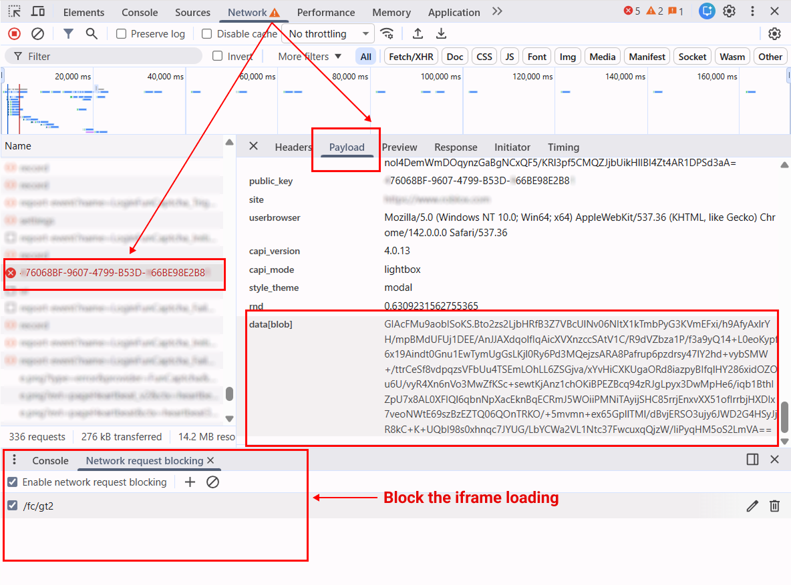

import Tabs from '@theme/Tabs';
import TabItem from '@theme/TabItem';
import ParamItem from '@theme/ParamItem';
import MethodItem from '@theme/MethodItem';
import MethodDescription from '@theme/MethodDescription'
import PriceBlock from '@theme/PriceBlock';
import PriceBlockWrap from '@theme/PriceBlockWrap';
import { ArticleHead } from '../../../../../src/theme/ArticleHead';

<ArticleHead slug="captchas/funcaptcha-task" />

# FunCaptcha

<PriceBlockWrap>
  <PriceBlock title="FunCaptcha" captchaId="funcaptcha"/>
</PriceBlockWrap>


:::warning **Attention!**
CapMonster Cloud uses built-in proxies by default — their cost is already included in the service. You only need to specify your own proxies in cases where the website does not accept the token or access to the built-in services is restricted.

If you are using a proxy with IP authorization, make sure to whitelist the address **65.21.190.34**.
:::

## Request parameters

<TabItem value="proxy" label="FunCaptchaTask" className="bordered-panel">
<ParamItem title="type" required type="string" />
**FunCaptchaTask**

---

<ParamItem title="websiteURL" required type="string" />
The URL of the page where the captcha is located.

---

<ParamItem title="websitePublicKey" required type="string" />
FunCaptcha key (value *public key* or *pk*).

---

<ParamItem title="data" type="string" />
Additional parameter. Required if the site uses *data[blob]*. <br />
**Important:** Do not load the captcha iframe to extract `blob`. Once the captcha is loaded, the value becomes invalid.

---

<ParamItem title="funcaptchaApiJSSubdomain" type="string" />
Arkose Labs subdomain (value *surl*). Specify only if it differs from the default: `client-api.arkoselabs.com`.

---

<ParamItem title="userAgent" type="string" />
Browser User-Agent. <br />
**Pass only a current Windows OS UA. Current example:** `userAgentPlaceholder`.

---

<ParamItem title="cookies" type="string" />
Pass additional cookies in the format:

```

cookieName1=value1; cookieName2=value2

````

---

<ParamItem title="proxyType" type="string" />
    **http** - regular http/https proxy;<br />**https** - try this option only if "http" doesn't work (required for some custom proxies);<br />**socks4** - socks4 proxy;<br />**socks5** - socks5 proxy.
	
	---

    <ParamItem title="proxyAddress" type="string" />
    <p>
      IPv4/IPv6 proxy IP address. Not allowed:
      - using transparent proxies (where you can see the client's IP);
      - using proxies on local machines.
    </p>

    ---

    <ParamItem title="proxyPort" type="integer" />
    Proxy port.

    ---

    <ParamItem title="proxyLogin" type="string" />
    Proxy-server login.

    ---

    <ParamItem title="proxyPassword" type="string" />
    Proxy-server password.

  </TabItem>

## Create task method

<Tabs className="full-width-tabs filled-tabs request-tabs" groupId="captcha-type">
<TabItem value="proxyless" label="FunCaptchaTask (proxyless)" default className="method-panel">
<MethodItem>
```http
https://api.capmonster.cloud/createTask
````

</MethodItem>
<MethodDescription>
**Request**
```json
{
  "clientKey": "API_KEY",
  "task": {
    "type": "FunCaptchaTask",
    "websiteURL": "https://www.example.com",
    "websitePublicKey": "EX72CCFB-26EX-40E5-91E6-85EX70BE98ED",
    "funcaptchaApiJSSubdomain": "example-api.arkoselabs.com",
    "data": "{\"blob\":\"nj9UbL+yio7goOlTQ/b64t.ayrrBnP6kPgzlKYCP/kv491lKS...Wot/7gjpyIxs7VYb0+QuRcfQ/t6bzh5pXDkOFSskA/V/ITSVZSAlglIplLcdreZ4PE8skfMU6k1Q\"}",
    "userAgent": "userAgentPlaceholder"
  }
}
```
**Response**
```json
{
  "errorId":0,
  "taskId":407533077
}
```
</MethodDescription>
</TabItem>

<TabItem value="proxy" label="FunCaptchaTask (with proxy)" default className="method-panel">
<MethodItem>
```http
https://api.capmonster.cloud/createTask
```
</MethodItem>
<MethodDescription>
**Request**
```json
{
  "clientKey": "API_KEY",
  "task": {
    "type": "FunCaptchaTask",
    "websiteURL": "https://www.example.com",
    "websitePublicKey": "EX72CCFB-26EX-40E5-91E6-85EX70BE98ED",
    "funcaptchaApiJSSubdomain": "example-api.arkoselabs.com",
    "data": "{\"blob\":\"nj9UbL+yio7goOlTQ/b64t.ayrrBnP6kPgzlKYCP/kv491lKS...Wot/7gjpyIxs7VYb0+QuRcfQ/t6bzh5pXDkOFSskA/V/ITSVZSAlglIplLcdreZ4PE8skfMU6k1Q\"}",
    "userAgent": "userAgentPlaceholder",
    "proxyType": "http",
    "proxyAddress": "8.8.8.8",
    "proxyPort": 8080,
    "proxyLogin": "proxyLoginHere",
    "proxyPassword": "proxyPasswordHere"
  }
}
```
**Response**
```json
{
  "errorId":0,
  "taskId":407533077
}
```
</MethodDescription>
</TabItem>
</Tabs>

## Get task result method

Use [getTaskResult](../api/methods/get-task-result.mdx) to get the FunCaptcha solution.

<TabItem value="proxyless" label="FunCaptchaTask (proxyless)" default className="method-panel-full">
<MethodItem>
```http
https://api.capmonster.cloud/getTaskResult
```
</MethodItem>
<MethodDescription>
**Request**
```json
{
  "clientKey": "API_KEY",
  "taskId": 407533077
}
```

**Response**

```json
{
  "errorId": 0,
  "errorCode": null,
  "errorDescription": null,
  "solution": {
    "token": "337187b9f57678923.5060184402|r=us-west-2|lang=en|pk=EX72CCFB-26EX-40E5-91E6-85EX70BE98ED|at=40|ag=101|cdn_url=https%3A%2F%2Fclient-api.arkoselabs.com%2Fcdn%2Ffc|surl=https%3A%2F%2Fclient-api.arkoselabs.com|smurl=https%3A%2F%2Fclient-api.arkoselabs.com%2Fcdn%2Ffc%2Fassets%2Fstyle-manager",
    "userAgent": "userAgentPlaceholder"
  },
  "status": "ready"
}
```

</MethodDescription>
</TabItem>

## Finding FunCaptcha parameters

### `websitePublicKey` and `funcaptchaApiJSSubdomain`

Open DevTools → **Elements** and find the hidden input with ID `verification-token` or `FunCaptcha-Token`. These contain the `pk` (*websitePublicKey*) and `surl` (*funcaptchaApiJSSubdomain*) values.

Get parameters via console:

```js
const v = document.querySelector("#verification-token, #FunCaptcha-Token").value;
const p = Object.fromEntries(v.split("|").map(x => x.split("=")));
console.log("pk:", p.pk);
console.log("surl:", decodeURIComponent(p.surl));
```

### `data (blob)`

If the site uses an additional `blob` parameter, you can obtain it as follows:

#### 1. Identify the data source

The `blob` parameter can be located in:

* **HTML attributes**: e.g., `data-blob` or other `data-*` attributes.


* **JSON API response**: returned after a user action (e.g., click or captcha request).

* **Query parameter in URL within JSON**: sometimes `blob` is passed as part of the URL.

#### 2. Perform the request

* **GET request** to the page where the captcha is displayed,
  or
* **POST request** to the API returning captcha data.

> **Important:** Do not load the captcha iframe to extract `blob`. Once the captcha is loaded, the parameter becomes invalid.

#### 3. Extract the parameter

* If the response is **HTML** — use regex or an HTML parsing tool to locate the attribute.
* If the response is **JSON** — get the value of the corresponding key (e.g., `data.blob`).
* If the `blob` is in a **URL** — parse the query parameters to extract the value.


<div style={{ fontSize: '110%' }}>
  **You can also find the `blob` parameter and its value using network requests in DevTools:**
</div>

1. Go to the page with the captcha, open DevTools, and trigger the captcha to appear.
   Then open the **Network** tab and find a request like:
   `https://arkoselabs.example.com/fc/gt2/public_key/176068BF-9607-4799-B53D-366BE98E2B84`

   

2. Block the loading of the captcha iframe to obtain a valid `blob`.
   To do this, press **Ctrl + Shift + P** (in Chromium browsers), type **Enable network request blocking**, enable request blocking, and add a pattern such as:
   `/fc/gt2`

   After reloading the page, the frame will be blocked. Copy the value of the `blob` parameter and use it in your captcha-solving request.

   


## Automatic FunCaptcha solving with `data[blob]`

The JavaScript (Node.js), Python, and C# examples show how to use Playwright to extract the `public_key` and `blob` parameters, create a task in CapMonster Cloud, and obtain the captcha solution token.
You can implement the same logic using other automation or testing tools.

---

<TabItem value="js" label="JavaScript" default className="method-panel">
<details>
<summary>Node.js</summary>

```javascript
// npm install playwright

const { chromium } = require("playwright");

const apiKey = "YOUR_API_KEY"; // CapMonster Cloud API key
const websiteURL = "https://www.example.com/"; // Page with FunCaptcha

// Wait for FunCaptcha request, check it, and extract public_key and blob
async function captureBlobAndPublicKey(page) {
    return new Promise(resolve => {
        page.on("request", req => {
            const url = req.url();

            // Check if the request is related to FunCaptcha initialization
            if (url.includes("/fc/gt2/public_key/")) {
                const publicKey = url.split("/fc/gt2/public_key/")[1].split("/")[0];
                const post = req.postData();

                // Check for the presence of blob in POST data and extract it
                if (post && post.includes("data[blob]")) {
                    const params = new URLSearchParams(post);
                    const blob = params.get("data[blob]");

                    console.log("Extracted blob:", blob);
                    console.log("Extracted public_key:", publicKey);

                    resolve({ blob, publicKey });
                }
            }
        });
    });
}

// Create a FunCaptchaTask in CapMonster Cloud and send parameters
async function createTask(blob, publicKey) {
    const task = {
        type: "FunCaptchaTask",
        websiteURL,
        websitePublicKey: publicKey,
        data: JSON.stringify({ blob }),
        userAgent: "userAgentPlaceholder"
    };

    const res = await fetch("https://api.capmonster.cloud/createTask", {
        method: "POST",
        headers: { "Content-Type": "application/json" },
        body: JSON.stringify({ clientKey: apiKey, task })
    });

    const json = await res.json();

    // Check CapMonster Cloud response and wait for taskId
    if (!json.taskId) {
        console.error("createTask error:", json);
        process.exit(1);
    }

    console.log("Task created:", json.taskId);
    return json.taskId;
}

// Wait for the task solution
async function getTaskResult(taskId) {
    while (true) {
        const res = await fetch("https://api.capmonster.cloud/getTaskResult", {
            method: "POST",
            headers: { "Content-Type": "application/json" },
            body: JSON.stringify({ clientKey: apiKey, taskId })
        });

        const json = await res.json();

        // Check if solution is ready
        if (json.status === "ready") return json.solution;

        console.log("Processing...");
        await new Promise(r => setTimeout(r, 2500));
    }
}

(async () => {
    const browser = await chromium.launch({ headless: false });
    const page = await browser.newPage();

    // Block captcha iframe
    await page.route("**/fc/gt2/**", route => route.abort());

    console.log("Opening page...");
    await page.goto(websiteURL, { waitUntil: "domcontentloaded" });

    console.log("Capturing public_key + blob...");

    /**
     * IMPORTANT!
     * AT THIS STEP, YOU NEED TO TRIGGER THE CAPTCHA.
     * - click Login / Sign up
     * - enter email / username
     * - wait for FunCaptcha to appear
     *
     * Example:
     * await page.click('text="Create account"');
     * await page.waitForTimeout(1000);
     */

    const { blob, publicKey } = await captureBlobAndPublicKey(page);

    // Check if parameters were successfully extracted
    if (!blob || !publicKey) {
        console.error("Failed to extract blob or public_key");
        await browser.close();
        return;
    }

    console.log("Creating CapMonster task...");
    const taskId = await createTask(blob, publicKey);

    console.log("Waiting for solution...");
    const solution = await getTaskResult(taskId);

    // Get the final token
    console.log("CAPTCHA SOLVED");
    console.log("Token:", solution.token);

    await browser.close();
})();
```

</details>
</TabItem>

---

<TabItem value="python" label="Python" className="method-panel">
<details>
<summary>Python</summary>

```python
# pip install playwright
# playwright install

import asyncio
import json
import time
import requests
from playwright.async_api import async_playwright

API_KEY = "YOUR_API_KEY"  # CapMonster Cloud API key
WEBSITE_URL = "https://www.example.com/"  # Page with FunCaptcha

# Wait for FunCaptcha request, intercept it, and extract public_key and blob
async def capture_blob_and_public_key(page):
    future = asyncio.Future()

    async def on_request(request):
        url = request.url

        # Check if the request is related to FunCaptcha initialization
        if "/fc/gt2/public_key/" in url:
            public_key = url.split("/fc/gt2/public_key/")[1].split("/")[0]
            post_data = request.post_data

            # Check for blob in POST data
            if post_data and "data[blob]" in post_data:
                params = dict(x.split("=") for x in post_data.split("&"))
                blob = params.get("data[blob]")

                print("Extracted blob:", blob)
                print("Extracted public_key:", public_key)

                future.set_result((blob, public_key))

    # Subscribe to network requests
    page.on("request", on_request)
    return await future

# Create a FunCaptchaTask in CapMonster Cloud and send parameters
def create_task(blob, public_key):
    task = {
        "type": "FunCaptchaTask",
        "websiteURL": WEBSITE_URL,
        "websitePublicKey": public_key,
        "data": json.dumps({"blob": blob}),  # Send blob
        "userAgent": "userAgentPlaceholder"
    }

    res = requests.post(
        "https://api.capmonster.cloud/createTask",
        json={"clientKey": API_KEY, "task": task},
        headers={"Content-Type": "application/json"}
    )

    data = res.json()

    # Check successful task creation
    if "taskId" not in data:
        raise Exception(f"createTask error: {data}")

    print("Task created:", data["taskId"])
    return data["taskId"]

# Wait for CapMonster Cloud task solution
def get_task_result(task_id):
    while True:
        res = requests.post(
            "https://api.capmonster.cloud/getTaskResult",
            json={"clientKey": API_KEY, "taskId": task_id},
            headers={"Content-Type": "application/json"}
        )

        data = res.json()

        # Check task status
        if data.get("status") == "ready":
            return data["solution"]

        print("Processing...")
        time.sleep(2.5)

async def main():
    async with async_playwright() as p:
        browser = await p.chromium.launch(headless=False)
        page = await browser.new_page()

        # Block FunCaptcha iframe
        await page.route("**/fc/gt2/**", lambda route: route.abort())

        print("Opening page...")
        await page.goto(WEBSITE_URL, wait_until="domcontentloaded")

        print("Capturing public_key + blob...")

        # ------------------------------------------------------------------
        # IMPORTANT!
        # AT THIS STEP, YOU NEED TO TRIGGER THE CAPTCHA.
        # - click Login / Sign up
        # - enter email / username
        # - wait for FunCaptcha to appear
        #
        # Example:
        # await page.click("text=Sign up")
        # await page.wait_for_timeout(1000)
        # ------------------------------------------------------------------

        blob, public_key = await capture_blob_and_public_key(page)

        # Check if parameters were successfully extracted
        if not blob or not public_key:
            print("Failed to extract blob or public_key")
            await browser.close()
            return

        print("Creating CapMonster task...")
        task_id = create_task(blob, public_key)

        print("Waiting for solution...")
        solution = get_task_result(task_id)

        # Final FunCaptcha token
        print("CAPTCHA SOLVED")
        print("Token:", solution["token"])

        await browser.close()

# Run
asyncio.run(main())
```

</details>
</TabItem>

---

<TabItem value="js" label="JavaScript" default className="method-panel">
<details>
<summary>C#</summary>

```csharp
// dotnet add package Microsoft.Playwright

using Microsoft.Playwright;
using System.Text;
using System.Text.Json;
using System.Net.Http;
using System.Threading.Tasks;

class Program
{
    private static readonly string ApiKey = "YOUR_API_KEY";   // CapMonster Cloud API key
    private static readonly string WebsiteURL = "https://www.example.com/"; // Page with FunCaptcha
    private static readonly HttpClient http = new HttpClient();

    // Wait for FunCaptcha network request, look for public_key + blob
    static TaskCompletionSource<(string blob, string publicKey)> blobTcs;

    static async Task Main()
    {
        blobTcs = new TaskCompletionSource<(string, string)>();

        using var playwright = await Playwright.CreateAsync();
        var browser = await playwright.Chromium.LaunchAsync(new BrowserTypeLaunchOptions
        {
            Headless = false
        });

        var page = await browser.NewPageAsync();

        // Block FunCaptcha iframe
        await page.RouteAsync("**/fc/gt2/**", route => route.AbortAsync());

        // Subscribe to network requests
        page.Request += OnRequest;

        Console.WriteLine("Opening page...");
        await page.GotoAsync(WebsiteURL, new PageGotoOptions
        {
            WaitUntil = WaitUntilState.DOMContentLoaded
        });

        Console.WriteLine("Capturing public_key + blob...");

        // ---------------------------------------------------------------
        // IMPORTANT!
        // AT THIS STEP, YOU NEED TO TRIGGER THE CAPTCHA.
        // - click Login / Sign up
        // - enter credentials
        // - wait for FunCaptcha to appear
        //
        // Example:
        // await page.ClickAsync("text=Sign up");
        // await page.WaitForTimeoutAsync(1500);
        // ---------------------------------------------------------------

        var (blob, publicKey) = await blobTcs.Task;

        if (blob == null || publicKey == null)
        {
            Console.WriteLine("Failed to extract blob or public_key");
            await browser.CloseAsync();
            return;
        }

        Console.WriteLine("Creating CapMonster task...");
        var taskId = await CreateTask(blob, publicKey);

        Console.WriteLine("Waiting for solution...");
        var solution = await GetTaskResult(taskId);

        Console.WriteLine("CAPTCHA SOLVED");
        Console.WriteLine("Token: " + solution);

        await browser.CloseAsync();
    }

    // Network request handler — look for public_key + blob
    private static async void OnRequest(object sender, IRequest request)
    {
        string url = request.Url;

        // Check if the request is related to FunCaptcha
        if (url.Contains("/fc/gt2/public_key/"))
        {
            string publicKey = url.Split("/fc/gt2/public_key/")[1].Split("/")[0];
            string postData = request.PostData;

            // Check for blob in POST data
            if (!string.IsNullOrEmpty(postData) && postData.Contains("data[blob]"))
            {
                var parts = postData.Split('&');
                string blob = null;

                foreach (var part in parts)
                {
                    if (part.StartsWith("data[blob]="))
                        blob = part.Substring("data[blob]=".Length);
                }

                Console.WriteLine("Extracted blob: " + blob);
                Console.WriteLine("Extracted public_key: " + publicKey);

                blobTcs.TrySetResult((blob, publicKey));
            }
        }
    }

    // Create a FunCaptchaTask in CapMonster Cloud
    private static async Task<int> CreateTask(string blob, string publicKey)
    {
        var task = new
        {
            type = "FunCaptchaTask",
            websiteURL = WebsiteURL,
            websitePublicKey = publicKey,
            data = JsonSerializer.Serialize(new { blob }),
            userAgent = "userAgentPlaceholder"
        };

        var payload = new
        {
            clientKey = ApiKey,
            task
        };

        var content = new StringContent(JsonSerializer.Serialize(payload), Encoding.UTF8, "application/json");
        var res = await http.PostAsync("https://api.capmonster.cloud/createTask", content);
        var json = JsonDocument.Parse(await res.Content.ReadAsStringAsync());

        if (!json.RootElement.TryGetProperty("taskId", out var taskIdProp))
        {
            throw new Exception("createTask error: " + json.RootElement.ToString());
        }

        int taskId = taskIdProp.GetInt32();
        Console.WriteLine("Task created: " + taskId);

        return taskId;
    }

    // Wait for CapMonster Cloud task solution
    private static async Task<string> GetTaskResult(int taskId)
    {
        while (true)
        {
            var payload = new
            {
                clientKey = ApiKey,
                taskId
            };

            var content = new StringContent(JsonSerializer.Serialize(payload), Encoding.UTF8, "application/json");
            var res = await http.PostAsync("https://api.capmonster.cloud/getTaskResult", content);
            var json = JsonDocument.Parse(await res.Content.ReadAsStringAsync());

            if (json.RootElement.GetProperty("status").GetString() == "ready")
            {
                return json.RootElement.GetProperty("solution").GetProperty("token").GetString();
            }

            Console.WriteLine("Processing...");
            await Task.Delay(2500);
        }
    }
}
```
</details>
</TabItem>


