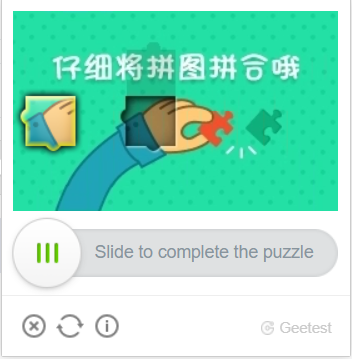

---
sidebar_position: 5
sidebar_label: GeeTestTask
title: "Recognise and resolve GeeTest - GeeTest Task | API"
description: "Learn how to set up automatic recognition and solve (bypass) GeeTest captchas via API using GeeTest Task type, see Capmonster Cloud Docs."
---

import Tabs from '@theme/Tabs';
import TabItem from '@theme/TabItem';
import ParamItem from '@theme/ParamItem';
import MethodItem from '@theme/MethodItem';
import MethodDescription from '@theme/MethodDescription'
import PriceBlock from '@theme/PriceBlock';
import PriceBlockWrap from '@theme/PriceBlockWrap';

# GeeTestTask

<PriceBlockWrap>
  <PriceBlock title="GeeTestTask" name="geeTestToken"/>
</PriceBlockWrap>

This type of task is for solving GeeTest captcha using your proxies.
Your application should send the site address, public domain key (`gt`), key (`challenge`) and proxy.

The result of solving the problem is three or five tokens for submitting the form.

:::warning **Attention!**
Proxies with IP authorization are not yet supported.
:::

:::info
- The `gt`, `challenge` and `geetestApiServerSubdomain` parameters are most often found inside the `initGeetest` JavaScript function.
- Also you can see in the HTML code of the page. You can find it in the `<sсript>` block, which appears after the page is fully loaded in the browser.
  
V3


V4 (captcha_id = gt)


:::

<br />

## <span style={{fontSize: '2.25rem'}}>GeeTest V3</span>

### <span style={{fontSize: '1.5rem'}}>Possible captcha variants</span>

<Tabs className="full-width-tabs">
  <TabItem value="intelligent" label="Intelligent mode" default className="bordered-panel">
    
  </TabItem>
  <TabItem value="slide" label="Slide CAPTCHA" className="bordered-panel">
    
  </TabItem>
  <TabItem value="icon" label="Icon CAPTCHA" className="bordered-panel">
    
  </TabItem>
  <TabItem value="space" label="Space CAPTCHA" className="bordered-panel">
    
  </TabItem>
</Tabs>

### <span style={{fontSize: '1.5rem'}}>Request parameters</span>

  <TabItem value="proxy" label="GeeTestTask (using proxy)" className="bordered-panel">
    <ParamItem title="type" required type="string" />
    **GeeTestTask**

    ---

    <ParamItem title="websiteURL" required type="string" />
    Address of the page on which the captcha is solved. The correct Url is always passed to Referer on the request https://api-na.geetest.com/gettype.php? For example: We are at https://example.com#login, but we see that the captcha is not actually initialised there, but at https://example.com.

    ---

    <ParamItem title="gt" required type="string" />
    The GeeTest identifier key `gt` for the domain. Static value, rarely updated.

    ---

    <ParamItem title="challenge" required="required only for V3" type="string" />
    <p>
    A dynamic key.<br />Each time our API is called, we need to get a new key value. If the captcha is loaded on the page, then the `challenge` value is no longer valid and you will get the [error](../api/api-errors.md) `ERROR_TOKEN_EXPIRED`. <br />
    You will be charged for tasks with `ERROR_TOKEN_EXPIRED` error.
    It is necessary to examine the requests and find the one in which this value is returned and, before each creation of the recognition task, execute this request and parse the challenge from it.
    </p>

    ---

    <ParamItem title="version" type="integer" required="required only for V4"/>
    3

    ---

    <ParamItem title="geetestApiServerSubdomain" type="string" />
    Geetest API subdomain server (must be different from api.geetest.com). <br />Optional parameter. May be required for some sites.

    ---

    <ParamItem title="geetestGetLib" type="string" />
    Path to the captcha script to display it on the page. <br /> Optional parameter. May be required for some sites. <br />Send JSON as a string.

    ---

    <ParamItem title="proxyType" type="string" />
    **http** - regular http/https proxy;<br />**https** - try this option only if "http" doesn't work (required for some custom proxies);<br />**socks4** - socks4 proxy;<br />**socks5** - socks5 proxy.

    ---

    <ParamItem title="proxyAddress" type="string" />
    <p>
      IPv4/IPv6 proxy IP address. Not allowed:
      - using of hostnames;
      - using transparent proxies (where you can see the client's IP);
      - using proxies on local machines.
    </p>

    ---

    <ParamItem title="proxyPort" type="integer" />
    Proxy port.

    ---

    <ParamItem title="proxyLogin" type="string" />
    Proxy-server login.

    ---

    <ParamItem title="proxyPassword" type="string" />
    Proxy-server password.

    ---

    <ParamItem title="userAgent" type="string" />
    Browser User-Agent used to recognize captcha.
  </TabItem>


### <span style={{fontSize: '1.5rem'}}>Create task</span>

<Tabs className="full-width-tabs filled-tabs request-tabs" groupId="captcha-type">
	<TabItem value="proxyless" label="GeeTestTask (without proxy)" default className="method-panel">
		<MethodItem>
			```http
			https://api.capmonster.cloud/createTask
			```
		</MethodItem>
		<MethodDescription>
			**Request**
			```json
			{
				"clientKey":"YOUR_CAPMONSTER_CLOUD_API_KEY",
				"task":
				{
					"type":"GeeTestTask",
					"websiteURL":"https://www.geetest.com/en/demo",
					"gt":"022397c99c9f646f6477822485f30404",
					"challenge":"7f044f48bc951ecfbfc03842b5e1fe59",
					"geetestApiServerSubdomain":"api-na.geetest.com"

				}
			}
			```
			**Response**
			```json
			{
			  "errorId":0,
			  "taskId":407533072
			}
			```
		</MethodDescription>
	</TabItem>

	<TabItem value="proxy" label="GeeTestTask (using proxy)" className="method-panel">
		<MethodItem>
			```http
			https://api.capmonster.cloud/createTask
			```
		</MethodItem>
		<MethodDescription>
			**Request**
			```json 
			  {
				"clientKey":"YOUR_CAPMONSTER_CLOUD_API_KEY",
				"task": {
				  "type":"GeeTestTask",
				  "websiteURL":"https://www.geetest.com/en/demo",
				  "gt":"022397c99c9f646f6477822485f30404",
				  "challenge":"7f044f48bc951ecfbfc03842b5e1fe59",
				  "geetestApiServerSubdomain":"api-na.geetest.com",
				  "proxyType":"http",
				  "proxyAddress":"8.8.8.8",
				  "proxyPort":8080,
				  "proxyLogin":"proxyLoginHere",
				  "proxyPassword":"proxyPasswordHere",
				  "userAgent":"userAgentPlaceholder"
				}
			  }
			```
			**Response**
			```json
			{
			  "errorId":0,
			  "taskId":407533072
			}
			```
		</MethodDescription>
	</TabItem>
  
</Tabs>


Use the [getTaskResult](../api/methods/get-task-result.md) method to get the result of GeeTest recognition. Depending on the system load, you will receive a response after a time in the range from 10 s to 30 s.

### <span style={{fontSize: '1.5rem'}}>Get task result</span>

	<TabItem value="proxyless" label="GeeTestTaskProxyless (without proxy)" default className="method-panel-full">
		<MethodItem>
			```http
			https://api.capmonster.cloud/getTaskResult
			```
		</MethodItem>
		<MethodDescription>
			**Request**
			```json
			{
			  "clientKey":"API_KEY",
			  "taskId": 407533072
			}
			```
			**Response**
			```json
			{
			  "errorId":0,
			  "status":"ready",
			  "solution": {
				"challenge":"0f759dd1ea6c4wc76cedc2991039ca4f23",
				"validate":"6275e26419211d1f526e674d97110e15",
				"seccode":"510cd9735583edcb158601067195a5eb|jordan"
			  }
			}
			```
		</MethodDescription>
	</TabItem>

<br />

<table><tr>
<th><b>Property</b></th><th><b>Type</b></th><th><b>Description</b></th>
</tr>
<tr><td>challenge</td><td>String</td><td rowspan="3">All three parameters are required when submitting the form on the target site.</td></tr>
<tr><td>validate</td><td>String</td></tr>
<tr><td>seccode</td><td>String</td></tr>
</table>

### <span style={{fontSize: '1.5rem'}}>Use SDK Library</span>

<Tabs className="full-width-tabs filled-tabs request-tabs" groupId="captcha-type">
  <TabItem value="js" label="JavaScript" default className="method-panel">
    ```js
    // https://github.com/ZennoLab/capmonstercloud-client-js

    import { CapMonsterCloudClientFactory, ClientOptions, GeeTestRequest, /*GeeTestRequest*/ } from '@zennolab_com/capmonstercloud-client';

    document.addEventListener('DOMContentLoaded', async () => {
      const cmcClient = CapMonsterCloudClientFactory.Create(new ClientOptions({ clientKey: '<your capmonster.cloud API key>' }));
      console.log(await cmcClient.getBalance());

      const geetestV3Request = new GeeTestRequest({
        websiteURL: 'https://example.com/geetest.php',
        gt: '81dc9bdb52d04dc20036dbd8313ed055',
        challenge: 'd93591bdf7860e1e4ee2fca799911215',
      });

      // const geetestV3Request = new GeeTestRequest({
      //   websiteURL: 'https://example.com/geetest.php',
      //   gt: '81dc9bdb52d04dc20036dbd8313ed055',
      //   challenge: 'd93591bdf7860e1e4ee2fca799911215',
      //   userAgent: 'userAgentPlaceholder',
      //   proxyType: 'https',
      //   proxyAddress: 'https://proxy.com',
      //   proxyPort: 6045,
      //   proxyLogin: 'login',
      //   proxyPassword: 'password',
      // });

      console.log(await cmcClient.Solve(geetestV3Request));
    });
    ```
  </TabItem>

  <TabItem value="python" label="Python" className="method-panel">
    ```python
    # https://github.com/ZennoLab/capmonstercloud-client-python

    # GeeTestV3:

    import asyncio
    from capmonstercloudclient import CapMonsterClient, ClientOptions
    from capmonstercloudclient.requests import GeetestRequest

    client_options = ClientOptions(api_key="your_api_key")  # Replace with your CapMonsterCloud API key
    cap_monster_client = CapMonsterClient(options=client_options)

    geetest_request = GeetestRequest(
        websiteUrl="https://example.com",  # Website with the captcha
        gt="your_gt_value",  # Replace with the 'gt' parameter
        challenge="your_challenge_value"  # Replace with the 'challenge' parameter
    )

    async def solve_captcha():
        return await cap_monster_client.solve_captcha(geetest_request)

    responses = asyncio.run(solve_captcha())
    print(responses)
    ```

    ```python
    # Geetest V3

    import asyncio
    from capmonstercloudclient import CapMonsterClient, ClientOptions
    from capmonstercloudclient.requests import GeetestRequest

    client_options = ClientOptions(api_key="your_api_key")  # Replace with your CapMonsterCloud API key
    cap_monster_client = CapMonsterClient(options=client_options)

    geetest_request = GeetestRequest(
        websiteUrl="https://example.com",  # Website with the captcha
        gt="your_gt_value",  
        challenge="your_challenge_value",  
        proxyType="http",  # Type of proxy (http, https, socks4, socks5)
        proxyAddress="8.8.8.8",  
        proxyPort=8080,  
        proxyLogin="proxyLoginHere",  
        proxyPassword="proxyPasswordHere", 
        user_agent="Mozilla/5.0 (Windows NT 10.0; Win64; x64) AppleWebKit/537.36 (KHTML, like Gecko) Chrome/130.0.0.0 Safari/537.36"  # Use the current userAgent
    )

    async def solve_captcha():
        return await cap_monster_client.solve_captcha(geetest_request)

    responses = asyncio.run(solve_captcha())
    print(responses)
    ```
  </TabItem>

  <TabItem value="csharp" label="C#" className="method-panel">
    ```csharp
    // https://github.com/ZennoLab/capmonstercloud-client-dotnet

    // GeeTestV3:

    using Zennolab.CapMonsterCloud.Requests;
    using Zennolab.CapMonsterCloud;

    class Program
    {
        static async Task Main(string[] args)
        {
            var clientOptions = new ClientOptions
            {
                ClientKey = "your_api_key" // Replace with your CapMonster Cloud API key
            };

            var cmCloudClient = CapMonsterCloudClientFactory.Create(clientOptions);

            var geetestRequest = new GeeTestRequest
            {
                WebsiteUrl = "https://example.com/demo/geetest", // URL with the captcha
                Gt = "your_gt_value", // Replace with the actual gt value
                Challenge = "your_challenge_value" // Replace with the actual challenge value
            };

            var geetestResult = await cmCloudClient.SolveAsync(geetestRequest);

            Console.WriteLine("Captcha Solution:");
            Console.WriteLine($"Challenge: {geetestResult.Solution.Challenge}");
            Console.WriteLine($"Validate:  {geetestResult.Solution.Validate}");
            Console.WriteLine($"SecCode:   {geetestResult.Solution.SecCode}");
        }
    }
    ```

    ```csharp
    // Geetest V3

    using Zennolab.CapMonsterCloud.Requests;
    using Zennolab.CapMonsterCloud;

    class Program
    {
        static async Task Main(string[] args)
        {
            var clientOptions = new ClientOptions
            {
                ClientKey = "your_api_key" // Replace with your CapMonster Cloud API key
            };

            var cmCloudClient = CapMonsterCloudClientFactory.Create(clientOptions);

            var geetestRequest = new GeeTestRequest
            {
                WebsiteUrl = "https://example.com/demo/geetest", // URL with the captcha
                Gt = "your_gt_value", // Replace with the actual gt value
                Challenge = "your_challenge_value",
                ProxyType = ProxyType.Http,
                ProxyAddress = "8.8.8.8",
                ProxyPort = 8080,
                ProxyLogin = "proxyLoginHere",
                ProxyPassword = "proxyPasswordHere"
            };

            var geetestResult = await cmCloudClient.SolveAsync(geetestRequest);

            Console.WriteLine("Captcha Solution:");
            Console.WriteLine($"Challenge: {geetestResult.Solution.Challenge}");
            Console.WriteLine($"Validate:  {geetestResult.Solution.Validate}");
            Console.WriteLine($"SecCode:   {geetestResult.Solution.SecCode}");
        }
    }
    ```
  </TabItem>  
</Tabs>

<br />

## <span style={{fontSize: '2.25rem'}}>GeeTest V4</span>

### <span style={{fontSize: '1.5rem'}}>Possible captcha variant</span>


### <span style={{fontSize: '1.5rem'}}>Request parameters</span>

  <TabItem value="proxy" label="GeeTestTask (using proxy)" className="bordered-panel">
    <ParamItem title="type" required type="string" />
    **GeeTestTask**

    ---

    <ParamItem title="websiteURL" required type="string" />
    Address of the page on which the captcha is solved.

    ---

    <ParamItem title="gt" required type="string" />
    The GeeTest identifier key for the domain - the `captcha_id` parameter.

    ---

    <ParamItem title="version" type="integer" required="required only for V4"/>
    4

    ---

    <ParamItem title="geetestApiServerSubdomain" type="string" />
    Geetest API subdomain server (must be different from api.geetest.com). <br />Optional parameter. May be required for some sites.

    ---

    <ParamItem title="geetestGetLib" type="string" />
    Path to the captcha script to display it on the page. <br /> Optional parameter. May be required for some sites. <br />Send JSON as a string.

    ---

    <ParamItem title="initParameters" type="object" />
    Additional parameters for version 4, used together with “riskType” (captcha type/characteristics of its verification).

    ---

    <ParamItem title="proxyType" type="string" />
    **http** - regular http/https proxy;<br />**https** - try this option only if "http" doesn't work (required for some custom proxies);<br />**socks4** - socks4 proxy;<br />**socks5** - socks5 proxy.

    ---

    <ParamItem title="proxyAddress" type="string" />
    <p>
      IPv4/IPv6 proxy IP address. Not allowed:
      - using of hostnames;
      - using transparent proxies (where you can see the client's IP);
      - using proxies on local machines.
    </p>

    ---

    <ParamItem title="proxyPort" type="integer" />
    Proxy port.

    ---

    <ParamItem title="proxyLogin" type="string" />
    Proxy-server login.

    ---

    <ParamItem title="proxyPassword" type="string" />
    Proxy-server password.

    ---

    <ParamItem title="userAgent" type="string" />
    Browser User-Agent used to recognize captcha.
  </TabItem>


### <span style={{fontSize: '1.5rem'}}>Create task method</span>


<Tabs className="full-width-tabs filled-tabs request-tabs" groupId="captcha-type">
	<TabItem value="proxyless" label="GeeTestTask (without proxy)" default className="method-panel">
		<MethodItem>
			```http
			https://api.capmonster.cloud/createTask
			```
		</MethodItem>
		<MethodDescription>
			**Request**
			```json
			{
				"clientKey":"YOUR_CAPMONSTER_CLOUD_API_KEY",
				"task":
				{
					"type":"GeeTestTask",
					"websiteURL":"https://gt4.geetest.com/",
					"gt":"54088bb07d2df3c46b79f80300b0abbe",
					"version": 4,
					"initParameters": {
					  "riskType": "slide"

					}
				}
			}
			```
			**Response**
			```json
			{
			  "errorId":0,
			  "taskId":407533072
			}
			```
		</MethodDescription>
	</TabItem>

	<TabItem value="proxy" label="GeeTestTask (using proxy)" className="method-panel">
		<MethodItem>
			```http
			https://api.capmonster.cloud/createTask
			```
		</MethodItem>
		<MethodDescription>
			**Request**
			```json
			{
			  "clientKey":"YOUR_CAPMONSTER_CLOUD_API_KEY",
			  "task": {
				"type":"GeeTestTask",
				"websiteURL":"https://gt4.geetest.com/",
				"gt":"54088bb07d2df3c46b79f80300b0abbe",
				"version": 4,
				"initParameters": {
				  "riskType": "slide"
				},
				"proxyType":"http",
				"proxyAddress":"8.8.8.8",
				"proxyPort":8080,
				"proxyLogin":"proxyLoginHere",
				"proxyPassword":"proxyPasswordHere",
				"userAgent":"userAgentPlaceholder"

			  }
			}
			```

			**Response**
			```json
			{
			  "errorId":0,
			  "taskId":407533072
			}
			```
		</MethodDescription>
	</TabItem>
  
</Tabs>

Use the [getTaskResult](../api/methods/get-task-result.md) to get the result of GeeTest recognition. Depending on the system load, you will receive a response after a time in the range from 10 s to 30 s.

### <span style={{fontSize: '1.5rem'}}>Get task result method</span>

<TabItem value="proxyless" label="GeeTestTask (without proxy)" default className="method-panel-full">
	<MethodItem>
		```http
		https://api.capmonster.cloud/getTaskResult
		```
	</MethodItem>
	<MethodDescription>
		**Request**
		```json
		{
		  "clientKey":"API_KEY",
		  "taskId": 407533072
		}
		```
		**Response**
		```json
		{
		  "errorId":0,
		  "status":"ready",
		  "solution": {
			"captcha_id":"f5c2ad5a8a3cf37192d8b9c039950f79",
			"lot_number":"bcb2c6ce2f8e4e9da74f2c1fa63bd713",
			"pass_token":"edc7a17716535a5ae624ef4707cb6e7e478dc557608b068d202682c8297695cf",
			"gen_time":"1683794919",
			"captcha_output":"XwmTZEJCJEnRIJBlvtEAZ662T...[cut]...SQ3fX-MyoYOVDMDXWSRQig56"
		  }
		}
		```
	</MethodDescription>
</TabItem>

<br />

<table>
<tr>
<th><b>Property</b></th><th><b>Type</b></th><th><b>Description</b></th>
</tr>
<tr>
<td>captcha_id</td><td>String</td><td rowspan="5">All five parameters are required when submitting the form on the target site.<br />input[name=captcha_id]<br />input[name=lot_number]<br />input[name=pass_token]<br />input[name=gen_time]<br />input[name=captcha_output]</td>
</tr>
<tr><td>lot_number</td><td>String</td></tr>
<tr><td>pass_token</td><td>String</td></tr>
<tr><td>gen_time</td><td>String</td></tr>
<tr><td>captcha_output</td><td>String</td></tr>
</table>


### <span style={{fontSize: '1.5rem'}}>Use SDK Library</span>

<Tabs className="full-width-tabs filled-tabs request-tabs" groupId="captcha-type">
  <TabItem value="js" label="JavaScript" default className="method-panel">
    ```js
    // https://github.com/ZennoLab/capmonstercloud-client-js

    import { CapMonsterCloudClientFactory, ClientOptions, GeeTestRequest, /*GeeTestRequest*/ } from '@zennolab_com/capmonstercloud-client';

    document.addEventListener('DOMContentLoaded', async () => {
      const cmcClient = CapMonsterCloudClientFactory.Create(new ClientOptions({ clientKey: '<your capmonster.cloud API key>' }));
      console.log(await cmcClient.getBalance());

      const geetestV4Request = new GeeTestRequest({
        websiteURL: 'https://example.com/geetest.php',
        gt: '81dc9bdb52d04dc20036dbd8313ed055',
        challenge: 'd93591bdf7860e1e4ee2fca799911215',
        version: '4',
        initParameters: {
          riskType: 'slide',
        },
      });

      // const geetestV4Request = new GeeTestRequest({
      //   websiteURL: 'https://example.com/geetest.php',
      //   gt: '81dc9bdb52d04dc20036dbd8313ed055',
      //   challenge: 'd93591bdf7860e1e4ee2fca799911215',
      //   version: '4',
      //   initParameters: {
      //     riskType: 'slide',
      //   },
      //   userAgent: 'userAgentPlaceholder',
      //   proxyType: 'https',
      //   proxyAddress: 'https://proxy.com',
      //   proxyPort: 6045,
      //   proxyLogin: 'login',
      //   proxyPassword: 'p@ssword',
      // })

      console.log(await cmcClient.Solve(geetestV4Request));
    });
    ```
  </TabItem>
  
  <TabItem value="python" label="Python" className="method-panel">
    ```python
    # https://github.com/ZennoLab/capmonstercloud-client-python

    # GeeTestV4
    import asyncio
    from capmonstercloudclient import CapMonsterClient, ClientOptions
    from capmonstercloudclient.requests import GeetestRequest

    client_options = ClientOptions(api_key = "your_api_key")  # Replace with your CapMonsterCloud API key
    cap_monster_client = CapMonsterClient(options = client_options)

    gee_test_request = GeetestRequest(
        websiteUrl    = "https://example.com/",  # Website with the captcha 
        gt            = "54088bb07d2df3c46b79f80300b0abbe",  
        version       = 4,  
        initParameters = {
            "riskType": "slide"
        }
    )

    async def solve_captcha():
        return await cap_monster_client.solve_captcha(gee_test_request)

    responses = asyncio.run(solve_captcha())
    print(responses)
    ```

    ```python
    # GeeTestV4
    import asyncio
    from capmonstercloudclient import CapMonsterClient, ClientOptions
    from capmonstercloudclient.requests import GeetestRequest

    client_options = ClientOptions(api_key = "your_api_key")  # Replace with your CapMonsterCloud API key
    cap_monster_client = CapMonsterClient(options = client_options)

    gee_test_request = GeetestRequest(
        websiteUrl    = "https://example.com/",  # Website with the captcha
        gt            = "54088bb07d2df3c46b79f80300b0abbe",  
        version       = 4,  
        initParameters = {
            "riskType": "slide"
        },
        proxyType     = "http",  # Type of proxy (http, https, socks4, socks5)
        proxyAddress  = "8.8.8.8",  
        proxyPort     = 8080, 
        proxyLogin    = "proxyLoginHere",  
        proxyPassword = "proxyPasswordHere",
        user_agent    = "Mozilla/5.0 (Windows NT 10.0; Win64; x64) AppleWebKit/537.36 (KHTML, like Gecko) Chrome/130.0.0.0 Safari/537.36"  # Use the current userAgent
    )

    async def solve_captcha():
        return await cap_monster_client.solve_captcha(gee_test_request)

    responses = asyncio.run(solve_captcha())
    print(responses)
    ```
  </TabItem>
  
  <TabItem value="csharp" label="C#" className="method-panel">
    ```csharp
    // https://github.com/ZennoLab/capmonstercloud-client-dotnet

    // GeeTestV4
    using Zennolab.CapMonsterCloud.Requests;
    using Zennolab.CapMonsterCloud;

    class Program
    {
        static async Task Main(string[] args)
        {
            var clientOptions = new ClientOptions
            {
                ClientKey = "your_api_key" // Replace with your CapMonster Cloud API key
            };

            var cmCloudClient = CapMonsterCloudClientFactory.Create(clientOptions);

            var geetestRequest = new GeeTestRequest
            {
                WebsiteUrl = "https://example.com/", // Website with the captcha
                Gt = "54088bb07d2df3c46b79f80300b0abbe",
                Version = 4,
                InitParameters = new Dictionary<string, string> { { "riskType", "slide" } }
            };

            var geetestResult = await cmCloudClient.SolveAsync(geetestRequest);

            Console.WriteLine("Captcha Solution:");
            Console.WriteLine($"CaptchaId: {geetestResult.Solution.CaptchaId}");
            Console.WriteLine($"LotNumber: {geetestResult.Solution.LotNumber}");
            Console.WriteLine($"PassToken: {geetestResult.Solution.PassToken}");
            Console.WriteLine($"GenTime: {geetestResult.Solution.GenTime}");
            Console.WriteLine($"CaptchaOutput: {geetestResult.Solution.CaptchaOutput}");
        }
    }
    ```

    ```csharp
    // Geetest V4
    using Zennolab.CapMonsterCloud.Requests;
    using Zennolab.CapMonsterCloud;

    class Program
    {
        static async Task Main(string[] args)
        {
            var clientOptions = new ClientOptions
            {
                ClientKey = "your_api_key" // Replace with your CapMonster Cloud API key
            };

            var cmCloudClient = CapMonsterCloudClientFactory.Create(clientOptions);

            var geetestRequest = new GeeTestRequest
            {
                WebsiteUrl = "https://example.com/", // Website with the captcha
                Gt = "54088bb07d2df3c46b79f80300b0abbe", // Replace with the correct gt value
                Version = 4,
                InitParameters = new Dictionary<string, string> { { "riskType", "slide" } },
                ProxyType = ProxyType.Http,
                ProxyAddress = "8.8.8.8",
                ProxyPort = 8080,
                ProxyLogin = "proxyLoginHere",
                ProxyPassword = "proxyPasswordHere"
            };

            var geetestResult = await cmCloudClient.SolveAsync(geetestRequest);

            Console.WriteLine("Captcha Solution:");
            Console.WriteLine($"CaptchaId: {geetestResult.Solution.CaptchaId}");
            Console.WriteLine($"LotNumber: {geetestResult.Solution.LotNumber}");
            Console.WriteLine($"PassToken: {geetestResult.Solution.PassToken}");
            Console.WriteLine($"GenTime: {geetestResult.Solution.GenTime}");
            Console.WriteLine($"CaptchaOutput: {geetestResult.Solution.CaptchaOutput}");
        }
    }
    ```
  </TabItem>
</Tabs>