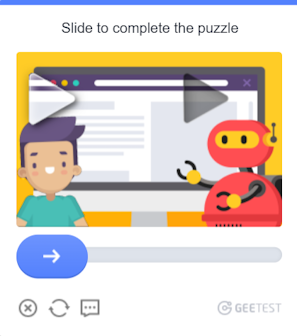

---
sidebar_position: 5
sidebar_label: GeeTest
title: 'Recognise and resolve GeeTest - GeeTest Task | API'
description: 'Learn how to set up automatic recognition and solve (bypass) GeeTest captchas via API using GeeTest Task type, see Capmonster Cloud Docs.'
---

import Tabs from '@theme/Tabs';
import TabItem from '@theme/TabItem';
import ParamItem from '@theme/ParamItem';
import MethodItem from '@theme/MethodItem';
import MethodDescription from '@theme/MethodDescription';
import PriceBlock from '../../../../../src/theme/PriceBlock';
import PriceBlockWrap from '@theme/PriceBlockWrap';
import ImagesLayout from '@theme/ImagesLayout';
import ImageWrap from '@theme/ImageWrap';
import { ArticleHead } from '../../../../../src/theme/ArticleHead';

<ArticleHead slug="captchas/geetest-task" />

# GeeTestTask

<PriceBlockWrap>
  <PriceBlock title="GeeTestTask" captchaId="geetest" />
</PriceBlockWrap>

<ImagesLayout gap="16px" columns={3}>
  <ImageWrap title="GeeTestCaptcha Example"></ImageWrap>
  <ImageWrap title="GeeTestCaptcha Example"></ImageWrap>
</ImagesLayout>

Your application should send the site address, public domain key (`gt`) and key (`challenge`).

The result of solving the task is three or five tokens for form submission.

:::warning **Attention!**
CapMonster Cloud uses built-in proxies by default — their cost is already included in the service. You only need to specify your own proxies in cases where the website does not accept the token or access to the built-in services is restricted.

Proxies with IP authorization are not yet supported.
:::

:::info

- The `gt`, `challenge` and `geetestApiServerSubdomain` parameters are most often found inside the `initGeetest` JavaScript function.
- Also you can see in the HTML code of the page. You can find it in the `<sсript>` block, which appears after the page is fully loaded in the browser.

V3


V4 (captcha_id = gt)


:::

<br />

## <span style={{fontSize: '2.25rem'}}>GeeTest V3</span>

### <span style={{fontSize: '1.5rem'}}>Possible captcha variants</span>

<Tabs className="full-width-tabs">
  <TabItem value="intelligent" label="Intelligent mode" default className="bordered-panel">
    
  </TabItem>
  <TabItem value="slide" label="Slide CAPTCHA" className="bordered-panel">
    
  </TabItem>
  <TabItem value="icon" label="Icon CAPTCHA" className="bordered-panel">
    
  </TabItem>
  <TabItem value="space" label="Space CAPTCHA" className="bordered-panel">
    
  </TabItem>
</Tabs>

### <span style={{fontSize: '1.5rem'}}>Request parameters</span>

  <TabItem value="proxy" label="GeeTestTask (with proxy)" className="bordered-panel">
    <ParamItem title="type" required type="string" />
    **GeeTestTask**

    ---

    <ParamItem title="websiteURL" required type="string" />
    Address of the page on which the captcha is solved. The correct Url is always passed to Referer on the request https://api-na.geetest.com/gettype.php? For example: We are at https://example.com#login, but we see that the captcha is not actually initialised there, but at https://example.com.

    ---

    <ParamItem title="gt" required type="string" />
    The GeeTest identifier key `gt` for the domain. Static value, rarely updated.

    ---

    <ParamItem title="challenge" required="required only for V3" type="string" />
    <p>
    A dynamic key.<br />Each time our API is called, we need to get a new key value. If the captcha is loaded on the page, then the `challenge` value is no longer valid and you will get the [error](../api/api-errors.mdx) `ERROR_TOKEN_EXPIRED`. <br />
    You will be charged for tasks with `ERROR_TOKEN_EXPIRED` error.
    It is necessary to examine the requests and find the one in which this value is returned and, before each creation of the recognition task, execute this request and parse the challenge from it.
    </p>

    ---

    <ParamItem title="version" type="integer" required="required only for V4"/>
    3

    ---

    <ParamItem title="geetestApiServerSubdomain" type="string" />
    Geetest API subdomain server (must be different from api.geetest.com). <br />Optional parameter. May be required for some sites.

    ---

    <ParamItem title="geetestGetLib" type="string" />
    Path to the captcha script to display it on the page. <br /> Optional parameter. May be required for some sites. <br />Send JSON as a string.

    ---

    <ParamItem title="proxyType" type="string" />
    **http** - regular http/https proxy;<br />**https** - try this option only if "http" doesn't work (required for some custom proxies);<br />**socks4** - socks4 proxy;<br />**socks5** - socks5 proxy.

    ---

    <ParamItem title="proxyAddress" type="string" />
    <p>
      IPv4/IPv6 proxy IP address. Not allowed:
      - using transparent proxies (where you can see the client's IP);
      - using proxies on local machines.
    </p>

    ---

    <ParamItem title="proxyPort" type="integer" />
    Proxy port.

    ---

    <ParamItem title="proxyLogin" type="string" />
    Proxy-server login.

    ---

    <ParamItem title="proxyPassword" type="string" />
    Proxy-server password.

    ---

    <ParamItem title="userAgent" type="string" />
    Browser User-Agent.

**Pass only a valid UA from Windows OS. Currently it is**: `userAgentPlaceholder`

  </TabItem>

### <span style={{fontSize: '1.5rem'}}>Create task method</span>

<Tabs className="full-width-tabs filled-tabs request-tabs" groupId="captcha-type">
	<TabItem value="proxyless" label="GeeTestTask (without proxy)" default className="method-panel">
		<MethodItem>
			```http
			https://api.capmonster.cloud/createTask
			```
		</MethodItem>
		<MethodDescription>
			**Request**
			```json
			{
				"clientKey":"YOUR_CAPMONSTER_CLOUD_API_KEY",
				"task":
				{
					"type":"GeeTestTask",
					"websiteURL":"https://www.geetest.com/en/demo",
					"gt":"022397c99c9f646f6477822485f30404",
					"challenge":"7f044f48bc951ecfbfc03842b5e1fe59",
					"geetestApiServerSubdomain":"api-na.geetest.com"

    			}
    		}
    		```
    		**Response**
    		```json
    		{
    		  "errorId":0,
    		  "taskId":407533072
    		}
    		```
    	</MethodDescription>
    </TabItem>

    <TabItem value="proxy" label="GeeTestTask (with proxy)" className="method-panel">
    	<MethodItem>
    		```http
    		https://api.capmonster.cloud/createTask
    		```
    	</MethodItem>
    	<MethodDescription>
    		**Request**
    		```json
    		  {
    			"clientKey":"YOUR_CAPMONSTER_CLOUD_API_KEY",
    			"task": {
    			  "type":"GeeTestTask",
    			  "websiteURL":"https://www.geetest.com/en/demo",
    			  "gt":"022397c99c9f646f6477822485f30404",
    			  "challenge":"7f044f48bc951ecfbfc03842b5e1fe59",
    			  "geetestApiServerSubdomain":"api-na.geetest.com",
    			  "proxyType":"http",
    			  "proxyAddress":"8.8.8.8",
    			  "proxyPort":8080,
    			  "proxyLogin":"proxyLoginHere",
    			  "proxyPassword":"proxyPasswordHere",
    			  "userAgent":"userAgentPlaceholder"
    			}
    		  }
    		```
    		**Response**
    		```json
    		{
    		  "errorId":0,
    		  "taskId":407533072
    		}
    		```
    	</MethodDescription>
    </TabItem>

</Tabs>

Use the [getTaskResult](../api/methods/get-task-result.mdx) method to get the result of GeeTest recognition. Depending on the system load, you will receive a response after a time in the range from 10 s to 30 s.

### <span style={{fontSize: '1.5rem'}}>Get task result method</span>

    <TabItem value="proxyless" label="GeeTestTaskProxyless (without proxy)" default className="method-panel-full">
    	<MethodItem>
    		```http
    		https://api.capmonster.cloud/getTaskResult
    		```
    	</MethodItem>
    	<MethodDescription>
    		**Request**
    		```json
    		{
    		  "clientKey":"API_KEY",
    		  "taskId": 407533072
    		}
    		```
    		**Response**
    		```json
    		{
    		  "errorId":0,
    		  "status":"ready",
    		  "solution": {
    			"challenge":"0f759dd1ea6c4wc76cedc2991039ca4f23",
    			"validate":"6275e26419211d1f526e674d97110e15",
    			"seccode":"510cd9735583edcb158601067195a5eb|jordan"
    		  }
    		}
    		```
    	</MethodDescription>
    </TabItem>

<br />

<table>
  <tr>
    <th>
      <b>Property</b>
    </th>
    <th>
      <b>Type</b>
    </th>
    <th>
      <b>Description</b>
    </th>
  </tr>
  <tr>
    <td>challenge</td>
    <td>String</td>
    <td rowspan="3">All three parameters are required when submitting the form on the target site.</td>
  </tr>
  <tr>
    <td>validate</td>
    <td>String</td>
  </tr>
  <tr>
    <td>seccode</td>
    <td>String</td>
  </tr>
</table>

## How to find all required parameters for task creation

### Manually

1. Open your website where the captcha appears in the browser.
2. Right-click on the captcha element and select **Inspect**.

All parameters can be found in _init-params_ among the requests:


### Automatically

A convenient way to automate the search for all necessary parameters.
Some parameters are regenerated every time the page loads, so you'll need to extract them through a browser — either regular or headless (e.g., using **Playwright**).
Since the values of dynamic parameters are short-lived, the captcha must be solved immediately after retrieving them.

:::warning **Important!**
The code snippets provided are basic examples for familiarization with extracting the required parameters. The exact implementation will depend on your captcha page, its structure, and the HTML elements/selectors it uses.
:::

<Tabs className="full-width-tabs filled-tabs request-tabs">
  <TabItem value="js" label="JavaScript" default className="method-panel">
    <details>
      <summary>Show code (in browser)</summary>

      ```js
      (function detectGeeTestV3Browser() {
        const t = Date.now();
        const url = `https://example.com/api/v1/captcha/gee-test/init-params?t=${t}`;

        fetch(url)
          .then(res => res.json())
          .then(data => {
            const { gt, challenge } = data;
            if (gt && challenge) {
              console.log("GeeTest v3 detected:");
              console.log({ gt, challenge });
            } else {
              console.log("Failed to find gt/challenge parameters");
            }
          })
          .catch(err => console.error("Request error:", err));
      })();
      ```
    </details>

    <details>
      <summary>Show code (Node.js)</summary>

      ```js
      async function detectGeeTestV3() {
        const result = {
          version: null,
          data: {},
        };

        const t = Date.now(); // Get current timestamp
        try {
          const response = await fetch(
            `https://example.com/api/v1/captcha/gee-test/init-params?t=${t}`
          );

          if (response.ok) {
            const data = await response.json();
            const challenge = data.challenge;
            const gt = data.gt;

            if (gt && challenge) {
              result.version = "v3";
              result.data = { gt, challenge };
              console.log(result.data);
            } else {
              console.log("Error: Missing gt or challenge");
            }
          } else {
            console.log("Error: Invalid response status", response.status);
          }
        } catch (error) {
          console.error("Request failed", error);
        }

        return result;
      }

      detectGeeTestV3();
      ```
    </details>

  </TabItem>

  <TabItem value="python" label="Python" className="method-panel">
    <details>
      <summary>Show code</summary>

      ```python
      import requests
      import asyncio
      import time

      async def detect_gee_test_v3():
        result = {
            'version': None,
            'data': {},
        }

        t = int(time.time() * 1000)
        response = requests.get(f'https://example.com/api/v1/captcha/gee-test/init-params?t={t}')

        if response.status_code == 200:
            data = response.json()
            challenge = data.get('challenge')
            gt = data.get('gt')

            if gt and challenge:
                result['version'] = 'v3'
                result['data'] = {'gt': gt, 'challenge': challenge}
                print(result['data'])
            else:
                print('error')

        return result

      asyncio.run(detect_gee_test_v3())
      ```
    </details>

  </TabItem>

  <TabItem value="csharp" label="C#" className="method-panel">
    <details>
      <summary>Show code</summary>

      ```csharp
      using System;
      using System.Net.Http;
      using System.Threading.Tasks;
      using Newtonsoft.Json.Linq;

      class Program
      {
          static async Task DetectGeeTestV3()
          {
              var result = new
              {
                  version = (string)null,
                  data = new { gt = (string)null, challenge = (string)null },
              };

              using (var client = new HttpClient())
              {
                  long t = DateTimeOffset.Now.ToUnixTimeMilliseconds();
                  var url = $"https://example.com/api/v1/captcha/gee-test/init-params?t={t}";

                  var response = await client.GetAsync(url);

                  if (response.IsSuccessStatusCode)
                  {
                      var responseContent = await response.Content.ReadAsStringAsync();
                      var data = JObject.Parse(responseContent);
                      var challenge = data["challenge"]?.ToString();
                      var gt = data["gt"]?.ToString();

                      if (!string.IsNullOrEmpty(gt) && !string.IsNullOrEmpty(challenge))
                      {
                          result = new
                          {
                              version = "v3",
                              data = new { gt = gt, challenge = challenge }
                          };
                          Console.WriteLine($"GT: {gt}, Challenge: {challenge}");
                      }
                      else
                      {
                          Console.WriteLine("Error: Missing required parameters.");
                      }
                  }
                  else
                  {
                      Console.WriteLine("Error: Failed to get response.");
                  }
              }
          }

          static async Task Main(string[] args)
          {
              await DetectGeeTestV3();
          }
      }
      ```
    </details>

  </TabItem>
</Tabs>

## <span style={{fontSize: '1.5rem'}}>Use the SDK library</span>

<Tabs className="full-width-tabs filled-tabs request-tabs" groupId="captcha-type">
  <TabItem value="js" label="JavaScript" default className="method-panel">
  <details>
      <summary>Show code (for browser)</summary>
    ```js
    // https://github.com/ZennoLab/capmonstercloud-client-js

    import { 
        CapMonsterCloudClientFactory, 
        ClientOptions, 
        GeeTestRequest 
    } from '@zennolab_com/capmonstercloud-client';

    const API_KEY = "YOUR_API_KEY"; // Specify your CapMonster Cloud API key

    document.addEventListener('DOMContentLoaded', async () => {
        const client = CapMonsterCloudClientFactory.Create(
            new ClientOptions({ clientKey: API_KEY })
        );

        // Optionally, you can check the balance 
        const balance = await client.getBalance();
        console.log("Balance:", balance);

        // Basic example without proxy
        // CapMonster Cloud automatically uses its own proxies
        let geetestRequest = new GeeTestRequest({
            websiteURL: "https://example.com/geetest.php", // URL of the page with captcha
            gt: "81dc9bdb52d04dc20036dbd8313ed055",        // Replace with the correct value
            challenge: "d93591bdf7860e1e4ee2fca799911215"  // Replace with the correct value
        });

        // Example of using your own proxy
        // Uncomment this block if you want to use your own proxy

        /*
        const proxy = {
            proxyType: "https",
            proxyAddress: "123.45.67.89",
            proxyPort: 8080,
            proxyLogin: "username",
            proxyPassword: "password"
        };

        geetestRequest = new GeeTestRequest({
            websiteURL: "https://example.com/geetest.php",
            gt: "81dc9bdb52d04dc20036dbd8313ed055",
            challenge: "d93591bdf7860e1e4ee2fca799911215",
            proxy,
            userAgent: "userAgentPlaceholder"
        });
        */

        const result = await client.Solve(geetestRequest);
        console.log("Solution:", result);
    });
    ```
    </details>

    <details>
      <summary>Show code (Node.js)</summary>
```javascript
// https://github.com/ZennoLab/capmonstercloud-client-js

import { CapMonsterCloudClientFactory, ClientOptions, GeeTestRequest } from '@zennolab_com/capmonstercloud-client';

const API_KEY = "YOUR_API_KEY"; // Specify your CapMonster Cloud API key

async function solveGeeTest() {
    const client = CapMonsterCloudClientFactory.Create(
        new ClientOptions({ clientKey: API_KEY })
    );

    // Optionally, you can check the balance 
    const balance = await client.getBalance();
    console.log("Balance:", balance);

    // Basic example without proxy
    // CapMonster Cloud automatically uses its own proxies
    let geetestRequest = new GeeTestRequest({
        websiteURL: "https://example.com/geetest.php", // URL of the page with captcha
        gt: "81dc9bdb52d04dc20036dbd8313ed055",       // Replace with the correct value
        challenge: "d93591bdf7860e1e4ee2fca799911215" // Replace with the correct value
    });

    // Example of using your own proxy
    // Uncomment this block if you want to use your own proxy

    /*
    const proxy = {
        proxyType: "https",
        proxyAddress: "123.45.67.89",
        proxyPort: 8080,
        proxyLogin: "username",
        proxyPassword: "password"
    };

    geetestRequest = new GeeTestRequest({
        websiteURL: "https://example.com/geetest.php",
        gt: "81dc9bdb52d04dc20036dbd8313ed055",
        challenge: "d93591bdf7860e1e4ee2fca799911215",
        proxy,
        userAgent: "userAgentPlaceholder"
    });
    */

    const result = await client.Solve(geetestRequest);
    console.log("Solution:", result);
}

solveGeeTest().catch(console.error);
```
</details>
  </TabItem>

  <TabItem value="python" label="Python" className="method-panel">
  <details>
      <summary>Show code</summary>
    ```python
    # https://github.com/ZennoLab/capmonstercloud-client-python

    import asyncio
    from capmonstercloudclient import CapMonsterClient, ClientOptions
    from capmonstercloudclient.requests import GeetestRequest
    # from capmonstercloudclient.requests.baseRequestWithProxy import ProxyInfo   # Uncomment if you plan to use a proxy

    API_KEY = "YOUR_API_KEY"  # Specify your CapMonster Cloud API key

    async def solve_geetest():
        client_options = ClientOptions(api_key=API_KEY)
        cap_monster_client = CapMonsterClient(options=client_options)

        # Basic example without proxy
        # CapMonster Cloud automatically uses its own proxies
        geetest_request = GeetestRequest(
            websiteUrl="https://example.com",
            gt="81dc9bdb52d04dc20036dbd8313ed055",
            challenge="d93591bdf7860e1e4ee2fca799911215"
        )

        # Example of using your own proxy
        # Uncomment this block if you want to use your own proxy

        # proxy = ProxyInfo(
        #     proxyType="http",
        #     proxyAddress="123.45.67.89",
        #     proxyPort=8080,
        #     proxyLogin="username",
        #     proxyPassword="password"
        # )

        # geetest_request = GeetestRequest(
        #     websiteUrl="https://example.com",
        #     gt="81dc9bdb52d04dc20036dbd8313ed055",
        #     challenge="d93591bdf7860e1e4ee2fca799911215",
        #     proxy=proxy,
        #     userAgent="userAgentPlaceholder"
        # )

        # Optionally, you can check the balance 
        balance = await cap_monster_client.get_balance()
        print("Balance:", balance)

        result = await cap_monster_client.solve_captcha(geetest_request)
        print("Solution:", result)

    asyncio.run(solve_geetest())
    ```
    </details>

  </TabItem>

  <TabItem value="csharp" label="C#" className="method-panel">
  <details>
      <summary>Show code</summary>
    ```csharp
    // https://github.com/ZennoLab/capmonstercloud-client-dotnet

    using System;
    using System.Threading.Tasks;
    using Zennolab.CapMonsterCloud;
    using Zennolab.CapMonsterCloud.Requests;

    class Program
    {
        static async Task Main(string[] args)
        {
            // Your CapMonster Cloud API key
            var clientOptions = new ClientOptions
            {
                ClientKey = "YOUR_API_KEY"
            };

            var cmCloudClient = CapMonsterCloudClientFactory.Create(clientOptions);

            // Optionally, you can check the balance 
            var balance = await cmCloudClient.GetBalanceAsync();
            Console.WriteLine("Balance: " + balance);

            // Basic example without proxy
            // CapMonster Cloud automatically uses its own proxies
            var geetestRequest = new GeeTestRequest
            {
                WebsiteUrl = "https://example.com/demo/geetest", // URL of the page with the captcha
                Gt = "your_gt_value",                             // Replace with the correct value
                Challenge = "your_challenge_value"               // Replace with the correct value
            };

            // Example of using your own proxy
            // Uncomment this block if you want to use your own proxy
            /*
            var geetestRequest = new GeeTestRequest
            {
                WebsiteUrl = "https://example.com/demo/geetest", // URL of the page with the captcha
                Gt = "your_gt_value",  
                Challenge = "your_challenge_value",

                Proxy = new ProxyContainer(
                    "123.45.67.89", 
                    8080,           
                    ProxyType.Http,    
                    "username",  
                    "password"
                )
            };
            */

            var geetestResult = await cmCloudClient.SolveAsync(geetestRequest);

            Console.WriteLine("Solution:");
            Console.WriteLine($"Challenge: {geetestResult.Solution.Challenge}");
            Console.WriteLine($"Validate:  {geetestResult.Solution.Validate}");
            Console.WriteLine($"SecCode:   {geetestResult.Solution.SecCode}");
        }
    }
    ```
</details>
  </TabItem>  
</Tabs>

<br />

## <span style={{fontSize: '2.25rem'}}>GeeTest V4</span>

### <span style={{fontSize: '1.5rem'}}>Possible captcha variant</span>


### <span style={{fontSize: '1.5rem'}}>Request parameters</span>

  <TabItem value="proxy" label="GeeTestTask (with proxy)" className="bordered-panel">
    <ParamItem title="type" required type="string" />
    **GeeTestTask**

    ---

    <ParamItem title="websiteURL" required type="string" />
    Address of the page on which the captcha is solved.

    ---

    <ParamItem title="gt" required type="string" />
    The GeeTest identifier key for the domain - the `captcha_id` parameter.

    ---

    <ParamItem title="version" type="integer" required="required only for V4"/>
    4

    ---

    <ParamItem title="geetestApiServerSubdomain" type="string" />
    Geetest API subdomain server (must be different from api.geetest.com). <br />Optional parameter. May be required for some sites.

    ---

    <ParamItem title="geetestGetLib" type="string" />
    Path to the captcha script to display it on the page. <br /> Optional parameter. May be required for some sites. <br />Send JSON as a string.

    ---

    <ParamItem title="initParameters" type="object" />
    Additional parameters for version 4, used together with “riskType” (captcha type/characteristics of its verification).

    ---

    <ParamItem title="proxyType" type="string" />
    **http** - regular http/https proxy;<br />**https** - try this option only if "http" doesn't work (required for some custom proxies);<br />**socks4** - socks4 proxy;<br />**socks5** - socks5 proxy.

    ---

    <ParamItem title="proxyAddress" type="string" />
    <p>
      IPv4/IPv6 proxy IP address. Not allowed:
      - using transparent proxies (where you can see the client's IP);
      - using proxies on local machines.
    </p>

    ---

    <ParamItem title="proxyPort" type="integer" />
    Proxy port.

    ---

    <ParamItem title="proxyLogin" type="string" />
    Proxy-server login.

    ---

    <ParamItem title="proxyPassword" type="string" />
    Proxy-server password.

    ---

    <ParamItem title="userAgent" type="string" />
    Browser User-Agent used to recognize captcha.

  </TabItem>

### <span style={{fontSize: '1.5rem'}}>Create task method</span>

<Tabs className="full-width-tabs filled-tabs request-tabs" groupId="captcha-type">
	<TabItem value="proxyless" label="GeeTestTask (without proxy)" default className="method-panel">
		<MethodItem>
			```http
			https://api.capmonster.cloud/createTask
			```
		</MethodItem>
		<MethodDescription>
			**Request**
			```json
			{
				"clientKey":"YOUR_CAPMONSTER_CLOUD_API_KEY",
				"task":
				{
					"type":"GeeTestTask",
					"websiteURL":"https://gt4.geetest.com/",
					"gt":"54088bb07d2df3c46b79f80300b0abbe",
					"version": 4,
					"initParameters": {
					  "riskType": "slide"

    				}
    			}
    		}
    		```
    		**Response**
    		```json
    		{
    		  "errorId":0,
    		  "taskId":407533072
    		}
    		```
    	</MethodDescription>
    </TabItem>

    <TabItem value="proxy" label="GeeTestTask (with proxy)" className="method-panel">
    	<MethodItem>
    		```http
    		https://api.capmonster.cloud/createTask
    		```
    	</MethodItem>
    	<MethodDescription>
    		**Request**
    		```json
    		{
    		  "clientKey":"YOUR_CAPMONSTER_CLOUD_API_KEY",
    		  "task": {
    			"type":"GeeTestTask",
    			"websiteURL":"https://gt4.geetest.com/",
    			"gt":"54088bb07d2df3c46b79f80300b0abbe",
    			"version": 4,
    			"initParameters": {
    			  "riskType": "slide"
    			},
    			"proxyType":"http",
    			"proxyAddress":"8.8.8.8",
    			"proxyPort":8080,
    			"proxyLogin":"proxyLoginHere",
    			"proxyPassword":"proxyPasswordHere",
    			"userAgent":"userAgentPlaceholder"

    		  }
    		}
    		```

    		**Response**
    		```json
    		{
    		  "errorId":0,
    		  "taskId":407533072
    		}
    		```
    	</MethodDescription>
    </TabItem>

</Tabs>

Use the [getTaskResult](../api/methods/get-task-result.mdx) to get the result of GeeTest recognition. Depending on the system load, you will receive a response after a time in the range from 10 s to 30 s.

### <span style={{fontSize: '1.5rem'}}>Get task result method</span>

<TabItem value="proxyless" label="GeeTestTask (without proxy)" default className="method-panel-full">
	<MethodItem>
		```http
		https://api.capmonster.cloud/getTaskResult
		```
	</MethodItem>
	<MethodDescription>
		**Request**
		```json
		{
		  "clientKey":"API_KEY",
		  "taskId": 407533072
		}
		```
		**Response**
		```json
		{
		  "errorId":0,
		  "status":"ready",
		  "solution": {
			"captcha_id":"f5c2ad5a8a3cf37192d8b9c039950f79",
			"lot_number":"bcb2c6ce2f8e4e9da74f2c1fa63bd713",
			"pass_token":"edc7a17716535a5ae624ef4707cb6e7e478dc557608b068d202682c8297695cf",
			"gen_time":"1683794919",
			"captcha_output":"XwmTZEJCJEnRIJBlvtEAZ662T...[cut]...SQ3fX-MyoYOVDMDXWSRQig56"
		  }
		}
		```
	</MethodDescription>
</TabItem>

<br />

<table>
  <tr>
    <th>
      <b>Property</b>
    </th>
    <th>
      <b>Type</b>
    </th>
    <th>
      <b>Description</b>
    </th>
  </tr>
  <tr>
    <td>captcha_id</td>
    <td>String</td>
    <td rowspan="5">
      All five parameters are required when submitting the form on the target site.
      <br />
      input[name=captcha_id]
      <br />
      input[name=lot_number]
      <br />
      input[name=pass_token]
      <br />
      input[name=gen_time]
      <br />
      input[name=captcha_output]
    </td>
  </tr>
  <tr>
    <td>lot_number</td>
    <td>String</td>
  </tr>
  <tr>
    <td>pass_token</td>
    <td>String</td>
  </tr>
  <tr>
    <td>gen_time</td>
    <td>String</td>
  </tr>
  <tr>
    <td>captcha_output</td>
    <td>String</td>
  </tr>
</table>

## How to find all required parameters for task creation

### Manually

1. Open your website where the captcha appears in the browser.
2. Right-click on the captcha element and select **Inspect**.

Parameters may load in _load?callback_:


### Automatically

A convenient way to automate the search for all necessary parameters.
Some parameters are regenerated every time the page loads, so you'll need to extract them through a browser — either regular or headless (e.g., using **Playwright**).
Since the values of dynamic parameters are short-lived, the captcha must be solved immediately after retrieving them.

:::warning **Important!**
The code snippets provided are basic examples for familiarization with extracting the required parameters. The exact implementation will depend on your captcha page, its structure, and the HTML elements/selectors it uses.
:::

<Tabs className="full-width-tabs filled-tabs request-tabs">
  <TabItem value="js" label="JavaScript" default className="method-panel">
    <details>
      <summary>Show code (in browser)</summary>

      ```js
      (function() {
        function getQueryParams(url) {
          const params = new URLSearchParams(new URL(url).search);
          const captchaId = params.get('captcha_id');
          const challenge = params.get('challenge');
          const riskType = params.get('risk_type');
          return { captchaId, challenge, riskType };
        }

        const observer = new PerformanceObserver((list) => {
          const entries = list.getEntriesByType('resource');
          entries.forEach((entry) => {
            if (entry.name.includes('https://gcaptcha4.geetest.com/load?')) {
              const { captchaId, challenge, riskType } = getQueryParams(entry.name);
              if (captchaId && challenge) {
                console.log('GeeTest v4 detected (via PerformanceObserver):');
                console.log({ captchaId, challenge, riskType });
              }
            }
          });
        });

        observer.observe({ type: 'resource', buffered: true });
      })();
      ```
    </details>

    <details>
      <summary>Show code (Node.js)</summary>

      ```js
      import { chromium } from "playwright";

      async function detectGeeTestV4(pageUrl) {
        const result = { version: null, data: {} };

        const browser = await chromium.launch({ headless: false });
        const context = await browser.newContext();
        const page = await context.newPage();

        page.on("response", async (response) => {
          const url = response.url();
          if (url.includes("https://gcaptcha4.geetest.com/load?")) {
            const urlParams = new URLSearchParams(url.split("?")[1]);
            const captchaId = urlParams.get("captcha_id");
            const challenge = urlParams.get("challenge");
            const riskType = urlParams.get("risk_type");

            if (captchaId && challenge && !result.version) {
              result.version = "v4";
              result.data = {
                captchaId: captchaId,
                challenge: challenge,
                riskType: riskType,
              };
              console.log("GeeTest v4 detected:");
              console.log(result.data);
            }
          }
        });

        await page.goto(pageUrl, { waitUntil: "networkidle" });
        await page.waitForTimeout(20000);

        if (!result.version) {
          console.log("error");
        }

        await browser.close();
        return result;
      }

      detectGeeTestV4("https://example.com").then((result) => {
        console.log(result);
      });
      ```
    </details>

  </TabItem>

  <TabItem value="python" label="Python" className="method-panel">
    <details>
      <summary>Show code</summary>

      ```python
      import asyncio
      from playwright.async_api import async_playwright
      from urllib.parse import urlparse, parse_qs

      async def detect_geetest_v4(page_url):
          result = {"version": None, "data": {}}

          async with async_playwright() as p:
              browser = await p.chromium.launch(headless=False)
              context = await browser.new_context()
              page = await context.new_page()

              async def on_request(request):
                  url = request.url
                  if "https://gcaptcha4.geetest.com/load?" in url:
                      query = parse_qs(urlparse(url).query)
                      captcha_id = query.get("captcha_id", [None])[0]
                      challenge = query.get("challenge", [None])[0]
                      risk_type = query.get("risk_type", [None])[0]

                      if captcha_id and challenge and not result["version"]:
                          result["version"] = "v4"
                          result["data"] = {
                              "captchaId": captcha_id,
                              "challenge": challenge,
                              "riskType": risk_type
                          }
                          print("GeeTest v4 detected:")
                          print(result["data"])

              context.on("request", on_request)

              await page.goto(page_url, wait_until="networkidle")
              await asyncio.sleep(10)

              if not result["version"]:
                  print("error")

              await browser.close()
              return result

      asyncio.run(detect_geetest_v4("https://www.example.com"))
      ```
    </details>

  </TabItem>

  <TabItem value="csharp" label="C#" className="method-panel">
    <details>
      <summary>Show code</summary>

      ```csharp
      using System;
      using System.Threading.Tasks;
      using Microsoft.Playwright;
      using System.Web;

      class Program
      {
          public static async Task Main(string[] args)
          {
              var result = new
              {
                  Version = (string)null,
                  Data = new
                  {
                      CaptchaId = (string)null,
                      Challenge = (string)null,
                      RiskType = (string)null
                  }
              };

              using var playwright = await Playwright.CreateAsync();
              var browser = await playwright.Chromium.LaunchAsync(new BrowserTypeLaunchOptions
              {
                  Headless = false
              });

              var context = await browser.NewContextAsync();
              var page = await context.NewPageAsync();

              page.Request += (_, request) =>
              {
                  var url = request.Url;

                  if (url.Contains("https://gcaptcha4.geetest.com/load?"))
                  {
                      var uri = new Uri(url);
                      var queryParams = HttpUtility.ParseQueryString(uri.Query);
                      var captchaId = queryParams.Get("captcha_id");
                      var challenge = queryParams.Get("challenge");
                      var riskType = queryParams.Get("risk_type");

                      if (!string.IsNullOrEmpty(captchaId) && !string.IsNullOrEmpty(challenge))
                      {
                          Console.WriteLine("GeeTest v4 detected:");
                          Console.WriteLine($"CaptchaId: {captchaId}");
                          Console.WriteLine($"Challenge: {challenge}");
                          Console.WriteLine($"RiskType: {riskType}");
                      }
                  }
              };

              await page.GotoAsync("https://www.example.com/", new PageGotoOptions
              {
                  WaitUntil = WaitUntilState.NetworkIdle
              });

              await Task.Delay(10000);

              await browser.CloseAsync();
          }
      }
      ```
    </details>

  </TabItem>
</Tabs>

## <span style={{fontSize: '1.5rem'}}>Use the SDK library</span>

<Tabs className="full-width-tabs filled-tabs request-tabs" groupId="captcha-type">
  <TabItem value="js" label="JavaScript" default className="method-panel">
  <details>
      <summary>Show code (for browser)</summary>
    ```js
    // https://github.com/ZennoLab/capmonstercloud-client-js

    import { 
        CapMonsterCloudClientFactory, 
        ClientOptions, 
        GeeTestRequest 
    } from '@zennolab_com/capmonstercloud-client';

    const API_KEY = "YOUR_API_KEY"; // Specify your CapMonster Cloud API key

    document.addEventListener('DOMContentLoaded', async () => {
        const client = CapMonsterCloudClientFactory.Create(
            new ClientOptions({ clientKey: API_KEY })
        );

        // Optionally, you can check the balance
        const balance = await client.getBalance();
        console.log("Balance:", balance);

        // Basic example without proxy
        // CapMonster Cloud automatically uses its own proxies
        let geetestRequest = new GeeTestRequest({
            websiteURL: "https://example.com/geetest.php", // URL of the page with the captcha
            gt: "81dc9bdb52d04dc20036dbd8313ed055",
            challenge: "d93591bdf7860e1e4ee2fca799911215",
            version: "4",
            initParameters: { riskType: "slide" }
        });

        // Example of using your own proxy
        // Uncomment this block if you want to use your own proxy

        /*
        const proxy = {
            proxyType: "https",
            proxyAddress: "123.45.67.89",
            proxyPort: 8080,
            proxyLogin: "username",
            proxyPassword: "password"
        };

        geetestRequest = new GeeTestRequest({
            websiteURL: "https://example.com/geetest.php",
            gt: "81dc9bdb52d04dc20036dbd8313ed055",
            challenge: "d93591bdf7860e1e4ee2fca799911215",
            version: "4",
            initParameters: { riskType: "slide" },
            proxy,
            userAgent: "userAgentPlaceholder"
        });
        */

        const result = await client.Solve(geetestRequest);
        console.log("Solution:", result);
    });
    ```

</details>


<details>
      <summary>Show code (Node.js)</summary>
```javascript
// https://github.com/ZennoLab/capmonstercloud-client-js

import { CapMonsterCloudClientFactory, ClientOptions, GeeTestRequest } from '@zennolab_com/capmonstercloud-client';

const API_KEY = "YOUR_API_KEY"; // Specify your CapMonster Cloud API key

async function solveGeeTest() {
    const client = CapMonsterCloudClientFactory.Create(
        new ClientOptions({ clientKey: API_KEY })
    );

    // Optionally, you can check the balance
    const balance = await client.getBalance();
    console.log("Balance:", balance);

    // Basic example without proxy
    // CapMonster Cloud automatically uses its own proxies
    let geetestRequest = new GeeTestRequest({
        websiteURL: "https://example.com/geetest.php", // URL of the page with the captcha
        gt: "81dc9bdb52d04dc20036dbd8313ed055",
        challenge: "d93591bdf7860e1e4ee2fca799911215",
        version: "4",                                 
        initParameters: { riskType: "slide" }
    });

    // Example of using your own proxy
    // Uncomment this block if you want to use your own proxy

    /*
    const proxy = {
        proxyType: "https",
        proxyAddress: "123.45.67.89",
        proxyPort: 8080,
        proxyLogin: "username",
        proxyPassword: "password"
    };

    geetestRequest = new GeeTestRequest({
        websiteURL: "https://example.com/geetest.php",
        gt: "81dc9bdb52d04dc20036dbd8313ed055",
        challenge: "d93591bdf7860e1e4ee2fca799911215",
        version: "4",
        initParameters: { riskType: "slide" },
        proxy,
        userAgent: "userAgentPlaceholder"
    });
    */

    const result = await client.Solve(geetestRequest);
    console.log("Solution:", result);
}

solveGeeTest().catch(console.error);
```
</details>
  </TabItem>
  
  <TabItem value="python" label="Python" className="method-panel">
  <details>
      <summary>Show code</summary>
    ```python
    # https://github.com/ZennoLab/capmonstercloud-client-python

    import asyncio
    from capmonstercloudclient import CapMonsterClient, ClientOptions
    from capmonstercloudclient.requests import GeetestRequest
    # from capmonstercloudclient.requests.baseRequestWithProxy import ProxyInfo  # Uncomment if you plan to use your own proxies

    API_KEY = "YOUR_API_KEY"  # Specify your CapMonster Cloud API key

    async def solve_geetest_v4():
        client_options = ClientOptions(api_key=API_KEY)
        cap_monster_client = CapMonsterClient(options=client_options)

        # Basic example without proxy
        # CapMonster Cloud automatically uses its own proxies
        geetest_request = GeetestRequest(
            websiteUrl="https://example.com/",
            gt="54088bb07d2df3c46b79f80300b0abbe",
            version=4,
            initParameters={
                "riskType": "slide"
            }
        )

        # Example of using your own proxy
        # Uncomment this block if you want to use your own proxy

        # proxy = ProxyInfo(
        #     proxyType="http",
        #     proxyAddress="123.45.67.89",
        #     proxyPort=8080,
        #     proxyLogin="username",
        #     proxyPassword="password"
        # )

        # geetest_request = GeetestRequest(
        #     websiteUrl="https://example.com/",
        #     gt="54088bb07d2df3c46b79f80300b0abbe",
        #     version=4,
        #     initParameters={
        #         "riskType": "slide"
        #     },
        #     proxy=proxy,
        #     userAgent="userAgentPlaceholder"
        # )

        # Optionally, you can check the balance
        balance = await cap_monster_client.get_balance()
        print("Balance:", balance)

        result = await cap_monster_client.solve_captcha(geetest_request)
        print("Solution:", result)

    asyncio.run(solve_geetest_v4())
    ```
</details>
  </TabItem>
  
  <TabItem value="csharp" label="C#" className="method-panel">
  <details>
      <summary>Show code</summary>
    ```csharp
    // https://github.com/ZennoLab/capmonstercloud-client-dotnet

    using System;
    using System.Collections.Generic;
    using System.Threading.Tasks;
    using Zennolab.CapMonsterCloud;
    using Zennolab.CapMonsterCloud.Requests;

    class Program
    {
        static async Task Main(string[] args)
        {
            // Specify your CapMonster Cloud API key
            var clientOptions = new ClientOptions
            {
                ClientKey = "YOUR_API_KEY"
            };

            var cmCloudClient = CapMonsterCloudClientFactory.Create(clientOptions);

            // Optionally, you can check the balance
            var balance = await cmCloudClient.GetBalanceAsync();
            Console.WriteLine("Balance: " + balance);

            // Basic example without proxy
            // CapMonster Cloud automatically uses its own proxies
            var geetestRequest = new GeeTestRequest
            {
                WebsiteUrl = "https://example.com/", // URL of the page with the captcha
                Gt = "54088bb07d2df3c46b79f80300b0abbe",
                Version = 4,                             
                InitParameters = new Dictionary<string, string> { { "riskType", "slide" } } // Additional parameter for V4
            };

            // Example of using your own proxy
            // Uncomment this block if you want to use your own proxy
            /*
            var geetestRequest = new GeeTestRequest
            {
                WebsiteUrl = "https://example.com/",
                Gt = "54088bb07d2df3c46b79f80300b0abbe",
                Version = 4,
                InitParameters = new Dictionary<string, string> { { "riskType", "slide" } },

                Proxy = new ProxyContainer(
                    "123.45.67.89", 
                    8080,           
                    ProxyType.Http,    
                    "username",   
                    "password" 
                )
            };
            */

            var geetestResult = await cmCloudClient.SolveAsync(geetestRequest);

            Console.WriteLine("Solution:");
            Console.WriteLine($"CaptchaId:     {geetestResult.Solution.CaptchaId}");
            Console.WriteLine($"LotNumber:     {geetestResult.Solution.LotNumber}");
            Console.WriteLine($"PassToken:     {geetestResult.Solution.PassToken}");
            Console.WriteLine($"GenTime:       {geetestResult.Solution.GenTime}");
            Console.WriteLine($"CaptchaOutput: {geetestResult.Solution.CaptchaOutput}");
        }
    }
    ```
</details>
  </TabItem>
</Tabs>

## Features of the GeeTest solution on app.gal\*\*.com

:::warning **Attention!**
This section is relevant **only for the GeeTest captcha on the `app.gal**.com` site\*\*. These values should not be used for other sites.
:::

<details>
  <summary>When to use the <code>challenge</code> field?</summary>

For the **`app.gal**.com`** site, you need to specify the value of the `challenge` field depending on the action being performed. If this field is not specified, the default value **`AddTypedCredentialItems`\*\* is used, but this does not suit all scenarios.

List of possible `challenge` values:

| Action on `app.gal**.com` site     | challenge Value             |
| ---------------------------------- | --------------------------- |
| Sending an email code              | `SendEmailCode`             |
| Confirming an action (e.g., login) | `SendVerifyCode`            |
| Claiming a reward                  | `ClaimUserTask`             |
| Opening a mystery box              | `OpenMysteryBox`            |
| Purchasing in GGShop               | `BuyGGShop`                 |
| Preparing to buy raffle tickets    | `PrepareBuyGGRaffleTickets` |
| Adding credentials                 | `AddTypedCredentialItems`   |
| Creating a report ticket           | `CreateReportTicket`        |
| Participating in an activity       | `PrepareParticipate`        |
| Updating credential data           | `RefreshCredentialValue`    |
| Synchronizing data                 | `SyncCredentialValue`       |
| Social login                       | `GetSocialAuthUrl`          |

> The `challenge` value must match the `operationName` visible in the network requests (`Network` tab) via DevTools.


</details>

<details>
  <summary>Task submission example</summary>

```json
{
  "type": "GeeTestTaskProxyless",
  "websiteURL": "https://app.gal**.com/accountSetting/social",
  "gt": "244bcb8b9846215df5af4c624a750db4",
  "challenge": "SendVerifyCode"
}
```

> Note: The GT key for gal\*\*.com is always `244bcb8b9846215df5af4c624a750db4`. You can leave this value as the default.

</details>

<details>
  <summary>Example response</summary>

```json
{
  "errorId": 0,
  "errorCode": null,
  "errorDescription": null,
  "solution": {
    "lot_number": "e0c84aab60867ad1316f8606d31ab58d2a54d8a4ca8e78b9339abd8ea62967cb",
    "captcha_output": "7DlZW2dul...cbEA5uIbwg==",
    "pass_token": "ce024389a0926e0d1081792c83e0c46f882084e45e95afa0e148fd03aed3ae10",
    "gen_time": "1753158042",
    "encryptedData": ""
  },
  "status": "ready"
}
```

The `encryptedData` field on the site side is usually empty, as the client logic ignores it. Although the value is returned via WebAssembly, in practice it is not used.

</details>
