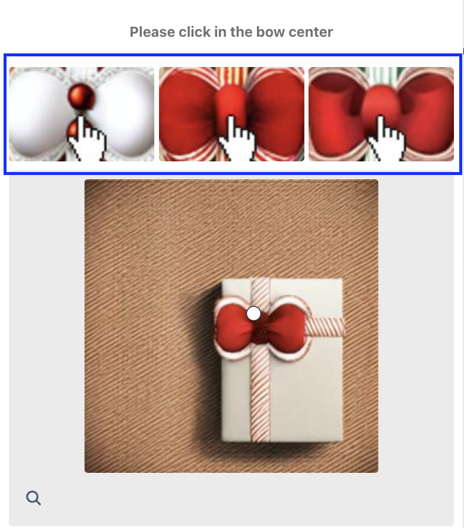

---
sidebar_position: 8
sidebar_label: ComplexImageTask HCaptcha
---

# ComplexImageTask HCaptcha

In ComplexImageTask, you need to perform certain actions such as overlaying objects on the image, rotating/modifying objects in the image to match certain criteria, searching/recognizing objects, and the like. 

The object contains data about the task for solving hCaptcha. 

## **Request to create a task**
### **Structure of the sent object**
:::info Method
```http
https://api.capmonster.cloud/createTask
```
:::
|**Parameter**|**Type**|**Required**|**Possible values**|**Description**|
| :- | :- | :- | :- | :- |
|type|String|yes|ComplexImageTask|Defines the task object type.|
|class|String|yes|hcaptcha|Defines the task object class.|
|imageUrls|Array|yes (if imagesBase64 is not filled)|[ “[https://i.postimg.cc/kg71cbRt/image-1.jpg](https://i.postimg.cc/kg71cbRt/image-1.jpg)”,… ]|List with image addresses. Maximum 18 elements.|
|imagesBase64|Array|yes (if imageUrls is not filled)|[ “/9j/4AAQSkZJRgABAQEAAAAAAAD…”,… ]|List with images in base64 format. Maximum 18 elements.|
|metadata.Task|String|yes|`Please click on the panda` and others|Task text (<u>in English</u>).|
|exampleImageUrls|Array|not always|[ “[https://i.postimg.cc/GmBgwnDm/4type-example-image.png](https://i.postimg.cc/GmBgwnDm/4type-example-image.png)”]|List with image addresses. Must contain 1 element.|
|exampleImagesBase64|Array|not always|[ “/9j/4AAQSkZJRgABAQEAAAAAAAD…”]|List with images in base64 format. Must contain 1 element.|
|metadata.Classes|Array|not always|[ "shark", "chicken", "goat", "hedgehog" ] and others|A list with string values located on the right half of the captcha (in the same order as in the image).|
|userAgent|String|no|-|Browser User-Agent used when loading images if links were passed to imageUrls. You should use a modern browser signature, otherwise Google will return an error asking you to update your browser.|
|websiteURL|String|no|-|Address of the page on which the captcha is solved.|

## **Request for a response**
:::info Method
```http
https://api.capmonster.cloud/getTaskResult
```
:::
Use the [getTaskResult](../api/methods/get-task-result.md) method to get the captcha solution. Depending on the system load, you will receive a response after a time ranging from 300ms to 6s.

### **Structure of the solution object**
|**Property**|**Type**|**Description**|
| :- | :- | :- |
|answer|Array of objects|List of answers to each of the sent images.|
|metadata.AnswerType|string|Type of the returned response.|

### **Grid response type**
|**Response format**|**Response example**|**Description**|
| :- | :- | :- |
|Array of boolean|`[true, false, true]`|List with boolean values, true - means that you need to click on the image corresponding to this position.|

**Response example:**
```json
{
  "errorId":0,
  "status":"ready",
  "solution": {
    "answer": [ false, true ],
    "metadata": { "AnswerType": "Grid" }
  }
}
```

### **Coordinate response type**
|**Response format**|**Response example**|**Description**|
| :- | :- | :- |
|Array of objects|`[{ "X":371, "Y":505.0000112 }, { "X":5, "Y":101.2 }]`|A list with coordinates to click on the corresponding image.|

**Response example:**
```json
{
  "errorId":0,
  "status":"ready",
  "solution": { 
    "answer": [ { "X":371, "Y":505.0000112 }, { "X":5, "Y":101.2 } ],
    "metadata": { "AnswerType": "Coordinate" }
  }
}
```

## **Image example (first type)**

 

:::info Choose the right task type
This task type does not contain a reference image, such as [fourth type](#image-example-fourth-type)
:::

### **Request example**

:::info Method
```http
https://api.capmonster.cloud/createTask
```
:::
```json
{
  "clientKey":"dce6bcbb1a728ea8d871de6d169a2057",
  "task": {
    "type": "ComplexImageTask",
    "class": "hcaptcha",
    "imageUrls":[ "https://i.postimg.cc/kg71cbRt/image-1.jpg", "https://i.postimg.cc/6381Zx2j/image.jpg" ],
    "metadata": {
      "Task": "Please click each image containing a mountain"
    },
    "userAgent": "Mozilla/5.0 (Windows NT 10.0; Win64; x64) AppleWebKit/537.36 (KHTML, like Gecko) Chrome/124.0.0.0 Safari/537.36.",
    "websiteUrl": "https://lessons.zennolab.com/captchas/recaptcha/v2_simple.php?level=middle"
  }
}
```

**Response example**

```json
{
  "errorId":0,
  "taskId":407533072
}
```

### **Getting a result**
:::info Method
```http
https://api.capmonster.cloud/getTaskResult
```
:::
Type of received response - [**Grid**](#grid-response-type).

**Example:**

```json
{
  "errorId":0,
  "status":"ready",
  "solution": {
    "answer": [ false, true ],
    "metadata": { "AnswerType": "Grid" }
  }
}
```

### **Pricing**

|**Name** |**Cost per 1000 images, $**|
| :-: | :-: |
|hCaptcha|0,02|

## **Image example (second type)**
||||
| :-: | :-: | :-: |

:::info Share reference images for better results
Images that are in the task header, if any, should be passed in the `exampleImagesBase64` or `exampleImageUrls` parameter



:::

### **Request example**

:::info Method
```http
https://api.capmonster.cloud/createTask
```
:::
```json
{
  "clientKey":"dce6bcbb1a728ea8d871de6d169a2057",
  "task": {
    "type": "ComplexImageTask",
    "class": "hcaptcha",
    "exampleImagesBase64":[“/9j/4AAQSkZJRgABAQEAAAAAAAD…”, “/9j/4AAQSkZJRgABAQEAAAAAAAD…”, “/9j/4AAQSkZJRgABAQEAAAAAAAD…”],
    "imagesBase64": [ “/9j/4AAQSkZJRgABAQEAAAAAAAD…” ],
    "metadata": {
      "Task": "Please click on the panda"
    },
    "userAgent": "Mozilla/5.0 (Windows NT 10.0; Win64; x64) AppleWebKit/537.36 (KHTML, like Gecko) Chrome/124.0.0.0 Safari/537.36."
  }
}
```

**Response example**
```json
{
  "errorId":0,
  "taskId":407533072
}
```

### **Getting a result**
:::info Method
```http
https://api.capmonster.cloud/getTaskResult
```
:::
Type of received response - [**Coordinate**](#coordinate-response-type).

**Example:**
```json
{
  "errorId":0,
  "status":"ready",
  "solution": { 
    "answer": [ { "X":371, "Y":505.0000112 } ],
    "metadata": { "AnswerType": "Coordinate" }
  }
}
```

### **Pricing:**

|**Name** |**Cost per 1000 images, $**|
| :-: | :-: |
|hCaptcha|0,02|

## **Image example (third type)**

 

This type of captcha should contain the **metadata.Classes** field.

### **Request example**

:::info Method
```http
https://api.capmonster.cloud/createTask
```
:::

```json
{
  "clientKey":"dce6bcbb1a728ea8d871de6d169a2057",
  "task": {
    "type": "ComplexImageTask",
    "class": "hcaptcha",
    "imagesBase64": [ “/9j/4AAQSkZJRgABAQEAAAAAAAD…” ],
    "metadata": {
      "Task": "What animal is shown in the image below?",
      "Classes": [ "shark", "chicken", "goat", "hedgehog" ]
    },
    "userAgent": "Mozilla/5.0 (Windows NT 10.0; Win64; x64) AppleWebKit/537.36 (KHTML, like Gecko) Chrome/124.0.0.0 Safari/537.36."
  }
}
```

**Response example**
```json
{
  "errorId":0,
  "taskId":407533072
}
```

### **Getting a result**
:::info Method
```http
https://api.capmonster.cloud/getTaskResult
```
:::
Type of received response - [**Grid**](#grid-response-type).

**Example:**

```json
{
  "errorId":0,
  "status":"ready",
  "solution": { 
    "answer": [ false, false, true, false ],
    "metadata": { "AnswerType": "Grid" }
  }
}
```

### **Pricing:**

|**Name** |**Cost per 1000 images, $**|
| :-: | :-: |
|hCaptcha|0,02|

## **Image example (fourth type)**


For this request, the required field is **exampleImageUrls** or **exampleImagesBase64**. It should contain one image.

The **imageUrls** or **imagesBase64** field should contain 9 images.

### **Request example**

:::info Method
```http
https://api.capmonster.cloud/createTask
```
:::

```json
{
  "clientKey":"dce6bcbb1a728ea8d871de6d169a2057",
  "task": {
    "type": "ComplexImageTask",
    "class": "hcaptcha",
    "imageUrls": [
      "https://i.postimg.cc/bwVVWbkG/4type-00.jpg",
      "https://i.postimg.cc/nzBdXP57/4type-01.jpg",
      "https://i.postimg.cc/zf9tXrd8/4type-02.jpg",
      "https://i.postimg.cc/2yY0hxRt/4type-03.jpg",
      "https://i.postimg.cc/rFQfRWhh/4type-04.jpg",
      "https://i.postimg.cc/Jz0PNnvR/4type-05.jpg",
      "https://i.postimg.cc/h48ygNVR/4type-06.jpg",
      "https://i.postimg.cc/yY1yXdtk/4type-07.jpg",
      "https://i.postimg.cc/Prt6qKMp/4type-08.jpg"
     ],
    "exampleImageUrls": [ "https://i.postimg.cc/MpLtdwJV/4type-example.jpg" ],
    "metadata": {
      "Task": "Please select all images that appear warmer in comparison to other images"
    }
  }
}
```

**Response example**
```json
{
  "errorId":0,
  "taskId":407533072
}
```

### **Getting a result**
:::info Method
```http
https://api.capmonster.cloud/getTaskResult
```
:::
Type of received response - [**Grid**](#grid-response-type).

**Example:**

```json
{
  "errorId":0,
  "status":"ready",
  "solution": { 
    "answer": [ true, false, false, false, false, true, false, false, true ],
    "metadata": { "AnswerType": "Grid" }
  }
}
```

### **Pricing**

|**Name** |**Cost per 1000 images, $**|
| :-: | :-: |
|hCaptcha|0,02|

