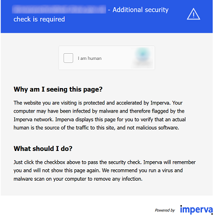
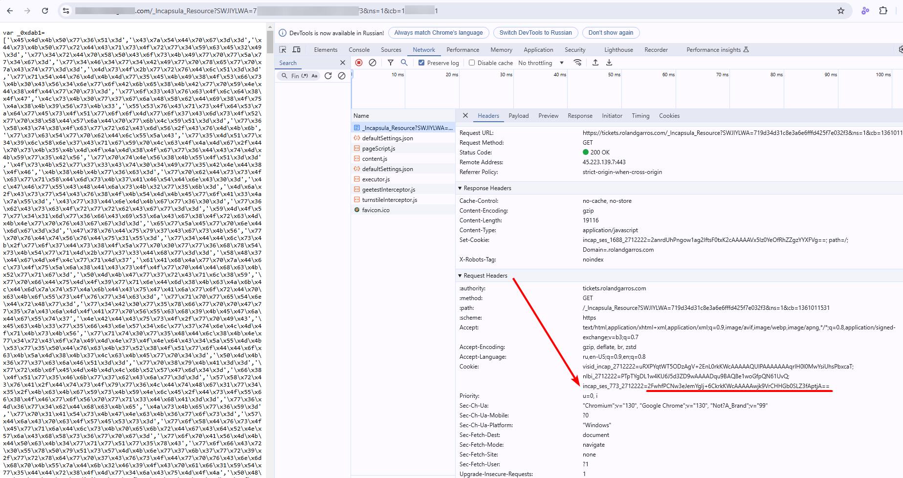

import Tabs from '@theme/Tabs';
import TabItem from '@theme/TabItem';
import ParamItem from '@theme/ParamItem';
import MethodItem from '@theme/MethodItem';
import MethodDescription from '@theme/MethodDescription'
import PriceBlock from '../../../../../src/theme/PriceBlock';
import PriceBlockWrap from '@theme/PriceBlockWrap';
import BlogLink from '@theme/BlogLink';

# Imperva (Incapsula)

<PriceBlockWrap>
  <PriceBlock title="Imperva" captchaId="imperva"/>
</PriceBlockWrap>



<BlogLink url="https://capmonster.cloud/en/blog/news/imperva-incapsula-news"/>

:::warning **Attention!**
* The Imperva (Incapsula) solution, available in CapMonster Cloud, is provided exclusively for testing and analyzing performance on your own web resources. The use of this solution on third-party sites is strictly prohibited and violates the service's usage policy.

* CapMonster Cloud uses built-in proxies by default — their cost is already included in the service. You only need to specify your own proxies in cases where the website does not accept the token or access to the built-in services is restricted.

* If you are using a proxy with IP authorization, make sure to whitelist the address **65.21.190.34**.

:::


## Request parameters

<TabItem value="proxyless" label="CustomTask (without proxy)" default className="bordered-panel">
    <ParamItem title="type" required type="string" />
    **CustomTask**

    ---

    <ParamItem title="class" required type="string" />
    **Imperva**

    ---

    <ParamItem title="websiteURL" required type="string" />
    The address of the main page where Incapsula is located. 

    ---
    <ParamItem title="incapsulaScriptUrl (inside metadata)" required="required" type="string" />
    `"incapsulaScriptUrl": "_Incapsula_Resource?SWJIYLWA=719d34d31c8e3a6e6fffd425f7e032f3"` - Name of the Incapsula JS file.

    ---

    <ParamItem title="incapsulaCookies (inside metadata)" required type="string" />
    Your cookies from Incapsula. They can be obtained on the page using document.cookie or in the request header Set-Cookie: "incap_sess_*=...; visid_incap_*=..." (see the /createTask request example).
	
	
	
	---

    <ParamItem title="reese84UrlEndpoint (inside metadata)" type="string" />
    The name of the endpoint where the reese84 fingerprint is sent can be found among the requests and ends with ?d=site.com

    	

    ---

    <ParamItem title="userAgent" type="string" />
    Browser User-Agent.  
  **Pass only a valid UA from Windows OS. Currently it is**: `userAgentPlaceholder`

    ---

    <ParamItem title="proxyType" type="string" />
    **http** - regular http/https proxy;<br />**https** - try this option only if "http" doesn't work (required for some custom proxies);<br />**socks4** - socks4 proxy;<br />**socks5** - socks5 proxy.

     ---

    <ParamItem title="proxyAddress" type="string" />
    <p>
      IPv4/IPv6 proxy IP address. Not allowed:
      - using transparent proxies (where you can see the client's IP);
      - using proxies on local machines.
    </p>

     ---

    <ParamItem title="proxyPort" type="integer" />
    Proxy port.

     ---

    <ParamItem title="proxyLogin" type="string" />
    Proxy-server login.

     ---

    <ParamItem title="proxyPassword" type="string" />
    Proxy-server password.

  </TabItem>


## Create task method

<Tabs className="full-width-tabs filled-tabs request-tabs" groupId="captcha-type">
  <TabItem value="proxyless" label="CustomTask (without proxy)" default className="method-panel">
    <MethodItem>
      ```http
      https://api.capmonster.cloud/createTask
      ```
    </MethodItem>
    <MethodDescription>

    **Request**

    ```json
    {
      "clientKey": "API_KEY",
      "task": {
        "type": "CustomTask",
        "class": "Imperva",
        "websiteURL": "https://example.com",
        "userAgent": "userAgentPlaceholder",
        "metadata": {
          "incapsulaScriptUrl": "_Incapsula_Resource?SWJIYLWA=719d34d31c8e3a6e6fffd425f7e032f3",
          "incapsulaCookies": "incap_ses_1166_2930313=br7iX33ZNCtf3HlpEXcuEDzz72cAAAAA0suDnBGrq/iA0J4oERYzjQ==; visid_incap_2930313=P3hgPVm9S8Oond1L0sXhZqfK72cAAAAAQUIPAAAAAABoMSY9xZ34RvRseJRiY6s+;",
          "reese84UrlEndpoint": "Built-with-the-For-hopence-Hurleysurfecting-the-"
        }
      }
    }
    ```

    **Response**

    ```json
    {
      "errorId": 0,
      "taskId": 407533072
    }
    ```

    </MethodDescription>
  </TabItem>

  <TabItem value="proxy" label="CustomTask (with proxy)" className="method-panel">
    <MethodItem>
      ```http
      https://api.capmonster.cloud/createTask
      ```
    </MethodItem>
    <MethodDescription>

    **Request**

    ```json
    {
      "clientKey": "API_KEY",
      "task": {
        "type": "CustomTask",
        "class": "Imperva",
        "websiteURL": "https://example.com",
        "userAgent": "userAgentPlaceholder",
        "metadata": {
          "incapsulaScriptUrl": "_Incapsula_Resource?SWJIYLWA=719d34d31c8e3a6e6fffd425f7e032f3",
          "incapsulaCookies": "incap_ses_1166_2930313=br7iX33ZNCtf3HlpEXcuEDzz72cAAAAA0suDnBGrq/iA0J4oERYzjQ==; visid_incap_2930313=P3hgPVm9S8Oond1L0sXhZqfK72cAAAAAQUIPAAAAAABoMSY9xZ34RvRseJRiY6s+;",
          "reese84UrlEndpoint": "Built-with-the-For-hopence-Hurleysurfecting-the-"
        },
        "proxyType": "http",
        "proxyAddress": "8.8.8.8",
        "proxyPort": 8080,
        "proxyLogin": "proxyLoginHere",
        "proxyPassword": "proxyPasswordHere"
      }
    }
    ```

    **Response**

    ```json
    {
      "errorId": 0,
      "taskId": 407533072
    }
    ```

    </MethodDescription>
  </TabItem>
</Tabs>


## Get task result method
Use the method [getTaskResult](../api/methods/get-task-result.md) to obtain the Imperva solution.

<TabItem value="proxyless" label="CustomTask (without proxy)" default className="method-panel-full">
	<MethodItem>
		```http
		https://api.capmonster.cloud/getTaskResult
		```
	</MethodItem>
	<MethodDescription>
		**Request**
		```json
		{
		  "clientKey":"API_KEY",
		  "taskId": 407533072
		}
		```
		**Response**
		```json
		{
			"errorId":0,
			"status":"ready",
			"solution": {
				"domains": {
					"https://example.com": {
						"cookies": {
							"___utmvc": "NMB+nRa4inxXNeXuhPl9w4opzdo2afqlceX5uMBLwrduDVo64yb4KunkabEeLYXmKZuVhloliIv6fWevXUcT1WJiFklg9AghMBMkDFjDAEtAnK639bNQi/ob8l+hp/5wf/WpTQcIkG8F9VifAEcZG7MxawsEpYJxkLji4vDSUbGuHPNf5CzIyEzATfw6UVBRiLiDdUvFWboxszG1T5aUrwQYgIlmm1B2X5ZZW4BzwN3k8Md5J+jIdllfdTaxK9JQfuqYQCdT/g5mifg2TPbrwVQeN14avfo1xQr88Mh+m4oclb0yR6VJp2vaVktDSIe2cwCZ3sKKYE0rzkCpcJb9530gRCOT3YxCtyU4Qqg6yRIf8Rk4q/KRSC8/VJ9ezreZ221mURm4FnFH+OF0PqjAiLd/lVK6oTO6BIet4ykEKCtch9EVk0hgGJieaG1F1Nt5haZcSNjGBa15wPyD2OFZe0kI7VBopsUyWqiD0Ydun6+WD/7aDHROngJj0VIZjSuOnQuVQDK2Vcw9gTVvvqwnDhR28ff0gj5b+LAkvrykfgO/AQO0K/DNCF0HgmWIMiSJeoohCpCa/UArU8tDtETnuxGKGaaJOsGKsPtOS5VRQlyRa+D0inSAVY77lpWF5+9SOS+Ioxlq3r8ovFosR33OOcBCEgAlrkdTNNKvK27mWNwmi+ccKkyuJw5Gtk3SEsYNZ75KU/ok+sKBZM5OIsrmp9ivj+nx0oi7yQf6q0Oksbwr2xTFANsIfpoOJBIMylVSCRGwEbpoN4+IJitczOtb8D/TmfHx5P1td0NWTli7UhqFSADS0CcH+vfBos4nucByHjMxkiKuGcudydlZ4IAzl4j0EhZb9OjqJsVe6NIosjwYuqVWHI6BKpRz4FnaqvW+fbEgNj/SmOrEJ/BbKsOOikJNDw6E6BznYT8oQaV6y5p+HFfut+fP3ocrgdMEjoA16oBDfj0rHopZtpJRk2ss41MOA4XyNbfzXVxotTjUXQnuSJXKqp5n4LUD2nFGFpKTwPOT5bTiFiXyHCwNzscRmlfnv38sjG76999auML2YaK1y1wi4sm9fhrbCJuJ9cSSUAMVyeCJhF6BBZ7K1xcGYsougAqbO+oHt/v2J0dnDBAgqQz43nHMNH0yduHWDZUoFsFGqLU8k9a/YYgznEWQDbXnbXAkLziOTNer9FijatGSGm/USO+Gu6TwbmiCfoRoCtm4LOv0aKpzCh48bVdpgEgU3cKLnY970QqnpcB2HCWyawyWMgW3lpXqRKvCbPXo9kiyIBAssNG+HY4URXrwZnhJsnomsipaxKCyRmAUrGjxxFNe0D7vbXn9uY6KnjlJ01Z2T1f3WgwBTBv1QrJsy33KZPkpKLK4VXmtVwD/NBgtgJx7f2xZrKsqrwS3nwa9nYaA9cbS6h4Akl0Ssruv5bwhcVjd7t5fdnCvH59L7emUBEhWV4GpE9owdZpXbWbW0Sq/ZXWe9QX/g4wKTcSJLDBA+T4tegikJv0NWm1aMI2RMJ58Y38JsWKJnkNgjbHAJ7SuVsAtBY3FBbVYLNlC41ZCs8Ygt5W4HNP5B0tRJxEvzqkdbMPg48oVO9AjohmqSPKaXq1TqRTUEatTvt0LD0Uo6v8FFGbCjuuc0kkq4zslsHxEPcB4PY1UKd5/Xw2ttU2ZeGOBIsG+HVTww2yPCYUNH1orKqEwt5H7oMApKWAy1J4lESr1RUbHCBHj7OikFvg4+clNBDGp0wCk+PigPFFNVWBfxtFwJSCZQTUuev1HpdMz/nEiUSPRL3xFbFDH+Ucmdn8lzwCj2EZSY4Zb8cBT92RzbjjcQoH51pgaSjTn5f9m496SyAu34aqTeGU+fYipD5UsWv5r2csBCVJWKm94Ds1QY3JkIkym69IRWoi3j1PKOKxIKX1QTiMqq+8GEgMgwrXYRhzBAmfp19h/ScvxYdiy0q4z6XzJ0pFs1h1bA+6oqqPOqUvrLVbMP1MM7LZKYlhUyJ70KRsrc13y9fLbJV0Znst7cKhi2RGKbU/8anFlzswtjnDD7Upuw/uO3rfedi33X9NFxUw6+pgUYur8ZWQWY3Gm4kX+ANW0upV4K4y/pj5BcZtCKVSXQ/XcLqWkSOt7acbitnrqOgJdw5LmSBhmB+dZwEMzMdUVhRtDt4+oC5DIgtC0B8FhxFX/BzHv6Gh2eO6HJHmXepSpH3csGFpQyJM/5VgNs0wNFPvl1PDA8GAQsu+bGWLGIycSA+XSZVdsRdnegdRIPi0ktOLsAs+ZIZXebkOCMnZytLnrxmfLkAQVtYoy0Qoh9Bv6QOQsxDUZrRu43oaVC/MLuzhftcv/ZhFtCj6IvqWuCHOUp+zLVpzCyiPvN/5eVoVJrY0Jq/Ky8WLUabkJh4h2CiS+9jipESYH+Tu2qsz3V/pR7swfW8zAwp8a4Hzl+8/eGea9X9NY1htqeqw/BJ3ALeozpaA833KZ4HeWrxLRennaqiOvTSkGKDKJsnT6zRQbMw6geAjXk7EMnZBTgTfrBUqpmCYsExQRiyP7DEEcpgTe3+ry9YzLLFevuyvwBYVI7pmc+AeWBNbcl3e7EwdeKZiprQgt7mASx2KRtkgUzNxH8OiPGvVMrJPYSWxUMgFrwVgxvV1kMb/PEVr0YXoFjccRQwWdsxoMizqBWALnYODaJwwl6RZraZIyPVp3ptW4mCWZCWTg+fFdeUWwzGfC312KHggGX2yntQV/iIE5kQWbk72JFP7Xf3it4XdFWBynaojzykDFXODTCEwGB1NIbmO+aVirjv0Rs6ZoKpxSMB+KHd4/TWRpZ2VzdD0xOTE0NDAscz02NzdiOTY4YjdmYTE5M2FjOTk4N2E5YThhMjljN2E4NjYzNWY4NWIxOWM3NTg4ODQ5NWFjOGE4MmE4OTU2OGEwNzI2ODlkODc4MWIwNmU3MQ==; Max-Age=31536000; Domain=.site.com; Path=/; Secure; SameSite=Lax",
							"reese84":"3:+K02uF6IfjbaMpdv1+5JLw==:x0jVrEYjOB+rVD2ZkdV2gpcVRjsahu5tqUlnsFl5amKje2ikXLJO6QHty6ipwIPX29mSruAp/AhCg15DjBX+EeYyC+ugScX2MtXA62fTUzELpZs2hkd428Q96bpb4lpEZSSVa5B6CBBtGL7VluNDjuVXo6BIUx+9CUFKxf2Zw7RW+BHCmdCZsHJdeCAIZ4h17IzTp3UgFNoxKwSp3fDwuYRgfg1BoezZWNcP4eAs2oaMcBmo66C8pLU8QoHFo5sp6BE43HbjYJ47RrbkokYRRhYwwe2n8OfkCws+9bQq++3LsThVxN37eeWH7UhVd7YlO+ldMOrMZHHP9U6ShTJZDVPUv++XGlKYw4B1sxaf0jN+2vc1a4zPX+eFlsnrvhymURYvE9fjgGjvFSVO+nQb3M50iKTKN/eHbshgnw2UcZmCvzCfcsGJl+idSsieA20YWe13lFAOIIQ3U1wct+EYjmJlSBq02IIn9Y+WtPXP4lkXzXex0W8I14k+uBe+XSb1:vIosWJM6+1OFaFys4VFDiTJ75BZg/k/jwaygMW3VKpU=; Max-Age=31536000; Domain=.site.com; Path=/; Secure; SameSite=Lax"
						}
					}
				}
			}
		}
		```
	</MethodDescription>
</TabItem>

## Access denied

Error 16 - this error is related to the use of proxy servers that do not match the required geolocation.

## How to find all required parameters for task creation

### Automatically

A convenient way to automate the search for all necessary parameters.
Some parameters are regenerated every time the page loads, so you'll need to extract them through a browser — either regular or headless (e.g., using **Playwright**).
Since the values of dynamic parameters are short-lived, the captcha must be solved immediately after retrieving them.

:::warning **Important!**
The code snippets provided are basic examples for familiarization with extracting the required parameters. The exact implementation will depend on your captcha page, its structure, and the HTML elements/selectors it uses.
:::

<Tabs className="full-width-tabs filled-tabs request-tabs">
  <TabItem value="js" label="JavaScript" default className="method-panel">
    <details>
      <summary>Show code (Node.js)</summary>
      ```js
      import { chromium } from "playwright";

      (async () => {
        const browser = await chromium.launch({ headless: false });
        const page = await browser.newPage();

        await page.goto("https://www.example.com/");

        // Extract the src attribute from the iframe with id main-iframe
        const iframeSrc = await page.$eval("#main-iframe", (iframe) =>
          iframe.getAttribute("src")
        );
        console.log("iframe src:", iframeSrc);

        // Get all cookies
        const cookies = await page.context().cookies();

        // Filter cookies that start with visid_incap_ or incap_ses_
        const filteredCookies = cookies.filter(
          (cookie) =>
            cookie.name.startsWith("visid_incap_") ||
            cookie.name.startsWith("incap_ses_")
        );

        filteredCookies.forEach((cookie) => {
          console.log(`${cookie.name}=${cookie.value}`);
        });

        await browser.close();
      })();
      ```
    </details>
  </TabItem>

  <TabItem value="python" label="Python" className="method-panel">
    <details>
      <summary>Show code</summary>
      ```python
      import asyncio
      from playwright.async_api import async_playwright

      async def main():
          async with async_playwright() as p:
              browser = await p.chromium.launch(headless=False)
              page = await browser.new_page()

              await page.goto("https://www.example.com/")

              # Extract the src attribute from the iframe with id main-iframe
              iframe_src = await page.locator("#main-iframe").get_attribute("src")
              print("iframe src:", iframe_src)  # Output the src value

              # Get all cookies
              cookies = await page.context.cookies()

              # Filter cookies that start with visid_incap_ or incap_ses_
              filtered_cookies = [
                  cookie for cookie in cookies
                  if cookie["name"].startswith("visid_incap_") or cookie["name"].startswith("incap_ses_")
              ]

              for cookie in filtered_cookies:
                  print(f"{cookie['name']}={cookie['value']}")

              await browser.close()

      asyncio.run(main())
      ```
    </details>
  </TabItem>

  <TabItem value="csharp" label="C#" className="method-panel">
    <details>
      <summary>Show code</summary>
      ```csharp
      using System;
      using System.Linq;
      using System.Threading.Tasks;
      using Microsoft.Playwright;

      class Program
      {
          public static async Task Main(string[] args)
          {
              var playwright = await Playwright.CreateAsync();
              var browser = await playwright.Chromium.LaunchAsync(new BrowserTypeLaunchOptions { Headless = false });
              var page = await browser.NewPageAsync();

              await page.GotoAsync("https://www.example.com/");

              // Extract the src attribute from the iframe with id main-iframe
              var iframeSrc = await page.GetAttributeAsync("#main-iframe", "src");
              Console.WriteLine("iframe src: " + iframeSrc); // Output the src value

              // Get all cookies
              var cookies = await page.Context.CookiesAsync();

              // Filter cookies that start with visid_incap_ or incap_ses_
              var filteredCookies = cookies.Where(cookie =>
                  cookie.Name.StartsWith("visid_incap_") || cookie.Name.StartsWith("incap_ses_"));

              foreach (var cookie in filteredCookies)
              {
                  Console.WriteLine($"{cookie.Name}={cookie.Value}");
              }

              await browser.CloseAsync();
          }
      }
      ```
    </details>
  </TabItem>
</Tabs>

## Use the SDK Library

<Tabs className="full-width-tabs filled-tabs request-tabs" groupId="captcha-type">

  <TabItem value="js" label="JavaScript" default className="method-panel">

  ```js
  // https://github.com/ZennoLab/capmonstercloud-client-js

  import { CapMonsterCloudClientFactory, ClientOptions, ImpervaRequest } from '@zennolab_com/capmonstercloud-client';

  document.addEventListener('DOMContentLoaded', async () => {
    const cmcClient = CapMonsterCloudClientFactory.Create(
      new ClientOptions({ clientKey: '<your capmonster.cloud API key>' })
    );

    console.log('Balance:', await cmcClient.getBalance());

    // Option 1: without proxy
    const impervaRequest = new ImpervaRequest({
      websiteURL: 'https://example.com', // Page URL with captcha
      metadata: {
        incapsulaScriptUrl: '_Incapsula_Resource?SWJIYLWA=719d34d31c8e3a6e6fffd425f7e032f3',
        incapsulaCookies: 'incap_ses_1166_2930313=br7iX33ZNCtf3HlpEXcuEDzz72cAAAAA0suDnBGrq/iA0J4oERYzjQ==; visid_incap_2930313=P3hgPVm9S8Oond1L0sXhZqfK72cAAAAAQUIPAAAAAABoMSY9xZ34RvRseJRiY6s+;',
      },
    });

    // Option 2: with proxy (uncomment if necessary)
    /*
    const impervaRequest = new ImpervaRequest({
      websiteURL: 'https://example.com',
      metadata: {
        incapsulaScriptUrl: '_Incapsula_Resource?SWJIYLWA=719d34d31c8e3a6e6fffd425f7e032f3',
        incapsulaCookies: 'incap_ses_1166_2930313=br7iX33ZNCtf3HlpEXcuEDzz72cAAAAA0suDnBGrq/iA0J4oERYzjQ==; visid_incap_2930313=P3hgPVm9S8Oond1L0sXhZqfK72cAAAAAQUIPAAAAAABoMSY9xZ34RvRseJRiY6s+;',
      },
      proxy: {
        type: 'http',
        address: '127.0.0.1',     
        port: 8080,               
        login: 'proxyUser',       
        password: 'proxyPass'     
      }
    });
    */

    const result = await cmcClient.Solve(impervaRequest);
    console.log('Captcha Solution:', result);
  });
````

  </TabItem>

  <TabItem value="python" label="Python" className="method-panel">

```python
# https://github.com/ZennoLab/capmonstercloud-client-python

import asyncio
from capmonstercloudclient import CapMonsterClient, ClientOptions
from capmonstercloudclient.requests import ImpervaCustomTaskRequest

# Your CapMonster Cloud API key
client_options = ClientOptions(api_key="your_api_key")  # Your CapMonster Cloud API key
cap_monster_client = CapMonsterClient(options=client_options)

# Option 1: without proxy
imperva_request = ImpervaCustomTaskRequest(
    websiteUrl="https://example.com",   # Page URL with captcha
    userAgent="userAgentPlaceholder",   # Use the current UserAgent
    metadata={
        "incapsulaScriptUrl": "_Incapsula_Resource?SWJIYLWA=719d34d31c8e3a6e6fffd425f7e032f3",
        "incapsulaCookie": "incap_ses_1166_2930313=br7iX33ZNCtf3HlpEXcuEDzz72cAAAAA0suDnBGrq/iA0J4oERYzjQ==; visid_incap_2930313=P3hgPVm9S8Oond1L0sXhZqfK72cAAAAAQUIPAAAAAABoMSY9xZ34RvRseJRiY6s+;",
        "reese84UrlEndpoint": "Built-with-the-For-hopence-Hurleysurfecting-the-"
    }
)

# Option 2: with proxy (uncomment if necessary)
# imperva_request = ImpervaCustomTaskRequest(
#     websiteUrl="https://example.com", 
#     userAgent="userAgentPlaceholder",  
#     metadata={
#         "incapsulaScriptUrl": "_Incapsula_Resource?SWJIYLWA=719d34d31c8e3a6e6fffd425f7e032f3",
#         "incapsulaCookie": "incap_ses_1166_2930313=br7iX33ZNCtf3HlpEXcuEDzz72cAAAAA0suDnBGrq/iA0J4oERYzjQ==; visid_incap_2930313=P3hgPVm9S8Oond1L0sXhZqfK72cAAAAAQUIPAAAAAABoMSY9xZ34RvRseJRiY6s+;",
#         "reese84UrlEndpoint": "Built-with-the-For-hopence-Hurleysurfecting-the-"
#     },
#     proxyType="http",                    
#     proxyAddress="127.0.0.1",            
#     proxyPort=8080,                      
#     proxyLogin="username",               
#     proxyPassword="password"             
# )

async def solve_captcha():
    return await cap_monster_client.solve_captcha(imperva_request)

responses = asyncio.run(solve_captcha())
print(responses)
```

  </TabItem>

  <TabItem value="csharp" label="C#" className="method-panel">

```csharp
// https://github.com/ZennoLab/capmonstercloud-client-dotnet

using System;
using System.Text.Json;
using System.Threading.Tasks;
using Zennolab.CapMonsterCloud;
using Zennolab.CapMonsterCloud.Requests;

class Program
{
    static async Task Main(string[] args)
    {
        // Your CapMonster Cloud API key
        var clientOptions = new ClientOptions
        {
            ClientKey = "your_api_key" // Your CapMonster Cloud API key
        };

        var cmCloudClient = CapMonsterCloudClientFactory.Create(clientOptions);

        // Imperva data
        var incapsulaScriptBase64 = "base64_encoded_js_here";
        var incapsulaSessionCookie = "incap_sess_*=your_cookie_here";
        var reese84UrlEndpoint = "your_reese84_endpoint_here";

        // Option 1: without proxy
        var impervaRequest = new ImpervaCustomTaskRequest(
            incapsulaScriptBase64,
            incapsulaSessionCookie,
            reese84UrlEndpoint
        )
        {
            WebsiteUrl = "https://example.com",   // Page URL with captcha
            UserAgent = "userAgentPlaceholder"    // Use the current UserAgent
        };

        // Option 2: with proxy (uncomment if necessary)
        /*
        var impervaRequest = new ImpervaCustomTaskRequest(
            incapsulaScriptBase64,
            incapsulaSessionCookie,
            reese84UrlEndpoint
        )
        {
            WebsiteUrl = "https://example.com",
            UserAgent = "userAgentPlaceholder",
            Proxy = new ProxyContainer(
                "123.123.123.123",   
                8080,                
                ProxyType.Http,      
                "proxy_user",        
                "proxy_pass"         
            )
        };
        */

        var impervaResult = await cmCloudClient.SolveAsync(impervaRequest);

        Console.WriteLine("Imperva Solution: " + JsonSerializer.Serialize(impervaResult.Solution));
    }
}
```

  </TabItem>

</Tabs>

