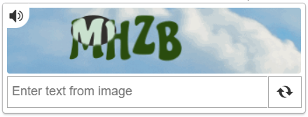

import Tabs from '@theme/Tabs';
import TabItem from '@theme/TabItem';
import ParamItem from '@theme/ParamItem';
import MethodItem from '@theme/MethodItem';
import MethodDescription from '@theme/MethodDescription'
import PriceBlock from '@theme/PriceBlock';
import PriceBlockWrap from '@theme/PriceBlockWrap';

# MTCaptcha

<PriceBlockWrap>
  <PriceBlock title="MTCaptcha task" captchaId="mtcaptcha"/>
</PriceBlockWrap>



:::warning **Attention!**
By default, CapMonster Cloud uses built-in proxy servers.
If access to built-in services is restricted, you can specify your own proxies to ensure stable operation.
:::

## Request parameters

<TabItem value="proxy" label="MTCaptchaTask" className="bordered-panel">
<ParamItem title="type" required type="string" />
**MTCaptchaTask**

---

<ParamItem title="websiteURL" required type="string" />
The URL of the page where the captcha is solved.

---

<ParamItem title="websiteKey" required type="string" />
The MTcaptcha key, passed in the request parameters as `sk` (*see example below on how to find it*).

---

<ParamItem title="pageAction" type="string" />
The *action* parameter is passed in the request as `act` and displayed when validating the token.  
Include it in the request only if its value differs from the default - **%24**.  
Example in HTML:
```

<script>
var mtcaptchaConfig = {
      "sitekey": "MTPublic-abCDEFJAB",
      "action": "login"
};
</script>

````

---

<ParamItem title="isInvisible" type="bool" />
**true** if the captcha is invisible, i.e., has a hidden confirmation field. If bot suspicion occurs, an additional verification is triggered.

---

<ParamItem title="userAgent" type="string" />
Browser User-Agent. <br />  
**Pass only a current UA from Windows OS. Currently it is:** userAgentPlaceholder

---

<ParamItem title="proxyType" type="string" />
**http** - regular http/https proxy;<br />
**https** - try this option only if "http" does not work (required for some custom proxies);<br />
**socks4** - socks4 proxy;<br />
**socks5** - socks5 proxy.

---

<ParamItem title="proxyAddress" type="string" />
<p>
Proxy IPv4/IPv6 IP address. Not allowed:  
- use of hostnames;  
- use of transparent proxies (where the client IP is visible);  
- use of proxies on local machines.
</p>

---

<ParamItem title="proxyPort" type="integer" />
Proxy port.

---

<ParamItem title="proxyLogin" type="string" />
Proxy server login.

---

<ParamItem title="proxyPassword" type="string" />
Proxy server password.

</TabItem>

## Task creation method
<Tabs className="full-width-tabs filled-tabs request-tabs" groupId="captcha-type">
<TabItem value="proxyless" label="MTCaptchaTask (without proxy)" default className="method-panel">
<MethodItem>
```http
https://api.capmonster.cloud/createTask
````

</MethodItem>
<MethodDescription>
**Request**
```json
{
  "clientKey": "API_KEY",
  "task": 
  {
    "type": "MTCaptchaTask",
    "websiteURL": "https://www.example.com",
    "websiteKey": "MTPublic-abCDEFJAB",
    "isInvisible": false,
    "pageAction": "login"
  }
}
```
**Response**
```json
{
  "errorId":0,
  "taskId":407533077
}
```
</MethodDescription>
</TabItem>

<TabItem value="proxy" label="MTCaptchaTask (using proxy)" default className="method-panel">
<MethodItem>
```http
https://api.capmonster.cloud/createTask
```
</MethodItem>
<MethodDescription>
**Request**
```json
{
  "clientKey": "API_KEY",
  "task": 
  {
    "type": "MTCaptchaTask",
    "websiteURL": "https://www.example.com",
    "websiteKey": "MTPublic-abCDEFJAB",
    "isInvisible": false,
    "pageAction": "login",
    "proxyType":"http",
    "proxyAddress":"8.8.8.8",
    "proxyPort":8080,
    "proxyLogin":"proxyLoginHere",
    "proxyPassword":"proxyPasswordHere"
  }
}
```
**Response**
```json
{
  "errorId":0,
  "taskId":407533077
}
```
</MethodDescription>
</TabItem>
</Tabs>

## Task result retrieval method

Use the [getTaskResult](../api/methods/get-task-result.md) method to get the solution for the MTCaptcha captcha.

<TabItem value="proxyless" label="CustomTask (without proxy)" default className="method-panel-full">
<MethodItem>
```http
https://api.capmonster.cloud/getTaskResult
```
</MethodItem>
<MethodDescription>
**Request**
```json
{
  "clientKey": "API_KEY",
  "taskId": 407533077
}
```

**Response**

```json
{
  "errorId": 0,
  "errorCode": null,
  "errorDescription": null,
  "solution": {
    "token": "v1(155506dc,c8c2e356,MTPublic-abCDEFJAB,70f03532a53...5FSDA**)"
  },
  "status": "ready"
}
```

</MethodDescription>
</TabItem>

## How to find CAPTCHA parameters

### websiteKey

This parameter can be found in the **Network** tab of Developer Tools.
Look for requests starting, for example, with `getchallenge.json` — the **sk** parameter corresponds to `websiteKey`.


### pageAction

The same request contains the `pageAction` parameter: the needed value is passed as **act**.
By default, it equals **%24**; if the value differs (e.g., *..\&act=login&...*), specify it when creating the task.


